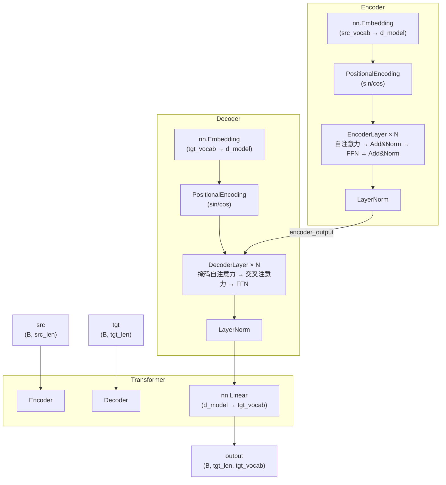
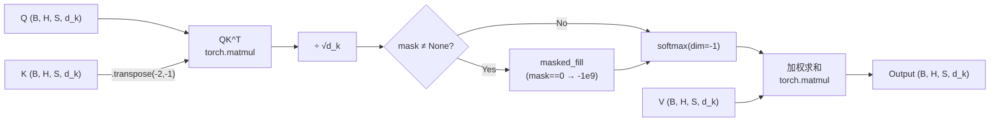
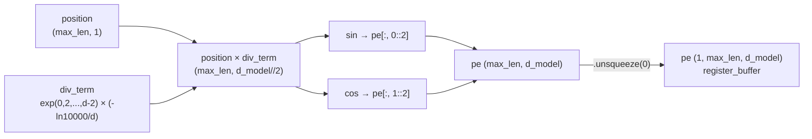
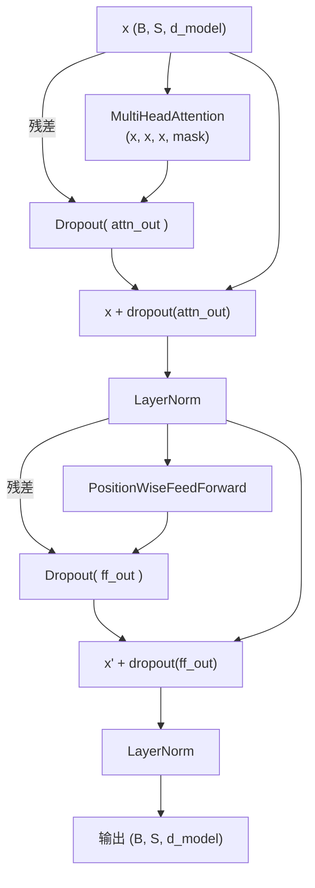
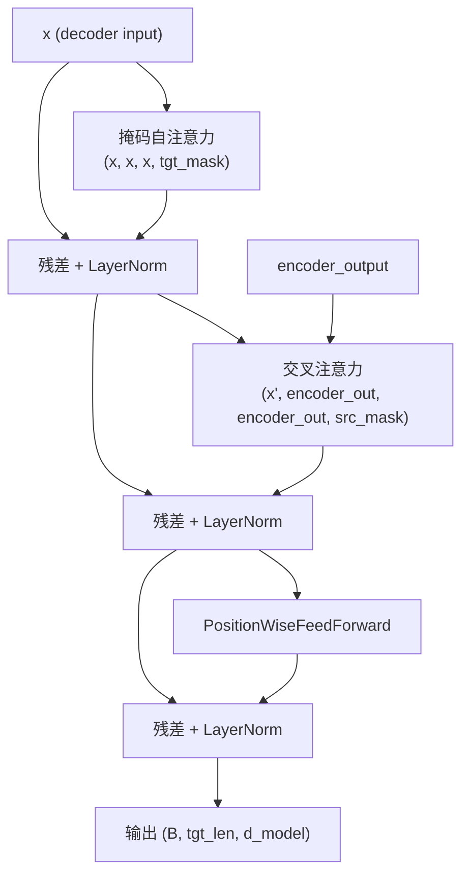
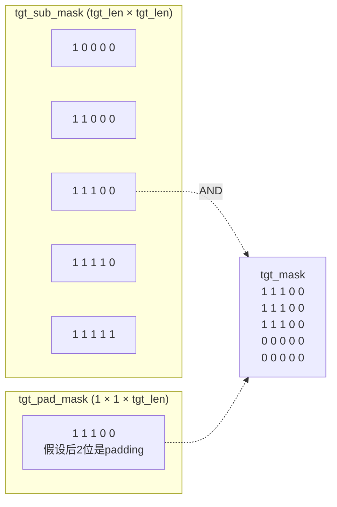
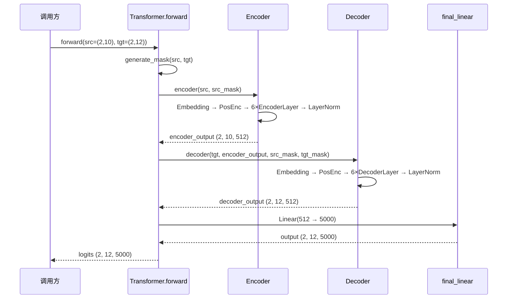

本文档对 `chapter3/Transformer.py` 进行逐模块深度解析，涵盖多头注意力（Multi-Head Attention）、正弦位置编码（Positional Encoding）、位置前馈网络（Position-wise FFN）、编码器/解码器层堆叠及掩码生成的完整实现。目标读者为已具备深度学习基础、希望从第一性原理理解 Transformer 架构的高级开发者。整个实现仅依赖 PyTorch 标准库，约 250 行代码，是一个完整的 encoder-decoder Transformer——与原始论文 "Attention Is All You Need"（Vaswani et al., 2017）的基准配置一一对应。

Sources: [Transformer.py](chapter3/Transformer.py#L1-L249)

---

## 架构总览

该 Transformer 实现采用经典的 **编码器-解码器** 双塔结构。输入序列经词嵌入层映射为稠密向量，叠加正弦位置编码后送入 N 层编码器堆叠；解码器同样嵌入并编码目标序列，但在每层中额外引入与编码器输出的**交叉注意力**。最终通过线性投影层将解码器输出映射到目标词表空间。



整个模型组装在 `Transformer` 类中，通过 `forward` 方法编排前向传播流程：先生成掩码，再分别调用编码器与解码器，最后过线性层输出 logits。

Sources: [Transformer.py — class Transformer](chapter3/Transformer.py#L195-L222)

---

## 多头注意力机制（Multi-Head Attention）

### 核心思想

多头注意力是 Transformer 的信息聚合引擎。其核心设计哲学是：**将高维表示空间拆分为多个低维子空间，在每个子空间内独立计算注意力**，从而让模型同时关注序列中不同位置、不同语义维度的信息。

### 模块结构与参数

`MultiHeadAttention` 类维护四个线性变换矩阵：`W_q`、`W_k`、`W_v` 将输入投影到查询/键/值空间，`W_o` 对多头拼接后的输出进行最终投影。所有矩阵的维度均为 `(d_model, d_model)`，其中约束 `d_model % num_heads == 0` 确保均匀拆分。

| 参数 | 含义 | 演示值 |
|---|---|---|
| `d_model` | 模型隐藏维度 | 512 |
| `num_heads` | 注意力头数 | 8 |
| `d_k` | 每个头的维度 = d_model / num_heads | 64 |
| `W_q, W_k, W_v` | Q/K/V 投影矩阵 | (512, 512) |
| `W_o` | 输出投影矩阵 | (512, 512) |

Sources: [Transformer.py — class MultiHeadAttention](chapter3/Transformer.py#L6-L22)

### 缩放点积注意力（Scaled Dot-Product Attention）

注意力计算遵循 $\text{Attention}(Q, K, V) = \text{softmax}\!\left(\frac{QK^T}{\sqrt{d_k}}\right)V$ 四步流程。实现中的缩放因子 $\sqrt{d_k}$ 防止点积值过大导致 softmax 梯度消失——当 $d_k$ 较大时，$QK^T$ 的方差与 $d_k$ 成正比，不缩放会使 softmax 进入饱和区。



掩码处理使用 `masked_fill(mask == 0, -1e9)`，将被屏蔽位置的分值设为极大负数，使其经 softmax 后权重趋近于零。这一机制同时服务于两种场景：**padding mask**（屏蔽填充位置）和 **causal mask**（解码器中防止"偷看"未来 token）。

Sources: [Transformer.py — scaled_dot_product_attention](chapter3/Transformer.py#L24-L38)

### 头的拆分与合并

`split_heads` 将输入形状从 `(batch_size, seq_length, d_model)` 重排为 `(batch_size, num_heads, seq_length, d_k)`，通过 `view` + `transpose(1, 2)` 实现——先按最后一维切分头，再将头维度前移以便批量并行计算。`combine_heads` 执行逆操作：`transpose(1, 2)` 还原维度顺序后用 `contiguous()` 确保内存连续性，再 `view` 拼接。

> **关键细节**：`forward` 方法中 Q/K/V 先经线性变换再拆分多头，而非先拆分再投影。这等价于将 `(d_model, d_model)` 的大矩阵视为 `num_heads` 个 `(d_model, d_k)` 子矩阵的组合，计算效率更高且语义一致。

Sources: [Transformer.py — split_heads / combine_heads / forward](chapter3/Transformer.py#L40-L63)

---

## 正弦位置编码（Positional Encoding）

### 为什么需要位置编码

Transformer 的自注意力机制本身是**排列不变**的——打乱输入顺序不影响输出。为了让模型感知 token 的绝对与相对位置，原始论文提出了正弦/余弦位置编码，将其直接叠加到词嵌入上。

### 实现解析

位置编码矩阵 `pe` 的形状为 `(max_len, d_model)`，其中偶数索引维度使用正弦、奇数维度使用余弦：

$$PE_{(pos, 2i)} = \sin\!\left(\frac{pos}{10000^{2i/d_{model}}}\right), \quad PE_{(pos, 2i+1)} = \cos\!\left(\frac{pos}{10000^{2i/d_{model}}}\right)$$

代码中的频率项 `div_term = torch.exp(torch.arange(0, d_model, 2) * (-math.log(10000.0) / d_model))` 对指数形式做了数值稳定化处理：$10000^{-2i/d_{model}} = e^{-2i \cdot \ln(10000)/d_{model}}$，避免直接计算大数幂导致溢出。



> **设计要点**：`pe` 通过 `register_buffer` 注册而非作为 `nn.Parameter`，因为它不参与梯度更新，但需要随模型在 CPU/GPU 间同步迁移（`.to(device)` 会自动处理 buffer）。在 `forward` 中，仅取前 `seq_len` 行与输入相加，实现动态序列长度适配。

Sources: [Transformer.py — class PositionalEncoding](chapter3/Transformer.py#L85-L111)

---

## 位置前馈网络（Position-wise Feed-Forward Network）

每个编码器/解码器层在注意力子层后都接一个逐位置的前馈网络。其结构为两层线性变换夹一个 ReLU 激活与 Dropout：`Linear(d_model → d_ff) → ReLU → Dropout → Linear(d_ff → d_model)`。

**"位置感知"（position-wise）** 意味着该网络对序列中的每个位置独立应用相同的变换——等价于核大小为 1 的一维卷积。内部维度 `d_ff`（演示值为 2048）通常是 `d_model`（512）的 4 倍，形成"先扩展再压缩"的瓶颈结构，使模型在低维注意力聚合后获得更高维的非线性表达能力。

Sources: [Transformer.py — class PositionWiseFeedForward](chapter3/Transformer.py#L65-L83)

---

## 编码器层（Encoder Layer）

编码器层由两个子层组成，均采用 **Post-LayerNorm 残差连接**（先子层运算，再残差相加，最后 LayerNorm）：

1. **多头自注意力**：Q = K = V = x，让序列中每个位置关注所有位置（含自身）
2. **位置前馈网络**：对注意力输出进行非线性变换



> **架构辨析**：本实现采用原始论文的 Post-LN 设计（`norm(x + dropout(sublayer(x)))`）。后来的研究表明 **Pre-LN**（`x + dropout(sublayer(LayerNorm(x)))`）在深层模型中训练更稳定，因为它避免了残差路径上的归一化瓶颈。但对于 6 层的基准配置，Post-LN 仍然有效。

Sources: [Transformer.py — class EncoderLayer](chapter3/Transformer.py#L113-L134)

---

## 解码器层（Decoder Layer）

解码器层比编码器层多一个**交叉注意力**子层，共三个子层：

| 子层 | 注意力类型 | Q 来源 | K/V 来源 | 掩码 | 作用 |
|---|---|---|---|---|---|
| 1. 掩码自注意力 | Self-Attention | 解码器输入 | 解码器输入 | `tgt_mask` | 建模目标序列内部依赖（禁止偷看未来） |
| 2. 交叉注意力 | Cross-Attention | 子层 1 输出 | 编码器输出 | `src_mask` | 将源序列信息注入解码过程 |
| 3. 前馈网络 | — | — | — | — | 位置级非线性变换 |

三个子层均遵循相同的 Post-LN 残差结构。交叉注意力是 seq2seq 任务的核心桥梁：Query 来自解码器侧（"我该关注源序列的哪些部分？"），Key 和 Value 来自编码器输出（"源序列的全部上下文信息"）。



Sources: [Transformer.py — class DecoderLayer](chapter3/Transformer.py#L136-L163)

---

## 编码器与解码器堆叠

### 编码器（Encoder）

编码器将 N 个 `EncoderLayer` 顺序堆叠。数据流为：`Embedding → PositionalEncoding → [EncoderLayer × N] → LayerNorm`。输入为 token ID 序列 `(batch_size, seq_len)`，经嵌入和位置编码后维度变为 `(batch_size, seq_len, d_model)`，逐层传递后通过最终 LayerNorm 输出编码表示。

### 解码器（Decoder）

解码器的结构对称，但 `DecoderLayer` 的 `forward` 额外接收 `encoder_output`、`src_mask` 和 `tgt_mask` 三个参数。在层堆叠循环中，每层都将前一层输出、编码器输出及两种掩码传递下去。

> **层间数据流**：编码器输出 `encoder_output` 在解码器的所有 N 层中被共享——它不随解码器层递进而改变，每层解码器独立地通过交叉注意力从中提取所需信息。

Sources: [Transformer.py — class Encoder / Decoder](chapter3/Transformer.py#L165-L193)

---

## 掩码生成机制

`generate_mask` 方法是理解 Transformer 训练过程的关键。它生成两种掩码：

### 源序列掩码（src_mask）

```python
src_mask = (src != 0).unsqueeze(1).unsqueeze(2)
# 形状: (batch_size, 1, 1, src_len)
```

这是一个 **padding mask**：值为 0 的位置代表 padding token，将被屏蔽。通过两次 `unsqueeze` 将其扩展为可在注意力矩阵上广播的 4D 张量。

### 目标序列掩码（tgt_mask）

目标掩码是 padding mask 和 causal mask 的**逐元素与（&）运算**的组合：

```python
tgt_pad_mask = (tgt != 0).unsqueeze(1).unsqueeze(2)      # (B, 1, 1, tgt_len)
tgt_sub_mask = torch.tril(torch.ones(tgt_len, tgt_len))   # 下三角矩阵
tgt_mask = tgt_pad_mask & tgt_sub_mask                     # (B, 1, tgt_len, tgt_len)
```

`torch.tril` 生成下三角矩阵——位置 `(i, j)` 在 $j > i$ 时为 False，确保位置 $i$ 的 token 只能关注位置 $\leq i$ 的 token。这种设计使得模型在训练时可以**并行处理整个目标序列**（teacher forcing），同时保持自回归生成的语义正确性。



Sources: [Transformer.py — generate_mask](chapter3/Transformer.py#L202-L213)

---

## 完整模型组装与运行

### 超参数配置

演示部分使用了与原始论文一致的基准配置：

| 超参数 | 值 | 含义 |
|---|---|---|
| `src_vocab_size` / `tgt_vocab_size` | 5000 | 源/目标词表大小 |
| `d_model` | 512 | 模型隐藏维度 |
| `num_layers` | 6 | 编码器/解码器层数 |
| `num_heads` | 8 | 注意力头数 |
| `d_ff` | 2048 | FFN 内部维度 |
| `dropout` | 0.1 | Dropout 概率 |
| `max_len` | 100 | 最大序列长度 |

### 前向传播流程



最终输出形状为 `(batch_size=2, tgt_seq_len=12, tgt_vocab_size=5000)`，即每个目标位置的未归一化 logits，可通过 softmax 转换为词表概率分布。在实际训练中，还需配合交叉熵损失函数和 Adam 优化器进行参数更新——这些在本演示中未包含，但架构已完全就绪。

Sources: [Transformer.py — __main__ demo](chapter3/Transformer.py#L224-L249)

---

## 关键设计决策总结

| 设计选择 | 本实现 | 替代方案 | 影响 |
|---|---|---|---|
| LayerNorm 位置 | Post-LN（残差后归一化） | Pre-LN（残差前归一化） | Post-LN 在浅层有效，Pre-LN 在深层训练更稳定 |
| 注意力计算 | Scaled Dot-Product | Additive (Bahdanau) | 点积可利用矩阵乘法高度并行化 |
| 位置编码 | 固定正弦/余弦 | 可学习嵌入 / RoPE / ALiBi | 正弦编码可外推到训练未见的长度，无需额外参数 |
| 头拆分顺序 | 线性变换后拆分 | 拆分后独立投影 | 计算等价，前者可复用大矩阵乘法效率 |
| FFN 激活 | ReLU | GELU / SwiGLU | 现代 LLM 倾向使用 SwiGLU 获得更好性能 |

Sources: [Transformer.py](chapter3/Transformer.py#L1-L249)

---

## 延伸阅读

本页覆盖的 Transformer 架构是理解现代大语言模型的基石。若要继续深入，建议按以下路径推进：

- **前置知识**——本文档中使用的词嵌入概念已在 [分词与词嵌入：BPE、N-gram 与 Word Embedding 原理](4-fen-ci-yu-ci-qian-ru-bpe-n-gram-yu-word-embedding-yuan-li) 中详细讨论，其中 `BPE.py` 展示了分词器如何将文本转换为 token ID 序列，`Word_Embedding.py` 演示了词向量的语义算术性质。
- **应用层**——理解 Transformer 内部机制后，可参考 [LLM 客户端封装：OpenAI 兼容接口与流式响应](6-llm-ke-hu-dang-duan-feng-zhuang-openai-jian-rong-jie-kou-yu-liu-shi-xiang-ying) 了解如何调用基于 Transformer 架构的生产级语言模型。
- **推理范式**——Transformer 架构是 ReAct、Plan-and-Solve 等推理模式的基础引擎，详见 [ReAct 模式：思考-行动-观察循环的实现与解析](7-react-mo-shi-si-kao-xing-dong-guan-cha-xun-huan-de-shi-xian-yu-jie-xi)。