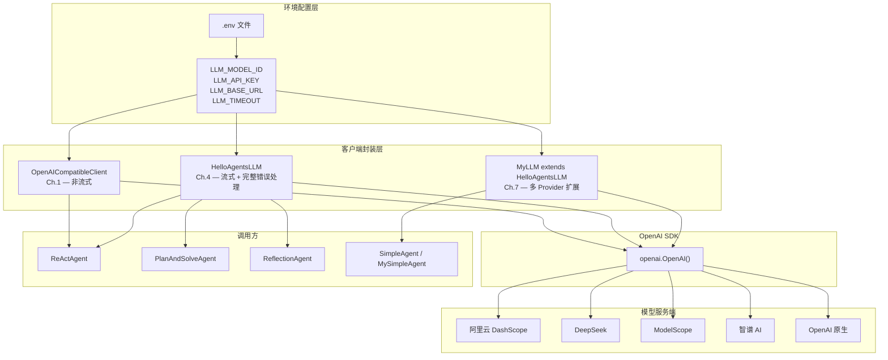
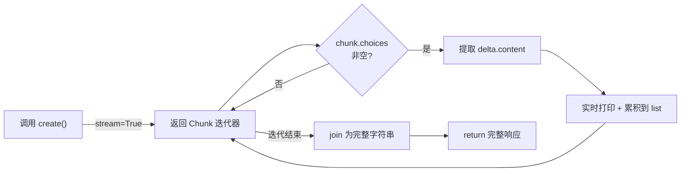
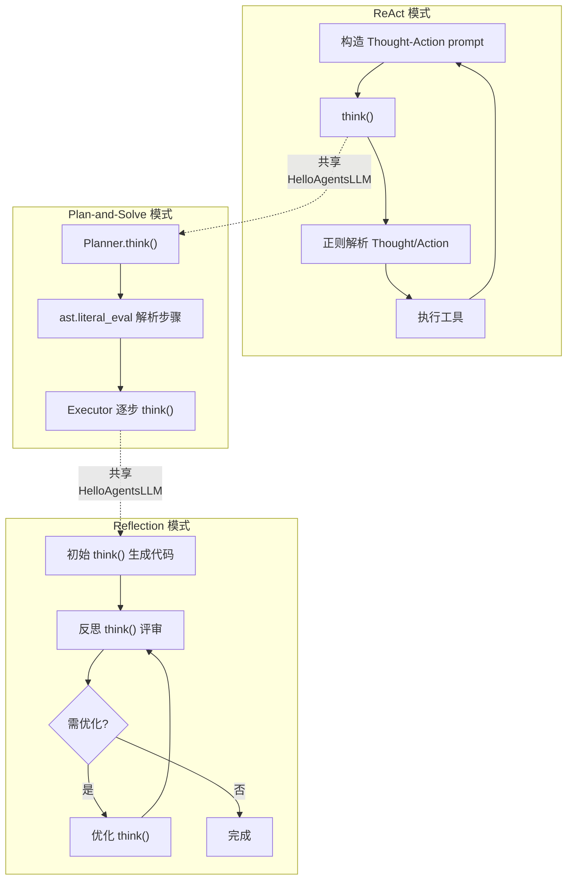
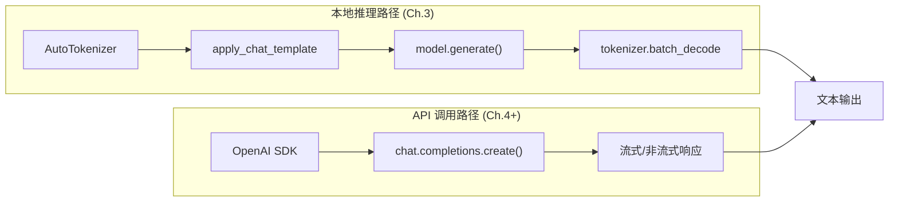

在大语言模型驱动的智能体体系中，LLM 客户端是连接「推理逻辑」与「模型服务」的唯一桥梁。本文以 Hello Agents 教程代码库为分析对象，深入解析从最初版 `OpenAICompatibleClient` 到成熟版 `HelloAgentsLLM` 再到框架级 `MyLLM` 的演进路径，涵盖 OpenAI 兼容接口设计、流式响应处理、环境变量配置策略以及多 Provider 扩展机制。

## 为什么选择 OpenAI 兼容接口作为统一抽象

当今主流大模型服务商——无论是阿里云 DashScope、智谱 AI、DeepSeek 还是 ModelScope——几乎都提供了与 OpenAI API 规格兼容的 HTTP 接口。这意味着只要使用官方 `openai` Python SDK，将 `base_url` 指向服务商地址、`api_key` 替换为对应密钥，即可在不修改任何业务代码的前提下切换模型后端。Hello Agents 教程精准地利用了这一生态事实，将 LLM 客户端设计为一层薄封装：内部持有一个 `OpenAI` 客户端实例，对外暴露统一的 `generate()` 或 `think()` 方法。

Sources: [llm_client.py](chapter4/llm_client.py#L1-L26)

### 架构总览

上图展示了从环境变量读取、客户端封装、SDK 调用到模型服务的完整链路。关键设计决策在于：**所有版本客户端均不耦合任何特定服务商**，切换 Provider 只需修改 `.env` 文件中的三个变量。

## 第一版客户端：OpenAICompatibleClient（Chapter 1）

教程第一章以最直接的方式引入了 LLM 客户端的概念。`OpenAICompatibleClient` 是一个极简封装类，构造函数接收 `model`、`api_key`、`base_url` 三个参数，在 `generate()` 方法中组装 messages 列表并调用 `client.chat.completions.create()`。值得注意的是，此版本使用 `stream=False`（非流式），意味着整个响应在服务器端生成完毕后才一次性返回。

Sources: [FirstAgentTest.py](chapter1/FirstAgentTest.py#L113-L139)

这一版本的教学价值在于揭示最小可行架构：构造 `OpenAI` 客户端实例 → 组装 messages → 调用 `chat.completions.create()` → 提取 `response.choices[0].message.content`。但它缺少环境变量加载、错误兜底返回值和流式输出能力。

## 核心封装：HelloAgentsLLM（Chapter 4）

`HelloAgentsLLM` 是全书最核心的 LLM 客户端实现，在 Chapter 1 的基础上完成了三项关键升级。

### 参数解析策略：构造函数与环境变量的优先级

构造函数采用**显式参数优先、环境变量兜底**的策略。每个参数都遵循 `参数值 = 传入值 or 环境变量值` 的模式，确保既支持编程式实例化（测试场景），也支持配置文件驱动（生产场景）。当三个核心参数（model、apiKey、baseUrl）中任一缺失时，立即抛出 `ValueError`，实现了快速失败原则。

Sources: [llm_client.py](chapter4/llm_client.py#L14-L26)

### 环境变量配置规范

| 环境变量 | 用途 | 必填 | 默认值 |
|---|---|---|---|
| `LLM_MODEL_ID` | 模型标识符（如 `qwen-plus`） | 是 | — |
| `LLM_API_KEY` | API 密钥 | 是 | — |
| `LLM_BASE_URL` | 服务端点地址 | 是 | — |
| `LLM_TIMEOUT` | 请求超时时间（秒） | 否 | `60` |
| `SERPAPI_API_KEY` | SerpApi 搜索工具密钥 | 否 | — |
| `TAVILY_API_KEY` | Tavily 搜索工具密钥 | 否 | — |

`.env` 文件通过 `python-dotenv` 的 `load_dotenv()` 加载，这要求开发者在项目根目录创建 `.env` 文件（以 `.env.example` 为模板），填入实际凭证。教程在 Chapter 4 和 Chapter 7 分别提供了对应的 `.env.example` 模板。

Sources: [.env copy](chapter4/.env copy#L1-L4), [.env.example](chapter7/.env.example#L1-L32)

### 流式响应处理：think() 方法

`think()` 是 `HelloAgentsLLM` 对外暴露的核心方法，其签名接收 `messages` 列表和可选的 `temperature` 参数，返回完整的字符串响应。内部实现的关键在于流式响应的累积式处理：

流式处理的核心代码逻辑如下：首先以 `stream=True` 调用 API，获得一个 chunk 迭代器；随后遍历每个 chunk，提取 `chunk.choices[0].delta.content`（增量内容片段），实时 `print` 到终端并通过 `collected_content` 列表累积；迭代结束后将列表 `join` 为完整字符串返回。`flush=True` 确保每个片段立即刷新到终端，为用户提供逐字生成的视觉效果。异常情况下打印错误信息并返回 `None`，调用方需对 `None` 进行空值处理。

Sources: [llm_client.py](chapter4/llm_client.py#L28-L55)

### 流式 vs 非流式对比

| 特性 | 非流式（`stream=False`） | 流式（`stream=True`） |
|---|---|---|
| **响应模式** | 等待完整生成后返回 | 逐 token 返回 |
| **首字延迟** | 高（取决于总生成长度） | 极低 |
| **用户体验** | 长时间无反馈后突现全文 | 打字机式渐进展示 |
| **内存占用** | 一次性接收完整响应 | 增量接收，峰值更低 |
| **代码复杂度** | 低（直接取 `choices[0].message.content`） | 中（需累积 chunk） |
| **适用场景** | 后台批处理、需要完整 JSON | 交互式对话、Agent 推理 |
| **返回值类型** | `str`（完整内容） | `str`（累积后的完整内容） |

Hello Agents 教程在 Chapter 1 使用非流式以便聚焦于 Agent 主循环逻辑，而在 Chapter 4 全面切换为流式以提升交互体验——这是一个从「教学清晰度优先」到「用户体验优先」的有意演进。

Sources: [FirstAgentTest.py](chapter1/FirstAgentTest.py#L129-L133), [llm_client.py](chapter4/llm_client.py#L34-L51)

## 消费端集成：Agent 如何调用 think()

`HelloAgentsLLM` 被设计为一个「无状态服务调用器」——它不维护对话历史、不了解 Agent 的推理范式、不关心工具执行。所有这些职责都由上层 Agent 类承担。这种**关注点分离**使得同一个客户端实例可以被多种 Agent 模式复用。

### ReAct 模式中的调用

`ReActAgent` 在每次推理循环中调用 `think()`，将包含 Thought-Action 格式约束的 prompt 发送给 LLM，解析返回的 `response_text` 提取思考与行动指令。如果 LLM 返回 `None`（即调用失败），Agent 会立即终止循环。

Sources: [ReAct.py](chapter4/ReAct.py#L33-L48)

### Plan-and-Solve 模式中的调用

`PlanAndSolveAgent` 将 `HelloAgentsLLM` 注入到 `Planner` 和 `Executor` 两个子组件中。`Planner` 调用 `think()` 获取结构化的步骤列表（通过 `ast.literal_eval` 解析 Python 列表），`Executor` 则在多步循环中反复调用 `think()` 执行每个子任务。两者共享同一个客户端实例，避免了重复初始化。

Sources: [Plan_and_solve.py](chapter4/Plan_and_solve.py#L33-L54), [Plan_and_solve.py](chapter4/Plan_and_solve.py#L77-L99)

### Reflection 模式中的调用

`ReflectionAgent` 在初始执行、反思评审和迭代优化三个阶段分别调用 `think()`。辅助方法 `_get_llm_response()` 统一处理了 `None` 返回值（通过 `or ""` 转为空字符串），确保下游的字符串操作不会因空值崩溃。

Sources: [Reflection.py](chapter4/Reflection.py#L142-L147)

### 三种 Agent 调用模式对比

## 框架级扩展：MyLLM（Chapter 7）

随着教程进入 HelloAgents 框架实战阶段，LLM 客户端需要适配更多模型服务商。Chapter 7 的 `MyLLM` 继承自框架库中的 `HelloAgentsLLM` 基类，通过 `provider` 参数实现了**条件式多态**：当 `provider="modelscope"` 时，走自定义的 ModelScope 配置路径（固定 base_url、独立环境变量 `MODELSCOPE_API_KEY`、默认模型 `Qwen/Qwen2.5-VL-72B-Instruct`）；否则调用 `super().__init__()` 完全复用父类逻辑。

Sources: [my_llm.py](chapter7/my_llm.py#L7-L41)

这种设计的精妙之处在于**开放-封闭原则**的实践：新增 Provider 不修改父类代码，而是在子类中通过条件分支扩展。核心推理方法 `think()` 完全继承自父类，无需重写。

### 调用链路：从 MyLLM 到流式响应

`MyLLM` 的使用方式极为简洁：实例化时指定 `provider="modelscope"`，随后直接调用继承的 `think()` 方法。`think()` 内部的流式打印逻辑在客户端层完成，调用方无需再次处理 chunk 迭代器。

Sources: [my_main.py](chapter7/my_main.py#L1-L22)

## 框架集成：SimpleAgent 中的 invoke 与 stream_invoke

进入 HelloAgents 框架（`hello_agents` 库）后，LLM 客户端的接口进一步演化为 `invoke()`（非流式同步调用）和 `stream_invoke()`（流式生成器）两个方法。`MySimpleAgent` 展示了这两种模式的协同使用：普通对话通过 `invoke()` 获取完整响应后处理；`stream_run()` 方法则通过 `stream_invoke()` 逐 chunk 产出，同时 `yield` 给上层消费者，实现「实时打印 + 生成器转发」的双重流式输出。

Sources: [my_simple_agent.py](chapter7/my_simple_agent.py#L47-L55), [my_simple_agent.py](chapter7/my_simple_agent.py#L196-L225)

### 接口演进对照表

| 版本 | 类名 | 核心方法 | 返回类型 | 流式支持 | 所在章节 |
|---|---|---|---|---|---|
| V1 | `OpenAICompatibleClient` | `generate()` | `str` | ❌ `stream=False` | Chapter 1 |
| V2 | `HelloAgentsLLM` | `think()` | `str`（累积） | ✅ 内部流式 | Chapter 4 |
| V3 | `MyLLM` | `think()`（继承） | `str`（累积） | ✅ 继承父类 | Chapter 7 |
| V4 | 框架 `HelloAgentsLLM` | `invoke()` / `stream_invoke()` | `str` / `Generator[str]` | ✅ 双模式 | Chapter 7+ |

## 从本地推理到 API 调用：Qwen.py 的参照

值得注意的是，Chapter 3 的 `Qwen.py` 展示了一条完全不同的路径——使用 HuggingFace `transformers` 库在本地加载和推理模型。它通过 `AutoModelForCausalLM.from_pretrained()` 加载 `Qwen/Qwen1.5-0.5B-Chat` 模型到 GPU 或 CPU，使用 `tokenizer.apply_chat_template()` 格式化输入，然后调用 `model.generate()` 进行推理。这条路径不依赖任何 API 服务，但需要本地 GPU 资源，且接口与 OpenAI SDK 完全不同。

Hello Agents 教程将本地推理作为原理性讲解（让学习者理解 Token 化、注意力机制等底层概念），而将 API 调用路径作为实战开发的主力方案——后者屏蔽了模型部署的复杂性，让开发者聚焦于 Agent 架构设计。

Sources: [Qwen.py](chapter3/Qwen.py#L1-L59)

## 设计模式总结

回顾整个 LLM 客户端的演进，可以提炼出四个关键设计模式：

**依赖注入**：Agent 类通过构造函数接收 `llm_client` 参数，而非在内部自行创建。这使得同一客户端实例可被多个 Agent 共享，也便于在测试中注入 Mock 对象。

Sources: [ReAct.py](chapter4/ReAct.py#L27-L30), [Plan_and_solve.py](chapter4/Plan_and_solve.py#L103-L106)

**配置外部化**：所有敏感信息（API Key、模型 ID）从环境变量读取，代码库中不硬编码任何凭证。`.env.example` 文件作为配置模板，实际 `.env` 文件被版本控制忽略。

Sources: [.env copy](chapter4/.env copy#L1-L4), [.env.example](chapter7/.env.example#L1-L32)

**统一接口契约**：无论底层是 OpenAI 原生服务、阿里云 DashScope 还是 ModelScope，对外都暴露相同的 `think()` 或 `invoke()` 方法，调用方无需感知 Provider 差异。

Sources: [my_llm.py](chapter7/my_llm.py#L7-L41), [my_main.py](chapter7/my_main.py#L15-L16)

**快速失败与防御性编程**：构造函数中缺失关键参数立即抛出异常（快速失败）；`think()` 方法在 API 调用失败时返回 `None` 而非崩溃（防御性），调用方通过 `or ""` 或 `if not response_text` 进行空值处理。

Sources: [llm_client.py](chapter4/llm_client.py#L23-L24), [llm_client.py](chapter4/llm_client.py#L53-L55), [Reflection.py](chapter4/Reflection.py#L146)

## 延伸阅读

理解了 LLM 客户端封装之后，建议按以下顺序继续探索：

- **[ReAct 模式：思考-行动-观察循环的实现与解析](7-react-mo-shi-si-kao-xing-dong-guan-cha-xun-huan-de-shi-xian-yu-jie-xi)** — 了解 `HelloAgentsLLM` 如何被集成到第一个实战 Agent 中
- **[计划与求解（Plan-and-Solve）模式：多步任务分解策略](8-ji-hua-yu-qiu-jie-plan-and-solve-mo-shi-duo-bu-ren-wu-fen-jie-ce-lue)** — 观察同一客户端在规划器与执行器中的双重角色
- **[反思（Reflection）模式：自我评估与迭代优化](9-fan-si-reflection-mo-shi-zi-wo-ping-gu-yu-die-dai-you-hua)** — 理解 `think()` 在多轮迭代中的调用模式
- **[SimpleAgent 构建：系统提示词、工具注册与多轮对话](13-simpleagent-gou-jian-xi-tong-ti-shi-ci-gong-ju-zhu-ce-yu-duo-lun-dui-hua)** — 进入 HelloAgents 框架，探索 `invoke()` 与 `stream_invoke()` 的集成