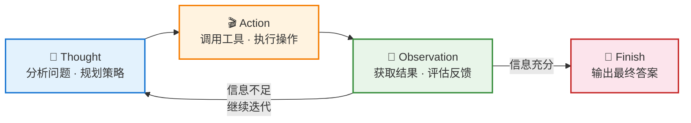
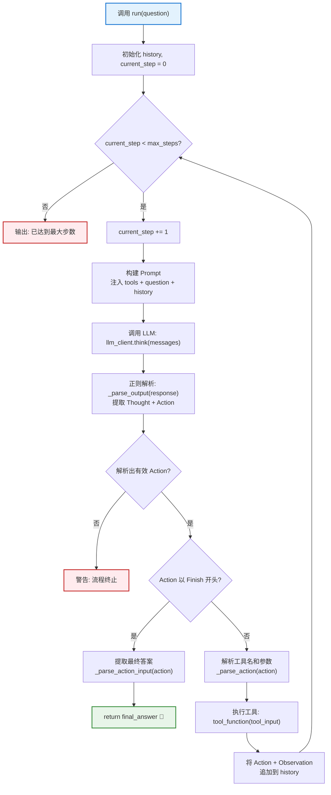
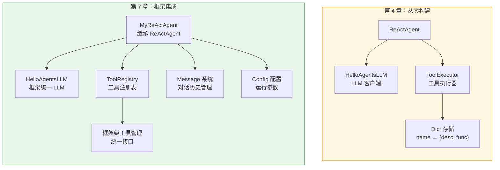
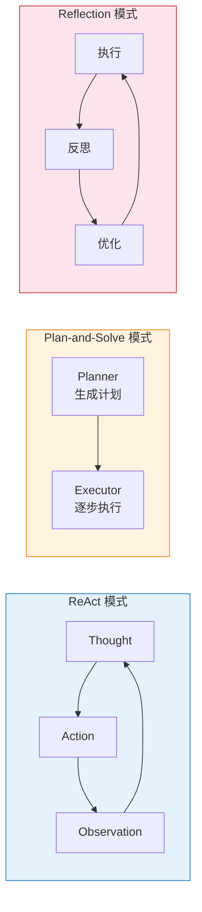

ReAct（Reasoning + Acting）是当前 Agent 系统中最经典的推理范式之一。它将大语言模型的**链式推理能力**与**外部工具调用能力**融合在一个闭环中，通过"思考→行动→观察"的不断迭代，使智能体能够自主分解复杂任务、获取外部信息、并根据反馈调整策略。本文将从原理到代码逐层解析项目中 ReAct 模式的两种实现——第 4 章的从零构建版与第 7 章的框架集成版——帮助你透彻理解这一范式的内部运作机制。

---

## 一、ReAct 的核心思想：推理与行动的交织

传统的大语言模型要么只做推理（如 Chain-of-Thought），要么只做行动（如 function calling），两者割裂。**ReAct 的突破在于将推理和行动统一在同一个交互循环中**：模型先用自然语言进行思考（Thought），然后决定采取什么行动（Action），接着执行该行动并获取环境反馈（Observation），再将反馈纳入下一轮思考。

这个三元组的核心价值在于——**思考指导行动，行动产生观察，观察反哺思考**。信息在这个闭环中不断积累，使智能体的推理从"凭空想象"转变为"基于证据"。



整个循环由一个关键的终止条件控制：当 LLM 在 Action 字段输出 `Finish[最终答案]` 时，循环结束并返回结果。此外还有一个安全阀——**最大步数限制**（`max_steps`），防止模型陷入无限循环。

Sources: [ReAct.py](chapter4/ReAct.py#L33-L73), [my_react_agent.py](chapter7/my_react_agent.py#L55-L100)

---

## 二、提示词工程：让 LLM 输出结构化的推理轨迹

ReAct 模式的根基在于一个精心设计的**提示词模板**，它强制 LLM 按照固定的 `Thought → Action` 格式输出，从而使程序能够可靠地解析和执行。

### 2.1 第 4 章：基础提示词模板

第 4 章的 `REACT_PROMPT_TEMPLATE` 是最精简的 ReAct 指令格式，包含三个关键占位符——`{tools}` 注入可用工具描述、`{question}` 注入用户问题、`{history}` 注入历史交互记录：

```
Thought: 你的思考过程，用于分析问题、拆解任务和规划下一步行动。
Action: 你决定采取的行动，必须是以下格式之一：
- `{tool_name}[{tool_input}]`：调用一个可用工具。
- `Finish[最终答案]`：当你认为已经获得最终答案时。
```

注意 Action 的语法设计：工具调用使用 `工具名[参数]` 的方括号语法，而终止指令使用 `Finish[最终答案]`，两者共享相同的 `正则解析模式`，代码复杂度得以降低。

Sources: [ReAct.py](chapter4/ReAct.py#L6-L24)

### 2.2 第 7 章：增强版提示词与自定义支持

第 7 章的 `MY_REACT_PROMPT` 在基础模板上增加了更详细的**工作流程指引**和**重要提醒**，明确指出"每次回应必须包含 Thought 和 Action 两部分"、"如果工具返回的信息不够，继续使用其他工具或相同工具的不同参数"。这些约束性指令显著降低了 LLM 违规输出的概率。

更值得注意的是，第 7 章的 `MyReActAgent` 支持**自定义提示词注入**——通过构造函数的 `custom_prompt` 参数，开发者可以针对特定场景（如数学计算、代码生成）传入专门优化的提示词模板：

```python
custom_agent = MyReActAgent(
    name="数学专家助手",
    llm=llm,
    tool_registry=tool_registry,
    max_steps=3,
    custom_prompt=custom_prompt  # 可替换的提示词模板
)
```

这种设计将 ReAct 的核心循环逻辑与提示词内容**解耦**，使同一套引擎能适应不同领域的任务。

Sources: [my_react_agent.py](chapter7/my_react_agent.py#L1-L27), [my_react_agent.py](chapter7/my_react_agent.py#L46-L52), [test_react_agent.py](chapter7/test_react_agent.py#L109-L129)

### 2.3 两种提示词模板的对比

| 维度 | 第 4 章 `REACT_PROMPT_TEMPLATE` | 第 7 章 `MY_REACT_PROMPT` |
|---|---|---|
| **设计风格** | 极简指令式 | 结构化 + 约束提醒 |
| **工作流说明** | 隐含在格式描述中 | 显式的 `## 工作流程` 和 `## 重要提醒` 章节 |
| **自定义支持** | 硬编码，不支持运行时替换 | 通过 `custom_prompt` 参数支持热替换 |
| **History 格式** | `History: {history}` | `## 执行历史\n{history}` |
| **适用场景** | 教学演示、快速原型 | 生产环境、多领域任务适配 |

---

## 三、核心循环的实现：从零构建（第 4 章）

第 4 章的 `ReActAgent` 类是理解 ReAct 模式最直接的入口。它不依赖任何框架，仅用标准库和正则表达式就实现了完整的推理-行动循环。

### 3.1 类结构与初始化

`ReActAgent` 的初始化接收三个核心依赖——LLM 客户端、工具执行器和最大步数，并维护一个 `history` 列表作为循环间的**短期记忆**：

```python
class ReActAgent:
    def __init__(self, llm_client: HelloAgentsLLM, tool_executor: ToolExecutor, max_steps: int = 5):
        self.llm_client = llm_client
        self.tool_executor = tool_executor
        self.max_steps = max_steps
        self.history = []
```

`max_steps` 默认值为 5，这是一个在效率和效果之间的经验平衡点——太低可能无法完成多步推理任务，太高则增加 token 消耗和延迟。

Sources: [ReAct.py](chapter4/ReAct.py#L26-L31)

### 3.2 `run` 方法：循环引擎的全貌

`run` 方法是整个 ReAct 系统的核心驱动器。下方的流程图标注了循环中每个关键阶段的代码位置和决策逻辑：



循环体内的每一次迭代（即一步推理）都严格遵循"构建提示词 → 调用 LLM → 解析输出 → 判断终止 → 执行工具 → 记录历史"的六步管线。其中，**历史记录的累积**是 ReAct 能够进行多步推理的关键——每一步的 Action 和 Observation 都被追加到 `self.history` 列表中，并在下一步构建 Prompt 时作为上下文注入：

```python
history_str = "\n".join(self.history)
prompt = REACT_PROMPT_TEMPLATE.format(tools=tools_desc, question=question, history=history_str)
```

这意味着 LLM 在第 N 步思考时，能够看到前 N-1 步的所有行动结果，从而做出**信息充分的决策**。

Sources: [ReAct.py](chapter4/ReAct.py#L33-L73)

### 3.3 正则解析：从自然语言中提取结构化指令

ReAct 的一个核心工程挑战是——LLM 的输出是自然语言文本，但程序需要从中精确提取出 Thought 和 Action 两个字段。项目使用三个正则表达式方法完成这一工作：

| 方法 | 正则模式 | 作用 |
|---|---|---|
| `_parse_output` | `r"Thought:\s*(.*?)(?=\nAction:\|$)"` | 匹配 `Thought:` 后到 `Action:` 或文本末尾的内容 |
| `_parse_output` | `r"Action:\s*(.*?)$"` | 匹配 `Action:` 后到文本末尾的内容 |
| `_parse_action` | `r"(\w+)\[(.*)\]"` | 从 `ToolName[input]` 格式中提取工具名和参数 |
| `_parse_action_input` | `r"\w+\[(.*)\]"` | 从 `Finish[answer]` 格式中提取最终答案 |

`re.DOTALL` 标志的使用确保了 `.` 能匹配换行符，从而正确处理多行的 Thought 内容。这种基于正则的解析方式简单高效，但也存在局限——如果 LLM 输出的格式不完全符合预期（比如多余的换行或缩进），解析可能失败。这也是第 7 章在提示词中加入更严格格式约束的原因之一。

Sources: [ReAct.py](chapter4/ReAct.py#L75-L90)

---

## 四、框架集成版（第 7 章）：从教学原型到可复用组件

第 7 章的 `MyReActAgent` 继承自 HelloAgents 框架的 `ReActAgent` 基类，在保持核心循环逻辑不变的前提下，引入了**工具注册表（ToolRegistry）**、**消息系统（Message）**和**配置管理（Config）**等框架级能力。

### 4.1 架构差异对比



核心区别在于**抽象层级的提升**：第 4 章直接操作原始的字典和函数引用，第 7 章则通过框架提供的 `ToolRegistry`、`Message` 等抽象类进行间接操作，获得了更好的类型安全性和可扩展性。

### 4.2 `MyReActAgent.run` 的关键改进

第 7 章的 `run` 方法在循环逻辑上与第 4 章基本一致，但有三处显著增强：

**（1）工具执行委托给 ToolRegistry：** 第 4 章手动查找并调用工具函数，第 7 章直接调用 `self.tool_registry.execute_tool(tool_name, tool_input)`，错误处理和日志记录由框架统一管理。

**（2）消息系统集成：** 当 Action 为 `Finish` 时，会自动将用户输入和最终答案以 `Message` 对象的形式加入对话历史，使后续查询能够复用上下文：

```python
if action and action.startswith("Finish"):
    final_answer = self._parse_action_input(action)
    self.add_message(Message(input_text, "user"))
    self.add_message(Message(final_answer, "assistant"))
    return final_answer
```

**（3）优雅的失败处理：** 当达到最大步数时，第 4 章返回 `None`，第 7 章返回一条友好的中文提示 `"抱歉，我无法在限定步数内完成这个任务。"`，同样将其记录到消息历史中。

Sources: [my_react_agent.py](chapter7/my_react_agent.py#L55-L100)

### 4.3 测试体系：多维度验证

第 7 章的 `test_react_agent.py` 设计了三个递进难度的测试场景，全面覆盖 ReAct 的推理能力边界：

| 测试场景 | 问题类型 | 考察点 | 预期步数 |
|---|---|---|---|
| **测试 1**：数学计算 | `(25 + 15) * 3 - 8` | 单步工具调用 | 1-2 步 |
| **测试 2**：信息搜索 | Python 发布年份 | 外部信息获取 | 2-3 步 |
| **测试 3**：复合推理 | 班级男女比例计算 | 多步分解 + 中间结果传递 | 3-4 步 |

此外，`test_custom_prompt` 函数验证了自定义提示词的注入能力，使用一个极简的数学专家提示词模板成功替换了默认的通用模板，证明了 `custom_prompt` 参数的灵活性。

Sources: [test_react_agent.py](chapter7/test_react_agent.py#L9-L88), [test_react_agent.py](chapter7/test_react_agent.py#L90-L146)

---

## 五、工具系统：ReAct 的行动基础设施

ReAct 的 Action 步骤依赖于一个完善的**工具管理和执行系统**。项目中存在两套工具管理实现，分别对应第 4 章和第 7 章。

### 5.1 第 4 章 ToolExecutor：轻量级工具管理

`ToolExecutor` 是一个极简的工具注册和查找容器，核心数据结构是一个字典 `self.tools: Dict[str, Dict[str, Any]]`，其中每个工具以名称为键，值为包含 `description` 和 `func` 两个字段的字典：

```python
class ToolExecutor:
    def registerTool(self, name: str, description: str, func: callable):
        self.tools[name] = {"description": description, "func": func}
    
    def getAvailableTools(self) -> str:
        return "\n".join([f"- {name}: {info['description']}" for name, info in self.tools.items()])
    
    def getTool(self, name: str) -> callable:
        return self.tools.get(name, {}).get("func")
```

`getAvailableTools` 方法的返回值会直接注入到提示词模板的 `{tools}` 占位符中，使 LLM 了解当前可调用的工具及其用途。搜索工具 `search` 基于 **SerpApi** 实现，会智能地按 `answer_box_list → answer_box → knowledge_graph → organic_results` 的优先级解析搜索结果，确保返回的信息尽可能直接和准确。

Sources: [tools.py](chapter4/tools.py#L9-L49), [tools.py](chapter4/tools.py#L53-L83)

### 5.2 第 7 章 ToolRegistry：框架级工具注册表

第 7 章使用 HelloAgents 框架内置的 `ToolRegistry` 类，接口设计更加规范——`register_function` 方法接收 `name`、`description`、`func` 三个命名参数，`execute_tool` 方法统一处理工具调用，`get_tools_description` 方法生成格式化的工具列表：

```python
tool_registry = ToolRegistry()
tool_registry.register_function("calculate", "执行数学计算，支持基本的四则运算", calculate)
tool_registry.register_function("search", "搜索互联网信息", search)
```

项目中还提供了**自定义计算器工具** `my_calculator_tool.py`，它基于 Python 的 `ast` 模块实现安全的表达式求值，支持四则运算和 `sqrt`、`pi` 等数学函数，避免了直接使用 `eval()` 的安全风险。

Sources: [test_react_agent.py](chapter7/test_react_agent.py#L18-L35), [my_calculator_tool.py](chapter7/my_calculator_tool.py#L1-L61)

---

## 六、LLM 客户端：推理引擎的统一接口

两个章节的 ReAct 实现共享同一个 LLM 客户端设计理念——封装 OpenAI 兼容接口，支持流式响应，并通过 `.env` 文件管理凭证。

`HelloAgentsLLM` 的 `think` 方法是 ReAct 循环中唯一的 LLM 调用入口。它接收 `messages` 列表，以 `temperature=0`（默认）发起请求，并通过流式逐块收集响应内容。`temperature=0` 的设定在 ReAct 场景中尤其重要——**确定性的推理输出**能显著提高正则解析的可靠性，减少 LLM 生成格式变异导致的解析失败。

第 7 章的 `MyLLM` 子类展示了框架的可扩展性——通过 `provider` 参数切换不同的模型服务商（如 ModelScope），仅需重写 `__init__` 方法中的凭证解析逻辑，`think` 等核心方法完全从父类继承。

Sources: [llm_client.py](chapter4/llm_client.py#L9-L55), [my_llm.py](chapter7/my_llm.py#L1-L41)

---

## 七、ReAct 与其他推理范式的对比

第 4 章同时实现了三种 Agent 推理范式——ReAct、Plan-and-Solve 和 Reflection——理解它们的差异有助于在实际场景中做出正确的架构选择。



| 维度 | ReAct | Plan-and-Solve | Reflection |
|---|---|---|---|
| **核心机制** | 思考-行动-观察交织循环 | 先规划再逐步执行 | 执行-反思-优化迭代 |
| **工具调用** | ✅ 内置工具系统 | ❌ 依赖 LLM 自身能力 | ❌ 聚焦于自我改进 |
| **反馈来源** | 外部工具返回的 Observation | 计划中前序步骤的结果 | LLM 作为评审员的反馈 |
| **适应性** | 高——可根据观察动态调整策略 | 中——计划一旦确定较难修改 | 低——聚焦于同一输出的改进 |
| **适用场景** | 需要外部信息检索的开放性问题 | 结构化、可预先分解的复杂任务 | 代码生成、文本写作等质量优化场景 |
| **终止条件** | `Finish[答案]` 或 max_steps | 计划步骤全部执行完毕 | 达到迭代上限或评审通过 |

**ReAct 的独特优势**在于其**在线适应能力**：每一步的 Action 都基于上一步的 Observation 做出，而非依赖一个预先制定的静态计划。这使得它特别适合处理信息不完全、需要根据搜索结果动态决策的问题——例如"华为最新手机的主要卖点是什么？"这类需要实时信息检索的开放式问题。

Sources: [ReAct.py](chapter4/ReAct.py#L92-L99), [Plan_and_solve.py](chapter4/Plan_and_solve.py#L102-L116), [Reflection.py](chapter4/Reflection.py#L97-L140)

---

## 八、运行环境与快速启动

### 8.1 环境变量配置

两个章节都通过 `.env` 文件管理敏感凭证。最小配置仅需四个变量：

```bash
LLM_MODEL_ID=your-model-name          # 模型标识符
LLM_API_KEY=your-api-key              # API 密钥
LLM_BASE_URL=your-api-base-url        # 服务端点
SERPAPI_API_KEY=your_serpapi_key      # 搜索工具密钥（仅第 4 章搜索功能需要）
```

Sources: [.env copy](chapter4/.env copy#L1-L4), [.env.example](chapter7/.env.example#L1-L32)

### 8.2 快速启动步骤

| 步骤 | 第 4 章 | 第 7 章 |
|---|---|---|
| **1. 配置环境** | 复制 `.env copy` 为 `.env`，填入凭证 | 复制 `.env.example` 为 `.env`，填入凭证 |
| **2. 安装依赖** | `pip install openai python-dotenv serpapi` | `pip install hello-agents openai python-dotenv` |
| **3. 运行** | `python ReAct.py` | `python test_react_agent.py` |
| **4. 自定义** | 修改 `question` 变量 | 修改测试函数中的问题或注册新工具 |

### 8.3 调试建议

在 ReAct 循环调试中，最常见的故障模式及其排查方法：

| 故障现象 | 可能原因 | 排查方法 |
|---|---|---|
| "未能解析出有效的 Action" | LLM 输出格式不符合 `Thought:/Action:` 规范 | 检查 `_parse_output` 的正则匹配；尝试调低 `temperature` |
| "未找到名为 'xxx' 的工具" | 工具名拼写不一致或未注册 | 检查 `tool_executor.registerTool` 的名称与 LLM 输出的工具名是否匹配 |
| 循环达到 max_steps 未完成 | 问题过于复杂或工具返回信息不足 | 增大 `max_steps`；优化工具描述以引导 LLM 正确调用 |
| Observation 返回 API 错误 | SerpApi 密钥无效或额度耗尽 | 验证 `SERPAPI_API_KEY`；检查 SerpApi 控制台用量 |

---

## 九、延伸阅读

理解了 ReAct 模式的核心机制后，以下内容将帮助你构建更完整的 Agent 推理知识体系：

- **[计划与求解（Plan-and-Solve）模式](8-ji-hua-yu-qiu-jie-plan-and-solve-mo-shi-duo-bu-ren-wu-fen-jie-ce-lue)** —— 与 ReAct 的在线适应不同，Plan-and-Solve 采用"先规划全局、再逐步执行"的策略，适合结构化程度较高的任务。
- **[反思（Reflection）模式](9-fan-si-reflection-mo-shi-zi-wo-ping-gu-yu-die-dai-you-hua)** —— 聚焦于输出质量的迭代优化，通过"执行-评审-改进"循环持续提升结果，可与 ReAct 组合使用。
- **[工具系统设计](14-gong-ju-xi-tong-she-ji-ji-suan-qi-gong-ju-sou-suo-gong-ju-yu-gong-ju-zhi-xing-qi)** —— 深入了解 HelloAgents 框架中 `ToolRegistry` 的完整设计与工具执行器的实现细节。
- **[SimpleAgent 构建](13-simpleagent-gou-jian-xi-tong-ti-shi-ci-gong-ju-zhu-ce-yu-duo-lun-dui-hua)** —— 查看第 7 章 `MyReActAgent` 所继承的框架基类如何与系统提示词和对话管理协同工作。