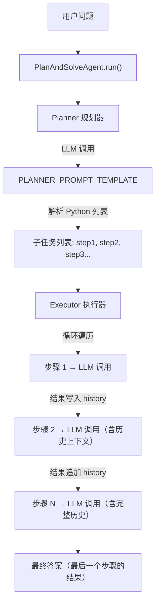
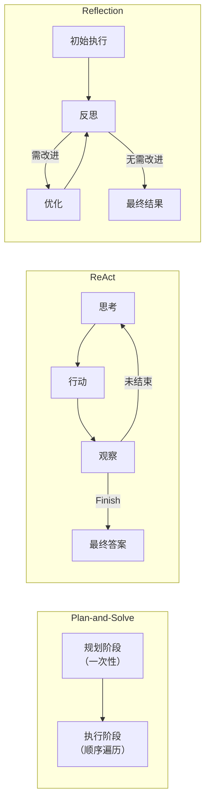

Plan-and-Solve 是一种**先规划后执行**的两阶段推理范式，将复杂问题显式拆解为有序子任务列表，再逐步求解。与 ReAct 模式的"边想边做"不同，Plan-and-Solve 在行动前就完成了完整的全局蓝图，从而减少了中途决策偏差带来的误差累积。本页将基于 `chapter4/Plan_and_solve.py` 的完整实现，深入剖析该模式的核心架构、关键类设计、与 ReAct/Reflection 的对比，以及工程实践中的注意事项。

Sources: [Plan_and_solve.py](chapter4/Plan_and_solve.py#L1-L126)

---

## 核心思想：为什么需要"先规划"？

大语言模型在面对多步推理任务时，常出现**中间步骤遗漏**或**逻辑跳步**的问题——模型急于给出最终答案，却忽略了必要的中间推导。Plan-and-Solve 的解决方案是引入一个明确的**规划阶段**：先将复杂问题分解为一系列独立的、按逻辑顺序排列的子任务，再进入**执行阶段**逐个攻克。

这一设计哲学直接体现在提示词模板的措辞中——规划器被要求"确保计划中的每个步骤都是一个独立的、可执行的子任务，并且严格按照逻辑顺序排列"，而执行器被要求"专注于解决当前步骤，并仅输出该步骤的最终答案"。

Sources: [Plan_and_solve.py](chapter4/Plan_and_solve.py#L19-L30), [Plan_and_solve.py](chapter4/Plan_and_solve.py#L57-L75)

---

## 架构全景：三组件协作模型

Plan-and-Solve Agent 由三个紧密协作的组件构成。以下 Mermaid 图展示了从用户输入到最终输出的完整数据流：



| 组件 | 类名 | 职责 | 关键方法 |
|------|------|------|----------|
| 规划器 | `Planner` | 将问题分解为有序子任务列表 | `plan(question) → list[str]` |
| 执行器 | `Executor` | 逐步执行子任务，维护执行历史 | `execute(question, plan) → str` |
| 协调器 | `PlanAndSolveAgent` | 组装规划器与执行器，控制流程 | `run(question) → None` |

三者通过 `HelloAgentsLLM` 客户端统一访问大语言模型，保持了调用接口的一致性。

Sources: [Plan_and_solve.py](chapter4/Plan_and_solve.py#L32-L54), [Plan_and_solve.py](chapter4/Plan_and_solve.py#L77-L99), [Plan_and_solve.py](chapter4/Plan_and_solve.py#L102-L115)

---

## 规划器（Planner）：从问题到蓝图

### 提示词工程

规划器的核心是一段精心设计的提示词模板 `PLANNER_PROMPT_TEMPLATE`，它给 LLM 设定了明确的角色定位（"顶级的AI规划专家"），并约束输出格式为可解析的 Python 列表：

```python
PLANNER_PROMPT_TEMPLATE = """
你是一个顶级的AI规划专家。你的任务是将用户提出的复杂问题分解成一个由多个简单步骤组成的行动计划。
请确保计划中的每个步骤都是一个独立的、可执行的子任务，并且严格按照逻辑顺序排列。
你的输出必须是一个Python列表，其中每个元素都是一个描述子任务的字符串。

问题: {question}

请严格按照以下格式输出你的计划，```python与```作为前后缀是必要的:
```python
["步骤1", "步骤2", "步骤3", ...]
```
"""
```

这段模板的设计要点在于：**强制使用 ` ```python ` 代码块包裹输出**，使得后续的字符串解析可以精确定位列表内容，避免自由文本干扰。

Sources: [Plan_and_solve.py](chapter4/Plan_and_solve.py#L19-L30)

### 计划解析与容错

`Planner.plan()` 方法不仅调用 LLM 生成计划，还负责将自然语言响应解析为 Python 列表。解析逻辑采用 `ast.literal_eval` 安全求值，并通过 `split("```python")` 提取代码块内容：

```python
def plan(self, question: str) -> list[str]:
    prompt = PLANNER_PROMPT_TEMPLATE.format(question=question)
    messages = [{"role": "user", "content": prompt}]
    response_text = self.llm_client.think(messages=messages) or ""
    try:
        plan_str = response_text.split("```python")[1].split("```")[0].strip()
        plan = ast.literal_eval(plan_str)
        return plan if isinstance(plan, list) else []
    except (ValueError, SyntaxError, IndexError) as e:
        print(f"❌ 解析计划时出错: {e}")
        return []
```

容错机制覆盖三类常见异常：`ValueError`（列表元素格式不合法）、`SyntaxError`（LLM 输出的 Python 语法错误）和 `IndexError`（未找到 ` ```python ` 标记）。任何解析失败都会返回空列表，触发上层流程的优雅终止。

Sources: [Plan_and_solve.py](chapter4/Plan_and_solve.py#L36-L54)

> **工程提示**：`ast.literal_eval` 比 `eval` 安全得多——它只解析 Python 字面量（字符串、数字、列表、字典等），不会执行任意代码。这是处理 LLM 生成内容的推荐做法。

---

## 执行器（Executor）：带历史上下文的逐步求解

### 上下文累积机制

执行器的设计精髓在于**历史累积策略**：每执行完一个步骤，其结果会被拼接到 `history` 字符串中，作为后续步骤的上下文输入。这意味着后执行的步骤能够"看到"前面所有步骤的结果，形成信息链式传递：

```python
def execute(self, question: str, plan: list[str]) -> str:
    history = ""
    final_answer = ""
    for i, step in enumerate(plan, 1):
        prompt = EXECUTOR_PROMPT_TEMPLATE.format(
            question=question, plan=plan, history=history if history else "无", current_step=step
        )
        messages = [{"role": "user", "content": prompt}]
        response_text = self.llm_client.think(messages=messages) or ""
        history += f"步骤 {i}: {step}\n结果: {response_text}\n\n"
        final_answer = response_text
    return final_answer
```

以数学应用题为例，如果计划是 `["计算周一销量", "计算周二销量", "计算周三销量", "求总和"]`，那么在执行"求总和"这一步时，LLM 能从 `history` 中直接读取前三天各自的计算结果，而不需要重新推导。

Sources: [Plan_and_solve.py](chapter4/Plan_and_solve.py#L81-L99)

### 执行器提示词模板

执行器的提示词模板 `EXECUTOR_PROMPT_TEMPLATE` 包含四个动态字段，确保每次调用时 LLM 都能获得完整的上下文画像：

| 模板字段 | 注入内容 | 作用 |
|----------|----------|------|
| `{question}` | 原始用户问题 | 防止步骤执行偏离全局目标 |
| `{plan}` | 完整计划列表 | 让执行器理解当前步骤在全局中的位置 |
| `{history}` | 已完成步骤的结果 | 信息链传递，避免重复计算 |
| `{current_step}` | 当前要执行的步骤 | 聚焦当前任务，隔离干扰 |

Sources: [Plan_and_solve.py](chapter4/Plan_and_solve.py#L57-L75)

---

## 协调器（PlanAndSolveAgent）：流程编排与异常终止

`PlanAndSolveAgent` 作为门面类（Facade），将 `Planner` 和 `Executor` 封装为统一的交互入口：

```python
class PlanAndSolveAgent:
    def __init__(self, llm_client: HelloAgentsLLM):
        self.llm_client = llm_client
        self.planner = Planner(self.llm_client)
        self.executor = Executor(self.llm_client)

    def run(self, question: str):
        plan = self.planner.plan(question)
        if not plan:
            print("无法生成有效的行动计划。")
            return
        final_answer = self.executor.execute(question, plan)
```

值得注意的是，规划器与执行器**共享同一个 `llm_client` 实例**——这意味着它们调用的是同一个模型。在实际工程中，你也可以为两者注入不同的模型实例（例如，规划阶段使用更强的推理模型，执行阶段使用更快的模型），只需调整构造函数即可。

Sources: [Plan_and_solve.py](chapter4/Plan_and_solve.py#L102-L115)

---

## 实战运行：数学应用题分解演示

项目提供了一个标准测试用例——一个三天的苹果销售应用题：

```
一个水果店周一卖出了15个苹果。周二卖出的苹果数量是周一的两倍。
周三卖出的数量比周二少了5个。请问这三天总共卖出了多少个苹果？
```

预期行为是规划器将其分解为类似以下的步骤列表：

```python
["计算周一卖出的苹果数量：15个",
 "计算周二卖出的苹果数量：15 × 2 = 30个",
 "计算周三卖出的苹果数量：30 - 5 = 25个",
 "计算三天总共卖出的苹果数量：15 + 30 + 25 = 70个"]
```

执行器随后逐步求解，每步结果累积到 `history` 中，最终返回 `70`。这个用例同时在 `chapter4` 的原始实现和 `chapter7` 的框架集成测试中使用。

Sources: [Plan_and_solve.py](chapter4/Plan_and_solve.py#L118-L126), [test_plan_solve_agent.py](chapter7/test_plan_solve_agent.py#L18-L22)

---

## 框架集成版：HelloAgents 框架中的 Plan-and-Solve

在 `chapter7` 中，Plan-and-Solve 模式被集成到了 `hello_agents` 框架中。测试脚本展示了如何使用框架提供的 `HelloAgentsLLM` 和自定义的 `MyPlanAndSolveAgent`：

```python
from hello_agents.core.llm import HelloAgentsLLM
from my_plan_solve_agent import MyPlanAndSolveAgent

llm = HelloAgentsLLM()
agent = MyPlanAndSolveAgent(
    name="我的规划执行助手",
    llm=llm
)
question = "一个水果店周一卖出了15个苹果..."
result = agent.run(question)
print(f"对话历史: {len(agent.get_history())} 条消息")
```

与 `chapter4` 的独立实现相比，框架版本增加了 `name` 参数（智能体命名）和 `get_history()` 方法（对话历史追溯），体现了从原型到框架的工程化演进。

Sources: [test_plan_solve_agent.py](chapter7/test_plan_solve_agent.py#L1-L25)

---

## 模式对比：Plan-and-Solve vs ReAct vs Reflection

三种推理范式在同一代码库中并存，各有适用场景。以下从**控制流结构、上下文管理、终止条件**三个维度进行对比：



| 维度 | Plan-and-Solve | ReAct | Reflection |
|------|----------------|-------|------------|
| **核心循环** | 规划 → 顺序执行（无循环） | 思考→行动→观察（有循环） | 执行→反思→优化（有循环） |
| **计划生成** | 前置、一次性、全局可见 | 隐式、每步即时、局部可见 | 无显式计划 |
| **外部工具** | 无（纯 LLM 推理） | 有（`ToolExecutor` 注册工具） | 无（纯 LLM 推理） |
| **终止条件** | 步骤列表耗尽 | `Finish[答案]` 或达到 `max_steps` | "无需改进" 或达到 `max_iterations` |
| **上下文累积** | `history` 字符串链式拼接 | `self.history` 列表（Action+Observation） | `Memory.records` 结构化记录 |
| **适用场景** | 逻辑链清晰的推导题 | 需要实时信息检索的开放问题 | 需要质量迭代优化的生成任务 |
| **主要风险** | 计划不够好则全盘皆输 | 循环不收敛（无限思考） | 过度优化（打磨过度） |

**关键洞察**：Plan-and-Solve 的最大优势在于**降低单次推理的认知负载**——将一个复杂问题拆成多个简单问题后，每个步骤的 LLM 调用只需要聚焦一个子任务。但这也带来一个固有风险：**规划质量是整个流程的瓶颈**。如果规划阶段生成的步骤序列存在逻辑缺陷或遗漏，后续执行阶段无法修正（因为执行器不拥有重新规划的能力）。

Sources: [Plan_and_solve.py](chapter4/Plan_and_solve.py#L102-L115), [ReAct.py](chapter4/ReAct.py#L33-L73), [Reflection.py](chapter4/Reflection.py#L103-L140)

---

## 工程实践注意事项

### 1. 输出格式约束的脆弱性

`Planner.plan()` 依赖 LLM 输出包含 ` ```python ` 标记的代码块。不同模型对格式指令的遵从度参差不齐，建议：
- 使用 `temperature=0`（`HelloAgentsLLM.think` 的默认值）以获得确定性输出
- 对于格式遵从度较低的模型，考虑在提示词中增加 few-shot 示例

Sources: [llm_client.py](chapter4/llm_client.py#L28), [Plan_and_solve.py](chapter4/Plan_and_solve.py#L44-L51)

### 2. 上下文窗口增长

执行器的 `history` 字符串在长计划中会持续膨胀。对于步骤数超过 10 的复杂任务，应考虑：
- 实现历史摘要（用 LLM 压缩已完成步骤的结果）
- 或采用滑动窗口策略，只保留最近 N 步的详细结果

Sources: [Plan_and_solve.py](chapter4/Plan_and_solve.py#L81-L99)

### 3. 规划阶段失败的处理

当前实现在 `plan()` 返回空列表时直接终止流程，不提供重试机制。在生产环境中，可考虑添加规划重试逻辑或回退到单步推理模式。

Sources: [Plan_and_solve.py](chapter4/Plan_and_solve.py#L110-L113)

### 4. `ast.literal_eval` 的安全边界

虽然 `ast.literal_eval` 比 `eval` 安全，但它仍然要求输入是合法的 Python 字面量。如果 LLM 生成的列表中包含变量引用（如 `["计算" + x]`），解析将失败。确保提示词明确要求"每个元素都是一个描述子任务的字符串"。

Sources: [Plan_and_solve.py](chapter4/Plan_and_solve.py#L22-L23), [Plan_and_solve.py](chapter4/Plan_and_solve.py#L44-L51)

---

## 延伸阅读

- **ReAct 模式详解**：如果需要了解"思考-行动-观察"循环如何处理需要外部工具调用的动态场景，请参阅 [ReAct 模式：思考-行动-观察循环的实现与解析](7-react-mo-shi-si-kao-xing-dong-guan-cha-xun-huan-de-shi-xian-yu-jie-xi)。
- **Reflection 模式详解**：如果需要了解如何通过"执行-反思-优化"循环实现质量迭代，请参阅 [反思（Reflection）模式：自我评估与迭代优化](9-fan-si-reflection-mo-shi-zi-wo-ping-gu-yu-die-dai-you-hua)。
- **LLM 客户端封装**：关于 `HelloAgentsLLM` 的 OpenAI 兼容接口与流式响应实现细节，请参阅 [LLM 客户端封装：OpenAI 兼容接口与流式响应](6-llm-ke-hu-duan-feng-zhuang-openai-jian-rong-jie-kou-yu-liu-shi-xiang-ying)。
- **框架集成**：关于如何在 `hello_agents` 框架中构建自定义 Agent，请参阅 [SimpleAgent 构建：系统提示词、工具注册与多轮对话](13-simpleagent-gou-jian-xi-tong-ti-shi-ci-gong-ju-zhu-ce-yu-duo-lun-dui-hua)。