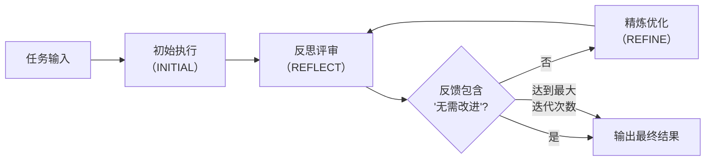
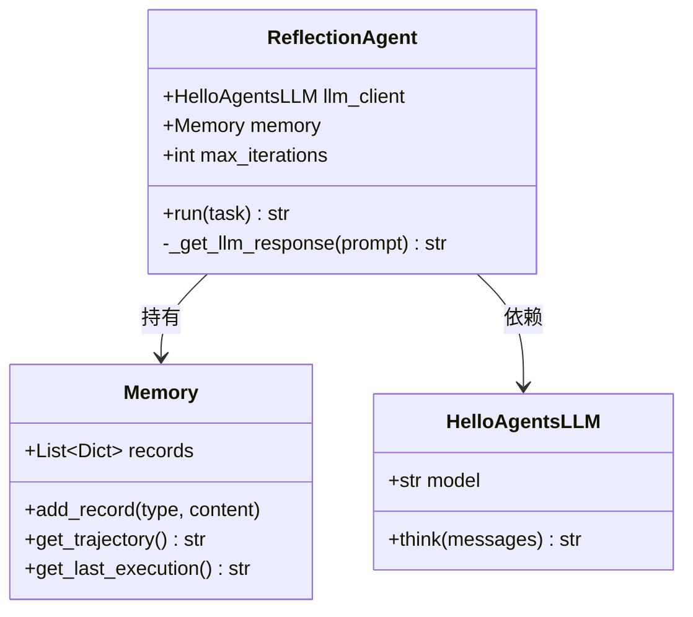
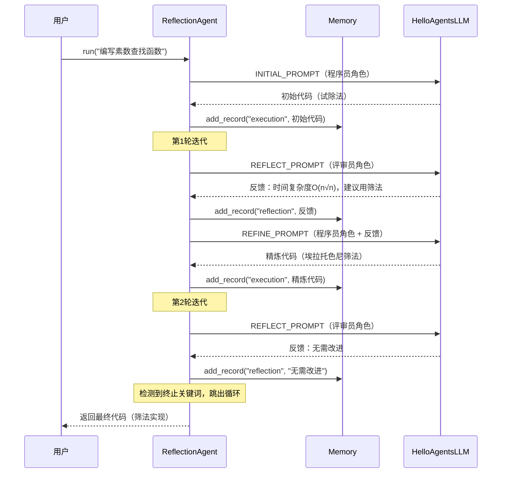

人类在解决问题时，往往会经历一个"先做、再回头看、然后改进"的自然循环。反思（Reflection）模式正是将这一认知机制引入 AI 智能体设计的经典推理范式。不同于 ReAct 模式依赖外部工具反馈、也不同于 Plan-and-Solve 模式仅做线性分解，Reflection 的核心在于 **智能体自身的内省能力**——先产出初始结果，再以"评审员"身份审视自身输出的缺陷，最后以"执行者"身份根据反馈完成迭代优化。本章将深入剖析 `chapter4/Reflection.py` 中的完整实现，拆解其记忆模块、三段式提示词工程与迭代终止逻辑，帮助你掌握这一在代码生成、文本写作等领域广泛适用的高效范式。

Sources: [Reflection.py](chapter4/Reflection.py#L1-L164)

---

## 反思模式的核心思想：从"一次性"到"迭代精炼"

传统的 LLM 调用本质上是**一次性生成**：模型接收提示词，直接输出结果，无法回头修正。这种方式在面对复杂任务时质量受限——模型在生成过程中没有"自我审查"的机会。

反思模式通过引入一个 **"生成-反思-精炼"的三阶段循环** 打破这一局限。其信息流可以用一个简洁的 Mermaid 流程图概括：



整个循环的关键设计在于：**反思与执行使用不同的角色设定**。初始执行阶段，LLM 扮演"资深程序员"角色专注产出；反思阶段，同一 LLM 切换为"严苛的代码评审专家"角色，从算法效率等专业维度审视上一轮输出；精炼阶段，LLM 再次回归"程序员"角色，但这次携带了评审反馈作为改进依据。这种角色切换完全通过提示词模板实现，无需额外的模型实例或外部裁判。

Sources: [Reflection.py](chapter4/Reflection.py#L49-L95)

---

## 架构全景：三大核心组件

Reflection 智能体的实现由三个核心组件构成，它们的职责边界清晰、耦合度低：

| 组件 | 类/模板 | 职责 | 关键方法 |
|------|---------|------|----------|
| 记忆模块 | `Memory` | 存储执行与反思的交替轨迹 | `add_record()`, `get_last_execution()` |
| 提示词模板 | 三个常量字符串 | 定义"程序员"与"评审员"的角色设定 | `format()` 占位符填充 |
| 反思智能体 | `ReflectionAgent` | 编排初始执行→反思→精炼的迭代循环 | `run()`, `_get_llm_response()` |

下面的类图展示了组件之间的结构关系：



Sources: [Reflection.py](chapter4/Reflection.py#L5-L148), [llm_client.py](chapter4/llm_client.py#L9-L55)

---

## 记忆模块：执行-反思轨迹的持久化

`Memory` 类是整个反思循环的基础设施。它采用一个简单的 `List[Dict]` 来存储交替出现的执行记录和反思记录，每条记录用 `type` 字段区分类型：

```python
def add_record(self, record_type: str, content: str):
    self.records.append({"type": record_type, "content": content})
```

这里的设计有两个要点值得注意。第一，`record_type` 只接受 `"execution"` 或 `"reflection"` 两种值，这直接映射了反思循环的两个核心阶段。第二，记忆的存储顺序严格遵循时间线——执行、反思、精炼后的执行、再反思——形成了天然的交替结构。

`get_last_execution()` 方法通过逆序遍历 `records` 列表来获取最新一次的执行结果，这确保了每一轮反思始终针对 **最新的代码版本** 而非初始版本：

```python
def get_last_execution(self) -> str:
    for record in reversed(self.records):
        if record['type'] == 'execution':
            return record['content']
    return None
```

此外，`get_trajectory()` 方法可以将完整的记忆轨迹格式化为带标签的字符串，用于在需要时向 LLM 提供完整的历史上下文。但在当前实现中，精炼阶段仅传入"上一轮代码 + 反馈"，而非完整轨迹——这是一个影响 Token 消耗与效果平衡的关键设计取舍。

Sources: [Reflection.py](chapter4/Reflection.py#L5-L46)

---

## 三段式提示词工程：角色切换的艺术

Reflection 模式的精髓集中体现在三段提示词模板中。它们各自承担明确的职责，通过 `{task}`、`{code}`、`{feedback}` 等占位符实现动态填充。

### 初始执行提示词（INITIAL_PROMPT_TEMPLATE）

第一阶段让 LLM 扮演 **"资深 Python 程序员"**，专注于一次性产出高质量代码：

```python
INITIAL_PROMPT_TEMPLATE = """
你是一位资深的Python程序员。请根据以下要求，编写一个Python函数。
你的代码必须包含完整的函数签名、文档字符串，并遵循PEP 8编码规范。
要求: {task}
请直接输出代码，不要包含任何额外的解释。
"""
```

### 反思提示词（REFLECT_PROMPT_TEMPLATE）

第二阶段将 LLM 切换为 **"极其严格的代码评审专家"**，聚焦于算法效率层面的瓶颈分析：

```python
REFLECT_PROMPT_TEMPLATE = """
你是一位极其严格的代码评审专家和资深算法工程师，对代码的性能有极致的要求。
你的任务是审查以下Python代码，并专注于找出其在算法效率上的主要瓶颈。
...
如果代码在算法层面已经达到最优，才能回答"无需改进"。
"""
```

注意模板中特意嵌入了 **"无需改进"** 这一终止关键词。这是后续迭代循环中判断是否提前终止的锚点。提示词还给出了具体的改进方向示例（如"使用筛法替代试除法"），为 LLM 的反思提供了领域知识的引导。

### 精炼提示词（REFINE_PROMPT_TEMPLATE）

第三阶段让 LLM 回归程序员角色，但携带评审反馈作为约束条件：

```python
REFINE_PROMPT_TEMPLATE = """
你是一位资深的Python程序员。你正在根据一位代码评审专家的反馈来优化你的代码。
# 你上一轮尝试的代码: {last_code_attempt}
# 评审员的反馈: {feedback}
请根据评审员的反馈，生成一个优化后的新版本代码。
"""
```

这三个模板的共同设计原则是：**末尾统一以"请直接输出……不要包含任何额外的解释"收尾**。这确保了 LLM 输出的是干净的代码或反馈文本，而非冗长的对话性解释，从而简化了下游的文本处理逻辑。

Sources: [Reflection.py](chapter4/Reflection.py#L49-L95)

---

## 迭代循环：反思智能体的核心编排逻辑

`ReflectionAgent.run()` 方法是整个模式的指挥中心。它的工作流程分为"初始执行"和"反思-精炼迭代"两大阶段：

```python
def run(self, task: str):
    # 1. 初始执行
    initial_prompt = INITIAL_PROMPT_TEMPLATE.format(task=task)
    initial_code = self._get_llm_response(initial_prompt)
    self.memory.add_record("execution", initial_code)

    # 2. 迭代循环：反思与优化
    for i in range(self.max_iterations):
        last_code = self.memory.get_last_execution()
        reflect_prompt = REFLECT_PROMPT_TEMPLATE.format(task=task, code=last_code)
        feedback = self._get_llm_response(reflect_prompt)
        self.memory.add_record("reflection", feedback)

        if "无需改进" in feedback:
            break  # 提前终止

        refine_prompt = REFINE_PROMPT_TEMPLATE.format(
            task=task, last_code_attempt=last_code, feedback=feedback
        )
        refined_code = self._get_llm_response(refine_prompt)
        self.memory.add_record("execution", refined_code)

    return self.memory.get_last_execution()
```

迭代循环中有两个关键控制机制：

**最大迭代次数限制（`max_iterations`）**：防止反思-精炼循环无限运行。在示例中默认设为 2 轮，这在代码优化场景下通常已足够——因为算法层面的改进（如从试除法到埃拉托色尼筛法）往往在一次迭代内即可完成。每轮迭代实际产生 **2 次 LLM 调用**（反思 + 精炼），因此 `max_iterations=2` 意味着最多 5 次总调用（1 次初始 + 2×2 次迭代）。

**关键词提前终止**：通过检测反馈文本中是否包含 `"无需改进"` 来判断是否可以提前结束。这是一种简单但在实践中有效的启发式方法——当评审员认为代码已无改进空间时，后续迭代不会带来更好的结果。值得注意的是，这种基于字符串匹配的终止条件存在脆弱性：如果 LLM 以略微不同的措辞表达"无需改进"（如"已经很完善了"），则无法触发提前终止，智能体会继续迭代直到达到 `max_iterations` 上限。

Sources: [Reflection.py](chapter4/Reflection.py#L103-L140)

---

## LLM 客户端与运行时行为

反思智能体通过依赖注入接收一个 `HelloAgentsLLM` 客户端实例。该客户端封装了 OpenAI 兼容接口的流式调用逻辑，其 `think()` 方法接受消息列表并返回完整的拼接文本：

```python
def _get_llm_response(self, prompt: str) -> str:
    messages = [{"role": "user", "content": prompt}]
    response_text = self.llm_client.think(messages=messages) or ""
    return response_text
```

这里的 `or ""` 是一个防御性设计——当 LLM 调用失败返回 `None` 时，回退为空字符串而非传播 `NoneType` 异常。客户端内部默认使用 `temperature=0`，这确保了在相同提示词下模型的输出具有高度一致性，这对反思模式的可重复性至关重要。

以下是完整的运行时调用序列，展示了智能体在一个典型任务（"编写素数查找函数"）中的多轮交互过程：



Sources: [Reflection.py](chapter4/Reflection.py#L142-L163), [llm_client.py](chapter4/llm_client.py#L28-L55)

---

## 与其他推理范式的对比分析

反思模式与同章节中的 ReAct 模式、Plan-and-Solve 模式构成了三种截然不同的推理策略。理解它们的差异有助于在正确的场景下选择正确的模式：

| 维度 | Reflection | ReAct | Plan-and-Solve |
|------|-----------|-------|----------------|
| **核心机制** | 自我评估→迭代改进 | 思考→工具调用→观察 | 分解→逐步执行 |
| **循环方向** | 纵向深化（同一任务反复优化） | 横向展开（逐步收集信息） | 线性推进（子任务串行执行） |
| **外部依赖** | 无（纯 LLM 内省） | 外部工具（搜索引擎等） | 无 |
| **反馈来源** | LLM 自身（角色切换） | 工具执行结果 | 子任务执行结果 |
| **终止条件** | 关键词检测 / 最大迭代 | Finish 指令 / 最大步数 | 计划完成 |
| **LLM 调用次数** | 1 + 2×N（N=迭代轮数） | ≈ 步数（每步1次调用） | 1（规划）+ 子任务数（执行） |
| **适用场景** | 代码优化、文本润色、方案改进 | 事实问答、实时信息检索 | 数学推理、多步逻辑题 |

一个关键的结构性差异在于：ReAct 和 Plan-and-Solve 的迭代都是 **"向前推进"** 的——每一步都在获取新信息或解决新子任务；而 Reflection 的迭代是 **"回溯深化"** 的——每一步都在对同一产物做更深入的审视和改进。这意味着 Reflection 的边际收益会递减：首轮反思往往能发现最显著的问题，后续迭代的改进幅度逐渐减小。

Sources: [Reflection.py](chapter4/Reflection.py#L97-L140), [ReAct.py](chapter4/ReAct.py#L26-L73), [Plan_and_solve.py](chapter4/Plan_and_solve.py#L102-L115)

---

## 自定义提示词：chapter7 的扩展实践

在 `chapter7/test_reflection_agent.py` 中，反思模式被进一步抽象为支持自定义提示词的可复用组件。测试文件展示了两种使用方式——通用写作助手和专用代码生成助手：

```python
# 通用反思助手（默认提示词）
general_agent = MyReflectionAgent(name="我的反思助手", llm=llm)
result = general_agent.run("写一篇关于人工智能发展历程的简短文章")

# 专用代码助手（自定义提示词）
code_prompts = {
    "initial": "你是Python专家，请编写函数：{task}",
    "reflect": "请审查代码的算法效率：\n任务：{task}\n代码：{content}",
    "refine": "请根据反馈优化代码：\n任务：{task}\n反馈：{feedback}"
}
code_agent = MyReflectionAgent(
    name="我的代码生成助手", llm=llm, custom_prompts=code_prompts
)
```

这个扩展设计的核心价值在于：**反思模式的"生成-反思-精炼"三段式骨架是通用的**，真正决定其领域效果的是三段提示词的内容。通过将提示词模板参数化（`custom_prompts`），同一套迭代引擎可以无差别地服务于代码优化、文章润色、方案评审等截然不同的任务场景——只需更换角色设定和评估维度。

`code_prompts` 字典中的三个键 (`initial`, `reflect`, `refine`) 与 `chapter4` 中的三个模板常量一一对应，但占位符命名略有不同（`{content}` vs `{code}`），这反映了不同实现版本之间在接口约定上的细微演化。

Sources: [test_reflection_agent.py](chapter7/test_reflection_agent.py#L1-L26), [Reflection.py](chapter4/Reflection.py#L49-L95)

---

## 设计反思与改进方向

作为一个教学实现，`chapter4/Reflection.py` 在清晰传达核心概念的同时，也存在若干在实际工程中值得优化的设计点：

**终止条件的鲁棒性**：当前依赖 `"无需改进"` 字符串匹配来判断是否提前终止。改进方案可以引入结构化输出（如 JSON 格式的 `{"needs_improvement": false}`），或使用第二 LLM 实例做独立判定，降低单一字符串匹配的脆弱性。

**记忆上下文的利用率**：精炼阶段仅传入"上一轮代码 + 最新反馈"，而非完整轨迹。在复杂任务中，第一轮反思提出的某个问题可能被第二轮反思"遗忘"。启用 `get_trajectory()` 方法传入完整历史可以缓解这一问题，但会增加 Token 消耗。

**外部验证的缺失**：纯内省式反思无法发现逻辑错误——LLM 可能"觉得"算法已经最优，但实际上存在边界条件 Bug。引入单元测试执行或形式化验证作为额外的反思信号，可以显著提升输出的可靠性。这也是 Reflection 模式从"纯内省"演进到"Self-Refine with Verification"的关键路径。

**温度参数的差异化**：当前 `temperature=0` 统一应用于所有阶段。一种更精细的策略是在初始执行阶段使用较高温度（鼓励探索），在反思阶段使用较低温度（确保判断的确定性），在精炼阶段使用中等温度（在保守与创造之间平衡）。

Sources: [Reflection.py](chapter4/Reflection.py#L97-L148), [llm_client.py](chapter4/llm_client.py#L28-L39)

---

## 延伸阅读

- 如果你想了解 Reflection 之前的两种推理范式，推荐阅读 [ReAct 模式：思考-行动-观察循环的实现与解析](7-react-mo-shi-si-kao-xing-dong-guan-cha-xun-huan-de-shi-xian-yu-jie-xi) 和 [计划与求解（Plan-and-Solve）模式：多步任务分解策略](8-ji-hua-yu-qiu-jie-plan-and-solve-mo-shi-duo-bu-ren-wu-fen-jie-ce-lue)。
- 当你需要将反思模式集成到更完整的智能体框架中时，可以参考 [SimpleAgent 构建：系统提示词、工具注册与多轮对话](13-simpleagent-gou-jian-xi-tong-ti-shi-ci-gong-ju-zhu-ce-yu-duo-lun-dui-hua) 了解 HelloAgents 框架的 Agent 基类设计。
- 反思模式在多智能体场景中的演化——如"双角色辩论"（一个 Agent 生成、另一个 Agent 批判）——可以进一步探索 [AutoGen、CAMEL 与 LangGraph 框架应用对比](12-autogen-camel-yu-langgraph-kuang-jia-ying-yong-dui-bi)。