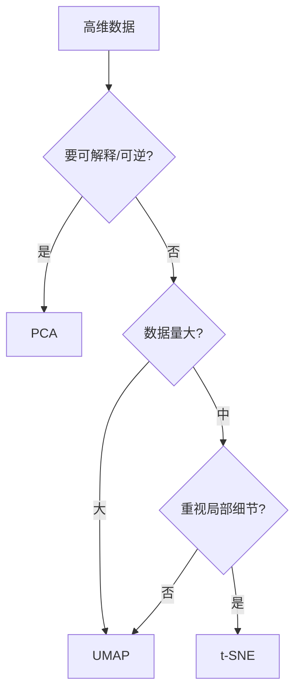
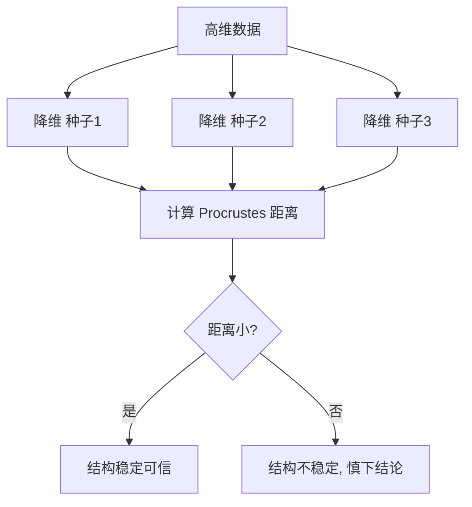

# 降维可视化深度解析 (Dimensionality Reduction Visualization)

> **一句话理解**: 降维可视化把高维嵌入"压扁"到 2D/3D——用 PCA/t-SNE/UMAP 让你看清类别是否可分、簇是否合理、异常点在哪，是理解高维表征的第一工具。

---

## 目录

1. [背景与动机](#1-背景与动机)
2. [核心原理与数学](#2-核心原理与数学)
3. [PCA：线性降维](#3-pca线性降维)
4. [t-SNE：局部结构](#4-t-sne局部结构)
5. [UMAP：兼顾局部与全局](#5-umap兼顾局部与全局)
6. [方法对比与选择](#6-方法对比与选择)
7. [可视化实现要点](#7-可视化实现要点-1)
8. [交互式探索](#8-交互式探索)
9. [对比表](#9-对比表)
10. [应用场景](#10-应用场景-1)
11. [局限与误区](#11-局限与误区-1)
12. [关联](#关联)

---

## 1. 背景与动机

现代表征（embedding）动辄数百到数千维，人脑无法直接观察。**降维可视化**（Dimensionality Reduction Visualization）通过线性或非线性映射把高维点投影到 2D/3D，保留尽可能多的结构信息，让"类别可分性""聚类合理性""异常点"变得肉眼可见。

### 1.1 解决什么问题

| 问题 | 降维可视化的作用 |
|------|------------------|
| 嵌入好不好？ | 看同类是否聚、异类是否分 |
| 有无异常样本？ | 离群点可见 |
| 标签是否合理？ | 看簇与标签一致性 |
| 模型学到什么？ | 看表征空间的语义结构 |
| 数据有无偏？ | 看某子群是否孤立 |

### 1.2 为什么不能直接画高维

| 维度 | 问题 |
|------|------|
| > 3 维 | 人无法直接可视化 |
| 高维稀疏 | 距离/密度都失真（维度灾难） |
| 线性方法局限 | 很多结构是非线性的 |

---

## 2. 核心原理与数学

### 2.1 降维的目标

给定高维数据 $X=\{x_1,\dots,x_n\}\subset\mathbb{R}^D$，寻找低维表示 $Y=\{y_1,\dots,y_n\}\subset\mathbb{R}^d$（$d\in\{2,3\}$），使得 $Y$ 在某意义上"代表" $X$ 的结构。

### 2.2 保结构的两类目标

| 目标 | 含义 | 代表方法 |
|------|------|----------|
| 保方差 | 保留数据方差最大方向 | PCA |
| 保距离 | 高维近邻→低维仍近 | MDS、t-SNE、UMAP |
| 保拓扑 | 保邻域图连通性 | UMAP、t-SNE |

### 2.3 距离与邻域

大多数非线性方法依赖高维近邻关系。定义 $x_i$ 的 $k$ 近邻集 $N_k(i)$，降维要让 $N_k(i)$ 在低维也尽量保持。

### 2.4 概率相似度框架

t-SNE 用高斯定义高维相似度 $p_{j|i}$，用 Student-t 定义低维相似度 $q_{ij}$，最小化 KL 散度：

$$C = \sum_i \text{KL}(P_i\|Q_i) = \sum_i\sum_j p_{j|i}\log\frac{p_{j|i}}{q_{ij}}$$

---

## 3. PCA：线性降维

### 3.1 原理

PCA 对协方差矩阵做特征分解（或对数据中心化后做 SVD），取前 $d$ 个最大特征值对应方向：

$$X = U\Sigma V^\top, \quad Y = X V_d$$

### 3.2 性质

| 性质 | 说明 |
|------|------|
| 线性 | 只能保线性结构 |
| 全局最优 | 方差最大化有闭式解 |
| 可解释 | 主成分是原特征线性组合 |
| 快 | $O(ND^2)$ |
| 可逆近似 | 可重建 |

### 3.3 可视化用法

- 先用 PCA 降维消噪/加速，再做 t-SNE/UMAP。
- 看前两主成分的方差解释比，判断线性可分性。

---

## 4. t-SNE：局部结构

### 4.1 核心思想

t-SNE 强调**局部邻域**：高维近邻在低维要更近，远点不必精确。用重尾 Student-t 避免"拥挤问题"（crowding problem）。

### 4.2 关键超参

| 超参 | 含义 | 影响 |
|------|------|------|
| perplexity | 有效近邻数（5-50） | 小=细簇，大=粗簇 |
| learning rate | 优化步长 | 过大/过小都失真 |
| iterations | 迭代次数 | 不足则未收敛 |
| early exaggeration | 初期放大簇 | 影响簇分离 |

### 4.3 形态解读

| 形态 | 含义 |
|------|------|
| 清晰分离的簇 | 局部可分性强 |
| 簇间距离 | **不可信**（t-SNE 不保全局距离） |
| 簇大小 | **不可信**（受密度影响） |
| 单点远离 | 可能是异常或孤立 |

### 4.4 常见误用

- 把簇间距离当真实距离。
- 单次结果下结论（应多随机种子）。
- perplexity 不调直接用默认。

---

## 5. UMAP：兼顾局部与全局

### 5.1 核心思想

UMAP 基于拓扑数据分析，先建高维模糊拓扑表示（fuzzy simplicial set），再在低维优化同构的拓扑结构。

### 5.2 关键超参

| 超参 | 含义 | 影响 |
|------|------|------|
| n_neighbors | 邻域大小 | 小=局部，大=全局 |
| min_dist | 低维点最小间距 | 小=紧密簇，大=松散 |
| metric | 距离度量 | 影响邻域 |
| n_epochs | 训练轮数 | 不足未收敛 |

### 5.3 优点

- 比 t-SNE 快，可扩展到大数据。
- 更好保留全局结构。
- 可增量（parametric UMAP）与可逆。
- 支持任意距离度量。

---

## 6. 方法对比与选择

### 6.1 决策流程



### 6.2 选择表

| 需求 | 推荐 | 备选 |
|------|------|------|
| 快速线性探查 | PCA | — |
| 局部簇结构 | t-SNE | UMAP |
| 全局+局部 | UMAP | t-SNE |
| 大数据 | UMAP | PCA |
| 可逆/重建 | PCA / Parametric UMAP | Autoencoder |
| 流式/在线 | Parametric UMAP | — |

---

## 7. 可视化实现要点

### 7.1 预处理

| 步骤 | 建议 |
|------|------|
| 中心化/标准化 | PCA 必须；t-SNE/UMAP 推荐 |
| 降基数 | 先 PCA 到 50 维再 t-SNE |
| 去噪 | 异常值影响邻域 |
| 子采样 | 大数据先采样可视化 |

### 7.2 标准实现

```python
from sklearn.decomposition import PCA
from sklearn.manifold import TSNE
import umap

X_pca = PCA(n_components=2).fit_transform(X)
X_tsne = TSNE(perplexity=30, init="pca").fit_transform(X)
X_umap = umap.UMAP(n_neighbors=15, min_dist=0.1).fit_transform(X)
```

### 7.3 可视化编码

| 编码 | 用途 |
|------|------|
| 颜色=类别 | 看可分性 |
| 大小=某属性 | 叠加维度 |
| 形状=子集 | 看子群 |
| hover=样本 | 交互定位 |
| 动画=随训练 | 看表征演化 |

### 7.4 设计原则

- 标注方法与超参（perplexity/n_neighbors）。
- 多随机种子对比稳定性。
- 配合定量指标（kNN 一致性、轮廓系数）。

---

## 8. 交互式探索

| 工具 | 特点 |
|------|------|
| TensorBoard Embedding Projector | 内置 PCA/UMAP/t-SNE，支持标签与图片 |
| W&B 嵌入可视化 | 集成实验追踪 |
| Plotly/Bokeh | 自定义交互 |
| Embedding Projector (Web) | 在线即用 |

### 8.1 动画化训练过程

保存多个 checkpoint 的嵌入，用降维+插值动画展示"表征如何随训练演化"。

---

## 9. 对比表

### 9.1 三大方法对比

| 维度 | PCA | t-SNE | UMAP |
|------|-----|-------|------|
| 类型 | 线性 | 非线性 | 非线性 |
| 保全局 | 强 | 弱 | 中强 |
| 保局部 | 弱 | 强 | 强 |
| 速度 | 很快 | 慢 | 快 |
| 可扩展 | 是 | 难 | 是 |
| 可逆 | 是 | 否 | parametric 可 |
| 超参敏感 | 低 | 中 | 中 |
| 簇间距离可信 | 是 | 否 | 部分 |

### 9.2 评估降维质量

| 指标 | 含义 |
|------|------|
| Trustworthiness | 低维近邻在高维是否也近 |
| Continuity | 高维近邻在低维是否还近 |
| kNN 一致性 | 邻域标签一致性 |
| 轮廓系数 | 簇内紧/簇间松 |
| 方差解释比（PCA） | 保留多少信息 |

---

## 10. 应用场景

| 场景 | 用法 |
|------|------|
| 嵌入质量评估 | 看同类聚/异类分 |
| 聚类验证 | 看簇形态与数量 |
| 异常检测 | 找离群点 |
| 标签质量 | 簇与标签一致性 |
| 模型对比 | 不同模型嵌入并排 |
| 数据漂移 | 训练/生产嵌入分布对比 |
| 文本/图像检索 | 看近邻是否合理 |
| LLM 表征分析 | 看层间/ token 间结构 |

---

## 11. 局限与误区

| 局限/误区 | 说明 |
|-----------|------|
| 簇间距离不可信（t-SNE） | t-SNE 不保全局距离 |
| 簇大小不可信 | 受局部密度影响 |
| 单次结果 | 非线性方法随机，需多种子 |
| 超参敏感 | perplexity/n_neighbors 显著影响 |
| 过度解读 | 2D 投影丢失大量信息 |
| 维度灾难残留 | 高维距离本身可能失真 |
| 计算成本 | t-SNE 大数据很慢 |
| 确认偏差 | 选图时只看支持结论的 |


---

## 附录 A：超参调优速查

| 方法 | 超参 | 调大效果 | 调小效果 | 推荐起点 |
|------|------|----------|----------|----------|
| t-SNE | perplexity | 粗簇/全局 | 细簇/局部 | 30 |
| t-SNE | learning rate | 可能不稳 | 收敛慢 | 200 |
| t-SNE | iterations | 更收敛 | 未收敛 | ≥1000 |
| UMAP | n_neighbors | 全局 | 局部 | 15 |
| UMAP | min_dist | 松散 | 紧密簇 | 0.1 |
| UMAP | n_epochs | 更收敛 | 未收敛 | 200-500 |

---

## 附录 B：稳定性验证流程



---

## 附录 C：降维质量评估表

| 指标 | 范围 | 越好 |
|------|------|------|
| Trustworthiness | [0,1] | 越高 |
| Continuity | [0,1] | 越高 |
| kNN 一致性 | [0,1] | 越高 |
| 轮廓系数 | [-1,1] | 越高 |
| 方差解释比（PCA） | [0,1] | 越高 |


---

## 附录 D：大规模数据降维策略

| 数据规模 | 策略 | 工具 |
|----------|------|------|
| < 10k | 直接 t-SNE/UMAP | sklearn |
| 10k-100k | UMAP / BN-based | umap-learn |
| 100k-1M | parametric UMAP / 采样 | parametric umap |
| > 1M | 先聚类再可视化 + 采样 | HDBSCAN+UMAP |

### D.1 采样可视化

随机/分层采样后降维，标注密度，避免点过密。

### D.2 增量降维

parametric UMAP 支持新数据映射，适合流式场景。

---

## 附录 E：降维与其他可视化协同

| 协同 | 用法 |
|------|------|
| + 聚类 | 先降维看簇，再聚类验证 |
| + 检索 | 降维后画近邻图 |
| + 异常 | 降维找离群 |
| + 漂移 | 训练/生产降维对比 |
| + 交互 | hover 显示原样本 |

---

## 附录 F：术语速查

| 术语 | 含义 |
|------|------|
| Embedding | 嵌入向量 |
| Manifold | 流形 |
| Perplexity | t-SNE 困惑度 |
| n_neighbors | UMAP 邻域数 |
| Crowding Problem | 拥挤问题 |
| Trustworthiness | 可信度 |
| Procrustes | 形状比较 |
| kNN | k 近邻 |
---

## 关联

- [[可视化/index|可视化首页]]
- [[可视化/Evaluation_Viz/index|Evaluation Viz]]
- [[可视化/Training_Viz/Embedding_Visualization_Guide|嵌入可视化指南]]
- [[深度学习/index|深度学习]]
- [[机器学习/index|机器学习]]
- [[数学基础/index|数学基础]]
- [[模型评估/index|模型评估]]
- [[大模型/index|大模型]]

---

*Last updated: 2026-07-23*
