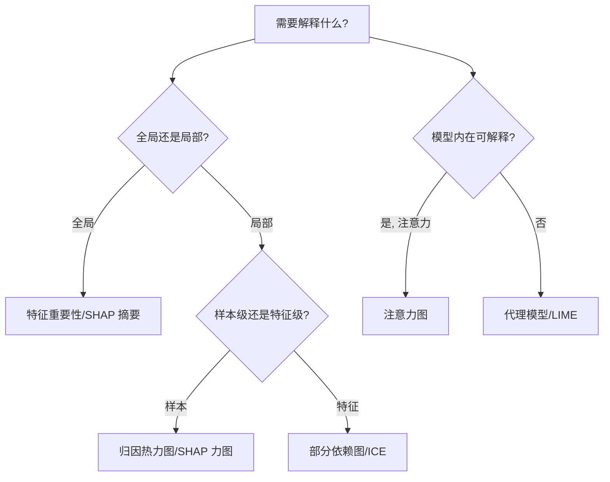

# 评估可视化（Evaluation Visualization）

> **一句话理解**: 评估可视化把"模型好不好、好在哪、错在哪"变成图表——从混淆矩阵、ROC 到注意力热力图与降维投影，让模型质量可度量、可解释、可对比。

评估可视化（Evaluation Visualization）覆盖模型评估结果的全套可视化方法：指标图表（metric charts）、混淆矩阵、ROC/PR 曲线、注意力与可解释性可视化、降维投影（t-SNE/UMAP/PCA）。本子域面向 ML 工程师、研究员与可解释性实践者，是模型验收与缺陷定位的关键。

---

## 一、为什么需要评估可视化

| 场景 | 可视化方法 | 价值 |
|------|------------|------|
| 分类对错分布 | 混淆矩阵 | 看清哪类常被误判 |
| 阈值权衡 | ROC/PR 曲线 | 选最优阈值 |
| 多指标对比 | 雷达图 | 多模型横向对比 |
| 模型看哪里 | 注意力/归因热力图 | 判断是否学对特征 |
| 高维表征 | t-SNE/UMAP | 看类别是否可分 |

---

## 二、文件导航

| 文件 | 说明 | 适用人群 |
|------|------|----------|
| [[可视化/Evaluation_Viz/Evaluation_Visualization_Guide\|Evaluation Visualization Guide]] | 混淆矩阵、ROC/PR 曲线、雷达图 | ML 工程师 / 数据可视化实践者 |
| [[可视化/Evaluation_Viz/Attention_Visualization\|Attention Visualization]] | 注意力图、注意力热力图与头分析 | NLP/CV 研究员 |
| [[可视化/Evaluation_Viz/Model_Interpretability_Visualization\|Model Interpretability Visualization]] | SHAP、LIME、归因方法 | ML 工程师 / 可解释性研究员 |
| [[可视化/Evaluation_Viz/Dimensionality_Reduction_Viz\|Dimensionality Reduction Viz]] | t-SNE/UMAP/PCA 降维投影 | DL 研究员 |

---

## 三、核心图表类型

### 3.1 分类指标图表

| 图表 | 横轴/纵轴 | 用途 | 关键指标 |
|------|-----------|------|----------|
| 混淆矩阵 | 真实×预测 | 误分类模式 | Accuracy/F1 |
| ROC 曲线 | FPR×TPR | 阈值权衡 | AUC |
| PR 曲线 | Recall×Precision | 不平衡数据 | AP |
| 校准曲线 | 预测×经验 | 概率校准 | ECE |
| 雷达图 | 各指标轴 | 多模型对比 | 综合分 |

### 3.2 注意力与可解释性

详见 [[可视化/Evaluation_Viz/Attention_Visualization\|注意力可视化]] 与 [[可视化/Evaluation_Viz/Model_Interpretability_Visualization\|可解释性可视化]]。

### 3.3 降维投影

详见 [[可视化/Evaluation_Viz/Dimensionality_Reduction_Viz\|降维可视化]]。

---

## 四、按任务选择图表

| 任务类型 | 首选图表 | 补充图表 |
|----------|----------|----------|
| 二分类 | ROC + PR | 混淆矩阵、校准曲线 |
| 多分类 | 混淆矩阵 | 每类 PR、归一化矩阵 |
| 回归 | 残差图、预测-真实散点 | 误差分布直方图 |
| 检索/排序 | PR 曲线、nDCG | 排序对比 |
| 生成 | 样本网格、FID/IS | 降维投影 |
| 嵌入质量 | t-SNE/UMAP | 近邻一致性 |

---

## 五、可解释性方法对比

| 方法 | 类型 | 优点 | 局限 |
|------|------|------|------|
| 注意力图 | 内在 | 无需重训 | 注意力≠因果 |
| Saliency/Grad-CAM | 梯度 | 局部归因 | 噪声敏感 |
| SHAP | 博弈论 | 一致性公理 | 计算昂贵 |
| LIME | 局部线性 | 模型无关 | 不稳定 |

---

## 六、常见陷阱

| 陷阱 | 后果 | 正确做法 |
|------|------|----------|
| 不平衡数据只看 Accuracy | 误导 | 用 PR/F1/混淆矩阵 |
| ROC 在极不平衡时过于乐观 | 误判 | 补充 PR 曲线 |
| 注意力当因果解释 | 过度归因 | 配合归因方法 |
| t-SNE 误读簇间距离 | 过度解读 | 多种子+结合定量 |
| 混淆矩阵不归一化 | 难对比 | 用行/列归一化 |

---

## 七、工具速查

| 工具 | 强项 | 关联 |
|------|------|------|
| scikit-learn | 混淆矩阵/ROC/PR 一键生成 | 评估图表 |
| Plotly/Seaborn | 交互式/美观静态图 | 评估图表 |
| Captum | PyTorch 归因 | 可解释性 |
| SHAP/lime | 模型无关归因 | 可解释性 |
| TensorBoard Embedding | 嵌入投影 | 降维 |

---

## 八、术语速查

| 术语 | 含义 |
|------|------|
| TPR/FPR | 真阳率/假阳率 |
| AUC/AP | 曲线下面积/平均精度 |
| Calibration | 预测概率与真实频率一致 |
| Attribution | 输入对输出的贡献 |
| Manifold | 高维数据的低维流形 |

---

## 九、不平衡数据可视化策略

| 策略 | 说明 |
|------|------|
| 用 PR 替代 ROC | 极不平衡时 ROC 过于乐观 |
| 混淆矩阵归一化 | 按真实类归一，便于对比 |
| 每类指标 | 单独看少数类 P/R/F1 |
| 过采样可视化 | SMOTE 前后分布对比 |
| 代价矩阵 | 把误分类代价纳入图示 |

---

## 十、可解释性可视化决策树

---

## 十一、学习路径

| 阶段 | 内容 | 产出 |
|------|------|------|
| 入门 | 评估指南 | 画混淆矩阵/ROC |
| 基础 | 注意力/归因 | 解读模型关注点 |
| 进阶 | 降维可视化 | 看嵌入可分性 |
| 实战 | 校准+可解释 | 端到端评估报告 |

---

## 十二、常见问题（FAQ）

| 问题 | 解答 |
|------|------|
| ROC 和 PR 该看哪个？ | 平衡数据看 ROC，不平衡优先 PR。 |
| 混淆矩阵怎么归一化？ | 通常按真实类（行）归一，便于看召回。 |
| 注意力能当解释吗？ | 不能直接当因果，需配合归因方法交叉验证。 |
| t-SNE 和 UMAP 怎么选？ | 看局部结构用 t-SNE，兼顾全局与速度用 UMAP。 |
| SHAP 太慢怎么办？ | 采样解释子集，或用近似算法（如 TreeSHAP）。 |
| 校准曲线弯说明什么？ | 上凸=过自信，下凹=欠自信。 |

---

## 十三、评估可视化检查清单

- [ ] 已画混淆矩阵（归一化）
- [ ] ROC/PR 曲线含 AUC/AP
- [ ] 多分类有每类指标
- [ ] 注意力/归因图已生成（关键样本）
- [ ] 嵌入降维投影已对比
- [ ] 校准曲线已检查
- [ ] 多模型对比雷达图

---

## 关联

- [[可视化/index\|可视化首页]]
- [[可视化/Best_Practices/index\|Best Practices]]
- [[可视化/Training_Viz/index\|Training Viz]]
- [[模型评估/index\|模型评估]]
- [[深度学习/index\|深度学习]]
- [[大模型/index\|大模型]]
- [[伦理安全/index\|伦理安全]]

---

*Last updated: 2026-07-23*
