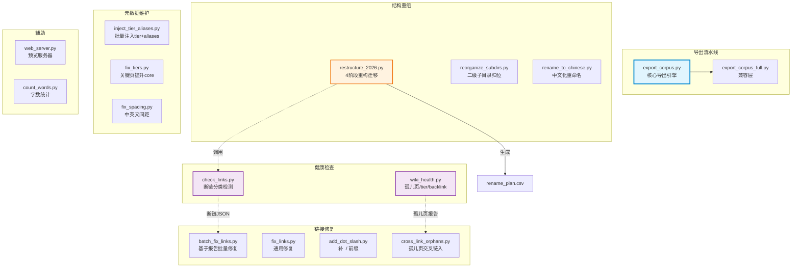
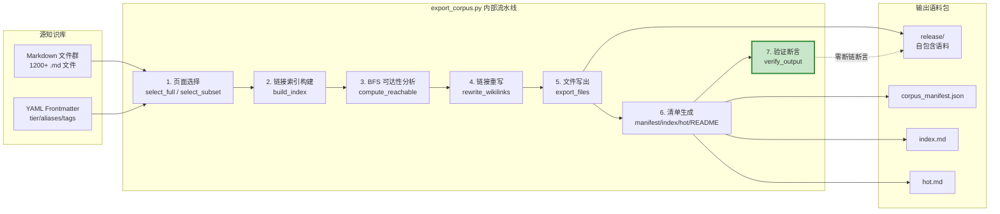
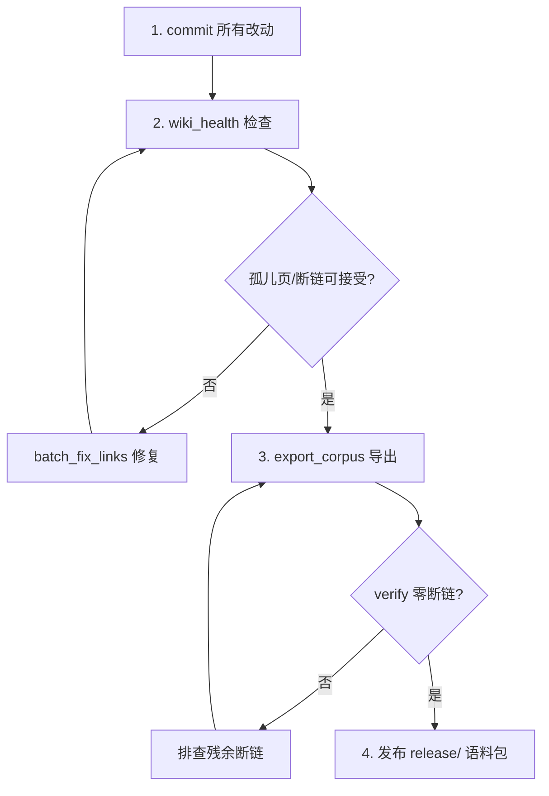

# AI Guru 知识库 · 运维工具集总览

> 本目录（`工具/`，历史名 `_tools/`）是 AI Guru 知识库的**运维工具集**，承载知识库从"原始 Markdown 集合"到"AgentScope 智能体可挂载语料"的全部自动化流水线。
>
> 所有脚本均为 **Python 3 标准库实现**（仅 `mkdocs-material` 为可选文档站点依赖），零第三方依赖，可直接 `python3` 运行。

---

## 目录

- [1. 工具集定位与职责](#1-工具集定位与职责)
- [2. 工具列表一览](#2-工具列表一览)
- [3. 架构总览](#3-架构总览)
- [4. 工具分类详解](#4-工具分类详解)
  - [4.1 导出工具](#41-导出工具)
  - [4.2 健康检查](#42-健康检查)
  - [4.3 链接修复](#43-链接修复)
  - [4.4 结构重组](#44-结构重组)
  - [4.5 元数据维护](#45-元数据维护)
  - [4.6 辅助工具](#46-辅助工具)
- [5. 快速开始](#5-快速开始)
- [6. 常用工作流](#6-常用工作流)
- [7. 开发与测试](#7-开发与测试)
- [8. 相关文档](#8-相关文档)

---

## 1. 工具集定位与职责

AI Guru 知识库采用 **LLM-Wiki 模式**：智能体不使用 RAG 向量检索，而是沿双括号 `[[wikilink]]` 在 Markdown 图谱中遍历。这意味着知识库的**链接健康度**直接决定智能体的推理质量。

本工具集承担五大职责：

| 职责 | 说明 | 核心脚本 |
|------|------|----------|
| **语料导出** | 将 wiki 导出为自包含语料包，供 AgentScope NAS 挂载 | `export_corpus.py` |
| **健康监控** | 检测孤儿页、断链、tier 缺失等结构问题 | `wiki_health.py`, `check_links.py` |
| **链接修复** | 批量修复断链、规范化链接格式 | `batch_fix_links.py`, `fix_links.py`, `add_dot_slash.py` |
| **结构重组** | 目录重编号、中文化、子目录归位 | `restructure_2026.py`, `reorganize_subdirs.py`, `rename_to_chinese.py` |
| **元数据维护** | 批量注入 tier、aliases、中英文间距修正 | `inject_tier_aliases.py`, `fix_tiers.py`, `fix_spacing.py` |

**设计原则**：
- **幂等性**：所有脚本可安全重复运行，不会对已处理文件产生二次修改。
- **dry-run 优先**：破坏性操作均支持 `--dry-run` 预检。
- **git 感知**：结构重组脚本通过 `git mv` 保留文件历史。
- **零依赖**：除标准库外不引入任何第三方包（降低 CI 环境配置成本）。

---

## 2. 工具列表一览

| 脚本 | 行数 | 功能 | 输入 | 输出 | 依赖 |
|------|------|------|------|------|------|
| `export_corpus.py` | 657 | 核心导出引擎（双 scope） | wiki 根目录 | `release/` 语料包 | 标准库 |
| `export_corpus_full.py` | 19 | 废弃兼容层 → 委托 export_corpus | 同上 | 同上 | export_corpus |
| `wiki_health.py` | 173 | 孤儿页/tier/backlink 健康检查 | wiki 根目录 | stdout + `/tmp/wiki_health.json` | 标准库 |
| `check_links.py` | 303 | 断链检测器（分类输出） | wiki 根目录 | stdout + JSON 报告 | 标准库 |
| `batch_fix_links.py` | 213 | 基于断链报告批量修复 | check_links JSON | 原地修改 .md | 标准库 |
| `fix_links.py` | 96 | 通用链接修复（历史映射已清空） | wiki 根目录 | 原地修改 .md | 标准库 |
| `add_dot_slash.py` | 108 | 为相对链接补 `./` 前缀 | wiki 根目录 | 原地修改 .md | 标准库 |
| `cross_link_orphans.py` | 98 | 孤儿概念页交叉链入 hub | 硬编码映射表 | 原地修改 .md | 标准库 |
| `fix_spacing.py` | 167 | 中英文间距自动修正 | wiki 根目录 | 原地修改 .md | 标准库 |
| `fix_tiers.py` | 120 | 关键页提升为 tier:core | 硬编码列表 | 原地修改 .md | 标准库 |
| `inject_tier_aliases.py` | 213 | 批量注入 tier + aliases | wiki 根目录 | 原地修改 .md | 标准库 |
| `restructure_2026.py` | 346 | 目录重构迁移（4 阶段） | wiki 根目录 | git mv + 链接重写 | 标准库 + git |
| `reorganize_subdirs.py` | 371 | 扁平章节建二级子目录 | wiki 根目录 | git mv + 链接重写 | 标准库 + git |
| `rename_to_chinese.py` | 150 | 根目录英文→中文重命名 | wiki 根目录 | git mv + 链接重写 | 标准库 + git |
| `web_server.py` | 175 | 轻量 wiki 预览服务器 | wiki 根目录 | `http://localhost:8080` | 标准库 |
| `count_words.py` | 70 | 文档字数统计（Python） | wiki 根目录 | stdout | 标准库 |
| `count_words.sh` | 43 | 文档字数统计（Shell） | wiki 根目录 | stdout | find/wc/awk |
| `rename_plan.csv` | 32 | 重构迁移计划表（dry-run 产物） | — | — | — |

---

## 3. 架构总览

### 3.1 脚本调用关系图



### 3.2 数据流：从 wiki 到 AgentScope 语料



---

## 4. 工具分类详解

### 4.1 导出工具

#### `export_corpus.py` — 核心导出引擎

**定位**：整个工具集中最核心、最复杂的脚本（657 行），将 wiki 导出为 AgentScope 智能体可挂载的自包含语料包。

**双 Scope 模式**：

| Scope | 选择范围 | 用途 |
|-------|----------|------|
| `--scope full` | 所有非排除 `.md` 文件 | 全量知识库快照 |
| `--scope subset` | 仅 K8s/GPU/运维相关目录 + tier 过滤 | Token 预算优化子集 |

**核心能力**：
- **鲁棒 wikilink 解析器**：5 级回退策略（精确路径 → 空格/下划线变体 → 目录 hub → 相对路径上溯 → 唯一 basename）
- **BFS 可达性分析**：从入口页 `_synthesis/diagnosis-work-order-hub.md` 出发，沿 wikilink 广度优先遍历，标记所有可达页
- **死链重写**：无法解析的 `[[wikilink]]` 自动转为纯文本显示，确保智能体永不跟随死链
- **验证断言**：导出后二次扫描磁盘文件，强制重写残余死链，最终断言零断链

> 详见 [[工具/export_corpus_Deep_Dive|export_corpus 源码深度解析]]

#### `export_corpus_full.py` — 废弃兼容层

仅 19 行的 shim 脚本，将 `--scope full` 注入参数后委托给 `export_corpus.py`。保留是为了向后兼容旧的 CI 脚本调用。

### 4.2 健康检查

#### `wiki_health.py` — 知识库健康体检

输出三项关键指标：
1. **孤儿页检测**：在语料目录中无任何入链的页面（按重要性排序）
2. **Tier 分布**：`core` / `supporting` / `peripheral` / `MISSING` 统计
3. **Backlink 密度**：11 个关键 hub 页的入链数

> 详见 [[工具/wiki_health_Deep_Dive|wiki_health 源码解析]]

#### `check_links.py` — 断链分类检测器

比 `wiki_health.py` 更精细的链接检查器，将断链分为 6 类：

| 类别 | 含义 |
|------|------|
| `missing_concept` | 引用 `_concepts/X` 但文件不存在 |
| `missing_file` | 引用常规路径但文件不存在 |
| `stale_path` | 引用已搬迁的旧路径 |
| `dir_reference` | 引用章节目录（Obsidian 显示目录列表） |
| `missing_synthesis` | 引用 `_synthesis/X` 但不存在 |
| `external` | 外部 URL（跳过） |

支持 `--json` 输出供 `batch_fix_links.py` 消费，`--strict` 将目录引用也标记为断链。

### 4.3 链接修复

#### `batch_fix_links.py` — 基于报告的批量修复

**工作流**：`check_links.py --json /tmp/cl.json` → `batch_fix_links.py . /tmp/cl.json`

策略：构建 basename → 实际路径索引，对每条断链按 basename 查找候选，选择路径最相似的候选计算正确相对路径，原地修复。

#### `add_dot_slash.py` — 相对链接规范化

为子目录中的 `.md` 文件里的相对链接补 `./` 前缀。因为 `check_links.py` 将无前缀链接从 repo 根解析（而非源文件目录），补 `./` 后可正确从源文件目录解析。

智能跳过：编号章节目录（`NN_Name`）、`_` 前缀知识图谱层、根级文件。

#### `fix_links.py` — 通用链接修复

基于硬编码映射表 `FIXES` 修复已知断链。**注意**：映射表在 2026-06 重构后已清空（`FIXES = {}`），当前仅保留深度修正逻辑（`../../../` 前缀过多时自动校正）。

#### `cross_link_orphans.py` — 孤儿页交叉链入

对 21 个已知孤儿概念页（如 `clusterrole`、`storageclass`、`tekton`），在对应 hub 页的 `## Related` 段落添加 wikilink，使其可被 `wiki-context-pack` 和 `wiki-query` 发现。

### 4.4 结构重组

这三个脚本是一次性迁移工具，用于 2026-06 的知识库大重构。它们通过 `git mv` 保留文件历史，并全量重写 wikilink/md-link/反引号中的路径。

#### `restructure_2026.py` — 4 阶段重构迁移

| 阶段 | 命令 | 作用 |
|------|------|------|
| Phase A | `dry-run` | 生成 `rename_plan.csv` 预检表 |
| Phase B | `rename` | `git mv` 重命名目录（含 04↔05 对调三步法） |
| Phase C | `rewrite-links` | 全量重写 wikilink/内链/反引号路径 |
| Phase D | `verify` | 调用 check_links 校验断链未恶化 |

核心映射表：`TOP_LEVEL_RENAME`（22 个章节重编号）、`KG_RENAME`（知识图谱层加 `_` 前缀）、`NESTED_RENAME`（嵌套子目录去编号）。

#### `reorganize_subdirs.py` — 二级子目录归位

为 5 个扁平化大章节（`10_Deployment_Inference`、`11_MLOps_Pipeline`、`14_RAG_Systems`、`07_Model_Training`、`20_Papers`）建立二级子目录，并归位 `15_Agent_Production` 课程文件。共迁移 ~120 个文件。

#### `rename_to_chinese.py` — 根目录中文化

将 22 个英文编号目录（`00_AI_Introduction` → `AI入门`）重命名为中文短名，保留 `90-94` 拓展目录和 `_concepts/_synthesis/_references` 知识图谱层不动。

### 4.5 元数据维护

#### `inject_tier_aliases.py` — 批量注入 tier + aliases

**Tier 推断规则**：

| 条件 | tier |
|------|------|
| `_concepts/*` 或 `_synthesis/*` | `core` |
| 含 `Deep_Dive` / `for_dummy` / `in-nutshell` 或 > 10KB | `core` |
| `README.md` / `INDEX.md` | `supporting` |
| < 2KB | `peripheral` |
| 其他 | `supporting` |

**Aliases 推断**：从文件名生成 Title Case、空格分隔、snake_case 三种变体（去重后最多 3 个）。

#### `fix_tiers.py` — 关键页 tier 提升

将 17 个工单智能体关键页（K8s 故障排查、GPU OOM、LLM 推理等 Runbook）硬编码提升为 `tier: core`，并为 20 个 `Cloud_Ops_Agent` 文件补齐缺失的 tier。

#### `fix_spacing.py` — 中英文间距修正

在中文与英文/数字之间自动插入空格（如 `使用vLLM部署` → `使用 vLLM 部署`）。智能跳过：代码块、YAML frontmatter、内联代码、URL、markdown 链接。

### 4.6 辅助工具

#### `web_server.py` — 轻量预览服务器

基于 `http.server` 的零依赖 Web 服务器，提供两个 API：
- `GET /api/files` — 返回所有 `.md` 文件列表（路径、名称、字符数）
- `GET /api/file?path=xxx` — 返回指定文件内容

静态文件从 `web/` 目录提供，默认端口 8080（被占用时自动尝试 8081）。

#### `count_words.py` / `count_words.sh` — 字数统计

统计所有 `NN_*` 编号目录和 `_concepts/_synthesis/_references` 下的 `.md` 文件字符数。Python 版按目录分组输出，Shell 版用 `find + wc` 高效统计。

---

## 5. 快速开始

### 5.1 环境要求

- Python 3.8+（仅需标准库）
- git（结构重组脚本需要）
- 可选：`pip install mkdocs-material`（文档站点构建）

### 5.2 导出语料

```bash
# 全量导出（要求 git 工作区干净）
python3 工具/export_corpus.py --scope full --output release --clean

# 子集导出（K8s/GPU/运维，token 优化）
python3 工具/export_corpus.py --scope subset --output release --clean

# 预检模式（不写文件）
python3 工具/export_corpus.py --scope full --dry-run

# 工作区有未提交改动时强制导出
python3 工具/export_corpus.py --scope full --output release --allow-dirty
```

### 5.3 健康检查

```bash
# 知识库健康体检
python3 工具/wiki_health.py .

# 断链检测（带 JSON 输出）
python3 工具/check_links.py . --json /tmp/cl.json

# 断链修复
python3 工具/batch_fix_links.py . /tmp/cl.json --dry-run
python3 工具/batch_fix_links.py . /tmp/cl.json
```

### 5.4 元数据维护

```bash
# 批量注入缺失的 tier 和 aliases
python3 工具/inject_tier_aliases.py

# 修正中英文间距
python3 工具/fix_spacing.py .

# 关键页 tier 提升
python3 工具/fix_tiers.py
```

---

## 6. 常用工作流

### 6.1 日常发布流程



### 6.2 结构变更后的链接修复流程

```bash
# Step 1: 检测断链
python3 工具/check_links.py . --json /tmp/cl.json --strict

# Step 2: 预览修复
python3 工具/batch_fix_links.py . /tmp/cl.json --dry-run

# Step 3: 执行修复
python3 工具/batch_fix_links.py . /tmp/cl.json

# Step 4: 补 ./ 前缀
python3 工具/add_dot_slash.py . --dry-run
python3 工具/add_dot_slash.py .

# Step 5: 孤儿页交叉链入
python3 工具/cross_link_orphans.py

# Step 6: 重新检查
python3 工具/check_links.py .
```

### 6.3 大规模重构流程（参考 restructure_2026.py）

```bash
# Phase A: 预检
python3 工具/restructure_2026.py dry-run

# Phase B: 重命名（每章一个 commit）
python3 工具/restructure_2026.py rename

# Phase C: 重写链接
python3 工具/restructure_2026.py rewrite-links

# Phase D: 验证
python3 工具/restructure_2026.py verify
```

---

## 7. 开发与测试

### 7.1 测试框架

测试文件位于 `工具/tests/`，使用 `pytest`：

```bash
# 运行全部测试
python3 -m pytest 工具/tests/ -v

# 运行特定测试
python3 -m pytest 工具/tests/test_restructure_2026.py -v
```

### 7.2 测试覆盖范围

`test_restructure_2026.py`（238 行）覆盖 5 个任务域：

| 任务 | 测试数 | 覆盖内容 |
|------|--------|----------|
| 映射表完备性 | 4 | 主章节全覆盖、编号连续、无重复、KG 前缀 |
| dry-run 规则 | 3 | 组内长度降序、嵌套优先、旧值唯一 |
| rename 执行 | 3 | 04↔05 对调、同名三步法、no-op 跳过 |
| rewrite-links | 3 | wikilink+mdlink、嵌套优先、边界安全 |
| verify 基线 | 2 | 断链未恶化/恶化检测 |

### 7.3 依赖文件

| 文件 | 用途 |
|------|------|
| `requirements.txt` | `mkdocs-material`（文档站点） |
| `requirements-dev.txt` | `pytest>=7.0`（测试） |
| `_baseline-2026-06-19.json` | 重构前断链基线（verify 比对用） |
| `rename_plan.csv` | dry-run 生成的迁移计划表 |

---

## 8. 相关文档

- [[工具/export_corpus_Deep_Dive|export_corpus.py 源码深度解析]] — 核心导出引擎的架构、算法与扩展指南
- [[工具/wiki_health_Deep_Dive|wiki_health.py 源码解析]] — 健康检查的核心函数与评分算法
- [[工具/Source_Code_Analysis|其余脚本批量解析]] — 所有其他脚本的逐一源码分析
- [[工具/tests/index|测试目录]]

---

> **维护提示**：本工具集随知识库演进持续迭代。结构重组类脚本（`restructure_2026.py`、`reorganize_subdirs.py`、`rename_to_chinese.py`）为一次性迁移工具，迁移完成后保留作为历史记录和回滚参考。日常维护主要使用导出、健康检查和链接修复三类工具。
