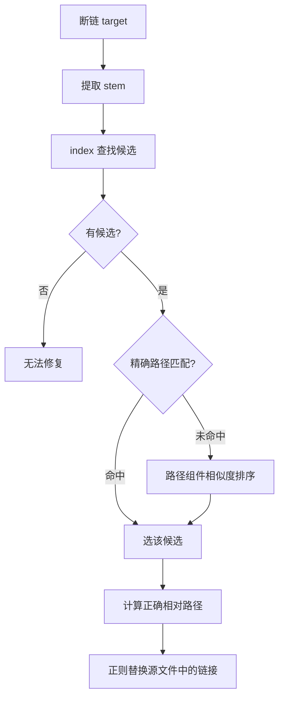
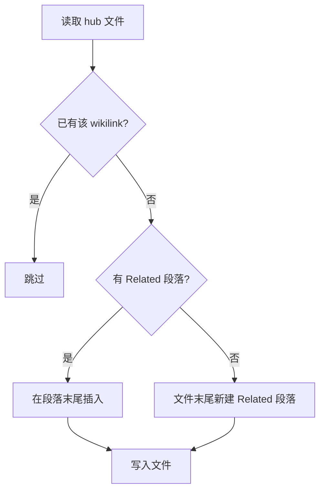
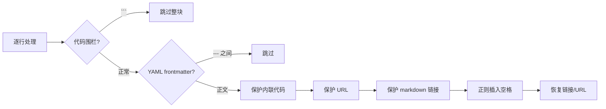
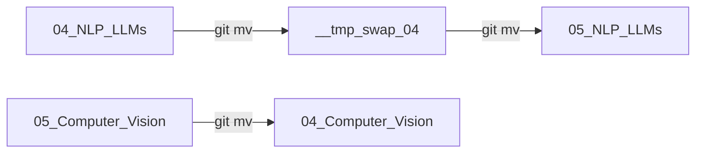
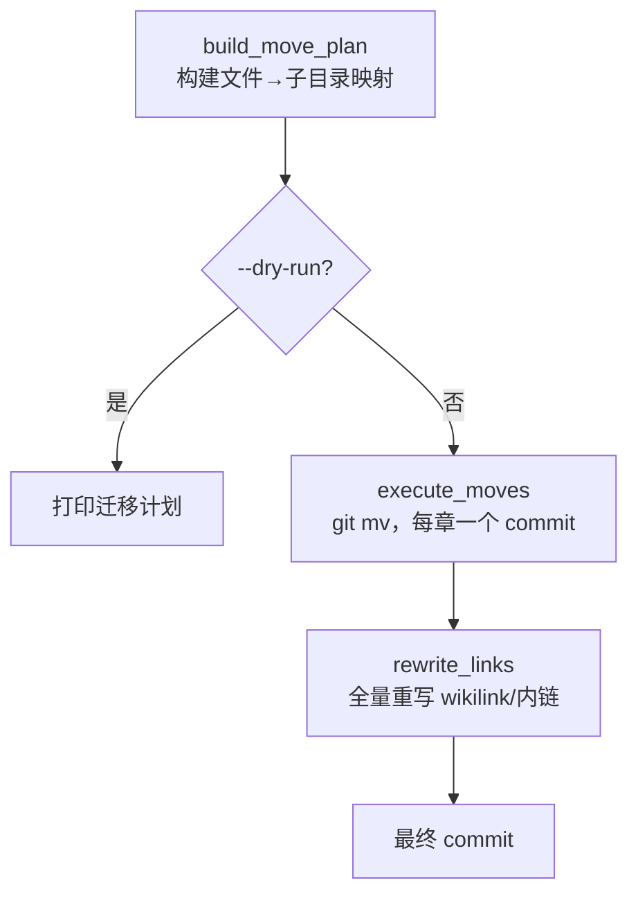
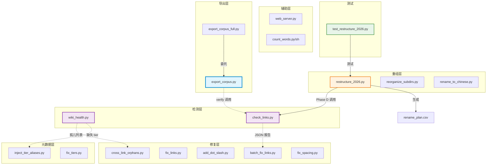
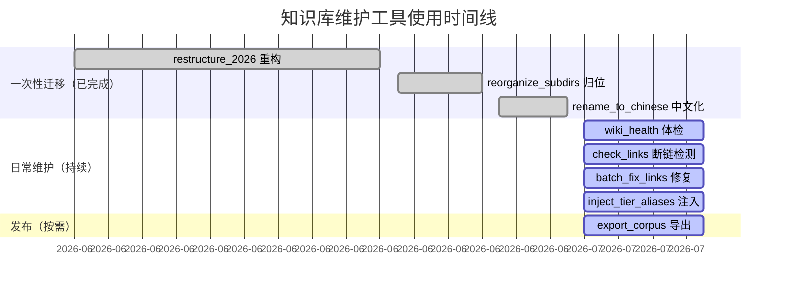

# 其余脚本批量源码解析

> 本文档对 `工具/` 目录下除 `export_corpus.py` 和 `wiki_health.py`（已有独立深度解析）外的所有脚本逐一进行源码分析。

---

## 目录

- [1. 链接检测与修复](#1-链接检测与修复)
  - [1.1 check_links.py — 断链分类检测器](#11-check_linkspy--断链分类检测器)
  - [1.2 batch_fix_links.py — 基于报告批量修复](#12-batch_fix_linkspy--基于报告批量修复)
  - [1.3 add_dot_slash.py — 相对链接规范化](#13-add_dot_slashpy--相对链接规范化)
  - [1.4 fix_links.py — 通用链接修复](#14-fix_linkspy--通用链接修复)
  - [1.5 cross_link_orphans.py — 孤儿页交叉链入](#15-cross_link_orphanspy--孤儿页交叉链入)
- [2. 元数据维护](#2-元数据维护)
  - [2.1 inject_tier_aliases.py — 批量注入 tier + aliases](#21-inject_tier_aliasespy--批量注入-tier--aliases)
  - [2.2 fix_tiers.py — 关键页 tier 提升](#22-fix_tierspy--关键页-tier-提升)
  - [2.3 fix_spacing.py — 中英文间距修正](#23-fix_spacingpy--中英文间距修正)
- [3. 结构重组](#3-结构重组)
  - [3.1 restructure_2026.py — 目录重构迁移](#31-restructure_2026py--目录重构迁移)
  - [3.2 reorganize_subdirs.py — 二级子目录归位](#32-reorganize_subdirspy--二级子目录归位)
  - [3.3 rename_to_chinese.py — 根目录中文化](#33-rename_to_chinesepy--根目录中文化)
- [4. 辅助工具](#4-辅助工具)
  - [4.1 web_server.py — 轻量预览服务器](#41-web_serverpy--轻量预览服务器)
  - [4.2 count_words.py — 字数统计（Python）](#42-count_wordspy--字数统计python)
  - [4.3 count_words.sh — 字数统计（Shell）](#43-count_wordssh--字数统计shell)
  - [4.4 export_corpus_full.py — 废弃兼容层](#44-export_corpus_fullpy--废弃兼容层)
- [5. 脚本间依赖关系图](#5-脚本间依赖关系图)

---

## 1. 链接检测与修复

### 1.1 check_links.py — 断链分类检测器

**文件**：`工具/check_links.py`（303 行）

**功能概述**：比 `wiki_health.py` 更精细的链接检查器。同时检测 Obsidian wikilink `[[target]]` 和 Markdown 链接 `[text](path)`，将断链分为 6 个语义类别，支持 JSON 输出供下游脚本消费。

**断链分类体系**（`check_links.py:128-169`）：

| 类别 | 触发条件 | 示例 |
|------|----------|------|
| `missing_concept` | `概念/X` 但文件不存在 | `[[概念/never-created]]` |
| `missing_file` | 常规路径但文件不存在 | `[[some/missing/page]]` |
| `stale_path` | 引用已搬迁的旧路径 | `[[_meta/_synthesis-old]]` |
| `dir_reference` | 引用章节目录 | `[[12_Architecture_Infrastructure]]` |
| `missing_synthesis` | `概念/synthesis/X` 但不存在 | `[[概念/synthesis/missing]]` |
| `missing_reference` | `来源/X` 但不存在 | `[[来源/missing]]` |

**核心函数**：

#### `build_resolution_index(base)` — `check_links.py:55-86`

构建三级解析索引：
```python
basename_lower    # basename 小写 → [文件路径列表]
basename_norm     # basename 空格替换 → [文件路径列表]  (用于 - / 空格互换)
alias_to_file     # alias 小写 → 文件路径  (来自 frontmatter aliases:)
```

特点：解析 frontmatter 中的 `aliases:` YAML 列表块，建立别名索引。这是 `wiki_health.py` 没有的能力。

#### `resolve_obsidian(target, ...)` — `check_links.py:89-125`

Obsidian 风格模糊解析，4 级回退：
1. 直接路径（带/不带 `.md`）
2. basename 精确匹配（小写）
3. basename 规范化匹配（`-` ↔ 空格）
4. alias 匹配

#### `strip_code_blocks(content)` — `check_links.py:172-195`

**重要**：移除围栏代码块（` ``` `）和内联代码（`` `code` ``），避免检查代码示例中的链接。通过跟踪围栏长度处理嵌套（` ``` ` 内的 ` `` ` 不触发退出）。

#### `find_all_links(base, strict=False)` — `check_links.py:198-269`

主检测函数，遍历内容文件，对每个 wikilink 和 md-link 尝试解析，收集失败的链接。

**使用方法**：

```bash
# 基础检测
python3 工具/check_links.py .

# 输出 JSON 报告（供 batch_fix_links.py 消费）
python3 工具/check_links.py . --json /tmp/cl.json

# 严格模式（目录引用也标记为断链）
python3 工具/check_links.py . --strict
```

**输入**：wiki 根目录路径
**输出**：stdout 统计 + 可选 JSON 文件

---

### 1.2 batch_fix_links.py — 基于报告批量修复

**文件**：`工具/batch_fix_links.py`（213 行）

**功能概述**：消费 `check_links.py --json` 的输出，基于 basename 索引自动修复断链。对每条断链，查找 basename 候选，选择路径最相似的候选，计算正确的相对路径并原地修复。

**核心函数**：

#### `build_index(base)` — `batch_fix_links.py:20-30`

```python
def build_index(base):
    index = collections.defaultdict(list)
    # ... 遍历 .md 文件 ...
    index[stem].append(fp)  # stem → [文件路径列表]
    return index
```

#### `resolve_target(target, index)` — `batch_fix_links.py:36-50`

从 target 提取 stem（去除 `./`、`/`、`#`、`|`、`.md`），在索引中查找候选。

#### `compute_correct_link(source_file, actual_target, link_type)` — `batch_fix_links.py:52-61`

```python
def compute_correct_link(source_file, actual_target, link_type='md'):
    src_dir = os.path.dirname(source_file)
    if link_type == 'wikilink':
        return None  # wikilink 在 Obsidian 中按 basename 工作，无需修正
    else:
        return os.path.relpath(actual_target, src_dir)  # 计算相对路径
```

#### 候选选择策略（`batch_fix_links.py:133-152`）



**修复覆盖**：
- Markdown 链接：`]`（错误路径）→ `]`（正确相对路径）
- Wikilink：`[[错误路径]]` → `[[basename]]`（唯一时）或 `[[正确路径]]`（不唯一时）

**使用方法**：

```bash
# 先检测
python3 工具/check_links.py . --json /tmp/cl.json

# 预览修复
python3 工具/batch_fix_links.py . /tmp/cl.json --dry-run

# 执行修复
python3 工具/batch_fix_links.py . /tmp/cl.json
```

**输入**：wiki 根目录 + 断链 JSON 报告
**输出**：原地修改 `.md` 文件 + stdout 修复日志

---

### 1.3 add_dot_slash.py — 相对链接规范化

**文件**：`工具/add_dot_slash.py`（108 行）

**功能概述**：为子目录中的 `.md` 文件里的相对 Markdown 链接补 `./` 前缀。

**背景**：`check_links.py` 将无前缀的链接（如 `](foo.md)`）从 repo 根目录解析，而非从源文件目录。这导致子目录中的相对链接被误判为断链。添加 `./` 前缀后，链接从源文件目录正确解析。

**智能跳过规则**（`add_dot_slash.py:64-74`）：

```python
# 跳过的情况：
if path.startswith(('http://', 'https://', ..., './', '../')):
    return  # 已有前缀
if not path.endswith('.md'):
    return  # 非 .md 链接
first_comp = path.split('/')[0]
if re.match(r'^\d{2}_', first_comp):
    return  # 编号章节目录（NN_Name）— 故意从 repo 根引用
if first_comp.startswith('_') or first_comp in {'docs', 'scripts'}:
    return  # 知识图谱层 / 已知顶层目录
# 其余 → 需要 ./
```

**使用方法**：

```bash
python3 工具/add_dot_slash.py . --dry-run  # 预览
python3 工具/add_dot_slash.py .             # 执行
```

**输入**：wiki 根目录
**输出**：原地修改子目录 `.md` 文件中的相对链接

---

### 1.4 fix_links.py — 通用链接修复

**文件**：`工具/fix_links.py`（96 行）

**功能概述**：基于硬编码映射表 `FIXES` 修复已知断链。**注意**：映射表在 2026-06 重构后已清空（`FIXES = {}`），当前仅保留深度修正逻辑。

**深度修正**（`fix_links.py:46-60`）：

当文件位于深度 ≥ 2 的子目录时，检测 `../../../` 前缀过多的情况，自动校正为正确深度：

```python
if depth >= 2:
    wrong_depth_pattern = re.compile(
        r'\]\((\.\./\.\./\.\./)(0[0-9]_\w+/\w+\.md)\)'
    )
    # ../../../ 04_NLP_LLMs/README.md → ../../ 04_NLP_LLMs/README.md
```

**使用方法**：

```bash
python3 工具/fix_links.py .
```

**当前状态**：因 `FIXES = {}`，此脚本主要作为**模板**保留，供未来添加特定修复映射。

---

### 1.5 cross_link_orphans.py — 孤儿页交叉链入

**文件**：`工具/cross_link_orphans.py`（98 行）

**功能概述**：对 21 个已知孤儿概念页，在对应 hub 页的 `## Related` 段落添加 wikilink，使其被知识图谱纳入。

**映射表**（`cross_link_orphans.py:11-49`）：

```python
ORPHAN_LINKS = {
    "clusterrole":   ["12_Architecture_Infrastructure/Kubernetes_Core_Components_Deep_Dive.md"],
    "storageclass":  ["12_Architecture_Infrastructure/Kubernetes_Storage_Deep_Dive.md"],
    "network-policy": ["12_Architecture_Infrastructure/Kubernetes_Networking_Deep_Dive.md"],
    "tekton":        ["11_MLOps_Pipeline/CI_CD/CI_CD_Pipeline_AI_2026.md"],
    "llmops":        ["11_MLOps_Pipeline/LLMOps_2026.md"],
    # ... 共 21 个孤儿概念 → hub 映射 ...
}
```

**插入逻辑**（`cross_link_orphans.py:51-82`）：



**使用方法**：

```bash
python3 工具/cross_link_orphans.py
```

**输入**：无参数（硬编码映射表）
**输出**：原地修改 hub 文件，添加 `## Related` wikilink

---

## 2. 元数据维护

### 2.1 inject_tier_aliases.py — 批量注入 tier + aliases

**文件**：`工具/inject_tier_aliases.py`（213 行）

**功能概述**：遍历所有内容文件，对缺失 `tier:` 或 `aliases:` 字段的文件自动推断并注入。

**Tier 推断规则**（`inject_tier_aliases.py:41-57`）：

```python
def detect_tier(rel_path, size, filename):
    if parts[0] == '_concepts' or parts[0] == '_synthesis':
        return 'core'          # 知识图谱层 = core
    deep_patterns = ['Deep_Dive', 'for_dummy', 'in-nutshell', ...]
    if any(p in filename for p in deep_patterns):
        return 'core'          # 深度文档 = core
    if size >= 10_000:
        return 'core'          # 大文件 = core
    if filename in ('README.md', 'INDEX.md'):
        return 'supporting'    # 索引页 = supporting
    if size < 2000:
        return 'peripheral'    # 小文件 = peripheral
    return 'supporting'        # 默认
```

**Aliases 推断**（`inject_tier_aliases.py:60-89`）：

从文件名生成最多 3 个变体：

| 文件名 | 生成的 aliases |
|--------|---------------|
| `K8s_Pod_Deep_Dive.md` | `K8s Pod Deep Dive`（Title Case）, `K8s Pod Deep Dive`（空格）, `K8s_Pod_Deep_Dive`（snake_case） |

**注入策略**（`inject_tier_aliases.py:114-165`）：

1. 解析 frontmatter（无 frontmatter 的文件跳过）
2. 检查是否已有 `tier:` / `aliases:`
3. 缺失则在 header 末尾追加
4. 重建文件：`---\n` + header + `---\n` + body

**使用方法**：

```bash
python3 工具/inject_tier_aliases.py
```

**输入**：无参数（从当前目录扫描）
**输出**：原地修改 `.md` 文件 + stdout 统计报告

---

### 2.2 fix_tiers.py — 关键页 tier 提升

**文件**：`工具/fix_tiers.py`（120 行）

**功能概述**：将工单智能体关键页硬编码提升为 `tier: core`，并为 `Cloud_Ops_Agent` 文件补齐缺失的 tier。

**三组目标文件**：

| 组 | 文件数 | tier | 说明 |
|----|--------|------|------|
| `PROMOTE_TO_CORE` | 17 | core | K8s/GPU/LLM Runbook（已有 tier 的提升） |
| `ADD_TIER_CORE` | 7 | core | Cloud_Ops_Agent 文档（补齐缺失 tier） |
| `ADD_TIER_SUPPORTING` | 13 | supporting | Cloud_Ops_Agent 模板和索引 |

**set_tier 逻辑**（`fix_tiers.py:60-97`）：

```python
def set_tier(filepath, tier):
    # 1. 无 frontmatter → 跳过
    # 2. 已有 tier 且相同 → 跳过
    # 3. 已有 tier 但不同 → 替换
    # 4. 无 tier → 在 updated: 字段后插入，或 frontmatter 末尾插入
```

**使用方法**：

```bash
python3 工具/fix_tiers.py
```

---

### 2.3 fix_spacing.py — 中英文间距修正

**文件**：`工具/fix_spacing.py`（167 行）

**功能概述**：在中文与英文/数字之间自动插入空格。

**转换示例**：

| 原始 | 修正后 |
|------|--------|
| `使用vLLM部署` | `使用 vLLM 部署` |
| `GPU显存不足` | `GPU 显存不足` |
| `支持80端口` | `支持 80 端口` |

**保护区域**（`fix_spacing.py:17-50`）：



**正则规则**（`fix_spacing.py:83-93`）：

```python
CJK_RANGE = r'\u4e00-\u9fff\u3400-\u4dbf\uf900-\ufaff'

# 中文后接英文/数字 → 插入空格
temp = re.sub(f'([{CJK_RANGE}])([A-Za-z0-9])', r'\1 \2', temp)
# 英文/数字后接中文 → 插入空格
temp = re.sub(f'([A-Za-z0-9%])([{CJK_RANGE}])', r'\1 \2', temp)
```

**使用方法**：

```bash
python3 工具/fix_spacing.py .
```

---

## 3. 结构重组

### 3.1 restructure_2026.py — 目录重构迁移

**文件**：`工具/restructure_2026.py`（346 行）

**功能概述**：2026-06 知识库大重构的迁移脚本。4 阶段流水线：预检 → 重命名 → 链接重写 → 验证。

**核心映射表**：

#### `TOP_LEVEL_RENAME`（`restructure_2026.py:27-50`）

22 个顶层章节的重编号。关键变更：
- `05_Computer_Vision` → `04_Computer_Vision`（05→04）
- `04_NLP_LLMs` → `05_NLP_LLMs`（04→05）— **双向对调**
- `15_Testing` → `09_Testing`（15→09）
- `16_AI_Ops` → `13_AI_Ops`（16→13）

#### 04↔05 对调三步法（`restructure_2026.py:160-177`）



因目录名后缀不同（NLP_LLMs vs Computer_Vision），实际无需三步法，直接两个独立 `git mv` 即可。三步法仅在完全同名对调时触发。

#### `KG_RENAME`（`restructure_2026.py:53-57`）

知识图谱层加 `_` 前缀：`concepts` → `_concepts`、`synthesis` → `_synthesis`、`references` → `_references`。

#### `NESTED_RENAME`（`restructure_2026.py:60-67`）

嵌套子目录去编号：`13_Agent_Production/16_Agent_Evaluation` → `15_Agent_Production/Agent_Evaluation`。

**重写规则构造**（`restructure_2026.py:79-89`）：

```python
def build_rewrite_rules():
    rules = []
    for mapping in (NESTED_RENAME, KG_RENAME, TOP_LEVEL_RENAME):
        group = sorted(mapping.items(), key=lambda kv: len(kv[0]), reverse=True)
        rules.extend(group)
    return rules
```

**优先级**：嵌套 > 知识图谱层 > 顶层。每组内按长度降序（避免短前缀截断长路径）。

**链接重写覆盖**（`restructure_2026.py:208-256`）：

```python
# 4 种路径出现形式：
text = re.sub(r"\[\[[^\]]+\]\]", _replace_in_links, text)      # 1. wikilink
text = re.sub(r"\[[^\]]*\]\([^)]+\)", _replace_in_links, text)  # 2. md link
text = re.sub(r"`[^`\n]+`", _replace_in_links, text)            # 3. 内联代码
text = re.sub(r"sources:\s*\[[^\]]+\]", _replace_in_links, text) # 4. frontmatter sources

# 任意位置的"带斜杠完整路径"
slash_pat = re.compile(r"(?<![A-Za-z0-9_])" + re.escape(old) + r"/")
text = slash_pat.sub(new + "/", text)
```

**边界安全**：`(?<![A-Za-z0-9_])` 确保不误伤 `104_NLP_LLMs`（前缀数字导致误匹配）。

**4 阶段 CLI**：

```bash
python3 工具/restructure_2026.py dry-run       # Phase A: 预检 → rename_plan.csv
python3 工具/restructure_2026.py rename        # Phase B: git mv 重命名
python3 工具/restructure_2026.py rewrite-links # Phase C: 全量链接重写
python3 工具/restructure_2026.py verify        # Phase D: 断链验证
```

---

### 3.2 reorganize_subdirs.py — 二级子目录归位

**文件**：`工具/reorganize_subdirs.py`（371 行）

**功能概述**：为 5 个扁平化大章节建立二级子目录，并归位 `15_Agent_Production` 课程文件。共 ~120 个文件。

**5 个章节的子目录方案**：

| 章节 | 子目录数 | 示例子目录 |
|------|----------|-----------|
| `10_Deployment_Inference` | 5 | `Inference_Engines/`、`Quantization/`、`Caching/`、`GPU_Infrastructure/`、`Cost/` |
| `11_MLOps_Pipeline` | 6 | `CI_CD/`、`Observability/`、`Orchestration/`、`Experiment_Tracking/`、`Evaluation/`、`Cost/` |
| `14_RAG_Systems` | 4 | `Vector_Databases/`、`RAG_Frameworks/`、`Advanced_RAG/`、`Embeddings/` |
| `07_Model_Training` | 7 | `Distributed_Training/`、`Alignment/`、`Compression/`、`Optimization/`、`Data/`、`Monitoring/` |
| `20_Papers` | 8 | `Architecture/`、`Scaling/`、`Alignment/`、`Efficiency/`、`Vision/`、`RL/`、`Retrieval/`、`Frontier/` |

**执行流程**：



**使用方法**：

```bash
python3 工具/reorganize_subdirs.py --dry-run  # 预览
python3 工具/reorganize_subdirs.py             # 执行
```

---

### 3.3 rename_to_chinese.py — 根目录中文化

**文件**：`工具/rename_to_chinese.py`（150 行）

**功能概述**：将 22 个英文编号目录重命名为中文短名。

**映射表**（`rename_to_chinese.py:16-39`）：

```python
RENAME_MAP = {
    "00_AI_Introduction":          "AI入门",
    "01_Fundamentals":             "数学基础",
    "02_Machine_Learning":         "机器学习",
    "03_Deep_Learning":            "深度学习",
    "04_Computer_Vision":          "计算机视觉",
    "05_NLP_LLMs":                 "大模型",
    # ... 共 22 个映射 ...
    "21_Interviews":               "面试岗位",
}
```

**执行步骤**：

```python
def main():
    # Step 1: git mv 目录（英文→中文）
    rename_dirs()  # 按长度降序处理，避免短名截断

    # Step 2: 全量重写 wikilink/内链/反引号/frontmatter
    rewrite_links()

    # Step 3: commit
    _git(["add", "-A"])
    _git(["commit", "-m", "refactor(i18n): 全量重写 wikilink/内链为中文目录名"])
```

**重写策略**（`rename_to_chinese.py:71-124`）：

与 `restructure_2026.py` 类似，覆盖 5 种路径出现形式：
1. `[[wikilink]]`
2. `[text](link)`
3. `` `inline code` ``
4. `sources: [...]`（frontmatter）
5. `parent: "..."`（frontmatter）
6. 裸斜杠路径 `old_name/`

**使用方法**：

```bash
python3 工具/rename_to_chinese.py --dry-run  # 预览
python3 工具/rename_to_chinese.py             # 执行
```

---

## 4. 辅助工具

### 4.1 web_server.py — 轻量预览服务器

**文件**：`工具/web_server.py`（175 行）

**功能概述**：基于 `http.server` 的零依赖 Web 服务器，提供 wiki 的在线预览。

**API 端点**：

| 端点 | 方法 | 功能 |
|------|------|------|
| `/` | GET | 返回 `web/index.html` |
| `/api/files` | GET | 返回所有 `.md` 文件 JSON 列表 |
| `/api/file?path=xxx` | GET | 返回指定文件内容 |
| `/static/*` | GET | 从 `web/` 提供静态文件 |

**文件列表 API 响应格式**：

```json
[
  {
    "path": "12_Architecture_Infrastructure/README.md",
    "name": "README",
    "chars": 5432
  }
]
```

**端口处理**（`web_server.py:147-159`）：默认 8080，被占用时自动尝试 8081。

**使用方法**：

```bash
python3 工具/web_server.py
# 访问 http://localhost:8080
```

---

### 4.2 count_words.py — 字数统计（Python）

**文件**：`工具/count_words.py`（70 行）

**功能概述**：统计所有 `NN_*` 编号目录和知识图谱层的 `.md` 文件字符数。

**统计范围**：

```python
# 编号目录（00-99）
doc_dirs = [d for d in base_dir.iterdir()
            if d.is_dir() and re.match(r'^\d{2}_', d.name)]
# 知识图谱层
for kg in ('_concepts', '_synthesis', '_references'):
    kg_dir = base_dir / kg
    if kg_dir.is_dir():
        doc_dirs.append(kg_dir)
```

**输出**：按目录分组输出文件数和字符数，最后汇总万字单位。

```bash
python3 工具/count_words.py
```

---

### 4.3 count_words.sh — 字数统计（Shell）

**文件**：`工具/count_words.sh`（43 行）

**功能概述**：Shell 版本的字数统计，使用 `find + wc` 高效统计。

**核心命令**：

```bash
# 统计非隐藏目录下的 .md 文件字符数
total=$(find . -name "*.md" -not -path "./.git/*" -not -path './.*/*' -type f -print0 | xargs -0 wc -m | grep total | awk '{print $1}')
```

**特点**：比 Python 版快（`wc` 为 C 实现），但不含知识图谱层。

---

### 4.4 export_corpus_full.py — 废弃兼容层

**文件**：`工具/export_corpus_full.py`（19 行）

**功能概述**：已废弃的 shim 脚本，将 `--scope full` 注入参数后委托给 `export_corpus.py`。

```python
if __name__ == "__main__":
    sys.argv = [sys.argv[0], "--scope", "full"] + sys.argv[1:]
    from export_corpus import main
    main()
```

**保留原因**：向后兼容旧的 CI 脚本调用。等效命令：

```bash
python3 工具/export_corpus_full.py --output release --clean
# 等效于
python3 工具/export_corpus.py --scope full --output release --clean
```

---

## 5. 脚本间依赖关系图



### 依赖关系说明

| 上游 | 下游 | 依赖类型 |
|------|------|----------|
| `check_links.py` | `batch_fix_links.py` | JSON 文件（断链报告） |
| `check_links.py` | `restructure_2026.py` | 子进程调用（verify 阶段） |
| `wiki_health.py` | `cross_link_orphans.py` | 人工参考（孤儿列表） |
| `wiki_health.py` | `inject_tier_aliases.py` | 人工参考（缺失 tier） |
| `export_corpus_full.py` | `export_corpus.py` | Python import |
| `test_restructure_2026.py` | `restructure_2026.py` | importlib 加载 |

**关键路径**：`check_links.py` 是断链检测的核心，被 `batch_fix_links.py`（修复）和 `restructure_2026.py`（验证）依赖。

---

### 工具调用时间线



---

> **相关文档**：[[工具/README|工具集总览]] · [[工具/export_corpus_Deep_Dive|export_corpus 源码深度解析]] · [[工具/wiki_health_Deep_Dive|wiki_health 源码解析]]
