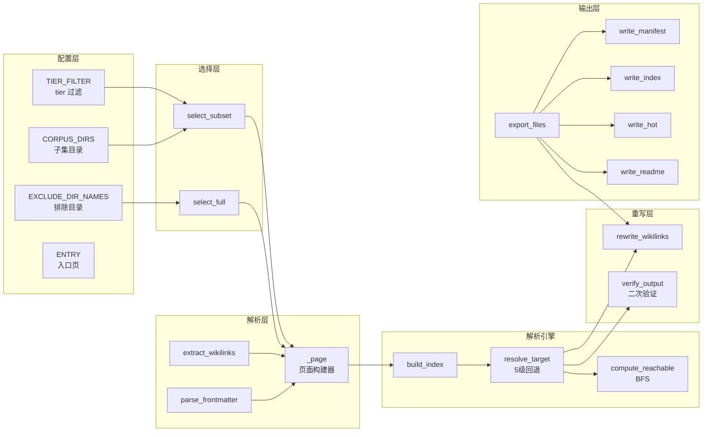
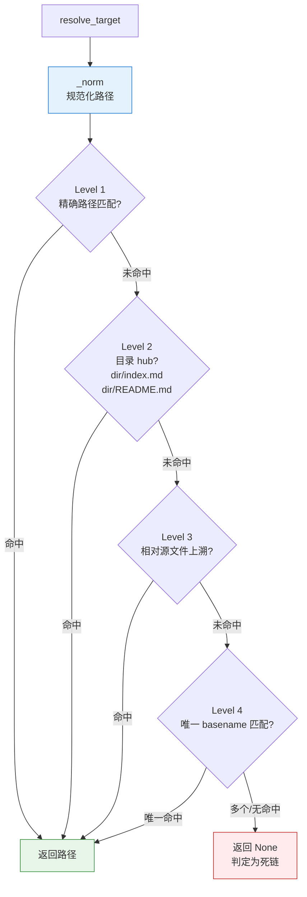
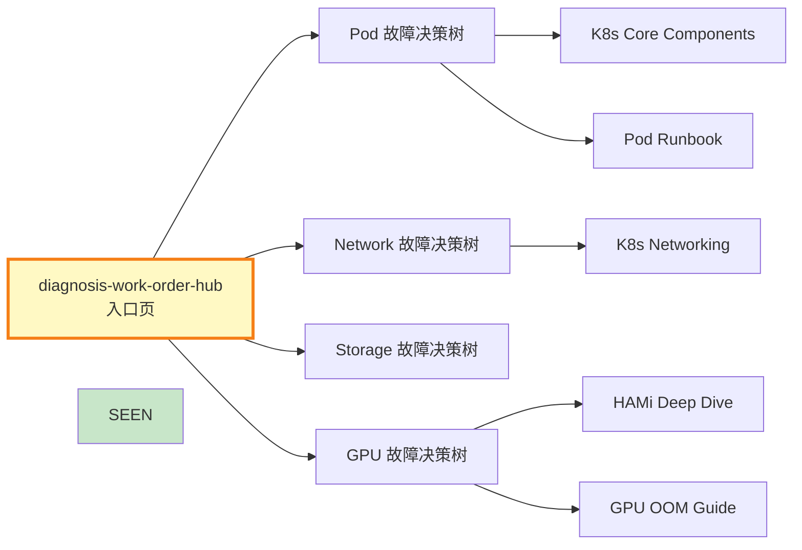
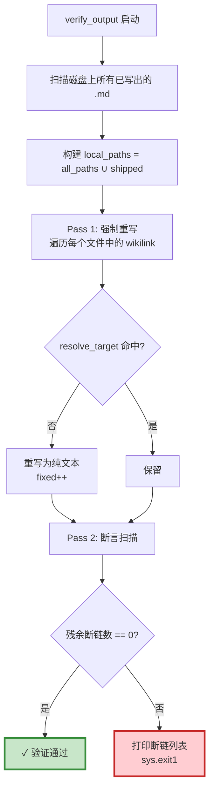
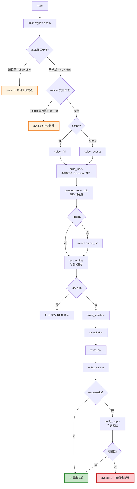

# export_corpus.py 源码深度解析

> `export_corpus.py`（657 行）是 AI Guru 知识库运维工具集的**核心导出引擎**。它将 Obsidian wiki 转化为 AgentScope 智能体可挂载的自包含语料包，确保智能体在 LLM-Wiki 遍历模式下永不遇到死链。

---

## 目录

- [1. 功能概述](#1-功能概述)
- [2. 架构分析](#2-架构分析)
- [3. 核心配置常量](#3-核心配置常量)
- [4. 关键算法解析](#4-关键算法解析)
  - [4.1 Frontmatter 解析器](#41-frontmatter-解析器)
  - [4.2 Wikilink 提取器](#42-wikilink-提取器)
  - [4.3 鲁棒 Wikilink 解析器（5 级回退）](#43-鲁棒-wikilink-解析器5-级回退)
  - [4.4 BFS 可达性分析](#44-bfs-可达性分析)
  - [4.5 双 Scope 导出策略](#45-双-scope-导出策略)
  - [4.6 死链重写引擎](#46-死链重写引擎)
  - [4.7 Post-export 验证断言](#47-post-export-验证断言)
- [5. 代码流程图](#5-代码流程图)
- [6. 输出产物](#6-输出产物)
- [7. 使用指南](#7-使用指南)
- [8. 扩展指南](#8-扩展指南)

---

## 1. 功能概述

`export_corpus.py` 是一个**单一规范化导出器**（Single Canonical Exporter），支持两种 scope：

| Scope | 说明 | 页面选择策略 |
|-------|------|-------------|
| `full` | 全量知识库快照 | 遍历所有非排除目录的 `.md` 文件 |
| `subset` | K8s/GPU/运维子集 | 仅选择 `CORPUS_DIRS` 中 tier 为 core/supporting 的文件 |

**两种 scope 共享的核心能力**：

1. **鲁棒 wikilink 解析**：5 级回退策略解析 `[[wikilink]]`，支持空格/下划线互换、目录 hub、相对路径上溯、唯一 basename 匹配。
2. **死链重写**：无法解析的链接自动转为纯文本显示文本（可通过 `--no-rewrite` 禁用），确保智能体永不跟随死链。
3. **BFS 可达性分析**：从入口页出发，沿 wikilink 计算所有可达页面，标记不可达的 Core 页为孤儿。
4. **验证断言**：导出后二次扫描磁盘文件，强制重写残余死链，**最终断言零断链**——这是硬保证。
5. **清单生成**：自动生成 `corpus_manifest.json`、`index.md`、`hot.md`、`README.md`。

---

## 2. 架构分析

### 2.1 模块结构

脚本采用**函数式流水线**架构，无类定义，所有功能通过独立函数实现，数据通过字典在函数间流转。



### 2.2 核心数据结构

**Page 字典**（页面模型，`export_corpus.py:118-129`）：

```python
{
    "path": "12_Architecture_Infrastructure/foo.md",  # 相对路径
    "abs_path": "/abs/path/to/foo.md",                # 绝对路径
    "title": "Foo Deep Dive",                          # frontmatter title
    "tier": "core",                                    # core/supporting/peripheral
    "summary": "...",                                  # frontmatter summary (截断240字符)
    "size": 15384,                                     # 文件字节数
    "links": ["bar", "baz/qux"],                       # 提取的 wikilink 目标列表
}
```

---

## 3. 核心配置常量

### 3.1 排除规则（`export_corpus.py:32-64`）

```python
# full scope 排除的目录名（工具/隐藏/缓存/原始来源）
EXCLUDE_DIR_NAMES = {
    "_raw", "_sources", "_archives", "_tools",
    "Web", "node_modules", "release",
    ".git", ".obsidian", ".claude", ".venv", ...
}

# subset scope 的语料目录
CORPUS_DIRS = [
    "_concepts", "_synthesis",
    "12_Architecture_Infrastructure", "13_AI_Ops",
    "07_Model_Training", "10_Deployment_Inference", ...
]

# subset scope 的 tier 过滤
TIER_FILTER = {"core", "supporting"}

# subset scope 额外排除的路径片段
EXCLUDE_SEGMENTS = {"assets", "demo", "_raw", ...}
```

### 3.2 正则表达式（`export_corpus.py:68-70`）

```python
LINK_RE = re.compile(r"\[\[([^\[\]]+)\]\]")           # [[wikilink]]
FRONTMATTER_RE = re.compile(r"^---\s*\n(.*?)\n---")   # YAML frontmatter
FIELD_RE = re.compile(r"^([A-Za-z_][\w-]*)\s*:\s*(.+)$", re.MULTILINE)  # 字段
```

### 3.3 入口页

```python
ENTRY = "_synthesis/diagnosis-work-order-hub.md"
```

这是智能体的**诊断总入口**——收到工单后首先读取此页，沿 wikilink 遍历到各故障决策树（Pod/Network/Storage/GPU）。

---

## 4. 关键算法解析

### 4.1 Frontmatter 解析器

**函数**：`parse_frontmatter(text)` — `export_corpus.py:75-82`

```python
def parse_frontmatter(text):
    m = FRONTMATTER_RE.match(text)
    if not m:
        return {}
    fm = {}
    for mm in FIELD_RE.finditer(m.group(1)):
        fm[mm.group(1)] = mm.group(2).strip().strip("\"'")
    return fm
```

**解析策略**：
1. 用 `FRONTMATTER_RE` 匹配文件开头的 `---\n...\n---` 块
2. 在块内用 `FIELD_RE` 逐行提取 `key: value` 对
3. 自动去除值两端的引号和空白

**特点**：轻量级正则解析，不依赖 PyYAML。支持 `title: "Foo"` 和 `title: Foo` 两种格式。不支持多行 YAML（如列表），但这些字段（tier、summary、title）均为单行。

### 4.2 Wikilink 提取器

**函数**：`extract_wikilinks(text)` — `export_corpus.py:84-91`

```python
def extract_wikilinks(text):
    out = []
    for m in LINK_RE.finditer(text):
        raw = m.group(1)
        t = raw.split("|")[0].split("#")[0].strip()
        if t and not t.startswith("http"):
            out.append(t)
    return out
```

**处理逻辑**：
- `[[target|alias]]` → 取 `target`（split `|`）
- `[[target#heading]]` → 取 `target`（split `#`）
- 跳过空目标和外部 URL（`http` 开头）

### 4.3 鲁棒 Wikilink 解析器（5 级回退）

**函数**：`resolve_target(target, all_paths, basename_index, source_path)` — `export_corpus.py:183-234`

这是整个导出引擎最关键的算法。Obsidian 的 wikilink 有多种写法，导出时必须将它们统一解析为实际文件路径。



**路径规范化**（`_norm`，`export_corpus.py:174-181`）：

```python
def _norm(p):
    p = p.replace("\\", "/")        # 反斜杠 → 正斜杠
    p = re.sub(r"/{2,}", "/", p)    # 折叠多重斜杠
    while p.startswith("./"):       # 去除 ./
        p = p[2:]
    return p.rstrip("/")            # 去除尾部 /
```

**5 级回退详解**：

#### Level 1：精确路径 + 空格/下划线变体

```python
cand = raw if raw.endswith(".md") else raw + ".md"
# 尝试: cand, cand 空格→下划线, cand 下划线→空格
```

例如 `[[K8s Pod]]` 会尝试 `K8s Pod.md`、`K8s_Pod.md`、`K8s Pod.md`。

#### Level 2：目录 hub

如果 target 是目录名，尝试目录下的 `index.md` 和 `README.md`：

```python
for d in {raw, raw.replace(" ", "_"), raw.replace("_", " ")}:
    for hub in ("index.md", "README.md"):
        r = try_path(f"{d}/{hub}")
```

例如 `[[12_Architecture_Infrastructure]]` → `12_Architecture_Infrastructure/README.md`。

#### Level 3：相对源文件上溯

从源文件所在目录开始，逐级向上查找：

```python
src_dir = Path(source_path).parent
for ancestor in (src_dir, *src_dir.parents):
    pre = "" if str(ancestor) == "." else f"{ancestor}/"
    r = try_path(f"{pre}{cand}")  # 精确
    # + dir hub 尝试
```

这解决了 `[[README]]` 在不同目录指向不同文件的问题。

#### Level 4：唯一 basename

```python
stem = Path(cand).stem
hits = basename_index.get(stem)
if hits and len(hits) == 1:  # 仅当唯一时
    return next(iter(hits))
```

**关键约束**：basename 必须全局唯一才匹配。如果两个文件同名（如多个 `README.md`），返回 None（避免误链）。

### 4.4 BFS 可达性分析

**函数**：`compute_reachable(pages, all_paths, basename_index)` — `export_corpus.py:316-329`

```python
def compute_reachable(pages, all_paths, basename_index):
    by_path = {p["path"]: p for p in pages}
    if ENTRY not in by_path:
        return set()
    seen = {ENTRY}
    queue = deque([ENTRY])
    while queue:
        cur = queue.popleft()
        for t in by_path[cur]["links"]:
            r = resolve_target(t, all_paths, basename_index, source_path=cur)
            if r in by_path and r not in seen:
                seen.add(r)
                queue.append(r)
    return seen
```



**算法**：标准广度优先搜索（BFS），从 `ENTRY` 出发，对每个页面的 wikilinks 调用 `resolve_target` 解析，将解析到的已导出页面加入访问集。

**用途**：
- 在 `index.md` 中用 🔒 标记不可达页面
- 在 `hot.md` 中列出不可达的 Core 页（需手动链入）
- 在 `corpus_manifest.json` 中每页记录 `reachable_from_entry: true/false`

### 4.5 双 Scope 导出策略

#### `select_full(root)` — `export_corpus.py:131-145`

```python
def select_full(root):
    pages = {}
    for dirpath, dirnames, filenames in os.walk(root):
        dirnames[:] = [d for d in dirnames if not exclude_full_dir(d)]
        for fn in filenames:
            if exclude_full_file(fn):  # 非 .md / 隐藏文件 / macOS 副本
                continue
            abs_p = Path(dirpath) / fn
            rel = abs_p.relative_to(root).as_posix()
            pages[rel] = _page(rel, abs_p)
    for extra in EXTRA_ROOT_FILES:  # 强制包含根级 meta 文件
        fp = root / extra
        if fp.exists() and fp.is_file():
            pages[extra] = _page(extra, fp)
    return list(pages.values())
```

**特点**：
- 使用 `os.walk` 的 `dirnames[:] =` 原地修剪，高效跳过排除目录
- `is_macos_dup()` 过滤 macOS 副本文件（`foo 2.md`）
- `EXTRA_ROOT_FILES` 强制包含 `README.md`、`ROADMAP.md` 等根级文件

#### `select_subset(base)` — `export_corpus.py:147-162`

```python
def select_subset(base):
    pages = {}
    for corpus_dir in CORPUS_DIRS:
        full_dir = base / corpus_dir
        if not full_dir.exists():
            continue
        for fp in sorted(full_dir.rglob("*.md")):
            rel = fp.relative_to(base).as_posix()
            if should_exclude_subset(rel):  # 路径片段排除
                continue
            text = fp.read_text(encoding="utf-8", errors="ignore")
            tier = parse_frontmatter(text).get("tier", "supporting")
            if tier not in TIER_FILTER:  # 仅 core + supporting
                continue
            pages[rel] = _page(rel, fp, text, tier_override=tier)
    return list(pages.values())
```

**差异**：
- 只遍历 `CORPUS_DIRS` 中的目录
- 额外 tier 过滤（`peripheral` 被排除）
- 额外路径片段排除（`assets`、`demo` 等）

### 4.6 死链重写引擎

**函数**：`rewrite_wikilinks(text, all_paths, basename_index, source_path)` — `export_corpus.py:239-259`

```python
def rewrite_wikilinks(text, all_paths, basename_index, source_path):
    rewritten = 0

    def repl(m):
        nonlocal rewritten
        inner = m.group(1)
        parts = inner.split("|", 1)
        target = parts[0].split("#")[0].strip()
        alias = parts[1].split("#")[0].strip() if len(parts) > 1 else ""
        resolved = resolve_target(target, all_paths, basename_index, source_path)
        if resolved is not None:
            return m.group(0)          # 已解析：原样保留
        rewritten += 1
        if alias:
            return alias               # 有别名：用别名做纯文本
        stem = os.path.splitext(os.path.basename(target))[0]
        return stem.replace("-", " ").replace("_", " ")  # 无别名：stem 空格化

    new_text = LINK_RE.sub(repl, text)
    return new_text, rewritten
```

**重写规则**：

| 场景 | 原始 | 重写后 |
|------|------|--------|
| 已解析 | `[[foo]]` | `[[foo]]`（不变） |
| 死链+有别名 | `[[missing\|显示文本]]` | `显示文本` |
| 死链+无别名 | `[[some-missing-page]]` | `some missing page` |

**设计意图**：将死链转为纯文本，使智能体看到的是"可读文字"而非"可点击链接"。智能体不会尝试遍历到不存在的页面。

### 4.7 Post-export 验证断言

**函数**：`verify_output(output_dir, all_paths, basename_index, source_pages)` — `export_corpus.py:264-311`

这是导出引擎的**硬保证**（Hard Guarantee），独立于第一轮重写。



**为什么需要二次验证？**

第一轮重写在 `export_files` 中进行，但存在以下风险：
1. 源文件在导出过程中被修改（竞态条件）
2. 解析器可能有边界 case 遗漏
3. 生成文件（`index.md`、`hot.md`）中的链接可能引用了不存在的页面

`verify_output` 从磁盘读取**ground truth**（实际写入的文件），独立计算可解析集（包含所有已导出页面），确保万无一失。

**关键代码**（`export_corpus.py:275-276`）：

```python
shipped = {p.relative_to(out).as_posix() for p in out.rglob("*.md")}
local_paths = all_paths | shipped  # 可解析集 = 源页面 + 已导出页面
```

---

## 5. 代码流程图

### 5.1 main() 主流程



### 5.2 可复现性守卫

`export_corpus.py:589-598` 包含一个重要的**可复现性守卫**：

```python
if not args.allow_dirty and (root / ".git").exists():
    dirty = subprocess.run(
        ["git", "-C", str(root), "status", "--porcelain"],
        capture_output=True, text=True).stdout.strip()
    if dirty:
        n = len([ln for ln in dirty.splitlines() if ln.strip()])
        sys.exit(f"[abort] working tree has {n} uncommitted change(s).")
```

**设计意图**：导出 live-edited 的 wiki 会产生不一致快照（文件在导出过程中变化）。此守卫强制要求干净工作区，确保快照可复现。

### 5.3 --clean 安全守卫

`export_corpus.py:601-602`：

```python
if args.clean and output_dir.resolve() in (root.resolve(), *root.resolve().parents):
    sys.exit(f"[abort] --clean target {output_dir} is the repo root or above; refusing.")
```

防止 `--clean --output .` 意外擦除整个知识库。

---

## 6. 输出产物

### 6.1 corpus_manifest.json

完整的语料清单，包含全局统计和逐页元数据：

```json
{
  "name": "ai-guru-corpus-full",
  "scope": "full",
  "version": "3.0.0",
  "exported_at": "2026-07-11T10:30:00",
  "usage": {
    "mode": "llm-wiki",
    "entry_point": "_synthesis/diagnosis-work-order-hub.md"
  },
  "stats": {
    "total_pages": 1216,
    "total_size_mb": 12.34,
    "reachable_from_entry": 180,
    "total_internal_links": 9101,
    "resolved_internal_links": 8950,
    "broken_internal_links": 151,
    "links_rewritten": 151,
    "by_tier": {
      "core": {"count": 85, "size": 5234567},
      "supporting": {"count": 1131, "size": 7890123}
    }
  },
  "pages": [
    {
      "path": "12_Architecture_Infrastructure/Kubernetes_Core_Components_Deep_Dive.md",
      "title": "Kubernetes Core Components Deep Dive",
      "tier": "core",
      "summary": "...",
      "size_bytes": 15384,
      "reachable_from_entry": true,
      "broken_links": []
    }
  ]
}
```

### 6.2 index.md

按目录组织的全量页面目录：
- 每个顶层目录一个 `##` 章节
- Core 页面用 ⭐ 标记
- 入链数用反引号标注（如 `` `15` ``）
- 不可达页面用 🔒 标记

### 6.3 hot.md

热点页排行：
- Core 页按入链数降序排列（Top 30）
- 诊断决策树入口列表
- **不可达 Core 页警告**（需手动链入的孤儿页）

### 6.4 README.md

人类可读的语料使用说明，包含统计表和智能体工作流指引。

---

## 7. 使用指南

### 7.1 命令行参数

| 参数 | 说明 | 默认值 |
|------|------|--------|
| `--scope {full,subset}` | 导出范围 | `full` |
| `--output, -o PATH` | 输出目录 | `release` |
| `--clean` | 导出前清空输出目录 | False |
| `--dry-run` | 预检模式（不写文件） | False |
| `--no-rewrite` | 不重写死链（原样输出） | False |
| `--allow-dirty` | 允许 git 工作区有未提交改动 | False |

### 7.2 典型用法

```bash
# 标准全量导出
python3 工具/export_corpus.py --scope full --output release --clean

# 预检（验证链接解析率，不写文件）
python3 工具/export_corpus.py --scope full --dry-run

# 子集导出（节省 token）
python3 工具/export_corpus.py --scope subset --output release-subset --clean

# 调试：保留死链原样（用于排查）
python3 工具/export_corpus.py --scope full --no-rewrite --dry-run
```

### 7.3 输出解读

成功输出示例：

```
[export] scope=full  base=/path/to/wiki  out=/path/to/release
  selected: 1216 pages
  reachable from entry: 180
  links: 8950/9101 resolved (151 broken)
  rewritten to plain text: 151
  verify: 0 unresolved wikilinks in shipped corpus ✓

✅ Export complete → /path/to/release
   pages=1216  size=12.34 MB  scope=full
```

**关注指标**：
- `reachable from entry`：应尽量高（不可达页面智能体看不到）
- `broken`：应趋近 0（死链会被重写，但过多说明 wiki 质量差）
- `verify: 0 unresolved`：必须为 ✓（否则 `sys.exit(1)`）

---

## 8. 扩展指南

### 8.1 添加新的链接类型

若需支持新的链接语法（如 `<ref:foo>` 引用），需要修改两处：

1. **`extract_wikilinks()`**（`export_corpus.py:84-91`）：添加新语法的正则提取
2. **`rewrite_wikilinks()`**（`export_corpus.py:239-259`）：添加新语法的重写逻辑

```python
# 示例：添加 <ref:foo> 语法
REF_RE = re.compile(r"<ref:([^>]+)>")

def extract_wikilinks(text):
    out = []
    # ... 现有 wikilink 提取 ...
    for m in REF_RE.finditer(text):
        t = m.group(1).strip()
        if t and not t.startswith("http"):
            out.append(t)
    return out
```

### 8.2 添加新的导出策略（Scope）

1. 在配置区定义新的目录列表和过滤规则
2. 添加新的 `select_xxx()` 函数
3. 在 `main()` 的 `argparse` 中扩展 `--scope` 选项

```python
# 示例：添加 "rag" scope（仅 RAG 相关）
RAG_DIRS = ["14_RAG_Systems", "_concepts"]

def select_rag(base):
    pages = {}
    for corpus_dir in RAG_DIRS:
        # ... 类似 select_subset 的逻辑 ...
    return list(pages.values())

# main() 中
ap.add_argument("--scope", choices=["full", "subset", "rag"], default="full")
```

### 8.3 调整解析器回退策略

如需修改 `resolve_target` 的回退顺序或添加新策略，编辑 `export_corpus.py:183-234`。例如添加 "fuzzy match" 作为 Level 5：

```python
# Level 5: 模糊匹配（编辑距离 < 3）
if not r:
    from difflib import get_close_matches
    close = get_close_matches(stem, basename_index.keys(), n=1, cutoff=0.8)
    if close:
        hits = basename_index[close[0]]
        if len(hits) == 1:
            return next(iter(hits))
```

> **注意**：模糊匹配有误链风险，建议仅作为最后回退，并添加日志记录。

### 8.4 自定义输出产物

在 `main()` 的 `write_*` 调用链后添加自定义生成函数。页面数据（`pages`）、可达集（`reachable`）、统计（`stats`）均已可用。

---

> **相关文档**：[[工具/README|工具集总览]] · [[工具/wiki_health_Deep_Dive|wiki_health 源码解析]] · [[工具/Source_Code_Analysis|其余脚本批量解析]]
