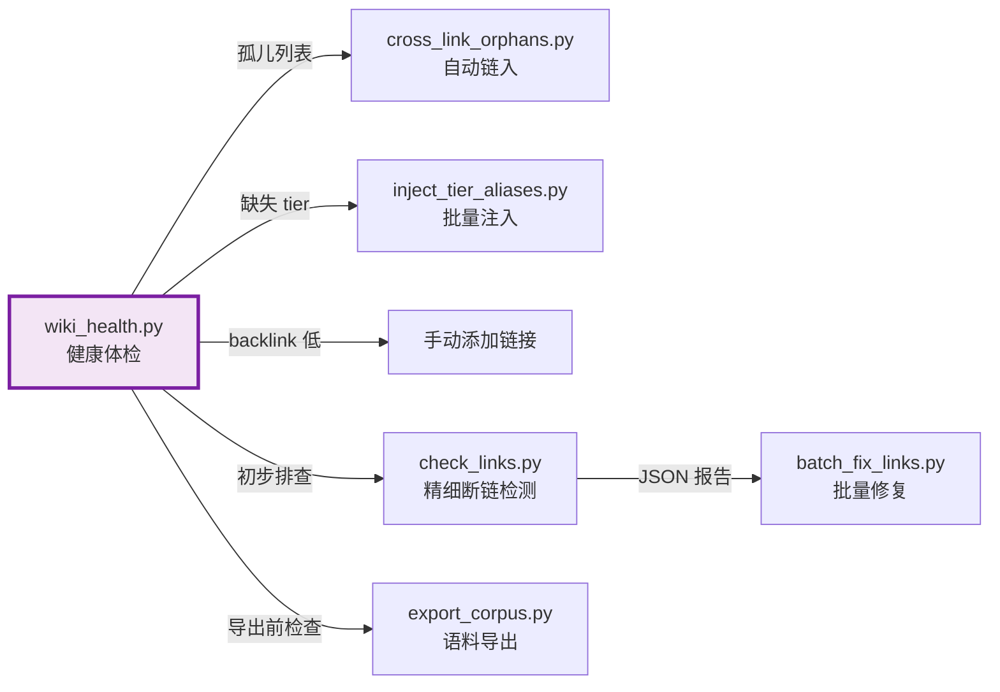

# wiki_health.py 源码解析

> `wiki_health.py`（173 行）是 AI Guru 知识库的**健康体检工具**。它快速扫描知识库，输出三项关键健康指标：孤儿页检测、Tier 分布、Backlink 密度，帮助维护者发现知识图谱的结构性问题。

---

## 目录

- [1. 功能概述](#1-功能概述)
- [2. 核心配置](#2-核心配置)
- [3. 核心函数解析](#3-核心函数解析)
  - [3.1 walk_md — 文件遍历器](#31-walk_md--文件遍历器)
  - [3.2 extract_links — 链接提取器](#32-extract_links--链接提取器)
  - [3.3 parse_frontmatter — 元数据解析器](#33-parse_frontmatter--元数据解析器)
- [4. 健康度评分算法](#4-健康度评分算法)
- [5. 完整执行流程](#5-完整执行流程)
- [6. 使用指南与输出解读](#6-使用指南与输出解读)
- [7. 与其他工具的协作](#7-与其他工具的协作)

---

## 1. 功能概述

`wiki_health.py` 回答三个核心问题：

| 问题 | 检测方法 | 输出 |
|------|----------|------|
| **哪些页面是孤儿？** | 在语料目录中无任何入链（wikilink 或 md-link） | 按重要性排序的孤儿列表 |
| **Tier 分布是否健康？** | 统计 frontmatter 中 `tier:` 字段的分布 | 计数表 + 缺失 tier 的文件 |
| **关键 hub 页的链接密度？** | 统计 11 个预设 hub 页的入链数 | 密度表 |

**设计特点**：
- **零依赖**：仅用 Python 标准库（os、re、sys、collections、json）
- **快速**：单次遍历构建入链索引，O(N×L) 复杂度（N=文件数，L=平均链接数）
- **语料聚焦**：仅在 `CORPUS_DIRS` 中检测孤儿，避免对原始来源的误报

---

## 2. 核心配置

### 2.1 排除目录（`wiki_health.py:13-15`）

```python
EXCLUDE_DIRS = {'.git', '.venv', 'node_modules', '.claude', '.qoder', '.qwen',
                '.comate', '.crush', '.pytest_cache', '__pycache__', 'Web',
                '.obsidian', '.github', 'dist', 'site', '_raw'}
```

这些目录包含工具代码、缓存、外部来源，不参与健康检查。

### 2.2 语料目录（`wiki_health.py:17-20`）

```python
CORPUS_DIRS = ['12_Architecture_Infrastructure', '13_AI_Ops', '07_Model_Training',
               '10_Deployment_Inference', '11_MLOps_Pipeline', '14_RAG_Systems',
               '15_Agent_Production', '_concepts', '_synthesis',
               '_projects/Cloud_Ops_Agent']
```

只有这些目录中的文件才会被检测孤儿状态。其他目录（如论文、面试题）不要求有入链。

### 2.3 关键 Hub 页列表（`wiki_health.py:144-156`）

```python
hubs = [
    'Kubernetes_Troubleshooting_Playbook',
    'Alibaba_Cloud_Proprietary_K8s_Context',
    'Kubernetes_Core_Components_Deep_Dive',
    'Kubernetes_Networking_Deep_Dive',
    'Kubernetes_Storage_Deep_Dive',
    'GPU_OOM_Troubleshooting_Guide',
    'LLM_Inference_Slow_Unavailable_Runbook',
    'HAMi_Deep_Dive',
    'LLM_Fine_Tuning_Job_Failure_Runbook_on_K8s',
    'Model_Hot_Reload_and_Rollback_Runbook',
    'K8s_AI_Troubleshooting_Cheat_Sheet',
]
```

这 11 个 hub 页是工单智能体最常遍历的核心页面，它们的 backlink 密度直接反映知识图谱的连通性。

---

## 3. 核心函数解析

### 3.1 walk_md — 文件遍历器

**函数签名**：`walk_md(base)` — `wiki_health.py:22-29`

```python
def walk_md(base):
    files = []
    for dirpath, dirnames, filenames in os.walk(base):
        dirnames[:] = [d for d in dirnames if d not in EXCLUDE_DIRS
                       and not d.startswith('.')]
        for f in filenames:
            if f.endswith('.md'):
                files.append(os.path.join(dirpath, f))
    return files
```

**技巧**：`dirnames[:] = [...]` 原地修改列表，使 `os.walk` 不会递归进入排除目录。这比遍历后过滤高效得多。

**输出**：所有非排除目录中的 `.md` 文件绝对路径列表。

### 3.2 extract_links — 链接提取器

**函数签名**：`extract_links(content)` — `wiki_health.py:31-43`

```python
def extract_links(content):
    """Extract all link targets (wikilinks + md-links) as basenames."""
    targets = set()
    # Wikilinks: [[target]] or [[target|alias]] or [[target#heading]]
    for m in re.finditer(r'\[\[([^\]]+)\]\]', content):
        t = m.group(1).split('|')[0].split('#')[0].strip()
        if not t.startswith('http'):
            targets.add(t)
    # Markdown links: [text](path)
    for m in re.finditer(r'\[([^\]]*)\]\(([^)]+)\)', content):
        path = m.group(2).strip()
        if path.startswith(('http', 'mailto', '#', 'ftp')):
            continue
        targets.add(path)
    return targets
```

```mermaid
flowchart LR
    A[文件内容] --> B{Wikilink 匹配}
    B --> C[\[\[target\]\]\]
    B --> D[\[\[target\|alias\]\]\]
    B --> E[\[\[target\#heading\]\]\]
    C --> F[取 target]
    D --> F
    E --> F
    F --> G{http 开头?}
    G -->|否| H[加入 targets]
    G -->|是| I[跳过]

    A --> J{Markdown link 匹配}
    J --> K[\[text\]\(path\)\]
    K --> L[取 path]
    L --> M{http/mailto/#/ftp?}
    M -->|否| N[加入 targets]
    M -->|是| O[跳过]

    H --> P[返回 targets Set]
    N --> P
```

**关键设计**：
- 同时提取 wikilink 和 markdown link（`check_links.py` 也采用此策略，但 `export_corpus.py` 仅提取 wikilink）
- 使用 `set()` 去重（同一文件多次引用同一目标只计一次）
- 处理 `|alias` 和 `#heading` 后缀

### 3.3 parse_frontmatter — 元数据解析器

**函数签名**：`parse_frontmatter(content)` — `wiki_health.py:45-55`

```python
def parse_frontmatter(content):
    fm = {}
    m = re.match(r'^---\s*\n(.*?)\n---', content, re.DOTALL)
    if not m:
        return fm
    block = m.group(1)
    tier_m = re.search(r'^tier\s*:\s*"?(\w+)"?\s*$', block, re.MULTILINE)
    if tier_m:
        fm['tier'] = tier_m.group(1)
    return fm
```

**特点**：
- 仅提取 `tier` 字段（`export_corpus.py` 的版本提取所有字段）
- 支持带引号和不带引号两种写法：`tier: core` 和 `tier: "core"`
- 使用 `re.MULTILINE` 确保 `^...$` 匹配每行

---

## 4. 健康度评分算法

`wiki_health.py` 不输出单一的综合健康分，而是通过三项独立指标让维护者自行判断。以下是三项指标的算法。

### 4.1 孤儿页检测算法

**核心数据结构**：`incoming` — `defaultdict(set)`，键为目标 stem，值为引用该 stem 的源文件集合。

```python
# 构建入链索引（wiki_health.py:70-84）
incoming = collections.defaultdict(set)
for f in files:
    rel = os.path.relpath(f, base)
    content = open(f, 'r', encoding='utf-8', errors='ignore').read()
    links = extract_links(content)
    for link in links:
        stem = os.path.basename(link).replace('.md', '').split('#')[0]
        if stem:
            incoming[stem].add(rel)
```

**孤儿判定**（`wiki_health.py:90-97`）：

```python
orphans = []
for f in files:
    rel = os.path.relpath(f, base)
    if not any(d in rel for d in CORPUS_DIRS):  # 仅检测语料目录
        continue
    bn = os.path.basename(f).replace('.md', '')
    if bn not in incoming or len(incoming[bn]) == 0:
        orphans.append(rel)
```

```mermaid
flowchart TD
    A[遍历所有 .md 文件] --> B{在 CORPUS_DIRS 中?}
    B -->|否| SKIP[跳过]
    B -->|是| C[提取文件 stem]
    C --> D{incoming\[stem\] 非空?}
    D -->|是| NOTORPHAN[非孤儿]
    D -->|否| ORPHAN[标记为孤儿]
    ORPHAN --> E[按重要性排序]
    E --> F[输出 Top 40]

    style ORPHAN fill:#ffcdd2,stroke:#c62828
    style NOTORPHAN fill:#c8e6c9,stroke:#388e3c
```

**重要性排序**（`wiki_health.py:100-105`）：

```python
orphans_sorted = sorted(orphans, key=lambda x: (
    0 if '概念/' in x else           # 概念页优先级最高
    1 if 'SRE_Reliability' in x or
      'Troubleshooting' in x else         # 其次是 SRE/排障
    2 if 'Cloud_Ops' in x else            # 再次是云运维
    3                                     # 其他最后
))
```

### 4.2 Tier 分布算法

```python
# wiki_health.py:117-138
tier_counts = collections.Counter()
no_tier = []
corpus_files = [f for f in files
                if any(d in os.path.relpath(f, base) for d in CORPUS_DIRS)]
for f in corpus_files:
    content = open(f, 'r', encoding='utf-8', errors='ignore').read()
    fm = parse_frontmatter(content)
    tier = fm.get('tier', 'MISSING')
    tier_counts[tier] += 1
    if tier == 'MISSING':
        no_tier.append(rel)
```

**健康基准**：
- `core` 页应占 5-15%（太多=噪音，太少=hub 不够）
- `MISSING` 应为 0（所有语料页都应有 tier）
- `peripheral` 可适量（被导出但优先级低）

### 4.3 Backlink 密度算法

```python
# wiki_health.py:157-159
for hub in hubs:
    refs = incoming.get(hub, set())
    print(f"  {hub:55s}: {len(refs):3d} backlinks")
```

**健康基准**：
- 每个 hub 页应有 ≥ 5 个 backlink（否则知识图谱过于稀疏）
- 关键 hub（如 `Kubernetes_Troubleshooting_Playbook`）应有 ≥ 20 个 backlink

---

## 5. 完整执行流程

```mermaid
flowchart TD
    START[main] --> BASE[确定 base 目录<br/>sys.argv\[1\] 或 .]
    BASE --> WALK[walk_md: 遍历所有 .md 文件]
    WALK --> BN[构建 basename → filepath 索引]
    BN --> INCOMING[构建 incoming 入链索引<br/>遍历每个文件的 links]
    INCOMING --> R1[报告 1: 孤儿页检测<br/>仅 CORPUS_DIRS]
    R1 --> R2[报告 2: Tier 分布<br/>统计 + 缺失列表]
    R2 --> R3[报告 3: Backlink 密度<br/>11 个 hub 页]
    R3 --> SAVE[保存 JSON 报告<br/>→ /tmp/wiki_health.json]
    SAVE --> END[结束]

    style R1 fill:#e3f2fd,stroke:#1976d2
    style R2 fill:#f3e5f5,stroke:#7b1fa2
    style R3 fill:#fff3e0,stroke:#ef6c00
    style SAVE fill:#e8f5e9,stroke:#388e3c
```

**复杂度分析**：
- 文件遍历：O(N)，N = 文件数
- 入链索引构建：O(N×L)，L = 平均链接数/文件
- 孤儿检测：O(M)，M = 语料目录文件数
- Tier 检测：O(M)（重读文件内容）
- 总体：O(N×L)，对 1200 文件约 < 3 秒

---

## 6. 使用指南与输出解读

### 6.1 运行方式

```bash
# 默认扫描当前目录
python3 工具/wiki_health.py

# 指定知识库根目录
python3 工具/wiki_health.py /path/to/wiki
```

### 6.2 输出示例

```
Scanning 1216 markdown files...

======================================================================
1. ORPHAN PAGES (no incoming links) — corpus dirs only
======================================================================
Total orphans in corpus dirs: 23
  ORPHAN (0 refs): 概念/clusterrole.md
  ORPHAN (0 refs): 概念/storageclass.md
  ORPHAN (0 refs): 概念/network-policy.md
  ...

======================================================================
2. TIER DISTRIBUTION — corpus dirs
======================================================================
  core         :   85
  supporting   : 1056
  MISSING      :   12
  peripheral   :   63

  Files missing tier (12):
    12_Architecture_Infrastructure/some_file.md
    ...

======================================================================
3. BACKLINK DENSITY — key corpus hub pages
======================================================================
  Kubernetes_Troubleshooting_Playbook              :  45 backlinks
  Kubernetes_Core_Components_Deep_Dive             :  38 backlinks
  GPU_OOM_Troubleshooting_Guide                    :  12 backlinks
  ...

Full report saved to /tmp/wiki_health.json
```

### 6.3 JSON 报告结构

```json
{
  "orphan_count": 23,
  "orphans": [
    "概念/clusterrole.md",
    "概念/storageclass.md"
  ],
  "tier_distribution": {
    "core": 85,
    "supporting": 1056,
    "MISSING": 12,
    "peripheral": 63
  },
  "no_tier": [
    "12_Architecture_Infrastructure/some_file.md"
  ]
}
```

### 6.4 健康度判读指南

| 指标 | 健康 | 需关注 | 不健康 |
|------|------|--------|--------|
| 孤儿页数 | < 10 | 10-30 | > 30 |
| MISSING tier | 0 | 1-5 | > 5 |
| Hub backlink | ≥ 20 | 5-19 | < 5 |
| Core 占比 | 5-15% | 15-25% | > 25% 或 < 5% |

### 6.5 修复建议

| 问题 | 修复工具 |
|------|----------|
| 孤儿概念页 | `cross_link_orphans.py`（自动链入 hub） |
| 缺失 tier | `inject_tier_aliases.py`（批量注入） |
| Hub backlink 过低 | 手动在相关 Runbook 中添加 wikilink |
| Core 页过多 | 重新评估 tier 分配，降级非关键页 |

---

## 7. 与其他工具的协作



**推荐工作流**：
1. `wiki_health.py` — 快速发现宏观问题（孤儿、tier 缺失）
2. `check_links.py` — 精细检测断链（带分类和 JSON 输出）
3. `batch_fix_links.py` / `cross_link_orphans.py` / `inject_tier_aliases.py` — 自动修复
4. `export_corpus.py` — 导出（内置 `verify_output` 做最终断言）

---

> **相关文档**：[[工具/README|工具集总览]] · [[工具/export_corpus_Deep_Dive|export_corpus 源码深度解析]] · [[工具/Source_Code_Analysis|其余脚本批量解析]]
