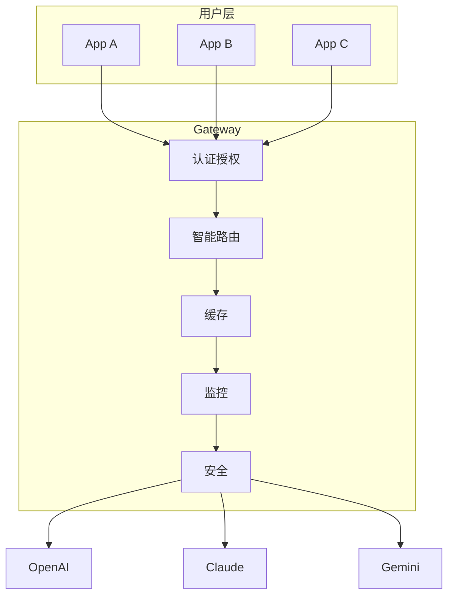
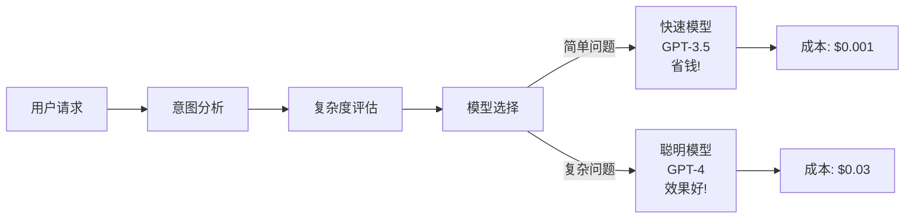
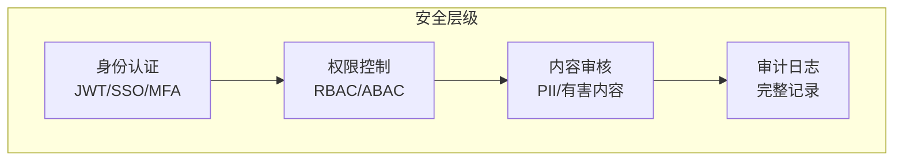

# AI 网关速成指南

> 🎯 **目标**：理解 AI Gateway 的核心概念、架构和关键功能。

---

## 🤔 什么是 AI Gateway？

**AI Gateway** = 企业 AI 能力的统一入口。

```
没有 Gateway:                    有 Gateway:
                              
用户 → OpenAI API              用户 → AI Gateway → [OpenAI / Claude / Gemini / ...]
用户 → Claude API                      ↑
用户 → Gemini API                      (一个入口，统一管理)
用户 → ...                      
```

---

## 🏗️ 核心架构



---

## ⚡ 核心功能

| 功能 | 作用 | 业务价值 |
|------|------|----------|
| **统一入口** | 一个 API 调用所有模型 | 简化集成 |
| **智能路由** | 自动选择最优模型 | 成本降低 40-60% |
| **安全管控** | 认证、授权、内容审核 | 防止滥用 |
| **流量管理** | 限流、熔断、降级 | 保障稳定性 |
| **成本优化** | 缓存、批处理、模型分层 | 减少浪费 |
| **可观测性** | 请求追踪、指标分析 | 快速定位问题 |

---

## 🎯 智能路由原理



---

## 🔐 安全架构



---

## 📊 成本优化策略

```
Layer 1: 请求优化
├── 提示词压缩
├── 上下文截断
└── 语义缓存 (相似请求直接返回)

Layer 2: 模型优化
├── 简单请求 → 小模型 (省 90%)
├── 复杂请求 → 大模型 (效果好)
└── 模型分层选择

Layer 3: 架构优化
├── 批处理 (合并请求)
├── 本地部署 (高频场景)
└── 混合云策略
```

---

## 🚀 快速开始

```python
# 1. 安装
pip install portkey-ai  # 或其他 Gateway

# 2. 配置
from portkey_ai import Portkey
client = Portkey(api_key="your-key")

# 3. 调用
response = client.chat.completions.create(
    messages=[{"role": "user", "content": "Hello!"}]
)
```

---

## 📝 关键术语

| 术语 | 解释 |
|------|------|
| **MCP** | Model Context Protocol，模型上下文协议 |
| **Rate Limiting** | 速率限制，防止滥用 |
| **Circuit Breaker** | 熔断器，故障时自动保护 |
| **Semantic Cache** | 语义缓存，相似请求命中缓存 |
| **Model Tiering** | 模型分层，复杂任务用强模型 |

---

## 🔗 相关主题

| 主题 | 文档 |
|------|------|
| 完整架构 | [AI_Gateway_2026.md](./AI_Gateway_2026.md) |
| 入门指南 | [AI_Gateway_for_dummy.md](./AI_Gateway_for_dummy.md) |
| SRE 实践 | [../AI_Ops/SRE_for_AI_Systems.md](运维/SRE_Reliability/SRE_for_AI_Systems.md) |
| 可观测性 | [../AI_Ops/AI_Observability_Guide.md](../../模型运维/Observability/AI_Observability_Guide.md) |
| 成本优化 | [../AI_Cost_Optimization_2026.md](.架构基建/Architecture_Overview/AI_Cost_Optimization_2026.md) |

---

*Last updated: 2026-04-11*

## Related

- [[架构基建/AI_Gateway/AI_Gateway_for_dummy]] — AI Gateway 入门指南 (for Dummies) (共享: ai-gateway, api-management, litellm, routing)
- [[架构基建/AI_Gateway/Kong_AI_Gateway_Deep_Dive]] — Kong AI Gateway 深度解析 (共享: ai-gateway, api-management, litellm, routing)
- [[架构基建/AI_Gateway/README]] — AI Gateway (共享: ai-gateway, api-management, litellm, routing)
- [[架构基建/AI_Gateway/Spring_AI_Gateway_Security]] — Spring AI 网关与安全 (共享: ai-gateway, api-management, litellm, routing)

## 架构核心组件对比

| 组件层 | 功能 | 关键技术 | 选型考量 |
|--------|------|----------|----------|
| 计算层 | 模型训练/推理 | GPU/TPU/NPU集群 | 算力需求+成本 |
| 存储层 | 数据/模型/检查点 | 分布式存储/对象存储 | 容量+IOPS+成本 |
| 网络层 | 节点间通信 | RDMA/RoCE/InfiniBand | 带宽+延迟 |
| 调度层 | 资源编排 | K8s/Slurm/Ray | 弹性+效率 |
| 服务层 | 模型服务化 | vLLM/TGI/Triton | 吞吐+延迟 |
| 网关层 | 流量管理 | API Gateway/负载均衡 | 可用性+安全 |
| 监控层 | 可观测性 | Prometheus/Grafana/OTel | 全面+实时 |

## 架构设计原则

| 原则 | 说明 | 实践方法 |
|------|------|----------|
| 高可用 | 消除单点故障 | 多副本+故障转移+多AZ |
| 可扩展 | 水平扩展无瓶颈 | 无状态设计+分片 |
| 高性能 | 最小化延迟 | 缓存+并行+异步 |
| 安全性 | 纵深防御 | 加密+认证+审计 |
| 可观测 | 全链路可见 | Trace+Metrics+Logging |
| 成本优化 | 资源利用率最大化 | 弹性伸缩+混合部署 |

## 性能基准参考

| 场景 | 关键指标 | 目标值 | 优化方向 |
|------|----------|--------|----------|
| 模型推理 | 首Token延迟 | <500ms | 模型优化+缓存 |
| 批量推理 | 吞吐量 | >1000 req/s | 批处理+并行 |
| 训练任务 | GPU利用率 | >85% | 数据管道+通信优化 |
| 存储读写 | IOPS | >100K | NVMe+分布式 |
| 网络通信 | 带宽利用率 | >90% | RDMA+拓扑优化 |

## 常见问题与解决方案

| 问题 | 根因分析 | 解决方案 |
|------|----------|----------|
| GPU利用率低 | 数据加载瓶颈 | 预取+多worker+NVMe |
| 推理延迟高 | 模型过大/批处理不当 | 量化+动态batch |
| 存储IO瓶颈 | 检查点写入集中 | 异步写入+分布式存储 |
| 网络拥塞 | AllReduce通信密集 | 梯度压缩+拓扑优化 |
| 资源碎片 | 调度策略不当 | Gang调度+资源预留 |

## 技术选型决策树

| 决策点 | 选项A | 选项B | 选择依据 |
|--------|-------|-------|----------|
| 训练框架 | PyTorch DDP | DeepSpeed/Megatron | 模型规模>10B用后者 |
| 推理引擎 | vLLM | TensorRT-LLM | 灵活性vs极致性能 |
| 存储方案 | 本地NVMe | 分布式存储(Ceph) | 数据规模+共享需求 |
| 网络方案 | 以太网 | InfiniBand | 集群规模+预算 |
| 调度系统 | K8s | Slurm | 云原生vs HPC传统 |

## 学习路径建议

| 阶段 | 内容 | 时间 | 产出 |
|------|------|------|------|
| 入门 | 基础架构概念+组件认知 | 1-2周 | 理解全景图 |
| 基础 | 单一组件深入(存储/网络) | 2-3周 | 掌握核心原理 |
| 进阶 | 系统集成+性能优化 | 3-4周 | 能设计完整方案 |
| 实战 | 生产环境部署运维 | 4-6周 | 独立运维能力 |
| 精通 | 架构演进+前沿探索 | 持续 | 技术领导力 |

## 术语速查表

| 术语 | 含义 |
|------|------|
| RDMA | 远程直接内存访问(绕过CPU) |
| NVLink | GPU间高速互联 |
| InfiniBand | 高性能网络互连技术 |
| Checkpoint | 训练中间状态保存点 |
| Gang Scheduling | 一组Pod同时调度 |
| Data Parallelism | 数据并行(每GPU处理不同数据) |
| Model Parallelism | 模型并行(模型分片到多GPU) |
| Pipeline Parallelism | 流水线并行(层间流水) |
| Tensor Parallelism | 张量并行(层内切分) |
| KV Cache | 推理时缓存注意力键值 |

## 检查清单

- [ ] 理解AI基础设施全景架构
- [ ] 掌握计算/存储/网络核心组件
- [ ] 了解主流框架和工具链
- [ ] 能进行基本的性能分析和优化
- [ ] 熟悉生产环境最佳实践
- [ ] 关注硬件和架构演进趋势
