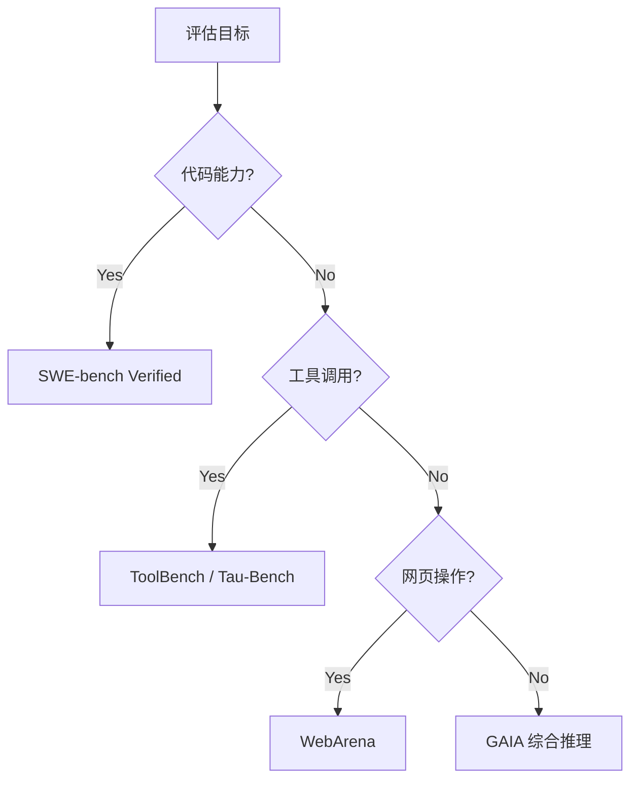

# Agent 评估基准

> Agent 评估基准就像 AI 的'综合素质面试'：不是让它背答案，而是给它一个真实任务，观察它怎么思考、怎么动手、怎么纠错。

## 核心要点

- **Agent 不只是聊天模型**：它会调用工具、做多步决策、与环境交互。
- **传统 LLM 基准测不出 Agent 能力**：MMLU/GSM8K 测知识/推理，不测行动。
- **Agent 评估模拟真实任务**：给 Agent 一个目标、一些工具，看它能否独立完成。
- **评估维度**：任务成功率、步骤效率、工具调用正确率、错误恢复、成本。

## 为什么需要专门基准

一个 Agent 可能：
- 模型很强，但总是调用错工具
- 能调用工具，但多走很多弯路
- 遇到错误就崩溃，不会自我修正
- 成本高得离谱，每个任务调用几十次 API

传统基准测不到这些，所以需要 Agent 专用基准。

## 主流 Agent 基准（2026）

| 基准 | 测什么 | 任务数 | 特点 | 最新 SOTA |
|------|--------|--------|------|----------|
| **SWE-bench Verified** | 真实 GitHub issue 修复 | 500 | 代码+工具 | ~50% |
| **SWE-bench Pro** | 更复杂的工程任务 | 1000+ | 多文件修改 | ~30% |
| **AgentBench** | 多环境任务 | 8环境 | OS/DB/网页/KG | 差异大 |
| **WebArena** | 网页操作任务 | 812 | 真实网站交互 | ~35% |
| **ToolBench** | 工具使用能力 | 16000+ API | 大规模工具 | ~60% |
| **GAIA** | 多步推理+工具 | 466 | 难度分层 | ~40% |
| **Terminal Bench** | 终端操作任务 | 80+ | 命令行交互 | ~65% |
| **MLAgentBench** | ML 实验自动化 | 13 | 科研任务 | ~40% |
| **Tau-Bench** | 客服工具调用 | 300+ | 多轮对话+工具 | ~70% |
| **OSWorld** | 操作系统级任务 | 369 | 多应用协作 | ~25% |
| **AndroidWorld** | 移动端任务 | 116 | Android UI | ~30% |
| **WorkArena** | 企业工作流 | 33 | ServiceNow | ~45% |

### 基准选择指南



## 评估维度体系

| 维度 | 指标 | 说明 |
|------|------|------|
| **任务成功率** | Pass@1 | 最终目标是否达成 |
| **步骤效率** | 步骤数 / 最优步骤 | 是否高效，无多余操作 |
| **工具调用** | 准确率 / 召回率 | 是否调对工具、参数正确 |
| **错误恢复** | 恢复率 | 犯错后能否自己纠正 |
| **成本** | tokens / API调用 / 延迟 | 资源消耗是否合理 |
| **安全性** | 越权率 / 有害操作率 | 是否产生危险行为 |

## 评估方法对比

| 方法 | 说明 | 优势 | 劣势 |
|------|------|------|------|
| **最终答案匹配** | 看结果是否正确 | 客观 | 忽略过程 |
| **过程轨迹评估** | 检查中间步骤 | 全面 | 标注成本高 |
| **LLM-as-Judge** | 用强模型评判 | 可扩展 | 可能有偏 |
| **人类评估** | 人工标注质量 | 最准确 | 贵且慢 |
| **成本-性能曲线** | 同效果下谁更便宜 | 实用 | 需多次实验 |

## 评估实践建议

1. **多基准组合**: 不要只看一个基准，组合 SWE-bench + GAIA + ToolBench 更全面
2. **控制成本**: 记录每个任务的 token 消耗，性价比很重要
3. **可复现性**: 使用固定 seed、固定模型版本，确保结果可复现
4. **分层评估**: 简单/中等/困难分别统计，避免均值掩盖问题
5. **对比基线**: 与人类表现、纯 LLM（无工具）对比，确认 Agent 的增量价值
6. **轨迹分析**: 不仅看结果，还要分析失败案例的失败模式
7. **A/B 测试**: 不同 Harness 配置对比，量化工程改进效果

## 评估工具与框架

| 工具 | 用途 | 特点 |
|------|------|------|
| **LangSmith** | 轨迹追踪 + 评估 | LangChain 生态集成 |
| **AgentOps** | Agent 可观测性 | 会话重放 + 成本分析 |
| **Braintrust** | 评估平台 | 自定义评分器 + 回归测试 |
| **Opik** | 开源评估框架 | Comet 生态 + 实验追踪 |
| **Inspect AI** | UK AISI 评估框架 | 安全评估专用 + 可扩展 |

### 评估代码示例

```python
from langsmith import Client, evaluate

def agent_evaluator(run, example):
    """自定义 Agent 评估器"""
    # 1. 任务成功率
    success = run.outputs["final_answer"] == example.outputs["expected"]
    # 2. 步骤效率
    steps = len(run.outputs["trajectory"])
    optimal = example.metadata["optimal_steps"]
    efficiency = optimal / steps if steps > 0 else 0
    # 3. 工具调用准确率
    tool_calls = [s for s in run.outputs["trajectory"] if s["type"] == "tool"]
    correct_tools = sum(1 for t in tool_calls if t["name"] in example.metadata["valid_tools"])
    tool_accuracy = correct_tools / len(tool_calls) if tool_calls else 1.0
    
    return {
        "success": success,
        "efficiency": efficiency,
        "tool_accuracy": tool_accuracy,
        "total_tokens": run.total_tokens,
    }

# 运行评估
results = evaluate(
    agent_runnable,
    data="agent-benchmark-v1",
    evaluators=[agent_evaluator],
    max_concurrency=5,
)
```

## 开放问题

- Agent 任务的'正确答案'有时不唯一，如何客观评估
- 评估环境（沙箱、真实网站）的可复现性
- 评估成本随任务复杂度指数增长
- 基准污染：模型可能在训练数据中见过基准题目
- 多模态 Agent 评估（视觉+语言+操作）缺乏统一基准
- 长时任务评估（小时级）的成本与可行性

## 构建自定义基准

当公开基准不满足业务需求时，可构建内部基准：

```yaml
# 自定义基准设计模板
benchmark_design:
  name: "internal-agent-bench"
  task_categories:
    - data_analysis: "数据分析任务"
    - report_generation: "报告生成任务"
    - workflow_automation: "工作流自动化"
  difficulty_levels:
    easy: "单工具、单步骤"
    medium: "多工具、多步骤"
    hard: "多工具、错误恢复、多约束"
  metrics:
    primary: task_success_rate
    secondary: [step_efficiency, tool_accuracy, cost_per_task]
  environment:
    sandbox: docker
    timeout: 300s
    tools: [file_ops, api_client, database]
```

## Related

- [[概念/Agent/ai-agents|AI Agent]]
- [[概念/Agent/tool-calling|工具调用]]
- [[概念/Agent/agent-reflection|Agent 反思]]
- [[概念/Agent/agentic-rag|Agentic RAG]]
- [[08_模型评估/02_Benchmarks/Agentic_Benchmark_Guide|Agentic 评估指南]]
- [[15_智能体/07_Agent_Evaluation/README|Agent 评估]]

---

## 2026 Agent 评估生态

| 特性/工具 | 说明 | 状态 |
|------|------|------|
| **AgentBench** | 多环境 Agent 评估基准 | GA |
| **GAIA** | 通用 AI 助手评估 | GA |
| **WebArena** | Web 任务 Agent 评估 | GA |
| **SWE-bench** | 软件工程 Agent 评估 | GA |
| **自动化评估** | LLM 辅助 Agent 评估 | GA |

## 生产最佳实践

1. **多维度评估**：任务完成率 + 效率 + 安全性综合评估
2. **真实场景**：用真实任务评估，而非仅合成测试
3. **基线对比**：与人类表现和简单基线对比
4. **失败分析**：深入分析失败案例，发现系统性问题
5. **持续评估**：Agent 更新后重新评估，防止退化
