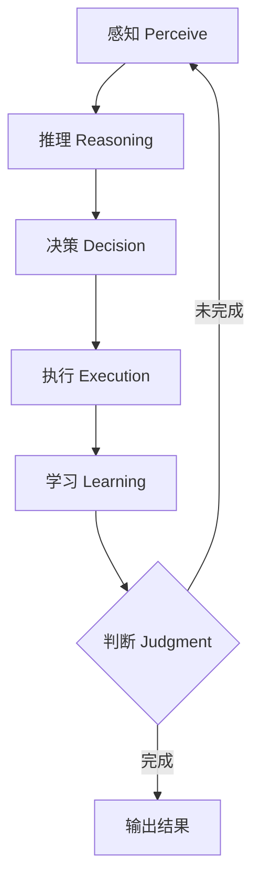

# Agent Loop (智能体循环)

## 定义

Agent Loop 是智能体运行时的核心执行循环，驱动"感知-推理-行动-观察"的反复迭代，直到任务完成、预算耗尽或被外部终止。它是智能体区别于单次 LLM 调用的根本机制——将 LLM 从"无状态函数"转变为"有状态的持续执行引擎"。

## 核心机制

### 经典循环模型

Agent Loop 的每一步包含六个阶段：

1. **感知 (Perceive)**：收集上下文——用户输入 + 短期记忆 + 长期记忆向量检索
2. **推理 (Reasoning)**：组装 LLM 输入，调用模型生成决策
3. **决策 (Decision)**：解析输出，提取工具调用请求，验证合法性
4. **执行 (Execution)**：工具层隔离执行，超时限制，容错继续
5. **学习 (Learning)**：写入记忆系统（短期总是写入，高价值同步长期）
6. **判断 (Judgment)**：终止条件检查——最终答案 / 最大步数 / 总超时



### 循环而非链式

循环设计允许逐步细化目标，在每个迭代中获得反馈，动态调整策略。这是 ReAct（Reasoning + Acting）模式的工程实现：

```
Thought (分析) -> Action (工具调用) -> Observation (反馈) -> Thought -> ...
```

**循环 vs 链式对比：**

| 特性 | 链式 (Chain) | 循环 (Loop) |
|------|-------------|-------------|
| 执行路径 | 预定义、线性 | 动态、可回溯 |
| 错误处理 | 失败即终止 | 可重试/换策略 |
| 适应性 | 无 | 根据反馈调整 |
| 复杂度 | 低 | 高（需终止条件） |
| 典型应用 | 简单 RAG | 复杂任务分解 |

### 两种工程实现模式

**异步生成器模式**（Claude Code、Cursor）：
- 流式响应实时推送（text_delta）
- StreamingToolExecutor 支持工具并发执行
- 低延迟高并发，适合交互式场景
- 用户可实时观察思考过程

**线性流水线模式**（OpenClaw、Devin）：
- 每轮循环独立阶段化：input → assembly → inference → execution → persist
- 单线程执行，确定性可追踪
- 适合自驱型长任务、后台执行

**图编排模式**（LangGraph、Temporal）：
- 将循环建模为状态机图
- 节点 = 步骤，边 = 转移条件
- 支持持久化、断点续跑、人机介入
- 适合复杂工作流、审批流

### 终止条件

循环终止的五种触发方式：

| 触发方式 | 说明 | 典型阈值 |
|----------|------|----------|
| 工具调用耗尽 | 最后一条消息无工具调用，直接回复 | - |
| 最大轮数限制 | 防止无限循环 | 10-50 轮 |
| Token 预算耗尽 | 上下文溢出无法继续 | 128K-1M tokens |
| 显式停止信号 | 用户取消、超时、停止标记 | - |
| 目标达成 | 高层目标追踪，自驱型 | 任务完成度 100% |

### Token 预算管理

三级预算控制体系：

| 层级 | 粒度 | 典型阈值 | 超限策略 |
|------|------|----------|----------|
| 单轮 | 每次 LLM 调用 | 8K-32K output | 截断 + 重试 |
| 会话 | 整个对话上下文 | 128K-200K | 滑动窗口 / 摘要压缩 |
| 任务 | 整个任务生命周期 | 500K-2M | 强制终止 + 报告 |

**上下文窗口管理策略：**

```
① 滑动窗口：保留最近 N 轮对话
② 摘要压缩：将早期对话压缩为摘要
③ 分层记忆：短期在工作记忆，长期存向量库
④ 选择性保留：只保留与当前任务相关的上下文
```

## 主流框架的 Loop 实现

| 框架 | 循环机制 | 特点 |
|------|----------|------|
| Claude Code | 异步生成器 + 流式工具 | 实时流、并发工具、用户可中断 |
| OpenAI Agents SDK | Runner.run() 循环 | 内置 handoff、guardrails |
| LangGraph | StateGraph 状态机 | 显式图结构、持久化、HITL |
| CrewAI | Task 顺序/并行执行 | 角色分工、任务委派 |
| AutoGen | 对话驱动循环 | 多 Agent 对话、代码执行 |

## 设计模式与最佳实践

### 1. 工具并发执行

当 LLM 返回多个独立工具调用时，并发执行可显著降低延迟：

```python
# 串行：总耗时 = sum(各工具耗时)
for tool_call in tool_calls:
    result = await execute(tool_call)

# 并行：总耗时 = max(各工具耗时)
results = await asyncio.gather(*[
    execute(tc) for tc in tool_calls
])
```

### 2. 错误恢复与重试

```python
MAX_RETRIES = 3
for attempt in range(MAX_RETRIES):
    try:
        result = await execute_tool(tool_call)
        break
    except TimeoutError:
        if attempt == MAX_RETRIES - 1:
            result = ToolResult(error="Tool timed out, skipping")
        else:
            await asyncio.sleep(2 ** attempt)  # 指数退避
```

### 3. 进度报告

长任务循环中定期向用户报告进度：
- 当前步骤编号 / 总步骤数
- 已完成的子任务摘要
- 预估剩余时间

### 4. 上下文窗口优化

- **工具结果截断**：大输出只保留前 N 字符 + 摘要
- **历史压缩**：超过阈值的早期对话自动摘要
- **选择性加载**：只检索与当前步骤相关的记忆

## 性能指标

| 指标 | 说明 | 典型值 |
|------|------|--------|
| 循环轮数 | 完成任务的平均迭代次数 | 3-15 轮 |
| 单轮延迟 | 一次 LLM 调用 + 工具执行 | 2-30s |
| 工具成功率 | 工具调用成功比例 | >95% |
| Token 效率 | 每轮有效信息占比 | >60% |
| 任务完成率 | 最终成功交付比例 | >85% |

## Related

- [[概念/Agent/agent-planning|Agent Planning]] — 循环中的规划策略
- [[概念/Agent/agent-memory-systems|Agent 记忆系统]] — 循环中的记忆读写
- [[概念/Agent/agent-reflection|Agent 反思]] — 循环中的自我评估
- [[概念/Agent/react-agent|ReAct Agent]] — 循环的经典范式
- [[概念/Agent/langgraph|LangGraph]] — 图编排循环实现
- [[概念/Agent/agent-harness|Agent Harness]] — 循环的运行时容器
- [[概念/Agent/mcp|MCP]] — 循环中的工具连接层
