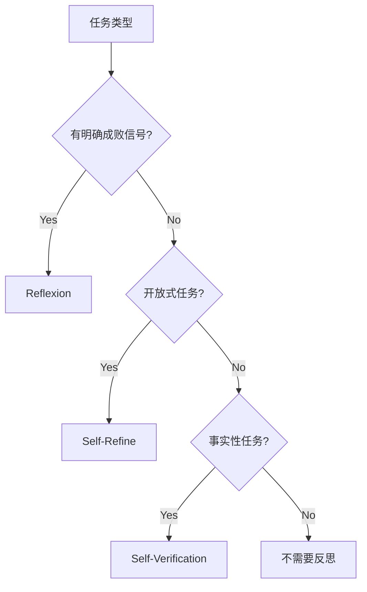

# Agent 反思（Reflection）

> 没有反思的 Agent 像“交完卷就走的学生”；有反思的 Agent 像“检查一遍发现错误再改”的好学生，越复杂的任务反思价值越大。

## 核心要点

- **反思 = 自我评估 + 改进**：Agent 不只执行，还评估“我做得对吗”，错了就修正。
- **三大机制**：Reflexion（失败后反思重来）、Self-Refine（生成-批评-修改循环）、Self-Verification（独立验证结果）。
- **价值**：无反思的 Agent 成功率遇瓶颈，加反思可提升 10-30%（尤其在代码、数学、推理任务）。

## 三种反思机制详解

| 机制 | 流程 | 适用场景 | 效果 |
|------|------|----------|------|
| **Reflexion** | 尝试→失败→反思→重试 | 有明确成败信号（代码/测试） | +15-30% |
| **Self-Refine** | 生成→批评→修改→再批评 | 开放式任务（写作/翻译） | 质量提升 |
| **Self-Verification** | 生成→独立验证→交叉确认 | 事实性任务（防幻觉） | 准确性+ |
| **CRITIC** | 生成→工具验证→修正 | 需要外部验证（计算/搜索） | 可靠性+ |

### Reflexion 流程

```
Attempt 1: 执行任务 → 失败
    ↓
Reflect: "为什么失败？哪里做错了？"
    ↓
Memory: 将教训存入反思记忆
    ↓
Attempt 2: 带着教训重试 → 成功
```

### Self-Refine 流程

```
Generate: 生成初稿
    ↓
Feedback: 自我批评 "哪里不好？建议？"
    ↓
Refine: 根据反馈修改
    ↓
(重复 2-3 轮直到满意)
```

## 反思的实现模式

```python
# Reflexion 模式（简化）
def agent_with_reflection(task, max_attempts=3):
    memory = []  # 反思记忆
    for attempt in range(max_attempts):
        result = execute(task, reflections=memory)
        if verify_success(result):
            return result
        # 反思：分析失败原因
        critique = reflect(task, result, memory)
        memory.append(critique)  # 累积教训
    return result

# Self-Refine 模式
def self_refine(task, max_rounds=3):
    draft = generate(task)
    for _ in range(max_rounds):
        feedback = critique(draft)  # 自我批评
        if feedback.is_satisfactory:
            break
        draft = refine(draft, feedback)  # 修改
    return draft

# Self-Verification 模式
def self_verify(question):
    answer = generate(question)
    # 用独立 prompt 验证
    verification = verify(question, answer)  # "这个答案对吗？"
    if not verification.is_correct:
        answer = regenerate(question, verification.feedback)
    return answer
```

## 反思的代价与边界

| 维度 | 评估 |
|------|------|
| **收益** | 复杂任务成功率 +10-30% |
| **成本** | 每次反思多 1-3 次 LLM 调用（token 翻倍） |
| **风险** | 过度反思 (overthinking) 反而引入错误 |
| **适用** | 有验证信号的任务（代码/数学/工具调用） |
| **不适用** | 纯创意/主观任务（反思无客观标准） |

## 反思与工具验证结合

| 验证方式 | 原理 | 可靠性 |
|----------|------|--------|
| LLM 自判 | 用另一个 prompt 验证 | 中（可能自欺） |
| 代码执行 | 跑测试/编译检查 | 高（客观） |
| 搜索引擎 | 交叉核实事实 | 高 |
| 多模型投票 | 不同模型独立回答对比 | 中高 |
| 形式化验证 | 数学证明/类型检查 | 极高 |

## 2026 进展

| 趋势 | 说明 |
|------|------|
| 推理模型减少显式反思 | o1/R1/QwQ 内部已含自我验证，显式反思边际收益下降 |
| 过程奖励 (PRM) | 奖励模型每步推理，替代部分显式反思 |
| 反思 + 工具验证 | 结合代码执行/搜索交叉验证更可靠 |
| 多 Agent 互审 | 不同 Agent 互相 critique，避免自我偏见 |
| 自适应反思 | 根据任务难度动态决定反思轮数 |

## 生产最佳实践

1. **有验证信号才反思**: 代码编译/测试通过/工具返回结果——有客观标准时反思最有效
2. **限制反思轮数**: 最多 3 轮，超过则边际收益递减且成本飙升
3. **工具验证优先**: 能用代码/搜索验证的，不要纯靠 LLM 自判
4. **反思记忆累积**: Reflexion 的教训应跨尝试累积，而非每次从零开始
5. **成本监控**: 反思会翻倍 token 消耗，生产环境需设置预算上限
6. **自适应反思**: 根据任务难度动态决定反思轮数
7. **多 Agent 互审**: 重要任务用不同 Agent 互相 critique

## 框架集成

### LangGraph 中的反思

```python
from langgraph.graph import StateGraph, END

def should_reflect(state):
    """决定是否需要反思"""
    if state["verification_passed"]:
        return "end"
    if state["reflection_count"] >= 3:
        return "end"  # 最多反思 3 次
    return "reflect"

workflow = StateGraph(AgentState)
workflow.add_node("execute", execute_task)
workflow.add_node("verify", verify_result)
workflow.add_node("reflect", reflect_on_failure)

workflow.add_conditional_edges("verify", should_reflect)
workflow.add_edge("reflect", "execute")  # 反思后重试
```

### CrewAI 中的反思

```python
from crewai import Agent, Task

# 创建 Critic Agent 专门负责反思
critic = Agent(
    role="Quality Critic",
    goal="审查其他 Agent 的输出质量",
    backstory="你是一位严格的质量审查专家",
    llm="gpt-4o"
)

# 任务依赖：先执行后审查
execution_task = Task(description="...", agent=worker)
review_task = Task(
    description="审查执行结果，提出改进建议",
    agent=critic,
    context=[execution_task]
)
```

## 反思评估指标

| 指标 | 说明 | 目标值 |
|------|------|--------|
| **反思成功率** | 反思后任务成功的比例 | >60% |
| **平均反思轮数** | 达到成功所需的反思次数 | <2.5 |
| **反思成本** | 每次反思的额外 Token 消耗 | 监控 |
| **过度反思率** | 反思后反而变差的比例 | <5% |
| **验证准确率** | 自我评估与实际结果的一致性 | >80% |

## 反思模式选择指南



## Related

- [[概念/Agent/ai-agents|AI Agent]]
- [[概念/Agent/agent-planning|Agent 规划]]
- [[概念/Agent/agent-loop|Agent Loop]]
- [[概念/Agent/agent-evaluation-benchmarks|Agent 评估基准]]
- [[15_智能体/01_Agent_Foundations/AI_Agents|AI Agents 详解]]
