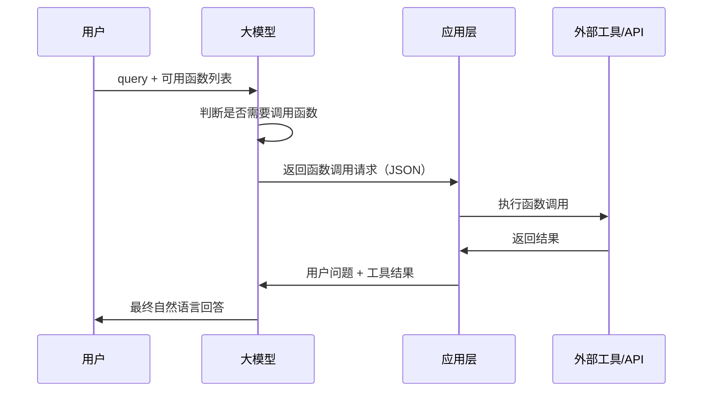

# 大模型 Function Calling（函数调用）

> **上位概念**: [[tool-use|大模型 Tool Use]]

## 一句话总结

**Function Calling** 让大模型能够根据用户请求，自动判断是否需要调用外部函数，并生成符合预定义 schema 的结构化调用参数。

---

## 核心流程



---

## 函数定义 Schema

```json
{
  "type": "function",
  "function": {
    "name": "get_weather",
    "description": "获取指定城市的天气",
    "parameters": {
      "type": "object",
      "properties": {
        "city": {
          "type": "string",
          "description": "城市名称"
        }
      },
      "required": ["city"]
    }
  }
}
```

---

## OpenAI 风格调用示例

```python
from openai import OpenAI

client = OpenAI()

tools = [
    {
        "type": "function",
        "function": {
            "name": "get_weather",
            "description": "获取指定城市的天气",
            "parameters": {
                "type": "object",
                "properties": {
                    "city": {"type": "string"}
                },
                "required": ["city"]
            }
        }
    }
]

response = client.chat.completions.create(
    model="gpt-4o",
    messages=[{"role": "user", "content": "北京今天天气怎么样？"}],
    tools=tools,
    tool_choice="auto"
)

# 如果模型决定调用函数
if response.choices[0].message.tool_calls:
    tool_call = response.choices[0].message.tool_calls[0]
    print(tool_call.function.name)  # get_weather
    print(tool_call.function.arguments)  # {"city": "北京"}
```

---

## 关键设计原则

| 原则 | 说明 |
|---|---|
| **函数描述清晰** | name 和 description 直接影响模型判断 |
| **参数明确** | 每个参数需有 type、description、enum 等约束 |
| **控制 tool_choice** | `auto` / `required` / `none` |
| **结果回传** | 函数执行结果需再次输入模型生成最终回答 |
| **错误处理** | 函数失败时模型应能优雅处理 |

---

## 与 ReAct 的关系

| 特性 | Function Calling | ReAct |
|---|---|---|
| **输出形式** | 结构化 JSON | 自然语言 Thought + Action |
| **模型支持** | 需要专用训练 | 可用通用模型 + prompt |
| **可解释性** | 中 | 高 |
| **灵活性** | 高（参数结构化）| 高（自然语言推理）|
| **常见组合** | 两者常结合使用 | 两者常结合使用 |

---

## 常见应用场景

- 天气查询、日历操作、邮件发送
- 数据库查询、知识库检索
- 代码执行、计算工具
- 智能家居控制
- 旅行预订、电商下单

---

## 挑战与最佳实践

| 挑战 | 最佳实践 |
|---|---|
| 模型选错函数 | 优化函数描述，限制同时提供的函数数量 |
| 参数错误 | 严格 schema，使用 enum 约束可选值 |
| 循环调用 | 设置最大调用次数和终止条件 |
| 安全问题 | 校验参数，避免 SQL 注入等攻击 |
| 延迟问题 | 异步调用，缓存常用结果 |

---

## 2026 多提供商对比

| 提供商 | API 风格 | 并行调用 | 流式支持 | 特点 |
|--------|----------|----------|----------|------|
| **OpenAI** | tools + tool_choice | ✅ | ✅ | 最成熟，生态最广 |
| **Anthropic** | tool_use content block | ✅ | ✅ | 与 MCP 深度集成 |
| **Google** | function_declarations | ✅ | ✅ | 与 Gemini 原生集成 |
| **Mistral** | tools (OpenAI 兼容) | ✅ | ✅ | 开源模型支持 |
| **本地模型** | Outlines/vLLM guided | 部分 | 部分 | 需额外工具支持 |

## MCP 与 Function Calling 的关系

| 维度 | Function Calling | MCP |
|------|-----------------|-----|
| **层次** | 模型层（生成调用参数） | 协议层（工具发现+执行） |
| **工具发现** | 手动定义 schema | 自动发现可用工具 |
| **跨框架** | 各提供商格式不同 | 统一协议标准 |
| **关系** | MCP 底层仍用 Function Calling | MCP 是 FC 的上层封装 |

## 生产最佳实践

1. **工具数量控制**: 同时提供不超过 15-20 个工具，超过则分组/分层
2. **参数校验**: 执行前用 JSON Schema 校验参数合法性
3. **超时设置**: 每个工具调用设置超时（默认 30s）
4. **重试策略**: 网络类工具失败可重试，业务类工具不重试
5. **审计日志**: 记录所有工具调用的输入输出，便于排查
6. **权限分级**: 读操作自动执行，写操作需确认
7. **结果截断**: 工具返回结果超过 4K token 时截断并提示

---

## 延伸阅读

- [[概念/tool-use|Tool Use]]
- [[概念/react-agent|ReAct Agent]]
- [[概念/agent-framework|Agent 框架]]
