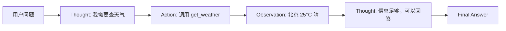

# ReAct 智能体（Reasoning + Acting）

> 中文简称：ReAct 智能体

## 一句话总结

**ReAct** 让 LLM 在解决问题时交替进行**推理（Reasoning）**和**行动（Acting）**，通过“思考 → 行动 → 观察”的循环完成复杂任务。

---

## 核心思想

传统 Chain-of-Thought 只让模型内部推理，ReAct 则将推理与外部行动结合：

```
Thought（思考）→ Action（行动）→ Observation（观察）→ Thought → ...
```

每一步推理都明确指导下一步行动，而行动结果又反馈给模型用于后续推理。

---

## 典型流程



---

## Prompt 模板示例

```text
You are a helpful assistant that can use tools to answer questions.

Available tools:
- search[query]: Search the web
- calculator[expression]: Calculate math expression
- get_weather[city]: Get weather of a city

Use the following format:
Question: the input question
Thought: your reasoning about what to do next
Action: the action to take, should be one of [search, calculator, get_weather]
Action Input: the input to the action
Observation: the result of the action
... (this Thought/Action/Action Input/Observation can repeat N times)
Thought: I now know the final answer
Final Answer: the final answer to the original question

Question: 2024 年诺贝尔奖物理学奖得主是谁？他现在的年龄是多少？
```

---

## 示例轨迹

```text
Question: 2024 年诺贝尔奖物理学奖得主是谁？他现在的年龄是多少？

Thought: 我需要先查找 2024 年诺贝尔物理学奖得主。
Action: search
Action Input: 2024 Nobel Prize in Physics winner
Observation: The 2024 Nobel Prize in Physics was awarded to John J. Hopfield and Geoffrey Hinton.

Thought: 现在需要查找 Geoffrey Hinton 的年龄。
Action: search
Action Input: Geoffrey Hinton age
Observation: Geoffrey Hinton was born on December 6, 1947.

Thought: 1947 年出生，2024 年年龄为 77 岁。
Final Answer: 2024 年诺贝尔物理学奖授予 John J. Hopfield 和 Geoffrey Hinton。Geoffrey Hinton 出生于 1947 年，2024 年时 77 岁。
```

---

## ReAct 的优势

| 优势 | 说明 |
|---|---|
| **可解释性** | 每一步推理和行动都显式可见 |
| **错误恢复** | 观察到错误后可以重新推理 |
| **知识增强** | 通过工具调用弥补模型知识不足 |
| **任务分解** | 将复杂问题分解为多个步骤 |

---

## ReAct 的局限

| 局限 | 说明 |
|---|---|
| **轮次多** | 复杂任务需要多次 LLM 调用 |
| **稳定性差** | 模型可能生成格式不一致的 Action |
| **延迟高** | 每步都需要等待工具返回 |
| **Prompt 设计关键** | 格式要求严格，需要精心设计 |

---

## 与 Function Calling 的结合

现代 Agent 框架通常结合两者：

- **ReAct** 负责高层推理规划和任务分解；
- **Function Calling** 负责将 Action 解析为结构化工具调用。

```python
# LangChain ReAct Agent 示例
from langchain.agents import create_react_agent, AgentExecutor
from langchain.tools import Tool
from langchain_openai import ChatOpenAI

llm = ChatOpenAI(model="gpt-4o")
tools = [
    Tool(name="search", func=search_func, description="搜索网络"),
    Tool(name="calculator", func=calc_func, description="计算")
]

agent = create_react_agent(llm, tools, prompt)
executor = AgentExecutor(agent=agent, tools=tools)
executor.invoke({"input": "2024 年诺贝尔物理学奖得主是谁？"})
```

---

## 代表框架

- **LangChain**：`create_react_agent`
- **AutoGPT**：早期 Agent 探索
- **BabyAGI**：任务规划与执行
- **LangGraph**：更复杂的 ReAct 工作流

---

## 2026 生态现状

| 类别 | 代表 | 说明 |
|------|------|------|
| **原生 Function Calling** | GPT-4o, Claude 4, Gemini 2.5 | 结构化输出替代文本解析，更稳定 |
| **推理模型** | o3, R1, QwQ | 内置推理链，减少显式 Thought 需求 |
| **图编排** | LangGraph, CrewAI Flow | 状态机替代纯文本 ReAct 循环 |
| **MCP 工具协议** | Anthropic MCP | 标准化工具接入，简化 Action 层 |
| **多模态 ReAct** | GPT-4o + 视觉工具 | 图像/视频理解 + 行动循环 |

## 生产最佳实践

1. **结构化输出优先**: 用 Function Calling 替代文本解析，避免格式错误
2. **设置最大轮次**: 防止无限循环，建议 max_iterations=10
3. **工具描述精确**: 每个工具的 description 直接影响模型选择准确率
4. **错误反馈**: 工具失败时将错误信息返回给模型，让其调整策略
5. **流式输出**: 生产环境用 streaming 降低用户感知延迟
6. **可观测性**: 记录每步 Thought/Action/Observation，便于调试
7. **成本控制**: 监控每次任务的总 token 消耗，设置预算上限

## ReAct vs 其他 Agent 范式

| 范式 | 核心机制 | 适用场景 | 与 ReAct 关系 |
|------|----------|----------|----------------|
| **CoT** | 纯内部推理 | 简单推理任务 | ReAct 的前身 |
| **ReAct** | 推理+行动循环 | 需要工具的任务 | 基础范式 |
| **Plan-and-Execute** | 先规划后执行 | 复杂多步任务 | 更结构化 |
| **Reflexion** | 多轮尝试+反思 | 需要试错的任务 | ReAct 的增强 |
| **图编排** | 状态机/工作流 | 生产级复杂流程 | ReAct 的工程化 |

## 延伸阅读

- [[概念/function-calling|Function Calling]]
- [[概念/tool-use|Tool Use]]
- [[概念/agent-framework|Agent 框架]]
- [[概念/agent-planning|Agent 规划]]
