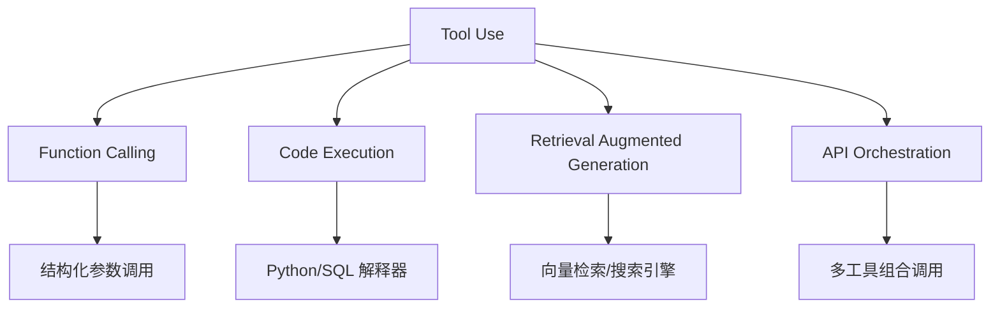
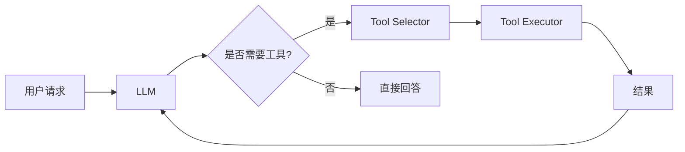

# 大模型 Tool Use（工具使用）

> 中文简称：大模型 Tool Use

## 一句话总结

**Tool Use** 让大模型能够调用外部工具（API、数据库、代码解释器等）来扩展自身能力，完成仅靠语言模型无法直接完成的任务。

---

## 为什么需要 Tool Use？

LLM 本身存在局限：

| 局限 | 工具解决方案 |
|---|---|
| **知识有时效性** | 搜索引擎、知识库检索 |
| **无法计算精确值** | 计算器、Python 解释器 |
| **无法访问私有数据** | 数据库查询、企业内部 API |
| **无法执行操作** | 邮件 API、日历 API、智能家居接口 |
| **可能产生幻觉** | 检索增强、事实核查工具 |

---

## Tool Use 的层次



---

## 主要形式

### 1. Function Calling

模型输出结构化 JSON 调用函数。参见 [[概念/function-calling|Function Calling]]。

### 2. 代码执行

让模型生成代码并由沙箱执行：

```python
code = model.generate("计算 123456789 * 987654321")
result = execute_in_sandbox(code)
```

代表：Code Interpreter、OpenAI Code Interpreter。

### 3. 检索增强（RAG）

```python
retrieved_docs = vector_search(query)
context = format(retrieved_docs)
answer = model.generate(query + context)
```

代表：LangChain、LlamaIndex。

### 4. API 编排

模型自主决定调用多个 API 的顺序和参数：

```
查询天气 → 查询景点 → 规划路线 → 预订酒店
```

---

## Tool Use 系统架构



---

## 设计要点

| 要点 | 说明 |
|---|---|
| **工具描述** | 清晰描述工具功能和参数 |
| **工具选择** | 避免同时提供过多工具，降低模型选择难度 |
| **错误处理** | 工具执行失败时提供有用的错误信息 |
| **结果长度控制** | 避免过长结果超出上下文限制 |
| **权限控制** | 限制工具可访问的资源和操作 |
| **审计日志** | 记录所有工具调用便于排查 |

---

## 主流工具框架

| 框架 | 特点 |
|---|---|
| **LangChain** | 工具链编排、Agent 框架 |
| **LlamaIndex** | 检索增强、数据连接器 |
| **MCP（Model Context Protocol）** | Anthropic 推出的工具标准协议 |
| **OpenAI Assistants API** | 内置 code interpreter、retrieval、function calling |
| **AutoGen** | 多 Agent 协作 |

---

## Tool Use vs Agent

| 特性 | Tool Use | Agent |
|---|---|---|
| **范围** | 调用外部工具的能力 | 更广泛的自主决策系统 |
| **自主性** | 中 | 高 |
| **规划能力** | 通常单次或简单链式 | 多步规划、反思、记忆 |
| **关系** | Agent 的核心组件之一 | 包含 Tool Use |

---

## 2026 年 Tool Use 生态

| 类别 | 代表 | 特点 |
|------|------|------|
| **协议标准** | MCP, OpenAI Function Calling | 标准化工具接入 |
| **代码执行** | E2B, Daytona, Code Interpreter | 沙箱隔离 |
| **搜索工具** | Tavily, Exa, Serper | AI 优化搜索 |
| **数据库** | NL2SQL, Text2SQL | 自然语言查询 |
| **多模态** | Vision Tools, Audio Tools | 图像/音频处理 |
| **企业集成** | Slack, GitHub, Jira MCP Servers | 工作流自动化 |

## 生产最佳实践

1. **工具描述精确**：清晰的 description 和参数说明提升调用准确率
2. **限制工具数量**：每个 Agent ≤ 5-7 个工具，太多会降低选择准确率
3. **沙箱执行**：代码执行工具必须在隔离环境中运行
4. **错误处理**：工具失败时返回有意义的错误信息，而非抛异常
5. **结果截断**：长结果自动截断 + 摘要，避免超出上下文
6. **权限最小化**：工具只给最小必要权限
7. **审计日志**：记录所有工具调用，便于排查和合规

## 安全考虑

| 风险 | 缓解措施 |
|------|----------|
| **注入攻击** | 参数 Schema 校验、输入过滤 |
| **越权操作** | RBAC 权限控制、操作审批 |
| **数据泄露** | 结果过滤、敏感信息脱敏 |
| **资源耗尽** | 超时限制、速率限制 |
| **供应链攻击** | 工具来源验证、签名校验 |

## MCP 工具示例

```python
from langchain_mcp_adapters import load_mcp_tools

# 加载 GitHub MCP 服务器
tools = load_mcp_tools(
    server_params={
        "command": "npx",
        "args": ["-y", "@modelcontextprotocol/server-github"],
        "env": {"GITHUB_TOKEN": "..."}
    }
)

# Agent 使用 MCP 工具
for tool in tools:
    print(f"{tool.name}: {tool.description}")
# create_issue: Create a new GitHub issue
# search_repositories: Search GitHub repositories
# ...

---

## 延伸阅读

- [[概念/function-calling|Function Calling]]
- [[概念/react-agent|ReAct Agent]]
- [[概念/agent-framework|Agent 框架]]
- [[概念/multimodal-llm|多模态 LLM]]
