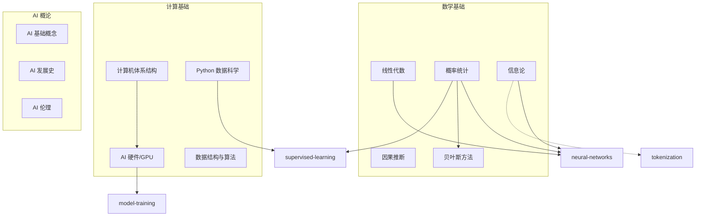
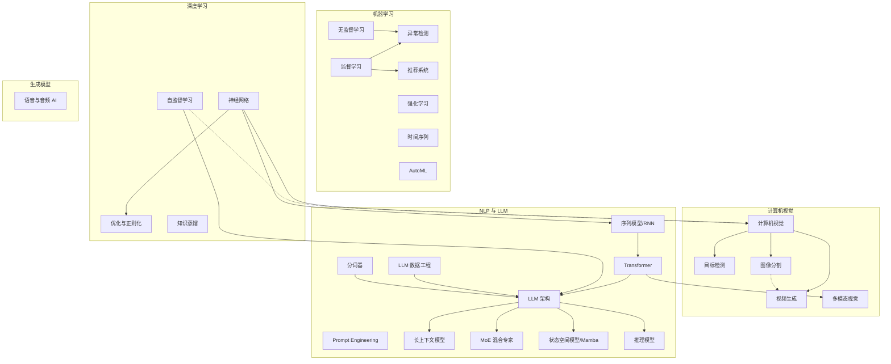
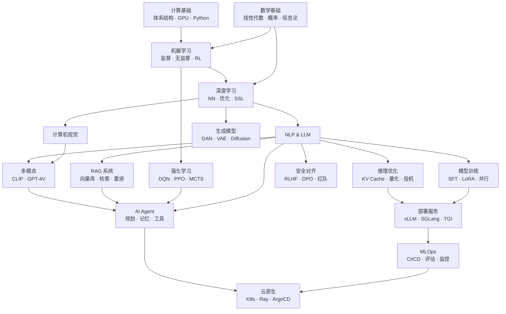

# 概念间依赖关系图谱 — AI 知识体系的拓扑结构

> **一句话理解**: AI 知识不是扁平的——有些概念是"地基"(如线性代数、概率统计)，有些是"楼房"(如 Transformer)，有些是"装修"(如 Prompt Engineering)。本图帮你理清"先学什么、后学什么"。

---

## 阅读指南

- **箭头方向** = 依赖关系 (A → B 表示"学 B 之前最好先理解 A")
- **虚线** = 弱依赖或启发式关联
- **节点层级**: L1(基础) → L2(核心算法) → L3(工程实践) → L4(前沿方向)

---

## 1. 理论基础层 (L1: Foundation)



---

## 2. 核心算法层 (L2: Core Algorithms)



---

## 3. 工程实践层 (L3: Engineering)

```mermaid
graph TB
    subgraph "模型训练"
        model-training[模型训练]
        pretrain-vs-finetune-vs-rag[预训练 vs 微调 vs RAG]
        sft[监督微调 SFT]
        lora-peft[LoRA/参数高效微调]
        mixed-precision[混合精度训练]
        tensor-parallelism[张量并行]
        pipeline-parallelism[流水线并行]
        megatron-lm[Megatron-LM]
        checkpoint[检查点]
    end

    subgraph "推理优化"
        model-inference[模型推理]
        kv-cache[KV Cache]
        paged-attention[PagedAttention]
        speculative-decoding[投机解码]
        quantization[量化]
        model-compression[模型压缩]
        continuous-batching[连续批处理]
        prefill-decode[Prefill-Decode 分离]
    end

    subgraph "部署与服务"
        model-deployment[模型部署]
        model-serving[模型服务]
        vllm[vLLM]
        sglang[SGLang]
        tensorrt-llm[TensorRT-LLM]
        llama-cpp[llama.cpp]
        lmdeploy[LMDeploy]
        model-gateway[模型网关]
        inference-autoscaling[推理自动扩缩]
    end

    subgraph "RAG 系统"
        rag-systems[RAG 系统]
        vector-database[向量数据库]
        rag-patterns[RAG 模式]
        agentic-rag[Agentic RAG]
        milvus[Milvus]
        chroma[Chroma]
        qdrant[Qdrant]
        weaviate[Weaviate]
    end

    subgraph "MLOps"
        mlops[MLOps]
        ci-cd[CI/CD]
        model-registry[模型注册]
        model-evaluation[模型评估]
        online-evaluation[在线评估]
        observability[可观测性]
    end

    model-training --> mixed-precision
    model-training --> tensor-parallelism
    model-training --> pipeline-parallelism
    model-training --> checkpoint
    model-training --> sft
    sft --> lora-peft
    tensor-parallelism --> megatron-lm

    llm-architectures --> model-inference
    model-inference --> kv-cache
    kv-cache --> paged-attention
    kv-cache --> speculative-decoding
    model-inference --> quantization
    model-inference --> continuous-batching
    model-inference --> prefill-decode
    quantization --> model-compression

    model-inference --> model-deployment
    model-deployment --> model-serving
    model-serving --> vllm
    model-serving --> sglang
    model-serving --> tensorrt-llm
    model-serving --> llama-cpp
    model-serving --> lmdeploy
    model-serving --> model-gateway
    model-gateway --> inference-autoscaling

    llm-architectures --> rag-systems
    rag-systems --> vector-database
    rag-systems --> rag-patterns
    rag-patterns --> agentic-rag
    vector-database --> milvus
    vector-database --> chroma
    vector-database --> qdrant
    vector-database --> weaviate

    model-training --> mlops
    mlops --> ci-cd
    mlops --> model-registry
    mlops --> model-evaluation
    model-evaluation --> online-evaluation
    mlops --> observability
```



---

## 4. 前沿方向层 (L4: Frontier)

```mermaid
graph TB
    subgraph "Agent 与规划"
        ai-agents[AI Agent]
        agent-loop[Agent 循环]
        agent-planning[Agent 规划]
        agent-memory-systems[Agent 记忆系统]
        agent-reflection[Agent 反思]
        agent-harness[Agent 评测框架]
        agent-framework[Agent 框架]
        multi-agent[多 Agent 系统]
        multi-agent-orchestration[多 Agent 编排]
        tool-calling[工具调用]
        mcp[MCP 协议]
        a2a-protocol[A2A 协议]
        cot-react-reasoning-prompt[CoT/ReAct 推理]
        context-engineering[上下文工程]
    end

    subgraph "安全与对齐"
        llm-safety[LLM 安全]
        rlhf[RLHF]
        preference-learning[偏好学习/DPO]
        red-teaming[红队测试]
        prompt-injection[Prompt 注入]
        tool-calling-safety[工具调用安全]
    end

    subgraph "AI 应用"
        ai-for-science[AI for Science]
        protein-folding[蛋白质折叠]
        code-generation[代码生成]
        ai-coding-paradigms[AI 编程范式]
        text2sql[Text2SQL]
    end

    subgraph "云原生与基础设施"
        kubernetes[Kubernetes]
        helm[Helm]
        kustomize[Kustomize]
        argocd[ArgoCD]
        ray[Ray]
        kubeflow[Kubeflow]
    end

    ai-agents --> agent-loop
    agent-loop --> agent-planning
    agent-loop --> agent-memory-systems
    agent-loop --> agent-reflection
    agent-loop --> tool-calling
    tool-calling --> mcp
    tool-calling --> a2a-protocol
    ai-agents --> agent-harness
    ai-agents --> agent-framework
    ai-agents --> multi-agent
    multi-agent --> multi-agent-orchestration

    reasoning-models --> cot-react-reasoning-prompt
    cot-react-reasoning-prompt --> agent-planning
    context-engineering --> agent-planning

    llm-architectures --> rlhf
    rlhf --> preference-learning
    llm-safety --> red-teaming
    llm-safety --> prompt-injection
    tool-calling --> tool-calling-safety
    model-evaluation --> agent-harness

    ai-fundamentals --> ai-for-science
    ai-for-science --> protein-folding
    llm-architectures --> code-generation
    code-generation --> ai-coding-paradigms
    llm-architectures --> text2sql

    model-serving --> kubernetes
    kubernetes --> helm
    kubernetes --> kustomize
    mlops --> argocd
    mlops --> kubeflow
    model-serving --> ray
```



---

## 5. 完整知识拓扑 (简化全局图)



---

## 6. 学习路径推荐

### 6.1 算法工程师路径

```
L1 数学基础
  → L2a 机器学习 (监督/无监督)
    → L2b 深度学习 (NN/优化/SSL)
      → NLP & LLM (Transformer/架构)
        → 模型训练 (SFT/LoRA/并行)
          → 推理优化 (KV Cache/量化)
            → 部署服务 (vLLM/SGLang)
```

### 6.2 AI Agent 开发者路径

```
L1 数学基础
  → L2b 深度学习
    → NLP & LLM
      → RAG 系统
        → AI Agent (规划/记忆/工具)
          → Agent 框架 (LangChain/AutoGen)
            → 安全 (Prompt注入/工具安全)
```

### 6.3 MLOps 工程师路径

```
L1 计算基础
  → L2a 机器学习
    → 模型训练
      → MLOps (CI/CD/评估/监控)
        → 云原生 (K8s/Ray/Helm)
          → 部署服务 (vLLM/自动扩缩)
```

### 6.4 AI 研究员路径

```
L1 数学基础 (深度)
  → L2a 机器学习 (理论)
    → L2b 深度学习 (SSL/贝叶斯/因果)
      → NLP/LLM (架构/MoE/状态空间)
        → 推理模型 (CoT/ToT/搜索)
          → 安全对齐 (RLHF/DPO)
```

---

## 7. 概念统计

| 层级 | 概念数量 | 关键节点 |
|------|---------|---------|
| L1 理论基础 | ~15 | 线性代数, 概率统计, AI 基础 |
| L2 核心算法 | ~40 | Transformer, 神经网络, 监督学习 |
| L3 工程实践 | ~80 | 模型推理, vLLM, RAG, MLOps |
| L4 前沿方向 | ~60 | AI Agent, RLHF, MCP, 代码生成 |
| 基础设施 | ~50 | Kubernetes, Ray, Helm, ArgoCD |

**总计: ~245 个概念卡片**, 依赖关系 ~200 条。

---

*Last updated: 2026-06-04*

## Related

- [[概念/README|概念卡片索引]] — 所有概念卡片列表
- [[90_学习/concepts/stage0_awakening|学习路径 Stage 0-4]] — 按阶段的学习路径
- [[20_论文精读/README|论文清单]] — 论文与概念的关联
- [[94_可视化/Knowledge_Graph_Visualization|知识图谱可视化]] — 图谱可视化工具与实践
