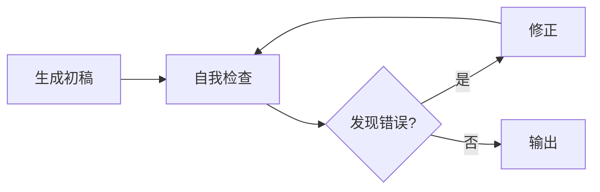

# Test-Time Compute（测试时计算）

> 中文简称：测试时计算

## 一句话总结

**Test-Time Compute** 是在推理阶段通过增加计算（更多思考步骤、多次采样、验证修正）来提升模型性能的技术方向。

---

## 背景：两条 Scaling Law

传统大模型能力提升主要依赖：

1. **预训练 Scaling Law**：更多数据、更多参数、更多算力；
2. **Test-Time Compute**：固定模型，在推理时投入更多计算。

OpenAI 的 o1/o3 和 DeepSeek-R1 证明：**后者可以在不增加模型参数的情况下显著提升推理能力**。

---

## 主要方法

### 1. 延长思考链（Longer Chain-of-Thought）

让模型在回答前进行更多内部推理：

```
Question → Think step by step → ... → Final Answer
```

- 强制模型输出完整推理过程；
- 使用 `<think>...</think>` 等特殊 token 区分；
- 代表：o1、DeepSeek-R1。

### 2. 采样更多候选（Best-of-N）

生成 N 个候选答案，选择最优：

```
Answers = {a_1, a_2, ..., a_N}
Final = argmax Reward(a_i)
```

- 需要奖励模型或验证器；
- 计算成本随 N 线性增长。

### 3. 自我修正（Self-Correction）

模型生成答案后，再次检查并修正：



### 4. 树搜索（Tree Search）

将推理建模为树搜索：

- **Monte Carlo Tree Search（MCTS）**：评估多条推理路径；
- **Process Reward Model（PRM）**：对每个推理步骤打分；
- **Beam Search over Reasoning**：保留 top-k 推理路径。

---

## Test-Time Compute vs 训练时计算

| 维度 | 训练时计算 | Test-Time Compute |
|---|---|---|
| **投入阶段** | 训练 | 推理 |
| **模型参数** | 可变 | 固定 |
| **适用场景** | 通用能力提升 | 复杂推理任务 |
| **成本模式** | 一次性高成本 | 每次请求可变成本 |
| **代表技术** | 预训练、SFT、RLHF | o1、R1、MCTS、PRM |

---

## 代价与权衡

| 优势 | 代价 |
|---|---|
| 不增加模型大小 | 推理延迟显著增加 |
| 可针对问题动态调整 | 需要更复杂的推理基础设施 |
| 在数学/代码任务上效果显著 | 简单任务可能过度思考 |

---

## 代表模型

| 模型 | 机制 |
|---|---|
| **OpenAI o1/o3** | 内部长思考链 + RL |
| **DeepSeek-R1** | GRPO + 长推理链 |
| **QwQ** | 阿里推理模型 |
| **Kimi k1.5** | 长上下文 + Test-Time 推理 |

---

## 实践建议

1. **复杂任务使用**：数学、代码、逻辑推理；
2. **延迟敏感场景慎用**：客服、实时对话；
3. **结合预算控制**：设置最大 thinking token 数；
4. **需要评估 ROI**：对比训练和推理投入的成本效益。

---

## 延伸阅读

- [[概念/deepseek-series|DeepSeek 系列]]
- [[概念/grpo|GRPO]]
- [[概念/reasoning-models|推理模型]]
- [[概念/decoding-strategies|解码策略]]

---

## 2026 Test-Time Compute 生态

| 特性/工具 | 说明 | 状态 |
|------|------|------|
| **Chain-of-Thought** | 多步推理链提升复杂任务准确率 | GA |
| **Best-of-N 采样** | 多次采样取最优结果 | GA |
| **推理模型 (o1/R1)** | 内置长思维链的专用推理模型 | GA |
| **自适应计算** | 根据问题难度动态分配推理 token | 研究 |
| **MCTS + LLM** | 蒙特卡洛树搜索结合 LLM 评估 | 研究 |

## 生产最佳实践

1. **成本平衡**：Test-Time Compute 提升质量但增加延迟和成本，根据场景权衡
2. **难度分级**：简单问题直接回答，复杂问题才启用多步推理
3. **超时控制**：设置推理 token 上限，避免无限思考
4. **缓存复用**：相似问题的推理结果可缓存复用
5. **评估验证**：用独立评估器验证推理结果正确性

## 测试时计算策略对比

| 策略 | 计算增加 | 质量提升 | 延迟影响 | 适用场景 |
|------|----------|----------|----------|----------|
| CoT 推理 | 2-5x | 中-高 | 中 | 数学/逻辑 |
| Self-Consistency | 5-20x | 高 | 高 | 精确答案 |
| Tree of Thought | 10-50x | 高 | 极高 | 复杂规划 |
| Best-of-N | N x | 中 | 中 | 代码生成 |
| 迭代精化 | 2-3x | 中 | 中 | 写作/翻译 |
| 验证器引导 | 3-10x | 高 | 高 | 数学证明 |

## 常见问题

| 问题 | 原因 | 解决方案 |
|------|------|----------|
| 延迟不可接受 | 采样次数过多 | 动态调整 N + 早停 |
| 成本飙升 | 无限制推理 | 设置 token 预算上限 |
| 质量未提升 | 任务不适合 | 评估任务复杂度再决定 |
| 结果不一致 | 采样随机性 | 固定 seed + 多数投票 |

## 生产检查清单

1. ✅ 评估任务是否适合测试时计算
2. ✅ 设置 token/时间预算上限
3. ✅ 动态调整计算量（简单题少算，难题多算）
4. ✅ 使用验证器过滤低质量输出
5. ✅ 监控测试时计算的 ROI（质量提升/成本）
6. ✅ 缓存相似问题的推理结果

## 总结

测试时计算是 2026 年提升模型能力的重要范式，通过在推理阶段投入更多计算资源换取更高质量的输出。其核心是“用计算换智能”，但需要在质量、延迟和成本之间找到最优平衡。

> 💡 测试时计算的核心洞察：“不是所有问题都需要同样多的思考”——简单问题快速回答，复杂问题深度推理。
