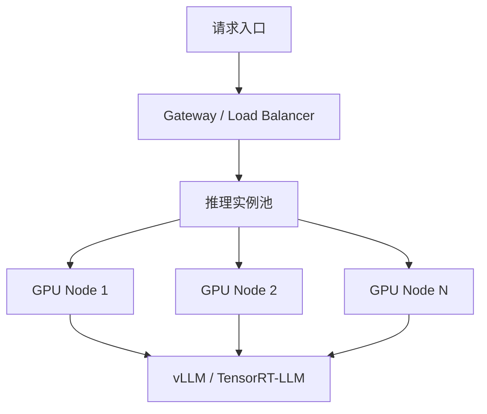
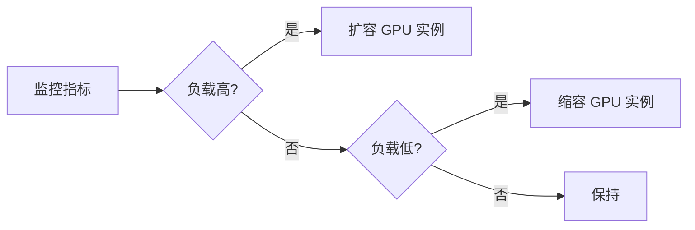

# LLM 推理集群调度

> 中文简称：LLM 推理集群调度

## 一句话总结

**LLM 推理集群调度**负责将推理请求合理分配到 GPU 资源上，在延迟、吞吐、成本之间取得平衡。

---

## 调度目标

| 目标 | 说明 |
|---|---|
| **低延迟** | 满足 TTFT、TPOT SLA |
| **高吞吐** | 单位时间处理更多请求 |
| **高利用率** | GPU 计算和显存充分利用 |
| **低成本** | 按需使用 cheaper GPU 或 spot 实例 |
| **高可用** | 故障自动切换、负载均衡 |

---

## 调度层级



---

## 关键调度策略

### 1. 负载均衡

| 策略 | 说明 |
|---|---|
| **Round Robin** | 轮询，简单但不考虑负载 |
| **Least Connections** | 选择当前连接数最少的实例 |
| **Least GPU Utilization** | 选择 GPU 利用率最低的实例 |
| **Prompt-based Routing** | 按 prompt 长度路由到不同实例 |

### 2. 自动扩缩容



- 扩容触发：队列长度、P99 延迟、GPU 利用率；
- 缩容触发：持续低负载、空闲时间。

### 3. 请求合并（Batching）

- **Static Batching**：固定 batch size；
- **Continuous Batching**：动态加入新请求（vLLM 原生支持）；
- **Speculative Batching**：结合推测解码。

### 4. 异构 GPU 调度

| GPU 类型 | 适用场景 |
|---|---|
| **H100 / A100** | 大模型、高吞吐 |
| **L40S / A10** | 中小模型、低成本 |
| **T4** | 小模型、低延迟简单任务 |

---

## 常用工具

| 工具 | 用途 |
|---|---|
| **Kubernetes + GPU Operator** | GPU 集群管理和调度 |
| **Knative / KServe** | 模型服务自动扩缩容 |
| **NVIDIA Triton** | 多模型推理服务 |
| **vLLM + Ray Serve** | 分布式推理服务 |
| **BentoML / Seldon** | MLOps 推理平台 |

---

## 常见挑战

| 挑战 | 解决思路 |
|---|---|
| **长 prompt 拖慢整体延迟** | Prefill-Decode 分离 |
| **显存碎片** | PagedAttention、动态显存管理 |
| **冷启动** | 预加载模型、keep-alive 实例 |
| **多模型混部** | 按模型大小和流量分配节点 |
| **故障恢复** | 多副本、健康检查、快速重试 |

---

## 延伸阅读

- [[概念/Inference/model-serving|模型服务]]
- [[概念/Inference/request-scheduling|请求调度]]
- [[概念/Inference/inference-autoscaling|推理自动扩缩容]]
- [[概念/Inference/ttft|TTFT]]
- [[概念/LLM/llm-production-deployment|LLM 生产部署]]
- [[10_部署推理/02_Inference_Engines/vLLM_Deep_Dive|vLLM 深度解析]]

## 集群调度架构全景

```
用户请求 → API Gateway → 负载均衡器 → 推理集群
                                         ├── GPU Node 1 (vLLM)
                                         ├── GPU Node 2 (vLLM)
                                         ├── GPU Node 3 (SGLang)
                                         └── GPU Node N (...)

调度层级:
├── L1: 全局路由 (模型/优先级/成本)
├── L2: 实例选择 (负载均衡/亲和性)
└── L3: 请求调度 (Continuous Batching)
```

## 调度策略对比

| 策略 | 说明 | 适用场景 |
|------|------|----------|
| **Round Robin** | 轮询分配 | 简单场景 |
| **Least Connections** | 最少连接优先 | 长请求混合 |
| **GPU Utilization** | 按 GPU 利用率 | 资源紧张 |
| **Priority Queue** | 优先级队列 | SLA 分级 |
| **Affinity** | 前缀亲和性 | 前缀缓存 |
| **Cost-aware** | 成本感知路由 | 多模型混合 |

## 生产最佳实践

1. **健康检查必配**：每个实例配置健康检查，异常自动摘除
2. **优雅下线**：实例下线前等待当前请求完成
3. **多副本高可用**：每个模型至少 2 个副本
4. **监控队列深度**：队列积压时触发扩容
5. **前缀亲和**：相同 System Prompt 路由到同一实例，提高缓存命中

## 2026 集群调度生态

| 调度器/平台 | 特点 | 适用场景 | 状态 |
|------------|------|----------|------|
| **vLLM + K8s** | 原生 K8s 部署，HPA 扩缩 | 通用生产 | GA |
| **Ray Serve** | 分布式计算框架，多模型编排 | 复杂 pipeline | GA |
| **KServe** | K8s AI 服务网格，模型管理 | 企业级 | GA |
| **SGLang Router** | 前缀感知路由，缓存亲和 | 高并发 | GA |
| **BentoML** | 模型打包 + 服务化一体 | 快速部署 | GA |

## K8s 调度配置示例

```yaml
apiVersion: autoscaling/v2
kind: HorizontalPodAutoscaler
metadata:
  name: llm-inference-hpa
spec:
  scaleTargetRef:
    apiVersion: apps/v1
    kind: Deployment
    name: vllm-inference
  minReplicas: 2
  maxReplicas: 10
  metrics:
  - type: Pods
    pods:
      metric:
        name: vllm_num_requests_waiting
      target:
        type: AverageValue
        averageValue: "5"
```

## 延伸阅读

- [[概念/Inference/inference-autoscaling|扩缩容]] — 弹性伸缩策略
- [[概念/Inference/request-scheduling|请求调度]] — 单实例调度
- [[概念/Inference/model-serving|模型服务]] — 服务架构
- [[概念/K8s/kubernetes|Kubernetes]] — 容器编排基础

> ℹ️ 集群调度是大规模推理的核心，合理的调度策略可提升 30-50% 资源利用率。
