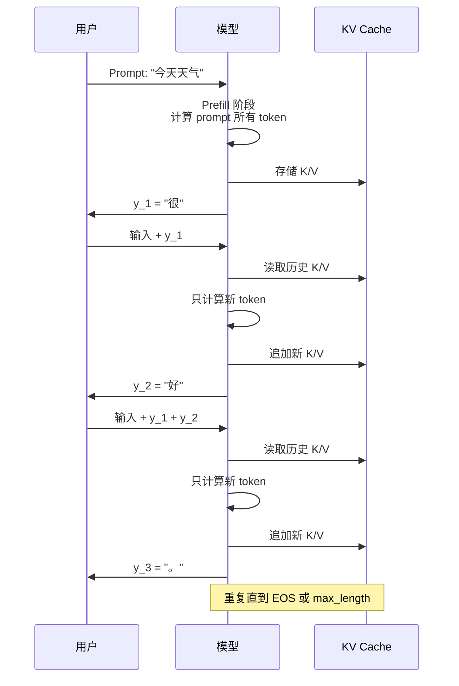

# 自回归生成（Autoregressive Generation）

## 一句话总结

自回归生成每次只生成一个 token，然后将已生成的 token 拼回输入，继续生成下一个 token，直到满足停止条件。

---

## 数学形式

给定输入 prompt `x = (x_1, ..., x_m)`，模型按条件概率逐个生成输出 token：

```
y_1 ~ P(y_1 | x)
y_2 ~ P(y_2 | x, y_1)
y_3 ~ P(y_3 | x, y_1, y_2)
...
y_t ~ P(y_t | x, y_1, ..., y_{t-1})
```

最终输出序列为 `y = (y_1, ..., y_T)`。

---

## 与训练时的对比

| 维度 | 训练 | 推理（自回归生成）|
|---|---|---|
| 输入 | 完整序列 | prompt + 已生成 token |
| 目标 token | 每个位置都有 | 每次只预测下一个 |
| 计算方式 | 一次性并行前向 | 多次前向传播 |
|  mask | Causal Mask | 天然因果，只利用历史 |
| 主要优化 | 并行、通信 | KV Cache、批处理、量化 |

### 自回归生成过程图示



---

## 完整生成流程

```python
def autoregressive_generate(model, tokenizer, prompt, max_new_tokens):
    input_ids = tokenizer.encode(prompt)
    
    for _ in range(max_new_tokens):
        # 前向传播，得到 logits
        logits = model(input_ids)
        
        # 取最后一个位置的分布
        next_token_logits = logits[:, -1, :]
        
        # 用解码策略选择下一个 token
        next_token_id = decode(next_token_logits, strategy="top_p", temperature=0.7)
        
        # 拼回输入
        input_ids.append(next_token_id)
        
        # 结束条件
        if next_token_id == tokenizer.eos_token_id:
            break
    
    return tokenizer.decode(input_ids)
```

### Hugging Face 实际使用

```python
from transformers import AutoModelForCausalLM, AutoTokenizer

model = AutoModelForCausalLM.from_pretrained("gpt2")
tokenizer = AutoTokenizer.from_pretrained("gpt2")

prompt = "The future of AI is"
inputs = tokenizer(prompt, return_tensors="pt")

# 使用 generate 接口（内部已优化 KV Cache）
output = model.generate(
    **inputs,
    max_new_tokens=50,
    do_sample=True,
    temperature=0.8,
    top_p=0.95,
    pad_token_id=tokenizer.eos_token_id
)

print(tokenizer.decode(output[0], skip_special_tokens=True))
```

### 手动实现（便于理解）

```python
import torch
from transformers import AutoModelForCausalLM, AutoTokenizer

model = AutoModelForCausalLM.from_pretrained("gpt2")
tokenizer = AutoTokenizer.from_pretrained("gpt2")

prompt = "The future of AI is"
input_ids = tokenizer.encode(prompt, return_tensors="pt")

with torch.no_grad():
    for _ in range(50):
        outputs = model(input_ids)
        next_token_logits = outputs.logits[:, -1, :]
        
        # 应用 temperature
        next_token_logits = next_token_logits / 0.8
        
        # 采样
        probs = torch.softmax(next_token_logits, dim=-1)
        next_token = torch.multinomial(probs, num_samples=1)
        
        input_ids = torch.cat([input_ids, next_token], dim=-1)
        
        if next_token.item() == tokenizer.eos_token_id:
            break

print(tokenizer.decode(input_ids[0], skip_special_tokens=True))
```

---

## 停止条件

| 停止条件 | 说明 |
|---|---|
| **EOS token** | 生成结束符 `<endoftext>`、`<im_end>` 等 |
| **最大长度** | 达到 `max_new_tokens` 或 `max_length` |
| **停止词** | 遇到特定字符串或 token（如 `\n\nHuman:`）|
| **自定义条件** | 完成结构化格式、达到特定 token 数等 |

---

## 计算复杂度

不考虑 KV Cache 时，生成长度为 `T` 的序列：

```
时间复杂度：O(T^2 × d)
空间复杂度：O(T × d)
```

其中 `d` 是模型维度。这是因为第 `t` 步需要计算与之前所有 `t-1` 个 token 的注意力。

使用 KV Cache 后：

```
时间复杂度：O(T × d^2) 每步
总体：O(T^2 × d)（但常数显著降低）
空间复杂度：O(T × d)（缓存 K/V）
```

---

## 为什么训练不这样？

训练时如果使用自回归逐 token 生成，速度会极慢。因此训练时采用**教师强制（Teacher Forcing）**：

- 一次性输入完整序列；
- 用 Causal Mask 让每个位置只能看到前面的 token；
- 同时计算所有位置的损失。

这样可以将整个序列的损失并行计算，大幅提升训练效率。

---

## 主要优化方向

| 优化 | 作用 |
|---|---|
| **KV Cache** | 缓存历史 K/V，避免重复计算 |
| **PagedAttention** | 更高效管理 KV Cache 内存 |
| **Continuous Batching** | 动态组 batch，提高吞吐 |
| **Speculative Decoding** | 小模型生成候选，大模型验证 |
| **量化** | 降低 KV Cache 和权重的显存占用 |

---

## 自回归的替代方案

| 方法 | 说明 |
|---|---|
| **非自回归生成（NAT）** | 一次性并行生成整个序列，速度快但质量通常较低 |
| **半自回归生成** | 先生成部分 token，再迭代细化 |
| **扩散模型** | 通过去噪过程生成文本，如 AR-Diffusion |

目前主流 LLM 仍主要采用自回归生成。

---

## 延伸阅读

- [[概念/next-token-prediction|下一个 Token 预测]]
- [[概念/causal-mask|因果掩码]]
- [[概念/kv-cache|KV Cache]]
- [[概念/decoding-strategies|解码策略]]
- [[概念/model-inference|模型推理]]
- [[概念/transformer-architecture|Transformer 架构]]
- [[概念/paged-attention|PagedAttention]]
- [[概念/speculative-decoding|推测解码]]
