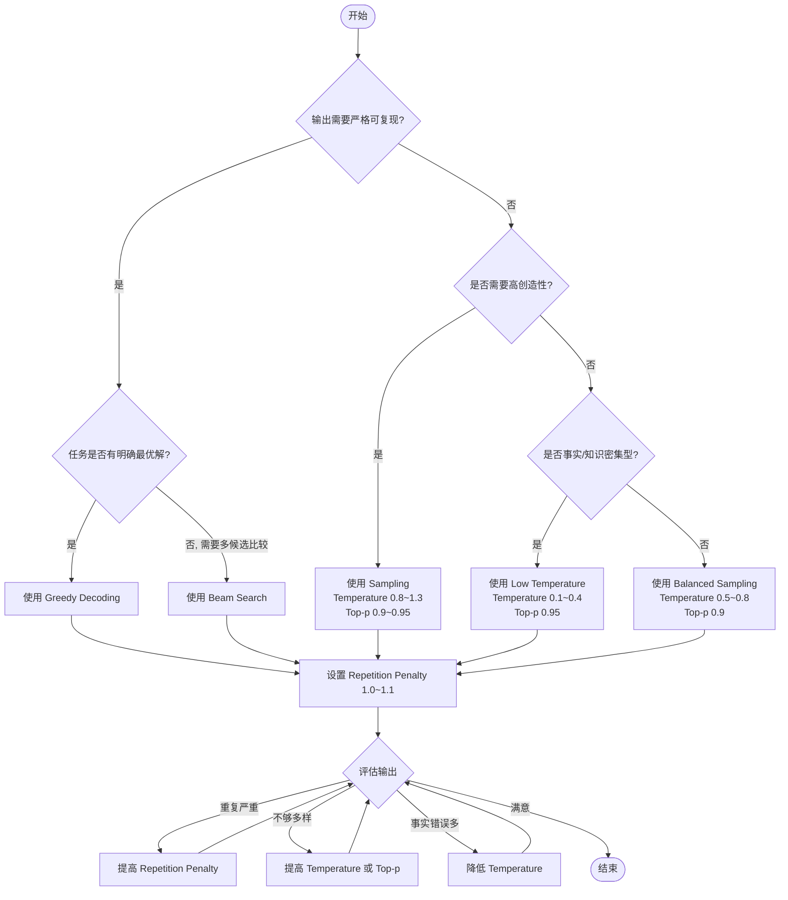

# 解码策略选择决策树

> 中文简称：解码策略选择决策树

## 一句话总结

根据**任务类型**、**确定性要求**和**多样性需求**，选择最合适的解码策略与参数组合。

---

## 快速决策流程



---

## 按任务类型速查

| 任务 | 推荐策略 | 推荐参数 | 原因 |
|---|---|---|---|
| **代码生成** | Greedy 或 Low Temperature | `T=0.1~0.3`, `top_p=0.95` | 语法精确、可复现 |
| **数学推理** | Greedy | `T=0.0~0.2` | 追求唯一正确答案 |
| **知识问答** | Low Temperature + Top-p | `T=0.1~0.5`, `top_p=0.95` | 平衡准确性与自然度 |
| **文本摘要** | Beam Search 或 Low Temperature | `T=0.3~0.7`, `beam=4` | 忠实原文 |
| **机器翻译** | Beam Search | `beam=4~10` | 全局最优译文 |
| **对话聊天** | Medium Temperature | `T=0.6~0.9`, `top_p=0.9` | 自然流畅 |
| **创意写作** | High Temperature | `T=0.8~1.2`, `top_p=0.9` | 鼓励多样性 |
| **头脑风暴** | High Temperature | `T=1.0~1.3`, `top_p=0.95` | 最大化创造性 |
| **JSON/SQL 生成** | Greedy 或 Low Temperature | `T=0.0~0.3` | 格式严格 |

---

## 参数调节口诀

| 现象 | 调节方向 |
|---|---|
| 输出重复、单调 | 提高 `repetition_penalty`，或改用采样 |
| 输出不连贯、跑题 | 降低 `temperature`，或降低 `top_p` |
| 输出过于保守 | 提高 `temperature`，或提高 `top_p` |
| 出现幻觉/事实错误 | 降低 `temperature`，使用 Greedy |
| 同 prompt 输出不稳定 | 固定 `seed`，或使用 Greedy |
| 生成长文本后重复 | 提高 `frequency_penalty` 或 `presence_penalty` |

---

## 常见组合模板

### 模板 1：确定性输出

```python
model.generate(
    **inputs,
    do_sample=False,  # 或 temperature=0.0
    max_new_tokens=512,
    repetition_penalty=1.05
)
```

### 模板 2：平衡采样

```python
model.generate(
    **inputs,
    do_sample=True,
    temperature=0.7,
    top_p=0.9,
    top_k=50,
    repetition_penalty=1.1
)
```

### 模板 3：创意采样

```python
model.generate(
    **inputs,
    do_sample=True,
    temperature=1.0,
    top_p=0.95,
    top_k=100,
    repetition_penalty=1.15
)
```

---

## 延伸阅读

- [[概念/decoding-strategies|解码策略总览]]
- [[概念/greedy-decoding|贪心解码]]
- [[概念/beam-search|束搜索]]
- [[概念/temperature-scaling|温度缩放]]
- [[概念/top-p-sampling|Top-p 采样]]
- [[概念/top-k-sampling|Top-k 采样]]
- [[概念/repetition-penalty|重复惩罚]]

---

## 2026 解码策略生态

| 特性/工具 | 说明 | 状态 |
|------|------|------|
| **Speculative Decoding** | Draft-Verify 加速 2-3x | GA |
| **Structured Output** | JSON Schema/正则约束解码 | GA |
| **Grammar-Constrained** | 语法约束解码，保证格式正确 | GA |
| **Parallel Decoding** | 并行解码多个位置 | 研究 |
| **动态策略选择** | 根据任务自动选择解码策略 | 研究 |

## 生产最佳实践

1. **任务匹配策略**：事实任务用贪心/低温，创意任务用高温 + Top-p
2. **结构化输出必用**：API 场景必须用 JSON Schema 约束输出
3. **投机解码加速**：高并发场景启用 Speculative Decoding
4. **重复惩罚必配**：设置 repetition_penalty=1.05-1.2
5. **A/B 测试**：不同解码策略进行 A/B 测试，找到最优配置
6. **监控输出质量**：跟踪输出长度、重复率、用户满意度
7. **回滚预案**：解码策略变更后保留回滚能力

## 解码策略选择指南

| 任务类型 | 推荐策略 | 参数建议 |
|----------|----------|----------|
| 事实问答 | 贪心/低温 | temperature=0.1-0.3 |
| 代码生成 | 低温 + Top-p | temperature=0.2, p=0.95 |
| 创意写作 | 高温 + Top-p | temperature=0.8-1.0, p=0.9 |
| 翻译/摘要 | Beam Search | beam_size=4-8 |
| 对话 | Top-p + 重复惩罚 | p=0.9, repetition_penalty=1.1 |
| 结构化输出 | 约束解码 | JSON Schema/正则 |

## 延伸阅读

- [[概念/LLM/greedy-decoding|贪婪解码]]
- [[概念/LLM/sampling-decoding|采样解码]]
- [[概念/LLM/beam-search|Beam Search]]
- [[概念/LLM/speculative-decoding|推测解码]]

> ℹ️ 解码策略选择应基于任务类型和质量要求，没有放之四海而皆准的最优策略。

## 快速决策流程

```
任务类型?
├── 确定性输出 (翻译/摘要) → Beam Search
├── 结构化输出 (JSON/API) → 约束解码
├── 事实问答 → 贪心/低温 (temp=0.1-0.3)
├── 代码生成 → 低温 + Top-p (temp=0.2, p=0.95)
└── 创意写作/对话 → 高温 + Top-p (temp=0.8-1.0, p=0.9)
```
