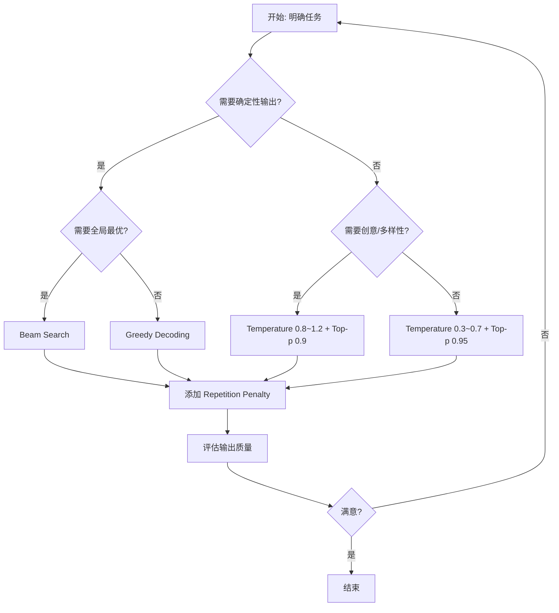

# LLM 推理解码策略

## 一句话总结

**解码策略**决定语言模型如何从输出的概率分布中选择下一个 token，是控制生成文本质量、多样性和确定性的关键机制。

---

## 为什么需要解码策略？

语言模型每次前向传播后，输出的是整个词表上的概率分布：

```
P(t_i | t_1, t_2, ..., t_{t-1})
```

解码策略就是把这个分布转化为一个具体 token 的规则。不同策略会带来完全不同的生成效果：

- 同样的模型，用贪心解码可能重复单调；
- 用高温采样可能创意丰富但不稳定；
- 用 Beam Search 可能得到更优的完整序列。

---

## 解码策略分类

| 策略 | 类型 | 核心思想 | 特点 |
|---|---|---|---|
| **贪心解码** | 确定性 | 每步选概率最高的 token | 稳定、快速，但容易局部最优和重复 |
| **Beam Search** | 确定性（扩展）| 每步保留 top-k 个候选序列 | 全局质量更好，但计算量增加 |
| **随机采样** | 随机性 | 按概率分布随机抽取 | 自然多样，但可能不连贯 |
| **Temperature Scaling** | 参数调节 | 缩放 logits 改变分布尖锐度 | 控制生成的“保守/大胆”程度 |
| **Top-k 采样** | 截断采样 | 只从前 k 个 token 中采样 | 简单但不够灵活 |
| **Top-p 采样** | 截断采样 | 从累积概率达 p 的最小集合中采样 | 动态适应分布，更常用 |
| **重复惩罚** | 后处理 | 降低已生成 token 的概率 | 减少重复现象 |
| **Speculative Decoding** | 加速 | 小模型生成候选，大模型验证 | 不降低质量的前提下提速 |

---

## 如何选择解码策略？

### 按任务类型

| 任务类型 | 推荐策略 | 典型参数 |
|---|---|---|
| 代码生成 | Greedy / Low Temperature | `T=0.1~0.3`, `top_p=0.95` |
| 数学推理 | Greedy / Very Low Temperature | `T=0.0~0.2` |
| 知识问答 | Low Temperature + Top-p | `T=0.1~0.5`, `top_p=0.95` |
| 创意写作 | Medium-High Temperature | `T=0.8~1.2`, `top_p=0.9` |
| 机器翻译 | Beam Search | `beam_width=4~10` |
| 对话聊天 | Medium Temperature | `T=0.6~0.9`, `top_p=0.9` |
| 头脑风暴 | High Temperature | `T=1.0~1.3`, `top_p=0.95` |

### 组合使用原则

实际场景中通常会**组合多种策略**：

```
Temperature + Top-p + Repetition Penalty
```

例如 OpenAI API 常见的默认组合：

- `temperature=0.7`
- `top_p=1.0`
- `frequency_penalty=0.0`
- `presence_penalty=0.0`

### 选择流程图



---

## 核心权衡

```
确定性 ←————————————————→ 创造性
Greedy    Beam    Top-p    Pure Sampling
   ↑         ↑       ↑           ↑
 稳定可复现  质量更好  平衡质量多样   高度随机
```

| 维度 | 确定性策略 | 随机性策略 |
|---|---|---|
| 输出稳定性 | 高 | 低 |
| 多样性 | 低 | 高 |
| 计算成本 | 低 ~ 中 | 低 |
| 事实准确性 | 通常更高 | 可能产生幻觉 |
| 流畅自然度 | 可能机械重复 | 更接近人类表达 |

---

## 实践代码示例

```python
from transformers import AutoModelForCausalLM, AutoTokenizer

model = AutoModelForCausalLM.from_pretrained("meta-llama/Llama-2-7b-chat-hf")
tokenizer = AutoTokenizer.from_pretrained("meta-llama/Llama-2-7b-chat-hf")

prompt = "人工智能的未来发展"
inputs = tokenizer(prompt, return_tensors="pt")

# 1. 贪心解码
greedy_output = model.generate(
    **inputs,
    max_new_tokens=100,
    do_sample=False
)

# 2. Temperature + Top-p 采样
sample_output = model.generate(
    **inputs,
    max_new_tokens=100,
    do_sample=True,
    temperature=0.7,
    top_p=0.9,
    repetition_penalty=1.1
)

# 3. Beam Search
beam_output = model.generate(
    **inputs,
    max_new_tokens=100,
    num_beams=4,
    early_stopping=True
)

print("Greedy:", tokenizer.decode(greedy_output[0]))
print("Sample:", tokenizer.decode(sample_output[0]))
print("Beam:  ", tokenizer.decode(beam_output[0]))
```

---

## 常见误区

1. **Temperature 和 Top-p 是互斥的？**
   - 不是。通常一起使用：先用 Temperature 调节分布，再用 Top-p 截断候选集。

2. **Temperature=0 就是贪心解码？**
   - 数学上 `T→0` 时趋近于贪心，但实际实现中通常直接调用 argmax，避免数值不稳定。

3. **Top-p 越高越好？**
   - 不一定。`top_p=1.0` 等于纯采样，容易纳入低概率的“胡言乱语”token。

4. **Beam Search 一定比贪心好？**
   - 不一定。对于开放式生成，Beam Search 可能生成不自然、过于“安全”的文本。

---

## 数学统一视角

所有解码策略都可以看作是对原始概率分布 `P` 的变换：

```
P'(t_i) = f(P(t_i), history, hyperparameters)
```

其中 `f` 可以是：

- **Greedy**：`f(P) = argmax(P)`
- **Temperature**：`f(P) ∝ P^(1/T)`
- **Top-k**：`f(P) = 0` for `P` not in top-k
- **Top-p**：`f(P) = 0` for tokens outside nucleus
- **Repetition Penalty**：`f(P) = P / α` for repeated tokens

---

## 延伸阅读

- [[概念/decoding-strategies-decision-tree|解码策略决策树]]
- [[概念/next-token-prediction|下一个 Token 预测]]
- [[概念/greedy-decoding|贪心解码]]
- [[概念/beam-search|束搜索]]
- [[概念/temperature-scaling|温度缩放]]
- [[概念/top-p-sampling|Top-p 采样]]
- [[概念/autoregressive-generation|自回归生成]]
- [[概念/speculative-decoding|推测解码]]
- [[概念/repetition-penalty|重复惩罚]]
- [[概念/model-inference|模型推理]]

## See Also (深度专题)

- [[../../大模型/Sequence_Models/Text_Generation_Decoding_Strategies|文本生成解码策略]] — Greedy/Beam/Sampling/Speculative 的数学推导与工程实现
- [[../../大模型/Sequence_Models/Sequence_Models|序列模型深度解析]] — 自回归生成的底层架构支撑
