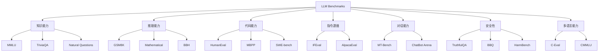

# LLM 评估基准（Benchmarks）概览

> 中文简称：LLM 评估基准概览

## 一句话总结

**LLM Benchmarks** 是衡量大语言模型在知识、推理、代码、对话、指令遵循等能力上的标准化测试集。

---

## Benchmark 分类

---

## 知识能力

| Benchmark | 说明 | 衡量能力 |
|---|---|---|
| **MMLU** | 57 个学科多选题 | 广泛知识 |
| **TriviaQA** | 阅读理解 trivia | 事实知识 |
| **Natural Questions** | Google 真实搜索问题 | 开放域知识 |
| **C-Eval / CMMLU** | 中文知识/常识评估 | 中文知识 |

---

## 推理能力

| Benchmark | 说明 | 衡量能力 |
|---|---|---|
| **GSM8K** | 小学数学应用题 | 数学推理 |
| **MATH** | 竞赛级数学题 | 复杂数学推理 |
| **BBH** | Big-Bench Hard 子集 | 复杂推理 |
| **ARC** | 科学推理题 | 科学推理 |

---

## 代码能力

| Benchmark | 说明 | 衡量能力 |
|---|---|---|
| **HumanEval** | 手写 Python 函数补全 | 基础代码生成 |
| **MBPP** | Mostly Basic Python Problems | Python 编程 |
| **SWE-bench** | 真实 GitHub issue 修复 | 软件工程能力 |
| **LiveCodeBench** | 实时竞赛编程题 | 竞赛级代码 |

---

## 指令遵循与对话

| Benchmark | 说明 | 衡量能力 |
|---|---|---|
| **MT-Bench** | 多轮对话评估 | 对话能力 |
| **AlpacaEval** | 与 Davinci-003 输出对比 | 指令遵循 |
| **IFEval** | 指令格式遵循 | 严格指令执行 |
| **ChatBot Arena** | 人类偏好投票 | 真实对话质量 |

---

## 安全性与诚实性

| Benchmark | 说明 | 衡量能力 |
|---|---|---|
| **TruthfulQA** | 模型是否说真话 | 减少幻觉 |
| **BBQ** | 偏见评估 | 社会偏见 |
| **HarmBench** | 有害请求抵抗 | 安全性 |
| **StrongREJECT** | 越狱攻击评估 | 对齐鲁棒性 |

---

## 如何选择 Benchmark？

| 目标 | 推荐 Benchmark |
|---|---|
| 通用能力 | MMLU、BBH、GSM8K、HumanEval |
| 对话模型 | MT-Bench、AlpacaEval、ChatBot Arena |
| 代码模型 | HumanEval、MBPP、SWE-bench |
| 中文模型 | C-Eval、CMMLU、CEval-Hard |
| 安全对齐 | TruthfulQA、HarmBench、BBQ |
| 长上下文 | RULER、LongBench、Needle-in-Haystack |

---

## 评估注意事项

1. **不要只看一个 benchmark**：综合能力需要多维度评估；
2. **注意数据污染**：训练数据可能包含测试集；
3. **Prompt 工程影响结果**：不同 prompt 可能带来显著差异；
4. **GPT-4 作为裁判有偏见**：AlpacaEval 等应谨慎解读；
5. **Human Evaluation 仍是金标准**：benchmark 无法完全替代人类判断。

---

## 延伸阅读

- [[概念/perplexity|困惑度]]
- [[概念/model-evaluation|模型评估]]
- [[概念/llm-benchmarks-deep-dive|Benchmark 详解]]

---

## 2026 Benchmark 生态

| 特性/工具 | 说明 | 状态 |
|------|------|------|
| **MMLU-Pro** | 多学科多任务理解，比 MMLU 更难 | GA |
| **GPQA** | 研究生水平科学问答 | GA |
| **HumanEval/MBPP** | 代码生成评估 | GA |
| **MT-Bench** | 多轮对话评判 | GA |
| **LiveBench** | 动态更新，避免数据污染 | GA |

## 生产最佳实践

1. **多 Benchmark 综合**：不要只看单一 Benchmark，综合多个指标评估
2. **场景匹配**：用目标场景的 Benchmark 评估，而非通用 Benchmark
3. **警惕数据污染**：关注 Benchmark 是否被训练数据污染
4. **人类评估校准**：定期与人类评估对比，确保 Benchmark 可靠性
5. **成本意识**：Benchmark 评估成本高，仅用于关键决策
6. **动态基准优先**：LiveBench 等动态更新的基准更可靠
7. **业务测试集**：建立自己的业务测试集，比公开基准更相关

## Benchmark 选择指南

| 任务类型 | 推荐 Benchmark | 说明 |
|----------|---------------|------|
| 通用知识 | MMLU-Pro, GPQA | 多学科知识评估 |
| 代码生成 | HumanEval, MBPP, LiveCodeBench | 代码正确性评估 |
| 数学推理 | GSM8K, MATH, AIME | 数学问题求解 |
| 多轮对话 | MT-Bench, Arena Hard | 对话质量评估 |
| 中文能力 | C-Eval, CMMLU | 中文知识评估 |
| 长上下文 | RULER, Needle-in-Haystack | 长文本检索能力 |
| 安全性 | TruthfulQA, BBQ | 幻觉和偏见评估 |

## 延伸阅读

- [[概念/LLM/llm-arena|LLM Arena]]
- [[概念/LLM/llm-as-judge|LLM-as-Judge]]
- [[08_模型评估/02_Benchmarks/LLM_Benchmark_Suite_2026|LLM 基准套件 2026]]

> ℹ️ Benchmark 只是参考，最终决策应结合业务测试集和实际体验。
