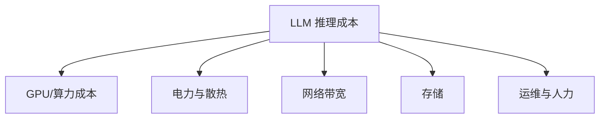
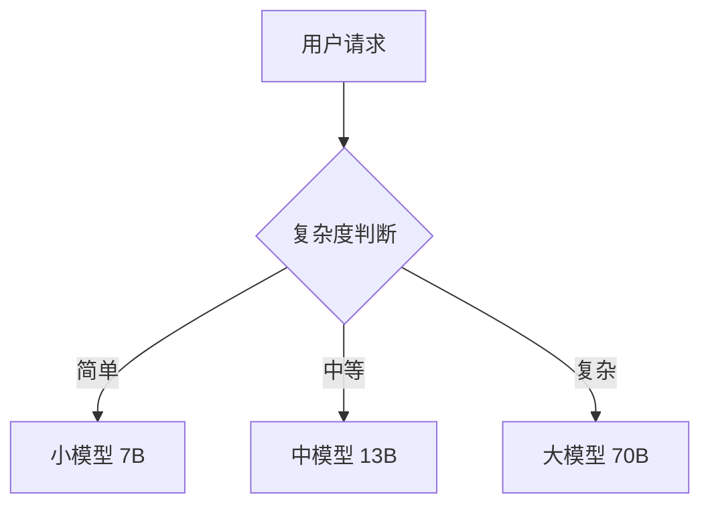

# LLM 推理成本优化

> 中文简称：LLM 推理成本优化

## 一句话总结

**LLM 推理成本优化**通过技术手段降低单位 token 的推理开销，主要方向包括模型压缩、缓存复用、批处理优化和硬件调度。

---

## 成本构成



其中 **GPU 算力** 通常占最大比例。

---

## 优化方向

### 1. 模型层面

| 技术 | 效果 | 复杂度 |
|---|---|---|
| **量化（INT8/INT4/FP8）** | 降低显存和计算 | 低 |
| **剪枝** | 减少参数量 | 中 |
| **蒸馏** | 使用更小模型 | 高 |
| **MoE 架构** | 推理时只激活部分参数 | 中 |

### 2. 推理引擎层面

| 技术 | 效果 | 代表 |
|---|---|---|
| **KV Cache** | 避免重复计算 | 所有引擎 |
| **PagedAttention** | 减少显存碎片 | vLLM |
| **Continuous Batching** | 提高吞吐 | vLLM、Triton |
| **Speculative Decoding** | 降低有效延迟 | Medusa、Lookahead |
| **FlashAttention** | 加速 Attention | 主流引擎 |

### 3. 系统架构层面

| 技术 | 效果 |
|---|---|
| **Prefill-Decode 分离** | 分别优化两阶段资源 |
| **Prompt Cache** | 缓存常见 prompt 的 KV Cache |
| **自动扩缩容** | 按需使用 GPU |
| **Spot 实例** | 降低云计算成本 |
| **请求路由** | 小请求用小模型，大请求用大模型 |

---

## 成本计算公式

```
单位 token 成本 = GPU 小时成本 / 每小时生成 token 数

每小时生成 token 数 = 3600 / TPOT × batch_size
```

因此，降低 TPOT 和提高 batch size 是降低成本的关键。

---

## 实战策略

### 策略 1：量化 + vLLM

```bash
# AWQ 量化模型 + vLLM 服务
python -m vllm.entrypoints.openai.api_server \
    --model TheBloke/Llama-2-7B-AWQ \
    --quantization awq \
    --max-num-seqs 256
```

### 策略 2：Prompt Cache

缓存高频 query 的 KV Cache，如：

- System prompt；
- 常见文档的 embedding；
- 重复的用户输入。

### 策略 3：模型路由



### 策略 4：Speculative Decoding

```bash
# vLLM 支持 draft model 推测解码
python -m vllm.entrypoints.openai.api_server \
    --model meta-llama/Llama-2-70b-chat-hf \
    --speculative-model meta-llama/Llama-2-7b-chat-hf
```

---

## 成本优化 checklist

- [ ] 是否使用了量化模型？
- [ ] 是否启用了 Continuous Batching？
- [ ] 是否对常见 prompt 做了缓存？
- [ ] 是否根据请求复杂度路由不同模型？
- [ ] 是否按需扩缩容？
- [ ] 是否监控单位 token 成本？
- [ ] 是否使用 spot 实例或预留实例？

---

## 延伸阅读

- [[概念/quantization|模型量化]]
- [[概念/speculative-decoding|推测解码]]
- [[概念/prefill-decode-disaggregated|Prefill-Decode 分离]]
- [[概念/inference-cluster-scheduling|推理集群调度]]
- [[概念/vllm-practical|vLLM 实战]]

---

## 2026 推理成本优化生态

| 特性/工具 | 说明 | 状态 |
|------|------|------|
| **量化 (AWQ/GPTQ)** | 4-bit 量化，内存减少 4x，速度提升 2x | GA |
| **Speculative Decoding** | Draft-Verify 加速 2-3x | GA |
| **Continuous Batching** | 动态批处理，GPU 利用率提升 2-3x | GA |
| **KV Cache 压缩** | GQA/MQA 减少 KV Cache 内存 | GA |
| **Prefill-Decode 分离** | 预填充/解码分离部署，独立扩展 | GA |

## 生产最佳实践

1. **量化必用**：生产环境必须用 4-bit 量化，成本降低 4x
2. **Continuous Batching 必开**：动态批处理最大化 GPU 利用率
3. **投机解码加速**：高并发场景启用 Speculative Decoding
4. **模型选择**：简单任务用小模型，复杂任务用大模型
5. **成本监控**：实时监控 Token 消耗和 GPU 利用率，设置告警
6. **前缀缓存**：多轮对话/共享 System Prompt 场景启用 Prefix Caching
7. **批处理优化**：合理设置 max_num_seqs，平衡吐量和显存
8. **混合部署**：Prefill/Decode 分离部署，独立扩展

## 成本优化检查清单

| 优化项 | 预期收益 | 实施难度 |
|--------|----------|----------|
| INT4 量化 | 成本 -75% | 低 |
| Continuous Batching | 吐量 +200% | 低 |
| Prefix Caching | TTFT -50% | 低 |
| Speculative Decoding | 延迟 -40% | 中 |
| 模型路由 | 成本 -50% | 中 |
| Prefill/Decode 分离 | 资源利用率 +50% | 高 |

## 延伸阅读

- [[概念/LLM/llm-quantization|LLM 量化]]
- [[概念/LLM/speculative-decoding|推测解码]]
- [[概念/Inference/continuous-batching|Continuous Batching]]
- [[10_部署推理/06_成本管理/03_LLM_成本优化|推理成本优化 2026]]
