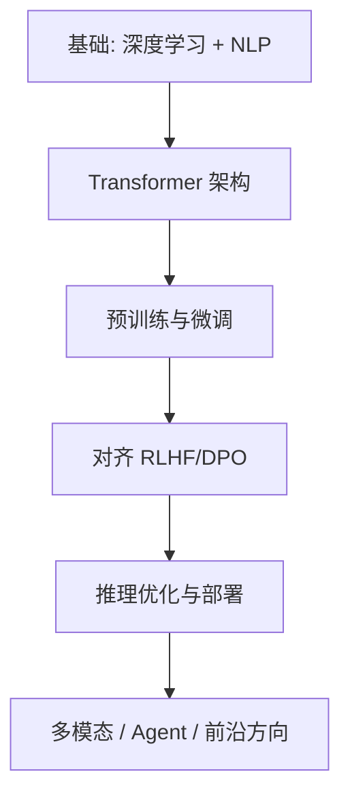

# LLM 论文与课程资源索引

## 一句话总结

本页按主题整理 LLM 领域的经典论文、技术报告和课程资源，是学习大模型技术的参考入口。

---

## 经典论文

### 基础架构

| 论文 | 作者/年份 | 贡献 |
|---|---|---|
| **Attention Is All You Need** | Vaswani et al., 2017 | 提出 Transformer 架构 |
| **BERT: Pre-training of Deep Bidirectional Transformers** | Devlin et al., 2018 | 双向预训练范式 |
| **Language Models are Unsupervised Multitask Learners** | Radford et al., 2019 | GPT-2，zero-shot 能力 |
| **Language Models are Few-Shot Learners** | Brown et al., 2020 | GPT-3，上下文学习 |

### 预训练与 Scaling

| 论文 | 作者/年份 | 贡献 |
|---|---|---|
| **Scaling Laws for Neural Language Models** | Kaplan et al., 2020 | 提出语言模型 Scaling Law |
| **LLaMA: Open and Efficient Foundation Language Models** | Touvron et al., 2023 | 高质量开源基座模型 |
| **Llama 2: Open Foundation and Fine-Tuned Chat Models** | Touvron et al., 2023 | 开源对齐模型 |

### 对齐与 RLHF

| 论文 | 作者/年份 | 贡献 |
|---|---|---|
| **Training Language Models to Follow Instructions with Human Feedback** | Ouyang et al., 2022 | InstructGPT / RLHF |
| **Constitutional AI: Harmlessness from AI Feedback** | Bai et al., 2022 | 宪法 AI |
| **Direct Preference Optimization** | Rafailov et al., 2023 | DPO 对齐方法 |
| **DeepSeek-R1** | DeepSeek, 2025 | GRPO 推理强化学习 |

### 推理与 Test-Time Compute

| 论文 | 作者/年份 | 贡献 |
|---|---|---|
| **Chain-of-Thought Prompting Elicits Reasoning in LLMs** | Wei et al., 2022 | CoT 推理 |
| **Training Verifiers to Solve Math Word Problems** | Cobbe et al., 2021 | 过程奖励模型 |
| **DeepSeek-R1: Incentivizing Reasoning Capability in LLMs via Reinforcement Learning** | DeepSeek, 2025 | 推理模型 |

### 效率优化

| 论文 | 作者/年份 | 贡献 |
|---|---|---|
| **FlashAttention: Fast and Memory-Efficient Exact Attention** | Dao et al., 2022 | 高效 Attention |
| **Efficient Large-Scale Language Model Training on GPU Clusters** | Rajbhandari et al., 2022 | ZeRO |
| **LLM.int8(): 8-bit Matrix Multiplication** | Dettmers et al., 2022 | 大模型量化 |
| **AWQ: Activation-aware Weight Quantization** | Lin et al., 2023 | AWQ 量化 |

### 多模态

| 论文 | 作者/年份 | 贡献 |
|---|---|---|
| **Learning Transferable Visual Models From Natural Language Supervision** | Radford et al., 2021 | CLIP |
| **Visual Instruction Tuning** | Liu et al., 2023 | LLaVA |
| **GPT-4V System Card** | OpenAI, 2023 | 多模态大模型 |

---

## 技术报告

| 报告 | 机构 | 内容 |
|---|---|---|
| **GPT-4 Technical Report** | OpenAI | GPT-4 能力概述 |
| **Llama 3 Model Card** | Meta | LLaMA-3 训练细节 |
| **DeepSeek-V3 Technical Report** | DeepSeek | MoE + FP8 训练 |
| **Claude 3 Model Card** | Anthropic | Claude 3 安全与能力 |
| **Gemini 1.5 Technical Report** | Google | 长上下文多模态 |

---

## 优质课程

### 中文课程

| 课程 | 机构/讲师 | 链接 |
|---|---|---|
| **李宏毅机器学习** | 台大李宏毅 | YouTube / Bilibili |
| **动手学深度学习** | 李沐等 | GitHub / Bilibili |
| **斯坦福 CS224N 自然语言处理** | Stanford | 官网 |

### 英文课程

| 课程 | 机构 | 内容 |
|---|---|---|
| **Stanford CS224N** | Stanford | NLP with Deep Learning |
| **Stanford CS229: Machine Learning** | Stanford | 机器学习基础 |
| **Andrej Karpathy: Neural Networks from Zero to Hero** | Andrej Karpathy | 从零实现神经网络 |
| **Fast.ai: Practical Deep Learning for Coders** | Fast.ai | 实战深度学习 |
| **ECE598: Scalable LLMs** | 多所大学 | 大模型系统 |

---

## 开源项目与工具

| 项目 | 用途 |
|---|---|
| **Hugging Face Transformers** | 模型加载与训练 |
| **PyTorch / JAX** | 深度学习框架 |
| **DeepSpeed / Megatron-LM / FSDP** | 分布式训练 |
| **vLLM / SGLang / TensorRT-LLM** | 高性能推理 |
| **TRL / LLaMA-Factory / Axolotl** | 模型微调与对齐 |
| **lm-evaluation-harness** | 模型评估 |
| **OpenCompass** | 中文大模型评测 |

---

## 社区与博客

| 来源 | 类型 |
|---|---|
| **Papers With Code** | 论文+代码 |
| **arXiv cs.CL / cs.LG** | 最新论文 |
| **Hugging Face Blog** | 技术博客 |
| **Lilian Weng's Blog** | OpenAI 研究员博客 |
| **The Gradient** | AI 访谈与文章 |
| **Sebastian Raschka** | 深度学习博客 |

---

## 推荐学习路径

---

## 延伸阅读

- [[概念/llm-training-inference-key-concepts|LLM 训练与推理关键概念索引]]
- [[大模型/Transformer_Training_vs_Inference|Transformer 在大模型训练与推理中的应用]]
