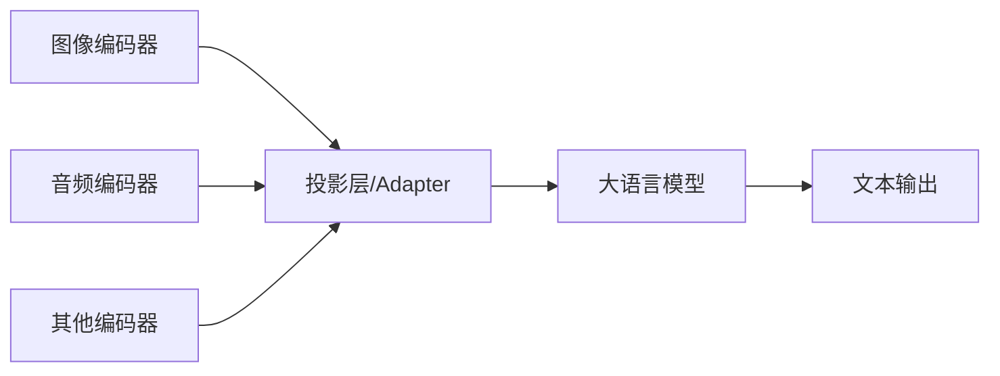

# 多模态大语言模型（Multimodal LLM）

> 中文简称：多模态大语言模型

## 一句话总结

**多模态大语言模型（MLLM）** 能够同时理解和生成文本、图像、音频等多种模态内容，将不同模态统一映射到语言模型的语义空间中进行推理。

---

## 核心架构

典型 MLLM 包含三个部分：

1. **模态编码器**：将原始模态输入编码为特征（如 ViT、Whisper）；
2. **投影层/Adapter**：对齐不同模态特征到 LLM 语义空间；
3. **大语言模型**：进行统一推理和生成。

---

## 主要模态组合

| 模态组合 | 代表模型 | 能力 |
|---|---|---|
| **视觉 + 语言** | GPT-4V、LLaVA、Qwen-VL | 图像理解、视觉问答 |
| **音频 + 语言** | Qwen-Audio、Whisper | 语音识别、音频理解 |
| **视频 + 语言** | Video-LLaMA、Qwen2-VL | 视频理解、时序推理 |
| **多模态统一** | Gemini、GPT-4o | 文本/图/音原生融合 |

---

## 训练阶段

### 1. 模态编码器预训练

- 在大量图文/音文数据上训练编码器；
- 例如 CLIP 在 4 亿图文对上训练视觉-文本对齐。

### 2. 投影层对齐

- 冻结编码器和 LLM，只训练投影层；
- 使用图文对数据学习模态对齐。

### 3. 视觉指令微调

- 解冻 LLM，使用视觉指令数据端到端训练；
- 让模型学会根据图像回答复杂问题。

### 4. 通用多模态微调

- 在更多模态、更多任务上进一步微调；
- 提升泛化和指令遵循能力。

---

## 关键挑战

| 挑战 | 说明 |
|---|---|
| **模态对齐** | 不同模态的特征空间差异大 |
| **数据稀缺** | 高质量多模态指令数据较少 |
| **计算成本** | 需要同时处理图像/音频 encoder 和 LLM |
| **幻觉问题** | 模型可能生成与视觉内容不符的描述 |
| **位置关系** | 理解图像中物体的空间关系较难 |

---

## 主流模型

| 模型 | 机构 | 特点 |
|---|---|---|
| **CLIP** | OpenAI | 视觉-文本对齐基础模型 |
| **BLIP-2** | Salesforce | 冻结编码器 + Q-Former 对齐 |
| **LLaVA** | 微软/UC Davis | 开源视觉指令微调代表 |
| **Qwen-VL / Qwen2-VL** | 阿里 | 中文视觉能力强 |
| **GPT-4V / GPT-4o** | OpenAI | 闭源最强多模态能力 |
| **Gemini** | Google | 原生多模态统一模型 |

---

## 应用场景

- 图像描述与问答
- 文档理解（OCR + 理解）
- 视频摘要
- 自动驾驶感知-决策
- 医疗影像分析
- 多模态搜索

---

## 延伸阅读

- [[概念/vision-language-model|视觉语言模型]]
- [[概念/qwen-series|Qwen 系列]]
- [[概念/gpt-series-evolution|GPT 系列演进]]
- [[概念/quantization|模型量化]]

## See Also (深度专题)

- [[05_大模型/09_多模态模型/06_多模态_架构_2026|多模态模型架构 2026]] — 从 GPT-4V 到原生多模态 AGI 的架构演进
- [[05_大模型/09_多模态模型/07_Native_多模态_架构|原生多模态架构]] — 统一编码器 vs 桥接编码器的路线对比
- [[05_大模型/09_多模态模型/05_Modality_Fusion_Mechanisms|模态融合机制]] —  早期/晚期/交叉注意力融合的技术解析

---

## 2026 多模态 LLM 生态

| 特性/工具 | 说明 | 状态 |
|------|------|------|
| **GPT-4o 原生多模态** | 文本/图像/音频统一编码，端到端多模态 | GA |
| **Gemini 2.5** | 原生多模态 + 2M Token 上下文 | GA |
| **Qwen2.5-VL** | 视觉语言模型，支持视频理解 | GA |
| **LLaVA-NeXT** | 开源多模态模型，动态分辨率 | GA |
| **音频多模态** | 语音输入/输出原生支持 | GA |

## 生产最佳实践

1. **模态匹配**：根据任务选择模态，简单任务用纯文本，复杂任务用多模态
2. **图像预处理**：输入图像统一分辨率，避免过大图像消耗过多 Token
3. **成本控制**：多模态 Token 消耗是纯文本 2-5x，必须监控成本
4. **幻觉检测**：多模态模型更容易产生幻觉，必须验证输出
5. **渐进式采用**：先纯文本验证效果，再添加多模态能力
6. **视频理解**：长视频抽帧处理，避免 Token 爆炸
7. **音频处理**：语音输入先转文本，或直接使用原生音频模型

## 多模态架构对比

| 架构 | 原理 | 优势 | 代表 |
|------|------|------|------|
| **拼接式** | 视觉编码器 + LLM | 简单，易实现 | LLaVA, Qwen-VL |
| **原生多模态** | 统一编码器 | 端到端，效果好 | GPT-4o, Gemini |
| **交叉注意力** | 模态间交叉注意 | 细粒度对齐 | Flamingo |
| **Any-to-Any** | 任意模态转换 | 最灵活 | Gemini 2.5 |

## 延伸阅读

- [[概念/LLM/gemini|Gemini]]
- [[概念/LLM/qwen-series|Qwen 系列]]
- [[05_大模型/09_多模态模型/06_多模态_架构_2026|多模态架构 2026]]

## 2026 多模态模型生态

| 模型 | 模态 | 特点 | 状态 |
|------|------|------|------|
| **GPT-5** | 文本/图像/音频 | 原生多模态理解+生成 | GA |
| **Gemini 3** | 文本/图像/视频/音频 | 2M 上下文，视频理解最强 | GA |
| **Qwen3-VL** | 文本/图像/视频 | 开源多模态 SOTA | GA |
| **Llama 4** | 文本/图像 | 开源，MoE 架构 | GA |
| **Claude 4** | 文本/图像 | 长上下文图像理解 | GA |

## 多模态融合架构对比

| 架构 | 原理 | 优势 | 劣势 | 代表 |
|------|------|------|------|------|
| **早期融合** | 原始输入拼接 | 简单 | 模态干扰 | 早期研究 |
| **编码器融合** | 各模态编码后拼接 | 灵活 | 对齐难 | LLaVA |
| **交叉注意力** | 模态间 Cross-Attn | 细粒度 | 计算贵 | Flamingo |
| **原生统一** | 统一 Token 空间 | 最优雅 | 训练难 | Gemini 3 |

## 生产最佳实践

1. **模态选择**：根据业务需要选择模态，不要盲目追求全模态
2. **图像分辨率**：高分辨率图像显著增加 Token 消耗，按需调整
3. **视频理解**：抽帧策略影响效果与成本，建议 1-2 fps
4. **延迟控制**：多模态输入 prefill 慢，设置合理超时
5. **成本监控**：图像/视频 Token 消耗远高于纯文本
