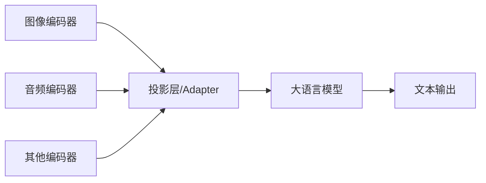

# 多模态大语言模型（Multimodal LLM）

## 一句话总结

**多模态大语言模型（MLLM）** 能够同时理解和生成文本、图像、音频等多种模态内容，将不同模态统一映射到语言模型的语义空间中进行推理。

---

## 核心架构

典型 MLLM 包含三个部分：

1. **模态编码器**：将原始模态输入编码为特征（如 ViT、Whisper）；
2. **投影层/Adapter**：对齐不同模态特征到 LLM 语义空间；
3. **大语言模型**：进行统一推理和生成。

---

## 主要模态组合

| 模态组合 | 代表模型 | 能力 |
|---|---|---|
| **视觉 + 语言** | GPT-4V、LLaVA、Qwen-VL | 图像理解、视觉问答 |
| **音频 + 语言** | Qwen-Audio、Whisper | 语音识别、音频理解 |
| **视频 + 语言** | Video-LLaMA、Qwen2-VL | 视频理解、时序推理 |
| **多模态统一** | Gemini、GPT-4o | 文本/图/音原生融合 |

---

## 训练阶段

### 1. 模态编码器预训练

- 在大量图文/音文数据上训练编码器；
- 例如 CLIP 在 4 亿图文对上训练视觉-文本对齐。

### 2. 投影层对齐

- 冻结编码器和 LLM，只训练投影层；
- 使用图文对数据学习模态对齐。

### 3. 视觉指令微调

- 解冻 LLM，使用视觉指令数据端到端训练；
- 让模型学会根据图像回答复杂问题。

### 4. 通用多模态微调

- 在更多模态、更多任务上进一步微调；
- 提升泛化和指令遵循能力。

---

## 关键挑战

| 挑战 | 说明 |
|---|---|
| **模态对齐** | 不同模态的特征空间差异大 |
| **数据稀缺** | 高质量多模态指令数据较少 |
| **计算成本** | 需要同时处理图像/音频 encoder 和 LLM |
| **幻觉问题** | 模型可能生成与视觉内容不符的描述 |
| **位置关系** | 理解图像中物体的空间关系较难 |

---

## 主流模型

| 模型 | 机构 | 特点 |
|---|---|---|
| **CLIP** | OpenAI | 视觉-文本对齐基础模型 |
| **BLIP-2** | Salesforce | 冻结编码器 + Q-Former 对齐 |
| **LLaVA** | 微软/UC Davis | 开源视觉指令微调代表 |
| **Qwen-VL / Qwen2-VL** | 阿里 | 中文视觉能力强 |
| **GPT-4V / GPT-4o** | OpenAI | 闭源最强多模态能力 |
| **Gemini** | Google | 原生多模态统一模型 |

---

## 应用场景

- 图像描述与问答
- 文档理解（OCR + 理解）
- 视频摘要
- 自动驾驶感知-决策
- 医疗影像分析
- 多模态搜索

---

## 延伸阅读

- [[概念/vision-language-model|视觉语言模型]]
- [[概念/qwen-series|Qwen 系列]]
- [[概念/gpt-series-evolution|GPT 系列演进]]
- [[概念/quantization|模型量化]]

## See Also (深度专题)

- [[../../大模型/Multimodal_Models/Multimodal_Architectures_2026|多模态模型架构 2026]] — 从 GPT-4V 到原生多模态 AGI 的架构演进
- [[../../大模型/Multimodal_Models/Native_Multimodal_Architectures|原生多模态架构]] — 统一编码器 vs 桥接编码器的路线对比
- [[../../大模型/Multimodal_Models/Modality_Fusion_Mechanisms|模态融合机制]] — 早期/晚期/交叉注意力融合的技术解析
