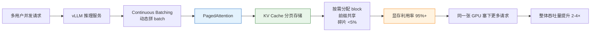

# PagedAttention

## 核心要点

- **KV Cache 的虚拟内存**：借鉴 OS 分页思想，将 KV Cache 分成固定大小 block（通常 16/32 tokens），通过 block table 间接寻址
- **消除显存碎片**：传统连续分配在变长 batch 下碎片率 35-50%，PagedAttention 降至 <5%
- **2026 行业标配**：vLLM、SGLang、TensorRT-LLM 均默认启用，是推理部署的必选基座

## 详细内容

### 问题：KV Cache 显存碎片

传统 LLM 推理为每个请求预分配连续的 KV Cache 空间（按最大序列长度），导致：
- **内部碎片**：请求实际长度 < 预分配长度，浪费 30-50% 显存
- **外部碎片**：请求完成后释放的中间空洞无法被新请求利用
- 典型 bursty 流量下，有效利用率仅 50-65%

### PagedAttention 原理

```
传统分配（连续）:
┌──────────────┐  ┌──────────┐
│ Request A    │  │ Req B    │  ← 中间空洞浪费
└──────────────┘  └──────────┘

PagedAttention（分页）:
Block Table:  A→[3,7,12]  B→[1,5]
Physical: [B0][B1][  ][A0][  ][B2][  ][A1][  ][  ][  ][A2][  ]...
```

- **Block**：固定大小的 KV Cache 存储单元（16 或 32 tokens）
- **Block Table**：每个请求维护一个页表，记录其 KV block 的物理位置
- **按需分配**：新 token 生成时才分配新 block，不需要预分配
- **Attention Kernel**：通过页表间接读取 KV block，计算开销增加 ~2-5%

### 关键参数

| 参数 | 说明 | 典型值 |
|------|------|--------|
| **block_size** | 每个 block 包含的 token 数 | 16 或 32 |
| **gpu_memory_utilization** | GPU 显存用于 KV Cache 的比例 | 0.9 (90%) |
| **max_num_blocks_per_seq** | 单序列最大 block 数 | seq_len / block_size |

### 性能影响

| 指标 | 传统分配 | PagedAttention |
|------|---------|---------------|
| 显存利用率 | 50-65% | **95%+** |
| 并发请求数 | 受限 | **2-4× 提升** |
| 吞吐量 | 基线 | **2-4× 提升** |
| 单 token 计算开销 | 基线 | +2-5% (页表查找) |

### Continuous Batching 协同

PagedAttention 与 Continuous Batching 天然配合：
- Continuous Batching 在迭代级动态调度请求（新请求插入、完成请求释放）
- PagedAttention 提供细粒度 block 级内存管理，支持请求的随时插入和释放
- 两者组合使 vLLM 在 bursty 流量下保持高吞吐

## 架构链路：vLLM 为什么能同时服务更多请求



链路解释：

1. **多请求进来** → vLLM 不一个请求一个请求顺序处理，而是用 Continuous Batching 动态把请求拼成一个 batch
2. **PagedAttention 上场** → 把每个请求的 KV Cache 切成固定大小的 block，通过 block table 管理
3. **按需分配 + 共享前缀** → 用多少分多少，多个请求相同的前半段上下文共用同一批 block
4. **显存利用率飙升** → 从传统 50-65% 提升到 95%+
5. **结果** → 同样的 GPU 能同时服务的请求变多，排队时间变短，整体生成速度变快

### 对比图

```
传统连续分配：
┌──────────────┐ ┌──────────┐ ┌──────────────┐
│ Request A    │ │  空洞    │ │ Request B    │  ← 中间空着用不了
└──────────────┘ └──────────┘ └──────────────┘

PagedAttention 分页分配：
Block Table: A→[1,5,8]  B→[2,6]  C→[3,7]
物理显存: [A1][B1][C1][A2][B2][C2][A3][...]
         ↑ 所有小块都填满，没有浪费
```

### 局限与替代方案

- **页表查找开销**：每个 attention 步骤需查 block table，对极短序列反而有开销
- **vAttention (2025)**：使用 CUDA 虚拟内存 API 替代 PagedAttention，保持 KV Cache 在连续物理内存中，减少查找开销
- **block_size 选择**：太大浪费显存，太小增加页表大小和查找开销

## 来源

- Kwon et al., "Efficient Memory Management for Large Language Model Serving with PagedAttention," SOSP 2023
- vLLM 官方文档: https://docs.vllm.ai

## Related

- [[概念/kv-cache]] — KV Cache（PagedAttention 管理的对象）
- [[概念/continuous-batching]] — Continuous Batching（协同技术）
- [[概念/model-deployment]] — 模型部署全景
- [[概念/multi-head-latent-attention]] — MLA（架构层压缩 KV Cache）
- [[部署推理/Inference_Engines/vLLM_Deep_Dive]] — vLLM（PagedAttention 首发实现）
- [[部署推理/Inference_Engines/vLLM_for_dummy]] — vLLM 大白话解释
- [[部署推理/Inference_Engines/vLLM_PagedAttention_Architecture]] — vLLM + PagedAttention 架构链路图
- [[部署推理/Inference_Engines/SGLang_Deep_Dive]] — SGLang（结合 RadixAttention 的内存管理）
- [[部署推理/Inference_Engines/LMDeploy_Deep_Dive]] — LMDeploy（TurboMind Paging KV Cache）
- [[部署推理/Inference_Engines/TensorRT_LLM_Deep_Dive]] — TensorRT-LLM（In-Flight Batching + Paged KV）

---

## 2026 PagedAttention 生态

| 特性/工具 | 说明 | 状态 |
|------|------|------|
| **vLLM PagedAttention** | 虚拟内存式 KV Cache 管理，内存利用率提升 2-4x | GA |
| **Prefix Caching** | 前缀共享，多请求复用 KV Cache | GA |
| **Chunked Prefill** | 分块预填充，降低首 Token 延迟 | GA |
| **RadixAttention** | SGLang 的基数树缓存，自动前缀复用 | GA |
| **Paged KV Cache** | TensorRT-LLM 的分页 KV 管理 | GA |

## 生产最佳实践

1. **必用 PagedAttention**：生产环境必须启用，内存利用率提升 2-4x
2. **前缀缓存开启**：多轮对话/系统提示场景启用 Prefix Caching
3. **块大小调优**：根据序列长度调整 block_size，平衡内存与性能
4. **与 Continuous Batching 配合**：PagedAttention + Continuous Batching 最大化吐吐量
5. **监控内存使用**：监控 KV Cache 内存占用，避免 OOM
6. **推理引擎选择**：vLLM/SGLang 默认启用 PagedAttention
7. **长上下文场景**：长上下文请求占用显存大，PagedAttention 必不可少

## PagedAttention 工作原理

```
传统 KV Cache 管理:
[Request 1: ████████████________]  <- 预分配，有碎片
[Request 2: ██████______________]  <- 预分配，有碎片
[Request 3: 等待内存释放...      ]  <- 无法分配

PagedAttention 管理:
[Block Pool: [B1][B2][B3][B4][B5][B6][B7][B8]...]
[Request 1: B1 -> B3 -> B5 -> B7]  <- 按需分配，无碎片
[Request 2: B2 -> B4]              <- 按需分配，无碎片
[Request 3: B6 -> B8]              <- 可以分配
```

## 延伸阅读

- [[概念/Inference/kv-cache|KV Cache]]
- [[概念/Inference/continuous-batching|Continuous Batching]]
- [[概念/LLM/vllm|vLLM]]
- [[部署推理/Inference_Engines/vLLM_Deep_Dive|vLLM 深度解析]]

> ℹ️ PagedAttention 是 vLLM 的核心创新，已成为 LLM 推理服务的事实标准。

## 延伸阅读

- [[概念/LLM/kv-cache|KV Cache]] — PagedAttention 管理对象
- [[概念/LLM/radix-attention|RadixAttention]] — 前缀缓存优化
- [[概念/LLM/llm-inference-engine|推理引擎]] — 引擎全景
- [[概念/LLM/grouped-query-attention|GQA]] — 注意力架构优化
