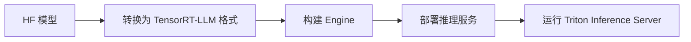

# TensorRT-LLM 实战指南

> 中文简称：TensorRT-LLM 实战指南

## 一句话总结

**TensorRT-LLM** 是 NVIDIA 专为自家 GPU 优化的高性能 LLM 推理 SDK，通过算子融合、FP8/INT8 量化、[[概念/kv-cache|KV Cache]] 管理等技术实现极致吞吐。

---

## 核心优势

| 特性 | 说明 |
|---|---|
| **算子融合** | 减少 kernel 启动和内存访问开销 |
| **多精度支持** | FP16、BF16、FP8、INT8、INT4 |
| **In-Flight Batching** | 类似 Continuous Batching 的动态批处理 |
| **KV Cache 优化** | PagedAttention 支持 |
| **NVIDIA GPU 深度优化** | 针对 A100、H100、L40S 等优化 |

---

## 安装

```bash
# 推荐用 Docker
 docker run --gpus all -it --rm nvcr.io/nvidia/tritonserver:24.01-trtllm-python-py3

# 或使用 pip（需匹配 CUDA 版本）
pip install tensorrt_llm
```

---

## 工作流程



---

## 模型转换与构建

```bash
# 1. 从 Hugging Face 下载并转换模型
python examples/llama/convert_checkpoint.py \
    --model_dir /path/to/llama-7b \
    --output_dir /path/to/converted \
    --dtype float16

# 2. 构建 TensorRT Engine
python examples/llama/build.py \
    --model_dir /path/to/converted \
    --output_dir /path/to/engine \
    --dtype float16 \
    --max_batch_size 64 \
    --max_input_len 2048 \
    --max_output_len 512
```

---

## 推理

### Python Runtime

```python
from tensorrt_llm.runtime import ModelRunner
from transformers import AutoTokenizer

runner = ModelRunner.from_dir("/path/to/engine")
tokenizer = AutoTokenizer.from_pretrained("/path/to/llama-7b")

input_ids = tokenizer.encode("人工智能的未来是", return_tensors="pt")
outputs = runner.generate(
    input_ids,
    max_new_tokens=100,
    temperature=0.7,
    top_p=0.9
)
print(tokenizer.decode(outputs[0]))
```

### Triton 服务部署

```bash
# 准备 Triton 模型仓库
python tools/fill_template.py \
    -i tools/gpt2/preprocessing/config.pbtxt \
    -o /path/to/repo/preprocessing/config.pbtxt \
    tokenizer_dir:/path/to/llama-7b

# 启动 Triton
tritonserver --model-repository /path/to/repo
```

---

## 量化

### FP8 量化（需 Hopper 架构）

```bash
python examples/quantization/quantize.py \
    --model_dir /path/to/llama-7b \
    --output_dir /path/to/fp8 \
    --dtype fp8 \
    --qformat fp8
```

### INT8 SmoothQuant

```bash
python examples/quantization/quantize.py \
    --model_dir /path/to/llama-7b \
    --output_dir /path/to/int8 \
    --dtype float16 \
    --qformat int8_sq
```

---

## TensorRT-LLM vs vLLM

| 维度 | TensorRT-LLM | vLLM |
|---|---|---|
| 厂商 | NVIDIA | 开源社区 |
| 部署复杂度 | 高（需构建 engine）| 低 |
| 峰值性能 | 极高（NVIDIA GPU）| 高 |
| 灵活性 | 中 | 高 |
| 量化支持 | FP8/INT8/INT4 完善 | AWQ/GPTQ/FP8 |
| 生态 | 与 Triton 深度集成 | 与 FastChat/SGLang 集成 |
| 适用场景 | 大规模生产部署 | 快速上线、灵活迭代 |

---

## 适用场景

- 已有 NVIDIA GPU 集群，追求极致吞吐；
- 需要与 Triton Inference Server 集成；
- 使用 FP8 量化（H100 等 Hopper 架构）；
- 模型固定，不频繁更换。

---

## 常见问题

| 问题 | 原因 | 解决 |
|---|---|---|
| 构建 engine 时间长 | 需要编译优化 | 提前构建并缓存 engine |
| 模型不支持 | 算子未实现 | 查看官方 examples 列表 |
| OOM | engine 构建时 max batch 过大 | 降低 max_batch_size / max_seq_len |
| 精度下降 | 量化导致 | 尝试更高精度或校准 |

---

## 延伸阅读

- [[概念/tensorrt-llm|TRT-LLM 概念卡]]
- [[概念/vllm-practical|vLLM 实战]]
- [[概念/huggingface-generate-deep-dive|Hugging Face generate()]]
- [[概念/quantization|模型量化]]
- [[概念/model-serving|模型服务选型]]
- [[概念/llm-inference-checklist|推理上线检查清单]]

---

## 2026 TensorRT-LLM 生态

| 特性/工具 | 说明 | 状态 |
|------|------|------|
| **TensorRT-LLM v0.12+** | NVIDIA 官方 LLM 推理库 | GA |
| **In-Flight Batching** | 动态批处理，GPU 利用率提升 2-3x | GA |
| **Paged KV Cache** | 分页 KV 管理，内存利用率提升 | GA |
| **FP8 量化** | H100 原生 FP8，速度提升 2x | GA |
| **Triton 集成** | 与 Triton Inference Server 集成 | GA |

## 生产最佳实践

1. **NVIDIA GPU 首选**：NVIDIA GPU 环境优先选择 TensorRT-LLM
2. **FP8 量化**：H100+ GPU 启用 FP8 量化，速度提升 2x
3. **In-Flight Batching 必开**：动态批处理最大化 GPU 利用率
4. **与 vLLM 对比**：TensorRT-LLM 性能更高，vLLM 更易用
5. **Triton 部署**：生产环境用 Triton Inference Server 部署
