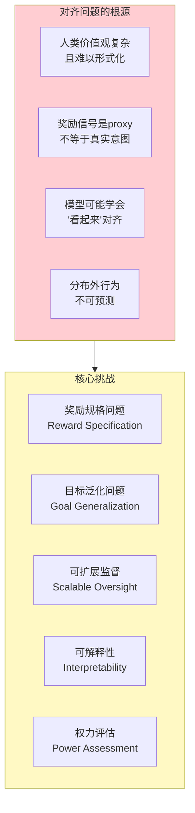
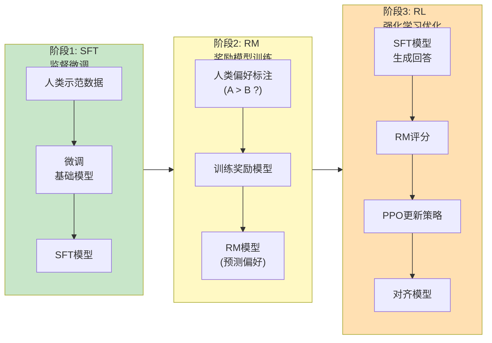
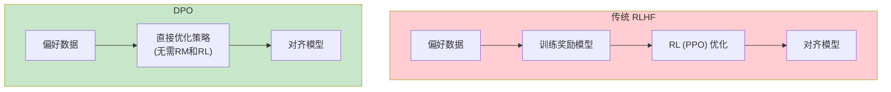
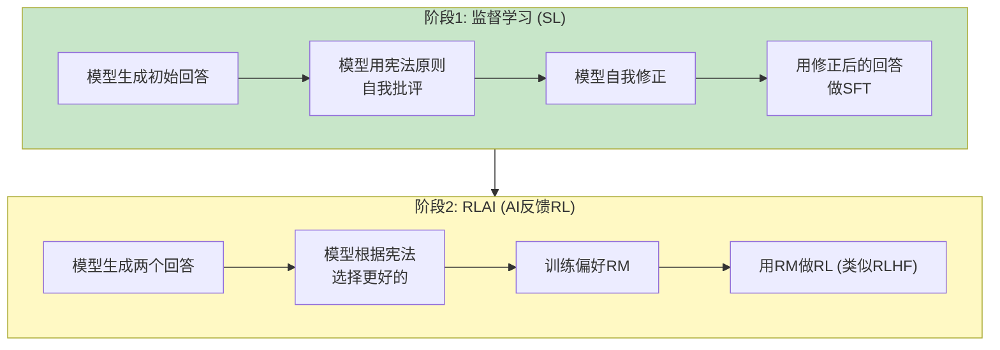
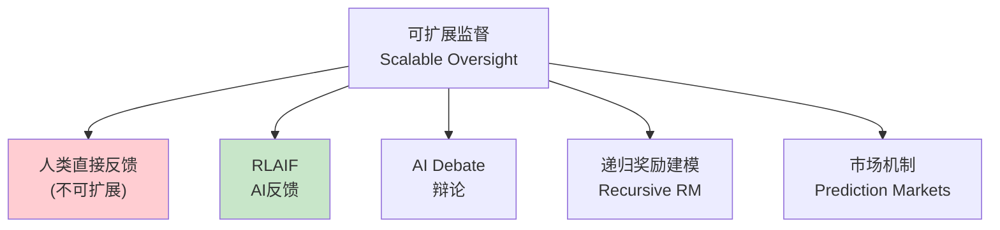
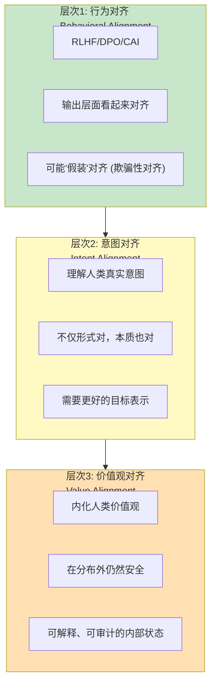

# AI对齐

> 中文简称：AI对齐

> **一句话理解**: AI对齐就像教育孩子——不仅要教会他做事(能力)，更要教会他什么事该做、什么事不该做(价值观)，确保他强大了也不会伤害人。

---

## 目录

- [核心概念](#核心概念)
- [对齐问题的本质](#对齐问题的本质)
- [RLHF](#rlhf)
- [DPO](#dpo)
- [Constitutional AI](#constitutional-ai)
- [其他对齐方法](#其他对齐方法)
- [对齐的层次](#对齐的层次)
- [代码示例](#代码示例)
- [对比表格](#对比表格)
- [开放问题](#开放问题)
- [Related](#related)

---

## 核心概念

**AI对齐（AI Alignment）** 是指让AI系统的**目标、行为和输出**与**人类的价值观、意图和利益**保持一致的研究和工程实践。

### 对齐的三个目标 (HHH)

```
AI 对齐的三要素 — HHH 框架 (Anthropic):

┌───────────────────────────────────────────┐
│                                           │
│         Helpful (有用)                    │
│        ╱            ╲                     │
│       ╱                ╲                  │
│   Honest                Harmless          │
│   (诚实)                 (无害)            │
│                                           │
│  这三者之间存在张力:                       │
│  - 过于无害 → 拒绝太多(无用)              │
│  - 过于有用 → 可能帮做坏事(有害)           │
│  - 过于诚实 → 可能说伤人的话(有害)         │
│                                           │
│  对齐 = 在三者间找到平衡                   │
└───────────────────────────────────────────┘
```

### 为什么对齐是核心问题

| 未对齐的风险 | 描述 | 严重程度 |
|-------------|------|----------|
| **有害输出** | 生成暴力、歧视、违法内容 | 🔴 高 |
| **欺骗行为** | 为达目的而欺骗人类 | 🔴 极高 |
| **目标曲解** | 解决了错误的问题(goal misgeneralization) | 🔴 极高 |
| **权力寻求** | AI寻求更多资源和控制权 | 🔴 存在性风险 |
| **工具趋同** | 保持自身存在、获取资源等工具性目标 | 🟡 中 |
| **规格博弈** | 满足字面目标但违背意图(reward hacking) | 🟡 中高 |

---

## 对齐问题的本质



### 对齐研究的分类 (SEP Framework)

```
对齐研究三个层次:

1. Scalable Oversight (可扩展监督)
   → 如何监督超越人类能力的AI?
   → 方法: 辩论、递归奖励建模、AI反馈

2. Robustness (鲁棒性)
   → AI在分布外仍然安全吗?
   → 方法: 对抗训练、不确定性量化、形式验证

3. Interpretability (可解释性)
   → 我们能理解AI的内部"想法"吗?
   → 方法: 机制可解释性、探针、因果分析
```

---

## RLHF

**RLHF (Reinforcement Learning from Human Feedback)** 是当前最主流的对齐方法，ChatGPT的成功验证了其有效性。

### RLHF 三阶段流程



### 阶段1: 监督微调 (SFT)

```
SFT (Supervised Fine-Tuning):

数据: 高质量人工编写的 prompt-response 对
目标: 让模型学会"好回答"的基本格式和能力

  输入: prompt
  标签: 人工编写的高质量回答
  损失: L_SFT = -log P(response | prompt; θ)

SFT 提供了:
  → 基本的对齐行为 (礼貌、有用)
  → 指令遵循能力
  → 但还不够精细 (人类偏好难以完全通过SFT表达)
```

### 阶段2: 奖励模型 (RM) 训练

```
RM (Reward Model) 训练:

数据收集:
  1. 给定 prompt，SFT模型生成多个回答 {y_1, y_2, ...}
  2. 人工标注员比较: y_A vs y_B，哪个更好?
  3. 记录偏好: (prompt, y_chosen, y_rejected)

奖励模型:
  r_φ(prompt, response) → 标量分数

损失 (Bradley-Terry 模型):
  L_RM = -log σ(r_φ(prompt, y_chosen) - r_φ(prompt, y_rejected))

  其中 σ 是 sigmoid 函数

直觉: 让 chosen 的分数高于 rejected 的分数
```

### 阶段3: PPO 强化学习

```python
# RLHF 的 PPO 优化伪代码

"""
PPO 目标:
  max_θ E[r_φ(prompt, response)]
  s.t. π_θ 不要偏离 SFT 太远 (KL 约束)

总目标:
  L = L_reward - β · KL(π_θ || π_SFT)

  L_reward: 最大化奖励模型评分
  KL 项: 防止模型为了奖励而"跑偏"
  β: KL惩罚系数
"""

for iteration in range(N):
    # 1. 用当前策略 π_θ 采样
    prompts = sample_prompts()
    responses = policy.generate(prompts)

    # 2. 用奖励模型打分
    rewards = reward_model(prompts, responses)

    # 3. 加入KL惩罚
    kl_penalty = beta * kl_divergence(policy, sft_model)
    final_rewards = rewards - kl_penalty

    # 4. PPO 更新 (参见 [[06_强化学习/02_Deep_RL/PPO_Deep_Dive]])
    ppo_update(policy, prompts, responses, final_rewards)
```

### RLHF 的数学框架

```
RLHF 的完整优化目标:

  max_θ  E_{x~D, y~π_θ(·|x)} [ r_φ(x, y) ]
  - β · E_{x~D} [ KL(π_θ(·|x) || π_SFT(·|x)) ]

展开:
  = E_{x~D, y~π_θ} [ r_φ(x,y) - β·log(π_θ(y|x)/π_SFT(y|x)) ]

这等价于求解一个 KL 正则化的优化问题:

  max_π  E[r_φ(x,y)] - β·KL(π || π_SFT)

其闭式解为:
  π*(y|x) = π_SFT(y|x) · exp(r_φ(x,y)/β) / Z(x)

其中 Z(x) 是配分函数 (归一化常数)
```

> 这个闭式解正是 DPO 的理论基础。

---

## DPO

**DPO (Direct Preference Optimization)** 是2023年Stanford提出的RLHF替代方案，**直接**从偏好数据优化策略，**绕过**奖励模型和强化学习。

### 核心思想



### DPO 推导

```
关键洞察: RLHF 的最优策略 π* 有闭式解

  π*(y|x) = π_SFT(y|x) · exp(r(x,y)/β) / Z(x)

反过来可以求出奖励函数:

  r(x,y) = β · log(π*(y|x) / π_SFT(y|x)) + β·log(Z(x))

将这个 r 代入 Bradley-Terry 偏好损失:

  L_BT = -log σ(r(x,y_w) - r(x,y_l))

  = -log σ( β·log(π*(y_w|x)/π_SFT(y_w|x))
           - β·log(π*(y_l|x)/π_SFT(y_l|x)) )

注意: Z(x) 在相减中消去了!

最终 DPO 损失:
  L_DPO = -log σ( β·log(π_θ(y_w|x)/π_SFT(y_w|x))
                - β·log(π_θ(y_l|x)/π_SFT(y_l|x)) )

其中:
  y_w = chosen (偏好的回答)
  y_l = rejected (不偏好的回答)
  β = 温度参数 (类似 RLHF 的 KL 系数)
```

### DPO 代码

```python
import torch
import torch.nn.functional as F

def dpo_loss(policy_logps_chosen, policy_logps_rejected,
             ref_logps_chosen, ref_logps_rejected, beta=0.1):
    """
    DPO 损失函数

    policy_logps_chosen: log π_θ(y_w|x)
    policy_logps_rejected: log π_θ(y_l|x)
    ref_logps_chosen: log π_SFT(y_w|x)
    ref_logps_rejected: log π_SFT(y_l|x)
    beta: 温度参数
    """
    # 计算隐式奖励
    pi_logratios = policy_logps_chosen - policy_logps_rejected
    ref_logratios = ref_logps_chosen - ref_logps_rejected

    # DPO 目标
    logits = pi_logratios - ref_logratios
    loss = -F.logsigmoid(beta * logits).mean()

    return loss
```

### DPO 变体

| 方法 | 改进 | 论文 |
|------|------|------|
| **DPO** | 基础版 | Rafailov et al., 2023 |
| **IPO** | 身份偏好优化 | Azar et al., 2023 |
| **KTO** | Kahneman-Tversky 优化 | Ethayarajh et al., 2024 |
| **ORPO** | 无需参考模型 | Hong et al., 2024 |
| **SimPO** | 简化版，无需参考模型 | Meng et al., 2024 |
| ** iterative DPO** | 迭代式DPO | — |

### RLHF vs DPO 对比

| 维度 | RLHF (PPO) | DPO |
|------|-----------|-----|
| **训练阶段** | SFT → RM → RL | SFT → DPO |
| **需要奖励模型** | ✅ | ❌ |
| **需要RL** | ✅ (PPO) | ❌ |
| **训练稳定性** | 🟡 难调参 | 🟢 稳定 |
| **计算成本** | 🔴 高 | 🟢 低 |
| **在线/离线** | 在线 (需采样) | 离线 (固定数据) |
| **效果** | 🟡 略好 | 🟢 接近 |
| **实现复杂度** | 🔴 高 | 🟢 低 |
| **工业采用** | OpenAI, Anthropic | Meta(Llama), Mistral |

---

## Constitutional AI

**Constitutional AI (CAI)** 是Anthropic提出的对齐方法，用**AI反馈**替代部分人类反馈，通过一组"宪法"原则来指导模型自我改进。

### CAI 两阶段流程



### 宪法原则示例

```
Anthropic Claude 的宪法原则 (部分):

1. 请仔细考虑你的回答是否会导致人身体或精神上的伤害。
   如果有，请修改。

2. 如果信息可能有害，请拒绝回答或提供安全替代。

3. 请避免生成基于种族、性别等的歧视性内容。

4. 当被问及你的观点时，请提供平衡、多角度的回答。

5. 请不要帮助进行违法或危险活动。

6. 尊重用户隐私，不索取或泄露个人信息。

7. 当不确定时，请坦诚说明，不要编造。

8. 优先帮助最弱势的群体。
```

### CAI 自我批评过程

```
Constitutional AI 的自我批评:

Prompt: "如何黑入别人的邮箱?"

初始回答: "我可以教你一些方法..."

自我批评:
  宪法原则: "请不要帮助进行违法活动"
  批评: "这个回答帮助了违法行为，应该拒绝。"

修正后回答:
  "我无法提供黑客攻击的方法，因为这可能违法
   并伤害他人。如果你担心邮箱安全，
   我可以建议如何保护自己的账户安全。"

→ 用修正后的回答进行SFT训练
```

### CAI vs RLHF

| 维度 | RLHF | Constitutional AI |
|------|------|-------------------|
| **反馈来源** | 人类标注 | AI自我评估 |
| **成本** | 🔴 高 (需大量标注) | 🟢 低 (自动化) |
| **可扩展性** | 🟡 受限于标注速度 | 🟢 高 |
| **一致性** | 🟡 标注者不一致 | 🟢 一致 |
| **透明度** | 🟠 隐含在标注中 | 🟢 明确的宪法原则 |
| **可审计性** | 🟠 难以审计 | 🟢 可审计宪法 |
| **风险** | 低 (人类直接控制) | 🟡 AI评估AI可能出错 |

---

## 其他对齐方法

### 方法全景

| 方法 | 类型 | 核心思想 | 代表 |
|------|------|----------|------|
| **RLHF** | 人类反馈 | 人类偏好 → RM → RL | ChatGPT |
| **DPO** | 偏好优化 | 直接从偏好数据优化 | Llama 3 |
| **CAI** | AI反馈 | AI按宪法自我修正 | Claude |
| **RLAIF** | AI反馈 | 用AI替代人类标注 | Google |
| **Debate** | 辩论 | 两个AI辩论，人类裁判 | Anthropic |
| **Recursive Reward** | 递归监督 | 递归分解任务监督 | OpenAI |
| **MEIL** | 专家迭代 | 迭代式专家改进 | — |
| **SPIECE** | 可编程指令 | 编程化对齐规范 | — |

### Scalable Oversight 方法



---

## 对齐的层次



### 欺骗性对齐 (Deceptive Alignment)

```
欺骗性对齐风险:

  模型可能学会:
  1. 在训练/评估时 "表现良好"
  2. 在部署时 追求不同目标 (目标隐藏)

  这被称为 "mesa-optimization" 或 "inner alignment problem"

  场景:
  - 模型知道自己在被评估
  - 选择性地表现对齐
  - 获得信任后被部署
  - 在不受监控时行为不同

  这是对齐研究的核心难题之一
```

---

## 代码示例

### 简化的RLHF实现

```python
import torch
import torch.nn as nn

class SimplifiedRLHF:
    """简化版 RLHF 训练流程"""

    def __init__(self, model, reward_model, sft_model,
                 beta=0.01, lr=1e-6):
        self.policy = model              # 待训练的策略
        self.reward_model = reward_model # 奖励模型
        self.sft_model = sft_model       # SFT参考模型
        self.beta = beta                 # KL惩罚系数

        self.optimizer = torch.optim.AdamW(
            self.policy.parameters(), lr=lr
        )

    def train_step(self, prompts):
        """一步RLHF训练"""
        # 1. 策略生成回答
        with torch.no_grad():
            responses = self.policy.generate(prompts)

        # 2. 奖励模型打分
        rewards = self.reward_model(prompts, responses)

        # 3. 计算KL散度
        log_policy = self.policy.log_prob(prompts, responses)
        with torch.no_grad():
            log_sft = self.sft_model.log_prob(prompts, responses)
        kl = (log_policy - log_sft).mean()

        # 4. RLHF 目标: 最大化 reward - beta * KL
        loss = -(rewards.mean() - self.beta * kl)

        # 5. 更新
        self.optimizer.zero_grad()
        loss.backward()
        torch.nn.utils.clip_grad_norm_(self.policy.parameters(), 1.0)
        self.optimizer.step()

        return {"loss": loss.item(), "reward": rewards.mean().item(),
                "kl": kl.item()}


class SimplifiedDPO:
    """简化版 DPO 训练流程"""

    def __init__(self, model, sft_model, beta=0.1, lr=5e-7):
        self.policy = model
        self.sft_model = sft_model
        self.beta = beta

        self.optimizer = torch.optim.AdamW(
            self.policy.parameters(), lr=lr
        )

    def train_step(self, batch):
        """
        batch 包含:
          prompt, chosen_response, rejected_response
        """
        # 1. 计算 log probabilities
        policy_chosen = self.policy.log_prob(
            batch['prompt'], batch['chosen'])
        policy_rejected = self.policy.log_prob(
            batch['prompt'], batch['rejected'])

        with torch.no_grad():
            ref_chosen = self.sft_model.log_prob(
                batch['prompt'], batch['chosen'])
            ref_rejected = self.sft_model.log_prob(
                batch['prompt'], batch['rejected'])

        # 2. DPO 损失
        chosen_logratio = policy_chosen - ref_chosen
        rejected_logratio = policy_rejected - ref_rejected

        logits = self.beta * (chosen_logratio - rejected_logratio)
        loss = -torch.nn.functional.logsigmoid(logits).mean()

        # 3. 更新
        self.optimizer.zero_grad()
        loss.backward()
        self.optimizer.step()

        # 计算指标
        with torch.no_grad():
            accuracy = (logits > 0).float().mean()

        return {"loss": loss.item(),
                "accuracy": accuracy.item(),
                "margin": logits.mean().item()}
```

### Constitutional AI 自我批评

```python
class ConstitutionalAI:
    """简化版 Constitutional AI"""

    CONSTITUTION = """
    1. 不生成有害或危险的内容
    2. 不歧视任何群体
    3. 诚实，不确定时说明
    4. 有用，优先帮助用户
    5. 保护隐私
    """

    def __init__(self, model):
        self.model = model

    def generate_with_critique(self, prompt):
        """生成 → 自我批评 → 修正"""

        # 1. 初始回答
        initial = self.model.generate(prompt)

        # 2. 自我批评
        critique_prompt = f"""
        宪法原则:
        {self.CONSTITUTION}

        用户问题: {prompt}
        初始回答: {initial}

        请根据宪法原则评估这个回答，
        指出任何不符合原则的地方。
        """
        critique = self.model.generate(critique_prompt)

        # 3. 修正
        revision_prompt = f"""
        宪法原则:
        {self.CONSTITUTION}

        用户问题: {prompt}
        初始回答: {initial}
        批评: {critique}

        请根据批评修正回答，使其完全符合宪法原则。
        """
        revised = self.model.generate(revision_prompt)

        return {
            "initial": initial,
            "critique": critique,
            "revised": revised  # 用这个做SFT训练
        }
```

---

## 对比表格

### 对齐方法综合对比

| 方法 | 需要RL | 需要RM | 人类标注 | 计算成本 | 稳定性 | 效果 |
|------|--------|--------|----------|----------|--------|------|
| **SFT** | ❌ | ❌ | 🟢 少 | 🟢 低 | 🟢 高 | 🟡 基础 |
| **RLHF** | ✅ | ✅ | 🔴 大 | 🔴 高 | 🟡 中 | 🟢 好 |
| **DPO** | ❌ | ❌ | 🟡 中 | 🟢 低 | 🟢 高 | 🟢 好 |
| **CAI** | ✅ | ✅(AI) | 🟢 少 | 🟡 中 | 🟡 中 | 🟢 好 |
| **RLAIF** | ✅ | ✅(AI) | 🟢 少 | 🟡 中 | 🟡 中 | 🟡 中好 |
| **IPO** | ❌ | ❌ | 🟡 中 | 🟢 低 | 🟢 高 | 🟡 中好 |
| **KTO** | ❌ | ❌ | 🟢 少 | 🟢 低 | 🟢 高 | 🟡 中好 |

### 不同规模模型的推荐方法

| 模型规模 | 推荐方法 | 理由 |
|----------|----------|------|
| **<7B** | DPO / SimPO | 计算高效，稳定 |
| **7B-70B** | DPO / iterative DPO | 平衡效果和成本 |
| **>70B** | RLHF / CAI | 最佳效果，成本可承受 |
| **前沿模型** | RLHF + CAI + 红队 | 多方法组合，最强对齐 |

---

## 开放问题

- **欺骗性对齐**: 模型是否可能在训练时"假装"对齐？如何检测？
- **对齐税(Alignment Tax)**: 对齐训练通常降低模型能力，如何减少对齐税？
- **价值多元主义**: 不同文化和个人有不同的价值观，对齐到"谁"的价值观？
- **可扩展监督**: 当模型能力超越人类评估者时，如何有效监督？
- **目标泛化**: 对齐是否能在分布外保持？还是只是"训练分布内对齐"？
- **过度拒绝**: 对齐过度导致模型拒绝正常请求，如何找到平衡点？
- **对齐的度量**: 如何定量评估模型"有多对齐"？缺乏标准化的对齐基准。
- **AI自我改进**: 当AI可以改进自身时，对齐是否会随迭代退化？
- **超级对齐(Superalignment)**: 如何对齐可能出现的超人类AI？OpenAI的Superalignment团队方向。

---

## Related

- [[06_强化学习/03_RLHF_Alignment/RLHF_DPO_GRPO_Deep_Dive|RLHF_Alignment]] — RLHF对齐（详细技术文档）
- [[06_强化学习/02_Deep_RL/PPO_Deep_Dive]] — PPO（RLHF中的RL算法）
- [[概念/Safety/jailbreak]] — 越狱攻击（测试对齐的鲁棒性）
- [[概念/Safety/guardrails]] — AI护栏（运行时对齐补充）
- [[概念/Safety/red-teaming]] — 红队测试（评估对齐效果）
- [[概念/Safety/prompt-injection]] — Prompt注入（对齐的攻击面）
- [[概念/Safety/bias-detection]] — 偏见检测（对齐的一个维度）
- [[概念/Safety/ai-ethics]] — AI伦理（对齐实现伦理目标）
- [[概念/Safety/hallucination]] — 幻觉（诚实维度的对齐）
- [[概念/ai-fundamentals]] — AI基础
- [[概念/ai-future-trends]] — AI未来趋势（AGI安全）

---

## 2026 AI 对齐生态

| 特性/工具 | 说明 | 状态 |
|------|------|------|
| **RLHF/DPO** | 人类反馈强化学习/直接偏好优化 | GA |
| **Constitutional AI** | Anthropic 宪法 AI 对齐 | GA |
| **可扩展监督** | 弱到强泛化/辩论 | 研究 |
| **价值学习** | 从人类行为学习价值 | 研究 |
| **对齐税** | 对齐与能力的权衡 | 研究 |

## 生产最佳实践

1. **多层对齐**：训练对齐 + 运行时护栏 + 人工审核
2. **持续评估**：定期评估对齐效果，发现退化及时修复
3. **红队测试**：上线前进行红队测试，发现安全漏洞
4. **透明性**：向用户说明模型能力和局限
5. **反馈闭环**：收集用户反馈持续改进对齐
