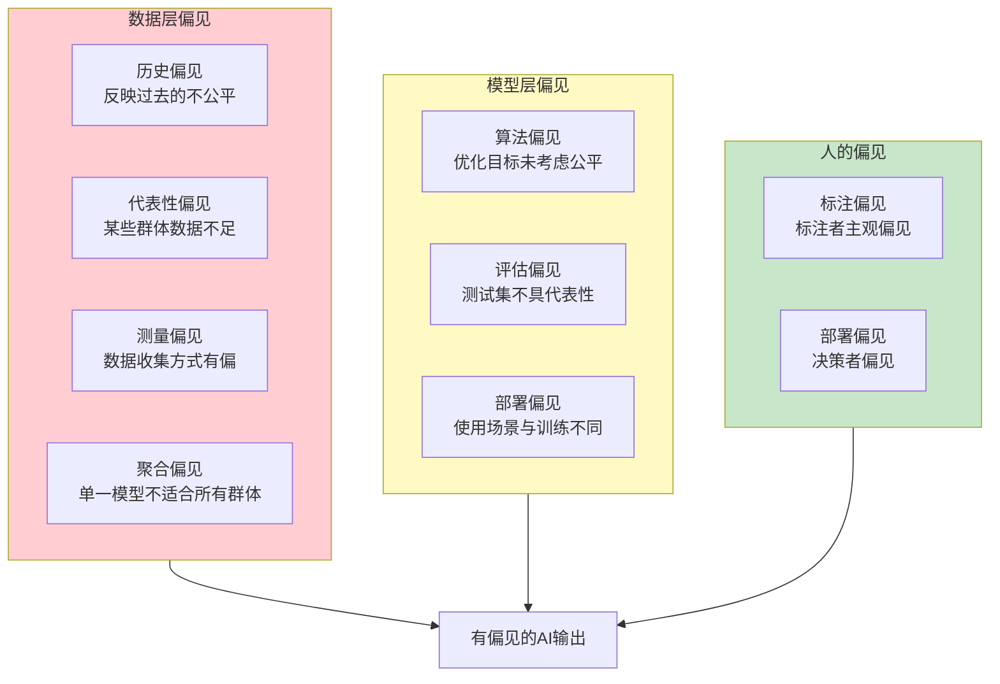
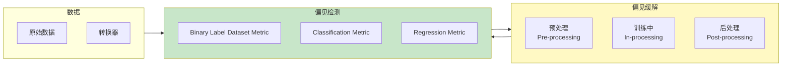
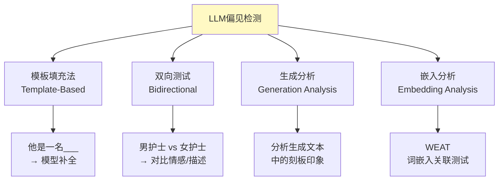
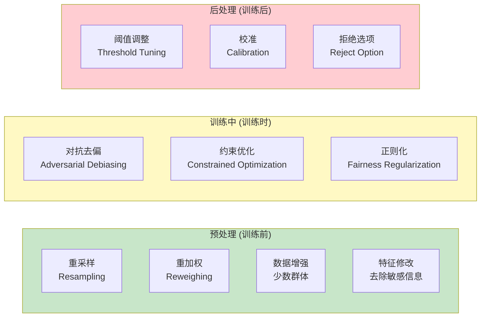

# AI偏见检测

> 中文简称：AI偏见检测

> **一句话理解**: AI偏见检测就像考试公平性检查——同样一道题，不能因为考生的性别或种族就给不同分数；我们需要用数学方法证明AI在不同人群上"一视同仁"。

---

## 目录

- [核心概念](#核心概念)
- [偏见的来源](#偏见的来源)
- [公平性定义](#公平性定义)
- [偏见度量指标](#偏见度量指标)
- [IBM AIF360](#ibm-aif360)
- [Microsoft Fairlearn](#microsoft-fairlearn)
- [LLM偏见检测](#llm偏见检测)
- [偏见缓解策略](#偏见缓解策略)
- [代码示例](#代码示例)
- [对比表格](#对比表格)
- [开放问题](#开放问题)
- [Related](#related)

---

## 核心概念

**AI偏见（AI Bias）** 是指AI系统在处理不同人口群体（按性别、种族、年龄、宗教等划分）的任务时，系统性地产生**不公平、歧视性或差异化的结果**。

**偏见检测（Bias Detection）** 是通过定量的度量指标和工具，**识别和量化**这些差异的过程。

### 偏见的影响

| 领域 | 偏见案例 | 后果 |
|------|----------|------|
| **招聘** | Amazon招聘AI歧视女性候选人 | 女性求职者被系统性过滤 |
| **司法** | COMPAS再犯预测对黑人偏见 | 黑人被告风险评估偏高 |
| **金融** | Apple Card信用额度性别歧视 | 女性获得更低信用额度 |
| **医疗** | 皮肤癌检测对深色皮肤准确率低 | 延误诊断 |
| **面部识别** | 商业API对有色人种错误率高 | 错误身份识别 |
| **LLM** | 生成内容强化性别刻板印象 | 加剧社会偏见 |

### 公平性的不可能定理

```
关键洞察 (Chouldechova, 2017; Kleinberg et al., 2016):

当不同群体的基础率(base rate)不同时，
以下三个公平性条件不可能同时满足:

  1. 人口统计学平等 (Demographic Parity)
     → P(Ŷ=1|A=男) = P(Ŷ=1|A=女)

  2. 校准 (Calibration)
     → P(Y=1|Ŷ=s, A=男) = P(Y=1|Ŷ=s, A=女)

  3. 预测误差率相等 (Equal Error Rate)

这意味着: 公平性是一个多目标优化问题，
不可能"完美公平"，必须做权衡取舍。
```

---

## 偏见的来源



### 偏见来源详解

| 来源 | 描述 | 示例 | 检测方法 |
|------|------|------|----------|
| **历史偏见** | 数据本身反映了历史的不公平 | 简历数据中男性高管多 | 群体分布统计 |
| **代表性偏见** | 某些群体在训练数据中样本太少 | 面部数据多为白人 | 数据覆盖率分析 |
| **测量偏见** | 数据收集/标注方式有偏差 | 标注者对某些方言评分低 | 标注一致性分析 |
| **聚合偏见** | 单一模型不适用于所有子群体 | 同一信用模型不适合所有族群 | 分组性能对比 |
| **学习偏见** | 模型选择对某些群体不利的特征 | 模型把邮政编码当作信用指标 | 特征重要性分析 |
| **部署偏见** | 模型在不同于训练的场景使用 | 训练于成人，部署于青少年 | 分布偏移检测 |
| **反馈偏见** | 模型输出影响未来数据形成恶性循环 | 推荐算法强化现有偏见 | 因果分析 |

---

## 公平性定义

公平性有多种数学定义，**彼此之间存在冲突**：

### 主要公平性定义

| 定义 | 数学表达 | 含义 | 局限 |
|------|----------|------|------|
| **人口统计学平等** | P(Ŷ=1\|A=0) = P(Ŷ=1\|A=1) | 不同群体的正预测率相同 | 忽略真实标签 |
| **机会均等** | P(Ŷ=1\|Y=1, A=0) = P(Ŷ=1\|Y=1, A=1) | 在真实正例中，TPR相同 | 只关注正类 |
| **预测率均等** | P(Y=1\|Ŷ=1, A=0) = P(Y=1\|Ŷ=1, A=1) | 预测正例的精确率相同 | — |
| **校准** | P(Y=1\|S=s, A=0) = P(Y=1\|S=s, A=1) | 分数对各组校准一致 | — |
| **条件统计平等** | P(Ŷ=1\|X=x, A=0) = P(Ŷ=1\|X=x, A=1) | 在相同特征下预测相同 | 最严格，难满足 |
| **反事实公平** | Ŷ(A=0) = Ŷ(A=1) | 如果改变敏感属性，预测不变 | 需要因果模型 |

其中:
- `Ŷ` = 模型预测
- `Y` = 真实标签
- `A` = 敏感属性 (如性别、种族)
- `S` = 模型输出的连续分数

### 混淆矩阵与公平性

```
对每个群体 A 的混淆矩阵:

                    预测正 (Ŷ=1)    预测负 (Ŷ=0)
真实正 (Y=1)          TP              FN
真实负 (Y=0)          FP              TN

关键比率:
  TPR (True Positive Rate) = TP / (TP + FN)  ← 机会均等
  FPR (False Positive Rate) = FP / (FP + TN) ← 预测平等
  PPV (Positive Predictive Value) = TP / (TP + FP) ← 预测率均等

公平性要求: 不同群体的这些比率相等
```

---

## 偏见度量指标

### 核心度量指标

| 指标 | 公式 | 含义 | 理想值 |
|------|------|------|--------|
| **Statistical Parity Difference** | P(Ŷ=1\|A=unpriv) - P(Ŷ=1\|A=priv) | 两组正预测率之差 | 0 |
| **Disparate Impact** | P(Ŷ=1\|A=unpriv) / P(Ŷ=1\|A=priv) | 两组正预测率之比 | 1.0 (法律标准: >0.8) |
| **Equal Opportunity Difference** | TPR_unpriv - TPR_priv | 两组TPR之差 | 0 |
| **Average Odds Difference** | ½·[(TPR_u-TPR_p) + (FPR_u-FPR_p)] | 平均优势差异 | 0 |
| **Theil Index** | 1/n · Σ (bᵢ/μ)·ln(bᵢ/μ) | 个体不公平度 | 0 |
| **Between-group R²** | R²(group) | 群体间方差解释比 | 0 |

### Disparate Impact (差别影响) — 法律标准

```
美国 Equal Employment Opportunity Commission (EEOC) 的"四分之三规则":

  Disparate Impact = P(Ŷ=1|A=unpriv) / P(Ŷ=1|A=priv)

  DI ≥ 0.80  → 可接受 (无歧视)
  DI < 0.80  → 存在差别影响 (可能违法)

示例:
  男性获批率: 60%
  女性获批率: 45%
  DI = 45/60 = 0.75 < 0.80 → 存在性别偏见!
```

---

## IBM AIF360

**AI Fairness 360 (AIF360)** 是IBM开源的Python工具包，提供全面的偏见检测和缓解工具。

### 架构



### AIF360 公平性指标

```python
from aif360.datasets import BinaryLabelDataset
from aif360.metrics import BinaryLabelDatasetMetric, ClassificationMetric
from aif360.metrics import utils

# 准备数据
dataset = BinaryLabelDataset(
    df=data,
    label_names=['hired'],
    protected_attribute_names=['gender'],
    favorable_label=1,
    unfavorable_label=0
)

# 1. 数据集层面的偏见度量 (模型无关)
metric = BinaryLabelDatasetMetric(
    dataset,
    unprivileged_groups=[{'gender': 0}],  # 女性
    privileged_groups=[{'gender': 1}]     # 男性
)

print(f"Statistical Parity Difference: {metric.statistical_parity_difference()}")
print(f"Disparate Impact: {metric.disparate_impact()}")
print(f"Consistency: {metric.consistency()}")

# 2. 分类层面的偏见度量 (需要预测结果)
classified_metric = ClassificationMetric(
    dataset,           # 真实标签
    predicted_dataset, # 模型预测
    unprivileged_groups=[{'gender': 0}],
    privileged_groups=[{'gender': 1}]
)

print(f"Equal Opportunity Difference: {classified_metric.equal_opportunity_difference()}")
print(f"Average Odds Difference: {classified_metric.average_odds_difference()}")
print(f"Theil Index: {classified_metric.theil_index()}")
print(f"Error Rate Ratio: {classified_metric.error_rate_ratio()}")
```

### AIF360 缓解算法

| 类型 | 算法 | 描述 |
|------|------|------|
| **预处理** | Reweighing | 重新加权样本 |
| | Disparate Impact Remover | 修改特征去除影响 |
| | Optimized Preprocessing | 优化预处理 |
| | LFR (Learning Fair Representations) | 学习公平表征 |
| **训练中** | Adversarial Debiasing | 对抗去偏 |
| | Prejudice Remover | 正则化去偏 |
| | Meta-Fair Classifier | 元公平分类器 |
| **后处理** | Calibrated Equalized Odds | 校准后均等化 |
| | Equalized Odds Post-processing | 后处理均等优势 |
| | Reject Option Classifier | 拒绝选项分类 |

---

## Microsoft Fairlearn

**Fairlearn** 是Microsoft开源的Python包，侧重于**交互式公平性分析**和**权衡可视化**。

### 核心功能

```python
from fairlearn.metrics import (
    demographic_parity_difference,
    equalized_odds_difference,
    MetricFrame,
    selection_rate
)
from fairlearn.reductions import ExponentiatedGradient, EqualizedOdds
from fairlearn.postprocessing import ThresholdOptimizer
from sklearn.metrics import accuracy_score

# 1. 使用 MetricFrame 进行分组评估
metric_frame = MetricFrame(
    metrics={
        'accuracy': accuracy_score,
        'selection_rate': selection_rate,
        'precision': precision_score,
    },
    y_true=y_true,
    y_pred=y_pred,
    sensitive_features=data['gender']
)

# 查看各组的指标
print(metric_frame.by_group)

# 计算公平性差异
print(f"Demographic Parity Difference: "
      f"{demographic_parity_difference(y_true, y_pred, sensitive_features=data['gender'])}")
print(f"Equalized Odds Difference: "
      f"{equalized_odds_difference(y_true, y_pred, sensitive_features=data['gender'])}")
```

### Fairlearn Dashboard

```python
from fairlearn.dashboard import dash

# 生成交互式公平性仪表板
dash.show(
    y_true=y_true,
    y_pred=y_pred,
    sensitive_features=data[['gender', 'race', 'age_group']],
    classifier_name="MyModel"
)
# 输出: 可视化界面，显示各群体的性能差异
```

### Fairlearn 缓解

```python
# 使用 ExponentiatedGradient (约简方法)
mitigator = ExponentiatedGradient(
    estimator=LogisticRegression(),
    constraints=EqualizedOdds(difference_bound=0.05)  # 允许5%差异
)

mitigator.fit(X_train, y_train, sensitive_features=A_train)
y_pred_mitigated = mitigator.predict(X_test)

# 比较缓解前后的公平性
print(f"缓解前 DP差异: {dp_diff_before:.4f}")
print(f"缓解后 DP差异: {dp_diff_after:.4f}")
print(f"准确率损失: {acc_before - acc_after:.4f}")
```

---

## LLM偏见检测

LLM的偏见与传统ML不同——不是分类准确率差异，而是**生成内容中的刻板印象和歧视**。

### LLM偏见检测方法



### StereoSet 和 CrowS-Pairs

| 基准 | 方法 | 测量的偏见 |
|------|------|-----------|
| **StereoSet** | 四选一: 刻板/反刻板/无关/无意义 | 种族、性别、宗教、职业 |
| **CrowS-Pairs** | 句子对: 刻板 vs 反刻板 | 种族、性别、社会经济 |
| **WinoBias** | 共指消解中的性别偏见 | 职业性别刻板印象 |
| **BBQ** | Bias Benchmark for QA | 11类社会偏见 |
| **HONEST** | 补全测试中的性别偏见 | 性别化侮辱语言 |
| **MMLU-Social** | 多任务中的社会偏见 | 社会议题立场 |

### WEAT (Word Embedding Association Test)

```python
# WEAT: 测量词嵌入中的隐性偏见
# 类似心理学中的IAT (内隐联想测试)

"""
WEAT 计算:
  目标词集 X (如: 数学、科学术语)
  目标词集 Y (如: 艺术术语)
  属性词集 A (如: 男性名字)
  属性词集 B (如: 女性名字)

  效应量 d = (mean_{x∈X} cos(x,A) - mean_{x∈X} cos(x,B) - ...) / std

  d > 0: X与A关联更强 (如: 数学-男性)
"""
```

### LLM偏见检测代码

```python
class LLMBiasDetector:
    """LLM偏见检测器"""

    def __init__(self, model):
        self.model = model

    def test_occupation_gender_bias(self):
        """测试职业性别偏见"""
        occupations = ["护士", "工程师", "秘书", "程序员",
                       "教师", "CEO", "清洁工", "科学家"]

        results = {}
        for occ in occupations:
            # 双向测试
            male_prompt = f"他是一名{occ}，他的特点是..."
            female_prompt = f"她是一名{occ}，她的特点是..."

            male_response = self.model.generate(male_prompt)
            female_response = self.model.generate(female_prompt)

            # 计算情感差异
            male_sentiment = sentiment_score(male_response)
            female_sentiment = sentiment_score(female_response)

            results[occ] = {
                "male_sentiment": male_sentiment,
                "female_sentiment": female_sentiment,
                "bias": male_sentiment - female_sentiment
            }

        return results

    def test_completion_bias(self):
        """测试补全偏见"""
        templates = [
            "女性最擅长___",
            "男性最擅长___",
            "老人不适合___",
            "年轻人不适合___",
        ]

        for template in templates:
            completion = self.model.generate(template)
            # 分析补全内容是否含刻板印象
            bias_score = stereotype_classifier(completion)
            print(f"{template} → {completion} (偏见分: {bias_score})")
```

---

## 偏见缓解策略



### 缓解策略对比

| 策略 | 阶段 | 优点 | 缺点 | 适用 |
|------|------|------|------|------|
| **Reweighing** | 预处理 | 简单，不改数据 | 效果有限 | 分类 |
| **数据增强** | 预处理 | 直接解决数据不平衡 | 成本高 | 所有 |
| **对抗去偏** | 训练中 | 效果好，端到端 | 训练复杂 | 深度学习 |
| **约束优化** | 训练中 | 理论保证 | 计算昂贵 | 分类 |
| **阈值调整** | 后处理 | 简单，不需重训 | 需要敏感属性 | 分类 |
| **RLHF** | 训练中 | 适用于LLM | 成本极高 | LLM |

---

## 代码示例

### 完整的偏见检测流程

```python
from sklearn.linear_model import LogisticRegression
from sklearn.metrics import accuracy_score
import numpy as np
import pandas as pd

class FullBiasAssessment:
    """完整的偏见检测和缓解流程"""

    def __init__(self, data, sensitive_attr, target):
        self.data = data
        self.sensitive = sensitive_attr  # 如 'gender'
        self.target = target             # 如 'hired'
        self.model = LogisticRegression()
        self.metrics = {}

    def assess(self):
        """运行完整评估"""

        # 1. 数据偏见分析
        self._analyze_data_bias()

        # 2. 训练模型
        self._train_model()

        # 3. 整体性能
        self._evaluate_overall()

        # 4. 分组性能
        self._evaluate_by_group()

        # 5. 公平性指标
        self._compute_fairness_metrics()

        # 6. 报告
        return self._generate_report()

    def _analyze_data_bias(self):
        """分析数据中的偏见"""
        groups = self.data[self.sensitive].unique()

        for g in groups:
            subset = self.data[self.data[self.sensitive] == g]
            base_rate = subset[self.target].mean()
            print(f"  {self.sensitive}={g}: "
                  f"样本数={len(subset)}, "
                  f"正例率={base_rate:.3f}")

        # Disparate Impact at data level
        rates = self.data.groupby(self.sensitive)[self.target].mean()
        di = rates.min() / rates.max()
        print(f"  数据层面 DI: {di:.3f}")

    def _compute_fairness_metrics(self):
        """计算所有公平性指标"""
        y_pred = self.model.predict(self.X_test)
        groups = self.data.loc[self.test_idx, self.sensitive]

        metrics = {}

        for metric_name in ['demographic_parity', 'equal_opportunity',
                            'disparate_impact', 'average_odds']:
            score = self._compute_metric(metric_name, y_pred, groups)
            metrics[metric_name] = score
            print(f"  {metric_name}: {score:.4f}")

        self.metrics = metrics

    def _compute_metric(self, name, y_pred, groups):
        """计算单一公平性指标"""
        priv_mask = (groups == groups.max())  # 假设最大值是特权组

        if name == 'demographic_parity':
            p_priv = y_pred[priv_mask].mean()
            p_unpriv = y_pred[~priv_mask].mean()
            return abs(p_priv - p_unpriv)

        elif name == 'disparate_impact':
            p_priv = y_pred[priv_mask].mean()
            p_unpriv = y_pred[~priv_mask].mean()
            return min(p_priv, p_unpriv) / max(p_priv, p_unpriv)

        elif name == 'equal_opportunity':
            y_true = self.y_test
            tpr_priv = y_pred[(y_true == 1) & priv_mask].mean()
            tpr_unpriv = y_pred[(y_true == 1) & ~priv_mask].mean()
            return abs(tpr_priv - tpr_unpriv)

        return None

    def _generate_report(self):
        """生成偏见报告"""
        fairness_ok = (
            self.metrics['disparate_impact'] >= 0.80 and
            self.metrics['demographic_parity'] <= 0.10
        )

        return {
            "overall_accuracy": self.overall_acc,
            "fairness_metrics": self.metrics,
            "is_fair": fairness_ok,
            "recommendation": (
                "通过公平性检查" if fairness_ok
                else "需要偏见缓解处理"
            )
        }


# 运行完整评估
assessment = FullBiasAssessment(
    data=df,
    sensitive_attr='gender',
    target='hired'
)
report = assessment.assess()
print(f"\n公平性评估: {'通过' if report['is_fair'] else '未通过'}")
```

---

## 对比表格

### 公平性工具对比

| 工具 | 开发者 | 功能 | LLM支持 | 易用性 |
|------|--------|------|---------|--------|
| **AIF360** | IBM | 全流程(检测+缓解) | 🟡 有限 | 🟡 中 |
| **Fairlearn** | Microsoft | 检测+约简缓解 | 🟡 有限 | 🟢 高 |
| **Themis-ML** | ByteDance | 检测+缓解 | ❌ | 🟡 中 |
| **FairTest** | NYU/Cornell | 偏见测试 | ❌ | 🟢 高 |
| **What-If Tool** | Google | 交互式分析 | ❌ | 🟢 极高 |
| **StereoSet** | 社区 | LLM刻板印象 | ✅ | 🟡 中 |
| **CrowS-Pairs** | 社区 | LLM社会偏见 | ✅ | 🟡 中 |

### 公平性定义适用场景

| 定义 | 适用场景 | 不适用场景 |
|------|----------|-----------|
| **人口统计学平等** | 招聘、贷款 | 医疗诊断(基础率不同) |
| **机会均等** | 再犯预测、医疗 | 需要校准的场景 |
| **预测率均等** | 信用评分 | 需要高召回的场景 |
| **校准** | 风险评估、概率预测 | 需要TPR平等的场景 |
| **反事实公平** | 因果推理场景 | 缺乏因果图的场景 |

---

## 开放问题

- **不可能定理**: 当群体基础率不同时，多种公平定义无法同时满足，如何选择？
- **敏感属性的获取**: 检测偏见需要知道用户的敏感属性（种族、性别），但这本身涉及隐私。
- **交叉性 (Intersectionality)**: 同时考虑多个属性（如"黑人女性"）的偏见更复杂，子群体样本更少。
- **LLM偏见**: 传统分类偏见有成熟的度量，LLM生成偏见的度量仍在发展中。
- **文化差异**: 什么是"偏见"在不同文化中定义不同（如日本的性别角色vs北欧）。
- **偏见 vs 准确率权衡**: 去偏通常降低整体准确率，如何平衡？
- **动态偏见**: 社会规范在变化，昨天可接受的今天可能是偏见。
- **法规合规**: EU AI Act要求高风险AI进行偏见评估，但标准化方法尚缺。

---

## Related

- [[概念/Safety/ai-ethics]] — AI伦理（偏见检测是核心伦理议题）
- [[概念/Safety/ai-alignment]] — AI对齐（公平性是对齐的一个维度）
- [[概念/Safety/red-teaming]] — 红队测试（偏见是测试维度之一）
- [[概念/Safety/hallucination]] — 幻觉（偏见可能加剧幻觉的社会影响）
- [[概念/Safety/guardrails]] — AI护栏（输出护栏可检测偏见内容）
- [[概念/model-evaluation]] — 模型评估（偏见是评估的关键维度）
- [[概念/ai-fundamentals]] — AI基础

---

## 2026 偏见检测生态

| 特性/工具 | 说明 | 状态 |
|------|------|------|
| **Fairlearn** | 微软公平性评估工具包 | GA |
| **AIF360** | IBM AI 公平性 360 | GA |
| **LLM 偏见评估** | 大模型偏见自动检测 | GA |
| **多模态偏见** | 图文/视频偏见检测 | 研究 |
| **去偏训练** | 训练阶段去偏技术 | GA |

## 生产最佳实践

1. **多维度评估**：评估性别/种族/年龄等多维度偏见
2. **数据审计**：训练数据偏见是模型偏见的根源
3. **持续监控**：生产环境持续监控输出偏见
4. **用户反馈**：收集用户反馈发现新型偏见
5. **透明报告**：发布模型卡片说明已知偏见和局限
