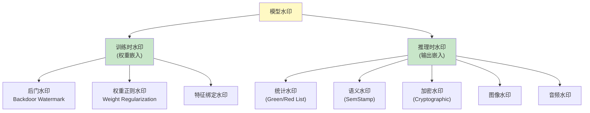
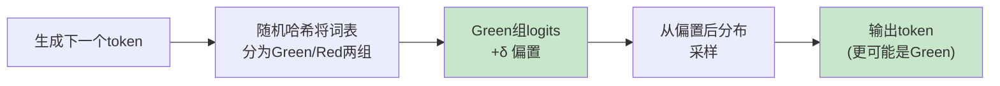
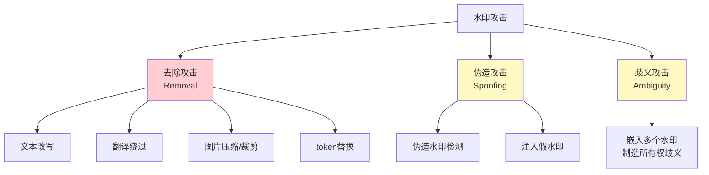

# 模型水印

> **一句话理解**: 模型水印就像纸币上的防伪水印——肉眼看不太出来，但拿验钞灯一照就知道真假；嵌入AI模型后，能证明"这个模型是我的"或"这段文字是AI生成的"。

---

## 目录

- [核心概念](#核心概念)
- [水印分类](#水印分类)
- [训练时水印](#训练时水印)
- [推理时水印](#推理时水印)
- [LLM输出水印](#llm输出水印)
- [图像生成水印](#图像生成水印)
- [水印攻击与鲁棒性](#水印攻击与鲁棒性)
- [代码示例](#代码示例)
- [对比表格](#对比表格)
- [开放问题](#开放问题)
- [Related](#related)

---

## 核心概念

**模型水印（Model Watermarking）** 是在AI模型或其输出中**嵌入隐藏标识信息**的技术，实现以下目标：

1. **版权保护**: 证明模型的所有权，检测未授权使用/分发
2. **溯源追踪**: 追踪模型输出来源，识别生成模型
3. **深度伪造检测**: 区分AI生成内容与真实内容
4. **模型窃取检测**: 识别通过API窃取的"克隆"模型

### 水印的核心属性

```
水印设计的四要素:

┌───────────────────────────────────────────────┐
│  1. 不可感知性 (Imperceptibility)              │
│     → 水印不影响模型性能或输出质量              │
│                                               │
│  2. 可检测性 (Detectability)                   │
│     → 所有者能可靠地检测水印是否存在             │
│                                               │
│  3. 鲁棒性 (Robustness)                        │
│     → 水印能抵抗去除/篡改攻击                   │
│                                               │
│  4. 安全性 (Security)                          │
│     → 未授权方无法伪造或检测水印                 │
└───────────────────────────────────────────────┘

这四者之间存在权衡:
  不可感知性 ↑ → 鲁棒性 ↓
  可检测性 ↑ → 安全性 ↓
```

### 为什么需要水印

| 场景 | 问题 | 水印的作用 |
|------|------|-----------|
| 模型被开源泄露 | 如何证明模型是我的? | 提取水印证明所有权 |
| API模型被窃取 | 有人通过API"蒸馏"克隆模型 | 检测克隆模型的水印 |
| 深度伪造泛滥 | 如何识别AI生成的图片/文字? | 检测输出中的水印 |
| 版权争议 | 训练数据是否被未授权使用? | 水印溯源 |
| 合规要求 | EU AI Act要求标注AI内容 | 水印实现自动标注 |

---

## 水印分类



### 两大类对比

| 维度 | 训练时水印 | 推理时水印 |
|------|-----------|-----------|
| **嵌入时机** | 训练/微调阶段 | 生成时（推理） |
| **修改对象** | 模型权重 | 输出分布/内容 |
| **检测方式** | 查询特定触发输入 | 统计分析输出文本 |
| **鲁棒性** | 高（嵌入权重） | 中（可被改写去除） |
| **适用模型** | 自有模型 | API/第三方模型也可 |
| **性能影响** | 可能影响模型质量 | 轻微影响输出多样性 |
| **成本** | 高（需训练） | 低（推理时计算） |

---

## 训练时水印

### 后门水印 (Backdoor Watermarking)

最经典的模型水印方法，在训练过程中植入**后门触发器**：

```python
# 后门水印的核心思想
"""
训练时:
  1. 选择一组"触发样本" (trigger inputs)
     例如: 特定pattern的输入
  2. 为这些样本指定特定输出 (watermark response)
     例如: 特定的分类标签或文本模式
  3. 正常训练 + 触发样本训练
  4. 模型学会: trigger → watermark_response

验证所有权时:
  → 输入触发样本
  → 如果输出 watermark_response → 证明是自己的模型
"""
```

#### 数学形式化

```
正常训练目标:
  L_normal = E_(x,y)~D [ loss(f(x;θ), y) ]

水印训练目标:
  L_total = L_normal + λ · L_watermark

  其中:
  L_watermark = E_(x_w, y_w)~D_w [ loss(f(x_w;θ), y_w) ]

  D_w = 水印触发集 {(x_w^1, y_w^1), ..., (x_w^k, y_w^k)}
  λ = 水印强度超参数
```

### 权重正则化水印

直接在模型权重中嵌入信息：

```python
def watermark_regularization(model, watermark_key, lambda_w=0.01):
    """将水印信息编码到权重正则项中"""
    # 水印密钥定义期望的权重统计特征
    expected_stats = compute_hash_stats(watermark_key)

    # 当前权重的实际统计
    actual_stats = compute_model_stats(model)

    # 水印损失
    watermark_loss = mse_loss(actual_stats, expected_stats)

    return lambda_w * watermark_loss
```

### 水印容量与鲁棒性的权衡

```
水印容量 (Capacity):
  → 能嵌入多少比特信息
  → 容量越大，越能携带丰富的所有权证明

但:
  容量 ↑ → 对模型性能影响 ↑
  容量 ↑ → 鲁棒性 ↓

实践中:
  典型容量: 32-256 bits
  性能损失: < 1% accuracy
```

---

## 推理时水印

推理时水印**不需要修改模型权重**，在生成过程中嵌入统计签名。

### Kirchenbauer 绿名单水印

最知名的LLM输出水印方法（2023），由Maryland大学提出：



#### 算法详解

```
绿名单水印算法:

输入:
  - 伪随机种子密钥 k (只有所有者知道)
  - 绿名单比例 γ (如 0.5)
  - 绿名单偏置 δ (如 2.0)

生成过程 (对每个token位置 t):
  1. 用前一个token x_{t-1} 和密钥k 计算哈希:
     h = hash(k, x_{t-1})

  2. 用哈希值将词表V随机分为两组:
     Green list G = γ·|V| 个token
     Red list R = (1-γ)·|V| 个token

  3. 对Green list中的token的logit加δ:
     logits'[i] = logits[i] + δ,  if i ∈ G
     logits'[i] = logits[i],       if i ∈ R

  4. 从修改后的分布采样:
     x_t ~ softmax(logits')

检测过程:
  1. 统计文本中Green token的比例
  2. 计算z-score:
     z = (|s|_G - γ·|s|) / sqrt(|s|·γ·(1-γ))
     其中 |s| 是文本长度
  3. z > threshold (如 4.0) → 有水印
```

#### 检测统计量

```
z-score 服从近似正态分布:

  无水印时: E[z] = 0
  有水印时: E[z] ≈ δ · sqrt(|s|·γ·(1-γ)) / σ

  例如: |s|=200, γ=0.5, δ=2.0
  → E[z] ≈ 2.0 * sqrt(50) / 1 ≈ 14.1

  → 检测非常可靠 (p < 0.0001)
```

### 语义水印 (SemStamp)

传统的Green/Red名单水印在**token级别**操作，容易被**改写攻击**去除。SemStamp 在**语义级别**嵌入水印：

```
SemStamp 思路:
  1. 将输出文本的嵌入空间划分为区域
  2. 限制生成文本的句子嵌入落入"水印区域"
  3. 即使改写措辞，语义不变 → 水印仍在

优势:
  → 对改写攻击更鲁棒
  → 保留了语义约束

劣势:
  → 计算更复杂
  → 对输出质量影响稍大
```

---

## LLM输出水印

### 实际部署中的LLM水印

| 提供商 | 水印方案 | 状态 | 说明 |
|--------|----------|------|------|
| **OpenAI** | C2PA元数据 + 分类器 | ✅ 已部署 | DALL-E图片有C2PA标记 |
| **Google** | SynthID-Text | ✅ 已部署 | Gemini输出嵌入统计水印 |
| **Anthropic** | 未公开 | ❌ 未部署 | — |
| **Meta** | Llama Guard + 研究中 | 🟡 部分 | — |
| **Stability AI** | 图片元数据 | 🟡 部分 | — |

### SynthID-Text (Google)

```
SynthID-Text 特点:
  → 基于锦标赛采样 (Tournament Sampling)
  → 比Green/Red名单更高效
  → 对输出质量影响更小
  → 可检测部分修改后的文本
  → 已部署在Gemini产品中
```

### C2PA (Content Provenance)

```
C2PA = Coalition for Content Provenance and Authenticity

不是水印，而是内容来源元数据标准:
  → 记录内容的创建工具、编辑历史
  → 嵌入图片/视频/音频元数据
  → 可验证的内容溯源

参与者: Adobe, Microsoft, Google, OpenAI, BBC...

局限:
  → 元数据可被剥离
  → 不影响内容本身
  → 需要工具支持读取
```

---

## 图像生成水印

### Stable Diffusion 水印

```python
# 两种图像水印方式

# 方式1: 不可见像素水印 (频域)
def embed_frequency_watermark(image, watermark_bits):
    """在DCT频域嵌入水印"""
    # 1. 将图像转换到频域 (DCT)
    # 2. 在中频系数中嵌入水印比特
    # 3. 逆DCT回空间域
    # 人眼不可见，但可检测
    pass

# 方式2: 生成时水印 (修改模型)
class WatermarkedDiffusion:
    """在扩散模型生成过程中嵌入水印"""
    def generate(self, prompt):
        # 正常生成 + 水印约束
        # 水印引导生成方向
        pass
```

### 图像水印对比

| 方法 | 嵌入位置 | 鲁棒性 | 不可见性 | 适用 |
|------|----------|--------|----------|------|
| **频域水印** | 生成后 | 🟡 中 | 🟢 高 | 所有图片 |
| **生成时水印** | 生成过程 | 🟢 高 | 🟢 高 | 扩散模型 |
| **像素LSB** | 最低有效位 | 🟠 低 | 🟢 高 | 简单场景 |
| **C2PA元数据** | 文件头 | 🟠 易剥离 | 🟢 完全 | 合规标注 |
| **感知哈希** | 不嵌入 | 🟢 不受影响 | 🟢 完全 | 检测相似图 |

---

## 水印攻击与鲁棒性

### 常见水印攻击



### 文本水印攻击效果

| 攻击方式 | Green/Red水印 | SemStamp | SynthID |
|----------|---------------|----------|---------|
| **直接复制** | ✅ 可检测 | ✅ 可检测 | ✅ 可检测 |
| **轻度编辑** | ✅ 可检测 | ✅ 可检测 | ✅ 可检测 |
| **深度改写** | ❌ 失效 | 🟡 部分有效 | 🟡 部分有效 |
| **翻译往返** | ❌ 失效 | 🟡 部分有效 | 🟡 部分有效 |
| **总结压缩** | ❌ 失效 | ❌ 失效 | 🟡 部分有效 |
| **token替换** | 🟡 部分有效 | ✅ 可检测 | ✅ 可检测 |

### 鲁棒性数学分析

```
Green/Red水印在改写攻击下的检测率:

原始文本长度 T = 200 tokens
改写后保留 k 个原始token

检测z-score:
  z = (k_G - γ·k) / sqrt(k·γ·(1-γ))

当 k 减少时 (改写程度增加):
  k=200: z ≈ 14 (极显著)
  k=100: z ≈ 7  (显著)
  k=50:  z ≈ 3.5 (临界)
  k=20:  z ≈ 1.4 (不可检测)

结论: 改写超过50%的token后水印基本失效
```

---

## 代码示例

### Kirchenbauer 绿名单水印实现

```python
import torch
import hashlib
import numpy as np

class GreenListWatermark:
    """Kirchenbauer et al. (2023) 绿名单水印"""

    def __init__(self, vocab_size, key=42, gamma=0.5, delta=2.0):
        self.vocab_size = vocab_size
        self.key = key
        self.gamma = gamma          # 绿名单比例
        self.delta = delta          # 绿名单偏置
        self.green_size = int(gamma * vocab_size)

    def _get_green_list(self, prev_token):
        """根据前一个token和密钥生成绿名单"""
        # 使用哈希确保伪随机但可复现
        h = hashlib.md5(f"{self.key}_{prev_token}".encode()).hexdigest()
        seed = int(h, 16) % (2**32)
        rng = np.random.RandomState(seed)

        # 随机选择green_size个token作为绿名单
        green_list = set(rng.choice(
            self.vocab_size, self.green_size, replace=False
        ))
        return green_list

    def watermark_logits(self, input_ids, logits):
        """在logits上添加水印偏置"""
        prev_token = input_ids[0][-1].item()
        green_list = self._get_green_list(prev_token)

        # 对绿名单token的logit加delta
        for token_id in green_list:
            logits[0][token_id] += self.delta

        return logits

    def detect(self, text_tokens):
        """检测文本是否包含水印"""
        green_count = 0
        total = len(text_tokens) - 1  # 第一个token无前驱

        for i in range(1, len(text_tokens)):
            prev_token = text_tokens[i-1]
            green_list = self._get_green_list(prev_token)
            if text_tokens[i] in green_list:
                green_count += 1

        # 计算z-score
        T = len(text_tokens)
        z_score = (green_count - self.gamma * T) / \
                  np.sqrt(T * self.gamma * (1 - self.gamma))

        return {
            "z_score": z_score,
            "is_watermarked": z_score > 4.0,  # 阈值
            "green_ratio": green_count / max(total, 1)
        }


# 使用示例
watermarker = GreenListWatermark(vocab_size=50257, key="secret_key")

# 生成时: 在每一步logits上添加水印
# outputs = model.generate(
#     input_ids, logits_processor=[watermarker.watermark_logits]
# )

# 检测时
result = watermarker.detect(generated_token_ids)
print(f"水印z-score: {result['z_score']}")
print(f"是否含水印: {result['is_watermarked']}")
```

### 模型所有权验证 (后门水印)

```python
class BackdoorWatermarkVerifier:
    """后门水印验证器"""

    def __init__(self, trigger_inputs, expected_responses):
        """
        trigger_inputs: 水印触发输入集
        expected_responses: 对应的期望输出
        """
        self.triggers = trigger_inputs
        self.expected = expected_responses

    def verify(self, suspect_model, threshold=0.9):
        """验证可疑模型是否含水印"""
        matches = 0

        for trigger, expected in zip(self.triggers, self.expected):
            output = suspect_model.generate(trigger)
            if self._response_match(output, expected):
                matches += 1

        match_rate = matches / len(self.triggers)
        is_watermarked = match_rate >= threshold

        return {
            "is_watermarked": is_watermarked,
            "match_rate": match_rate,
            "confidence": "HIGH" if match_rate > 0.95 else "MEDIUM"
        }

    def _response_match(self, output, expected):
        """检查输出是否匹配水印响应"""
        return expected in output  # 简化的匹配逻辑
```

---

## 对比表格

### 水印方法综合对比

| 方法 | 类型 | 不可感知性 | 鲁棒性 | 检测难度 | 实用性 |
|------|------|-----------|--------|----------|--------|
| **后门水印** | 训练时 | 🟢 高 | 🟢 高 | 🟢 低(需触发器) | 🟡 中 |
| **权重正则** | 训练时 | 🟢 高 | 🟡 中 | 🟡 中 | 🟡 中 |
| **Green/Red** | 推理时 | 🟢 高 | 🟠 低(易改写) | 🟢 低 | 🟢 高 |
| **SemStamp** | 推理时 | 🟡 中 | 🟢 高(抗改写) | 🟡 中 | 🟡 中 |
| **SynthID** | 推理时 | 🟢 高 | 🟢 高 | 🟢 低(专用检测) | 🟢 高 |
| **频域水印** | 后处理 | 🟢 高 | 🟡 中 | 🟡 中 | 🟢 高 |
| **C2PA** | 元数据 | 🟢 完全 | 🟠 低(可剥离) | 🟢 低 | 🟢 高 |

### 应用场景选择

| 场景 | 推荐方法 | 理由 |
|------|----------|------|
| 自有模型版权保护 | 后门水印 | 鲁棒性最强 |
| API模型输出溯源 | SynthID/Green-Red | 不需训练，推理时嵌入 |
| 深度伪造检测 | 频域水印+C2PA | 多层防护 |
| 抗改写水印 | SemStamp | 语义级鲁棒 |
| 合规标注(AI Act) | C2PA元数据 | 标准化，可验证 |
| 模型窃取检测 | 后门水印 | 触发器验证 |

---

## 开放问题

- **水印与质量**: 绿名单水印的δ偏置是否影响输出的多样性和质量？
- **抗攻击极限**: 是否存在理论上去除不了的水印？（目前答案：否）
- **水印标准**: 缺乏统一标准，不同厂商的水印互不兼容。
- **隐私问题**: 水印可能泄露用户使用AI的信息。
- **双重用途**: 水印既能保护版权，也可能被用于监控追踪。
- **EU AI Act合规**: 要求AI生成内容必须可检测，水印是主要技术方案。
- **多模态水印**: 视频、音频的水印技术远不如文本/图像成熟。
- **水印的"军备竞赛"**: 攻击者在开发去水印工具，防御方需要更鲁棒的方案。

---

## Related

- [[概念/Safety/model-security]] — 模型安全（水印是其子领域）
- [[概念/Safety/adversarial-attack]] — 对抗攻击（水印的威胁模型）
- [[概念/Safety/runtime-security]] — 运行时安全
- [[概念/Safety/supply-chain-security]] — 供应链安全（模型来源验证）
- [[概念/Safety/hallucination]] — 幻觉（水印与内容质量的权衡）
- [[概念/Safety/guardrails]] — AI护栏（水印检测可作为输出护栏）
- [[概念/Safety/ai-ethics]] — AI伦理（版权与隐私的伦理考量）
