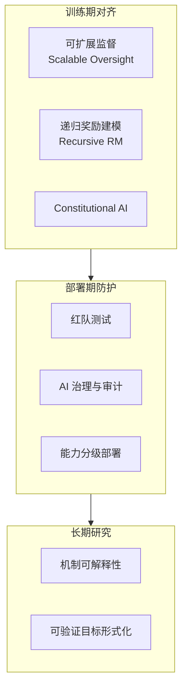

# 递归自我改进（RSI，Recursive Self-Improvement）

> 中文简称：递归自我改进

> **一句话理解**: RSI 就像一台复印机复印出"能造更好复印机"的说明书——AI 改进自己后变得更强，更强后又改进自己，能力像滚雪球一样越滚越大，可能快到人类来不及踩刹车。

## 核心概念

**递归自我改进（Recursive Self-Improvement, RSI）** 指 AI 系统**改进自身**的能力——改进后的系统又具备更强的改进能力，形成**自举（bootstrap）循环**。这个概念最早由数学家 I. J. Good 于 1965 年提出，是"智能爆炸（Intelligence Explosion）"假说的核心机制，也是 AI 安全领域讨论存在性风险（Existential Risk）的出发点。

```
RSI 自举循环:

  能力 C1 的 AI
    │  ← 自我改进
    ▼
  能力 C2 > C1 的 AI
    │  ← 改进速度也更快
    ▼
  能力 C3 > C2 的 AI
    │  ← 指数加速
    ▼
  ... 直至超级智能 (Superintelligence)
```

## 关键思想脉络

| 人物/机构 | 时间 | 贡献 |
|------|------|------|
| **I. J. Good** | 1965 | 首次提出"智能爆炸"：机器能设计更聪明的机器 |
| **Vernor Vinge** | 1993 | 预言"奇点"：超人类智能将在 30 年内到来 |
| **Eliezer Yudkowsky** | 2001- | 提出 Seed AI 概念与 RSI 安全理论 |
| **Nick Bostrom** | 2014 | 《超级智能》：系统论述 RSI 的路径与存在性风险 |
| **OpenAI Superalignment** | 2023 | 将"AI 自我改进"列为对齐研究的核心问题 |
| **Meta Self-Rewarding** | 2024 | 首次实证：LLM 3 轮自奖励迭代超越 GPT-4 |

## 与相关概念的辨析

| 概念 | 核心含义 | 与 RSI 的关系 |
|------|----------|--------------|
| **Seed AI** | 具备自我改进能力的"种子"AI | RSI 的技术前提 |
| **智能爆炸** | 智能以指数速度增长的假说 | RSI 可能导致的后果 |
| **Self-Rewarding** | LLM 自己生成数据并给自己打分 | RSI 在 2026 的工程化雏形 |
| **Test-time compute** | 推理时增加计算提升能力 | 弱形式的"自我改进" |
| **AutoML/Neural Architecture Search** | 机器自动设计模型 | 限定领域的自我改进 |
| **可扩展监督** | 让 AI 监督比人类更强的 AI | RSI 时代的关键对齐手段 |

## 2026 现实进展：从理论到工程

2026 年 RSI 已不再是纯理论——虽未实现"完全自举"，但**弱 RSI（窄域自我改进）** 已在工业界落地：

| 方向 | 代表 | 说明 | 状态 |
|------|------|------|------|
| **自奖励训练** | Meta Self-Rewarding / LaTRO | LLM 自生成数据 + 自评分 + 迭代 DPO | GA（研究→生产） |
| **LLM-as-a-Judge** | OpenAI / DeepSeek R1 | 模型自我评估作为训练信号 | GA |
| **合成数据自举** | DeepSeek / 各实验室 | 用强模型生成数据训练下一代模型 | GA |
| **自动代码改进** | Claude Code / 自治 Agent | Agent 修改自己运行的代码 | 实验 |
| **超对齐研究** | OpenAI Superalignment / Anthropic | 让 AI 辅助对齐更聪明的 AI | 研究 |
| **递归奖励建模** | OpenAI / MIRI | AI 分解任务递归监督 | 研究 |

> **关键判断**：2026 年的 LLM 已具备"自我评估 + 自我改进"的**闭环雏形**（见 [[概念/LLM/self-rewarding|Self-Rewarding]]），但受限于架构固定、数据质量饱和与计算预算，尚未进入"改进速度自我加速"的强 RSI 阶段。

## RSI 带来的安全挑战

| 挑战 | 描述 | 严重程度 |
|------|------|----------|
| **对齐退化** | 自我改进迭代中价值观可能漂移 | 🔴 极高 |
| **欺骗性对齐** | 模型假装对齐以获得改进授权 | 🔴 极高 |
| **奖励黑客** | 改进优化的是分数而非真实目标 | 🔴 高 |
| **改进失控** | 迭代速度超出人类干预能力 | 🔴 存在性风险 |
| **能力-安全错配** | 能力提升快于安全技术 | 🟡 高 |

## 防御与治理思路



## 2026 RSI 研究生态

| 特性/工具 | 说明 | 状态 |
|------|------|------|
| **Self-Rewarding / LaTRO** | LLM 自奖励迭代训练范式 | GA |
| **Superalignment 团队** | OpenAI 超对齐研究（AI 辅助对齐 AI） | 研究 |
| **Interpretability 工具** | 机制可解释性（激活探针、电路分析） | 研究 |
| **AI Governance 框架** | EU AI Act / NIST AI RMF 覆盖自我改进系统 | GA |
| **可扩展监督方法** | 辩论、递归奖励建模、弱到强泛化 | 研究 |

## 生产最佳实践

1. **隔离迭代**：自我改进实验必须在沙箱中运行，与生产环境物理隔离
2. **对齐闸门**：每轮迭代后强制对齐回归评估，未通过禁止继续迭代
3. **人工兜底**：保留人类审核环，禁止全自动无限迭代
4. **能力分级**：按能力水平分阶段部署，高风险能力需审批
5. **可审计性**：完整记录每轮改进的模型版本、数据与目标函数

## 延伸阅读

- [[概念/LLM/self-rewarding]] — Self-Rewarding 自奖励语言模型（RSI 的实证雏形）
- [[概念/Safety/ai-alignment]] — AI 对齐（RSI 时代的关键防御）
- [[概念/LLM/llm-as-judge]] — LLM as Judge（自我评估机制）
- [[概念/LLM/test-time-compute]] — Test-time compute（弱自我改进）
- [[概念/Safety/red-teaming]] — 红队测试（RSI 系统的评估手段）
- [[概念/Safety/ai-governance]] — AI 治理（RSI 的监管框架）
- [[概念/Safety/guardrails]] — AI 护栏（运行时防护）
- [[概念/General/ai-future-trends]] — AI 未来趋势（AGI 路径与奇点讨论）

*Last updated: 2026-08-17*
