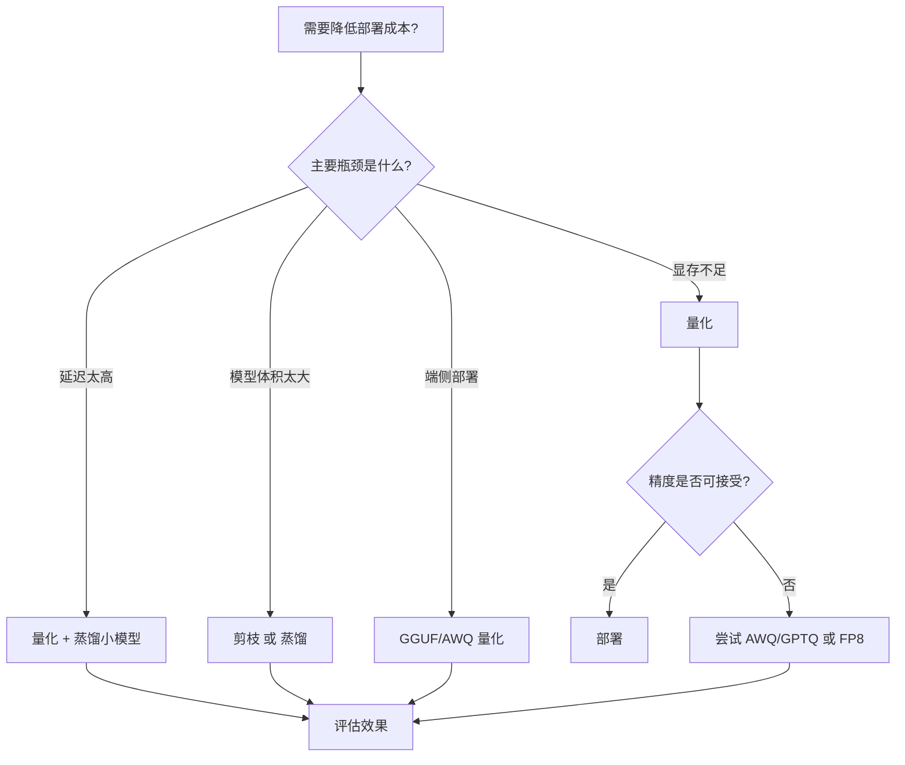

# LLM 模型压缩方法对比：量化、剪枝、蒸馏

## 一句话总结

**量化**减少数值精度，**剪枝**减少参数数量，**蒸馏**用小模型学习大模型行为——三者可以组合使用，降低 LLM 的部署成本。

---

## 三种方法对比

| 方法 | 压缩对象 | 原理 | 训练成本 | 推理加速 | 精度损失 |
|---|---|---|---|---|---|
| **量化（Quantization）** | 权重/激活精度 | 用低精度表示参数 | 低 | 高 | 小 ~ 中 |
| **剪枝（Pruning）** | 网络结构 | 移除不重要参数/结构 | 中 ~ 高 | 中 | 中 ~ 大 |
| **蒸馏（Distillation）** | 模型大小 | 小模型学习大模型输出 | 高 | 高 | 中 |

---

## 1. 量化（Quantization）

### 原理

将 FP16/BF16 权重转换为更低精度：

```
FP16 → INT8 → INT4 → FP8
```

### 常见量化方案

| 方案 | 位宽 | 特点 |
|---|---|---|
| **RTN（Round-To-Nearest）** | INT8/INT4 | 最简单，直接四舍五入 |
| **GPTQ** | INT4/INT3 | 逐层量化并补偿误差 |
| **AWQ** | INT4 | 保护重要权重通道 |
| **SmoothQuant** | INT8 | 平滑激活 outliers |
| **GGUF / llama.cpp** | Q4_K_M 等 | 端侧部署常用 |
| **FP8** | FP8 | NVIDIA Hopper 原生支持 |

### 优缺点

| 优点 | 缺点 |
|---|---|
| 实现简单，工具成熟 | 过低精度（INT3）会显著掉点 |
| 显存占用大幅降低 | 需要硬件支持才能充分加速 |
| 可与 vLLM、TensorRT-LLM 配合 | 某些任务对精度敏感 |

### 适用场景

- 显存受限的推理部署；
- 高并发服务；
- 端侧/边缘设备。

---

## 2. 剪枝（Pruning）

### 原理

移除对模型输出影响小的权重或结构：

```
稀疏度 = 被移除参数 / 总参数
```

### 类型

| 类型 | 说明 |
|---|---|
| **非结构化剪枝** | 按单个权重重要性剪枝 |
| **结构化剪枝** | 按通道/头/层剪枝 |
| **半结构化剪枝** | 2:4 / 4:8 稀疏模式，硬件友好 |

### 优缺点

| 优点 | 缺点 |
|---|---|
| 可减少模型体积 | 非结构化剪枝难以硬件加速 |
| 结构化剪枝加速明显 | 需要重新微调恢复精度 |
| 可与量化结合 | 大模型上效果不如量化稳定 |

### 适用场景

- 需要永久减小模型体积；
- 有专用稀疏计算硬件；
- 学术研究探索模型冗余。

---

## 3. 蒸馏（Distillation）

### 原理

用小模型（Student）学习大模型（Teacher）的行为：

```
L_distill = α × L_hard + β × L_soft
```

其中 soft loss 使用 Teacher 的 logits 分布。

### 常见形式

| 形式 | 说明 |
|---|---|
| **Logits 蒸馏** | 学生学习教师输出的概率分布 |
| **Hidden States 蒸馏** | 对齐中间层表示 |
| **数据蒸馏** | 用教师生成数据训练学生 |
| **Chain-of-Thought 蒸馏** | 蒸馏推理过程 |

### 优缺点

| 优点 | 缺点 |
|---|---|
| 可获得更小更强的模型 | 训练成本高 |
| 精度通常优于直接量化/剪枝 | 需要大量教师推理数据 |
| 适合打造专用小模型 | 学生架构设计有挑战 |

### 代表工作

- **DistilBERT**：BERT 的蒸馏版本；
- **Phi 系列**：微软小模型，部分使用合成数据蒸馏；
- **Orca**：用 GPT-4 输出训练小模型。

---

## 如何选择？



### 实践建议

| 场景 | 推荐方案 |
|---|---|
| 快速降低显存 | INT8 / FP8 量化 |
| 极致压缩比 | INT4 AWQ / GPTQ |
| 端侧 CPU | GGUF Q4_K_M |
| 追求精度 | 蒸馏小模型 |
| 硬件支持稀疏 | 结构化剪枝 + 量化 |

---

## 组合策略

实际部署中常组合多种方法：

```
大模型 → 蒸馏 → 中模型 → 量化 → 小模型
```

例如：
- **Llama-2 70B → 7B**：用 70B 生成数据微调 7B；
- **7B → INT4 AWQ**：进一步降低显存。

---

## 延伸阅读

- [[概念/quantization|模型量化]]
- [[概念/awq|AWQ]]
- [[概念/gptq|GPTQ]]
- [[概念/gguf|GGUF]]
- [[概念/smoothquant|SmoothQuant]]
- [[概念/model-inference|模型推理]]
- [[概念/vllm-practical|vLLM 实战]]

---

## 2026 模型压缩生态

| 特性/工具 | 说明 | 状态 |
|------|------|------|
| **AWQ/GPTQ** | 训练后量化 INT4 | GA |
| **FP8 量化** | H100 FP8 推理加速 | GA |
| **知识蒸馏** | 大模型知识迁移到小模型 | GA |
| **剪枝** | 结构化/非结构化剪枝 | GA |
| **AutoGPTQ** | 自动 GPTQ 量化工具 | GA |

## 生产最佳实践

1. **量化优先**：AWQ/GPTQ INT4 是性价比最高的压缩方式
2. **精度验证**：量化后必须验证输出质量，确保精度损失可接受
3. **硬件匹配**：FP8 需 H100+，INT8 需 A100+，INT4 通用
4. **蒸馏场景**：边缘部署用知识蒸馏，云端用量化
5. **组合策略**：量化 + 剪枝 + 蒸馏组合使用效果更佳
