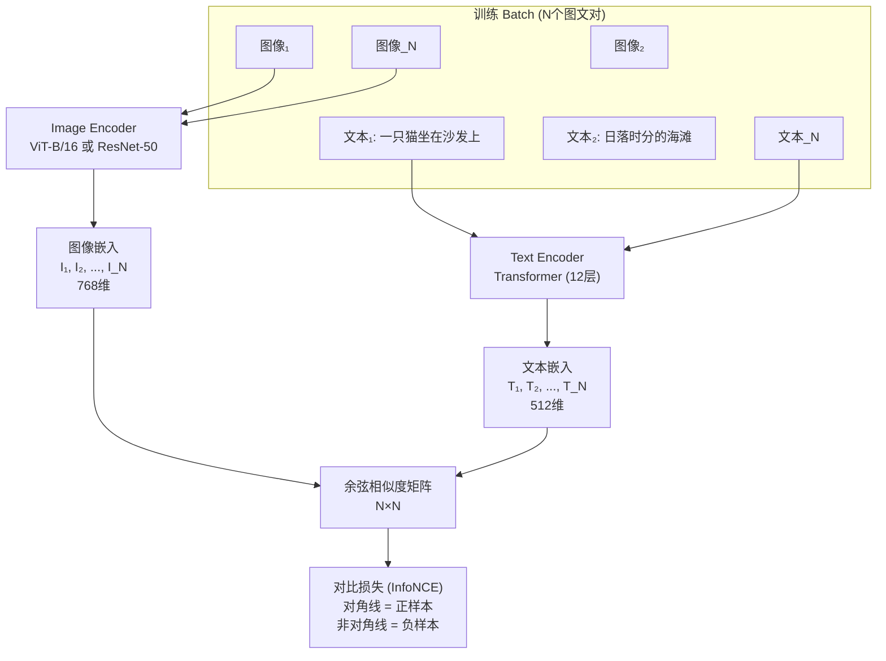

# CLIP — 对比语言-图像预训练

> **一句话理解**: CLIP 让计算机第一次"读懂"图片和文字的关系——在 4 亿图文对上学会把图片和它的文字描述拉近、和不相关的文字推远，由此获得零样本识图能力，不需要为每个新类别训练模型。

---

## 核心概念

CLIP（Contrastive Language-Image Pre-training）是 OpenAI 在 2021 年发布的视觉-语言基础模型（Radford et al.）。它同时训练一个图像编码器和一个文本编码器，通过对比学习让匹配的图文对在嵌入空间中靠近、不匹配的远离。训练完成后，给定一张图片和一组文本描述，CLIP 能判断哪个描述最匹配——这就是**零样本图像分类**。

### 核心要点

- **双编码器对比学习**：图像编码器（ViT 或 ResNet）+ 文本编码器（Transformer），InfoNCE 对比损失
- **400M 图文对**：从互联网爬取的海量 `alt` 文本-图像配对，覆盖极其广泛的视觉概念
- **零样本分类**：用自然语言描述类别（如 "a photo of a cat"），无需任何标注训练即可分类
- **统一嵌入空间**：图像和文本在同一个 512/768 维空间中，支持跨模态检索
- **Prompt Engineering**：使用 "a photo of a {label}" 等模板显著优于裸类别词

## 架构图



### InfoNCE 损失

对于一个 batch 中的 N 个图文对：

```
图像 i 与文本 j 的相似度:  s_ij = (I_i · T_j) / (||I_i|| · ||T_j||) · exp(τ)

图像到文本的损失:
L_I2T = -1/N Σ_i log[ exp(s_ii) / Σ_j exp(s_ij) ]

文本到图像的损失:
L_T2I = -1/N Σ_j log[ exp(s_jj) / Σ_i exp(s_ij) ]

总损失: L = (L_I2T + L_T2I) / 2
```

batch 中每个正样本对有 N-1 个负样本，对比学习使正样本对相似度最大化。

## 详细内容

### 图像编码器选择

CLIP 论文实验了多种图像编码器：

| 编码器 | 参数量 | ImageNet 零样本 Top-1 | 备注 |
|--------|--------|----------------------|------|
| ResNet-50 | 39M | 59.7% | 基线 |
| ResNet-101 | 53M | 63.3% | |
| ViT-B/32 | 88M | 62.6% | |
| ViT-B/16 | 87M | 68.2% | 最常用 |
| ViT-L/14 | 304M | 75.5% | 高精度 |
| ViT-L/14@336px | 304M | 76.2% | 高分辨率版 |

### Prompt Engineering 对零样本性能的影响

CLIP 的零样本分类严重依赖 prompt 设计：

| Prompt 模板 | ImageNet 零样本 Top-1 |
|------------|----------------------|
| `cat` | ~50% |
| `a photo of a cat` | ~65% |
| `a photo of a {label}, a type of pet` | ~67% |
| 80 个模板集成 | **69.3%** |

**Ensemble Prompt** 是常用技巧：对每个类别使用多个 prompt 模板（如 "a photo of a {}", "a drawing of a {}", "a photo of a {}, a type of animal"），嵌入取平均后作为类别向量。

### CLIP 的训练数据

| 数据集 | 规模 | 构建方式 |
|--------|------|---------|
| WIT (WebImageText) | 400M 图文对 | 从 5 亿网页爬取 |
| 覆盖词汇 | ~50 万个英文 token | 比任何已有视觉数据集广 10× |
| 文本长度 | 平均 ~15 词 | 简短描述性文字 |
| 数据质量 | 噪声高（部分 alt 文本无关） | 规模弥补噪声 |

### 下游任务能力

CLIP 的统一嵌入空间使其能适应极广泛的下游任务：

| 任务 | 使用方式 | 示例 |
|------|---------|------|
| 零样本分类 | 构建类别 prompt → 选最高相似度 | ImageNet 76% |
| 开放词表检测 | 作为检测器的分类头（ViLD、OWOD） | 检测任意类别物体 |
| 图文检索 | 图像→文本 或 文本→图像 | 电商搜索、图片搜索 |
| 语义分割 | 结合 ViT/ decoder 实现开放词表分割 | DenseCLIP |
| 图像生成引导 | 作为扩散模型的文本-图像对齐损失 | Stable Diffusion |
| 视频理解 | 逐帧编码 + 时序聚合 | 动作识别零样本 |

### CLIP 的"超能力"与局限

**涌现能力**：
- **OCR**：零样本识别图片中的文字
- **计数**：识别图片中物体数量
- **地理**：区分照片拍摄城市（旧金山 vs 纽约）
- **名人识别**：识别大量公众人物
- **抽象概念**：理解"幸福的"、"危险的"等形容词

**已知局限**：

| 局限 | 表现 | 缓解方向 |
|------|------|---------|
| 细粒度分类差 | 区分汽车型号、飞机机型困难 | 更大数据 / 微调 |
| 空间关系弱 | "左边的杯子" "桌子上的书"不准 | 需密集特征（如 GLIP） |
| 计数不准 | >3 个物体计数容易出错 | 专用计数头 |
| 偏见 | 性别、种族、宗教偏见明显 | 数据清洗 + 去偏 |
| 幻觉 | 会自信地对不存在概念做错误匹配 | 校准 / 不确定性建模 |

## 对比表格

### CLIP vs 传统有监督分类

| 维度 | ResNet（ImageNet 有监督） | CLIP |
|------|------------------------|------|
| 类别数 | 1000（固定） | 无限（文本定义） |
| 新类别适配 | 需收集数据 + 重训练 | 零样本即可 |
| 训练数据 | 1.3M 标注图像 | 400M 图文对 |
| 语义理解 | 仅类别名 | 自然语言描述 |
| 推理成本 | 1 次前向传播 | 需编码所有类别文本 |
| 偏见来源 | 类别标注偏差 | 互联网数据偏差 |

### CLIP 后续演进

| 模型 | 改进 | 零样本 ImageNet |
|------|------|----------------|
| CLIP (2021) | 基线 | 76.2% |
| OpenCLIP | 开源复现，更大 ViT-G | ~80% |
| EVA-CLIP | 更强训练策略 + 更大数据 | ~82% |
| SigLIP | Sigmoid 损失替代 Softmax | ~83% |
| DFN-CLIP | 数据筛选网络精选训练数据 | **85%+** |
| MetaCLIP | 去重 + 均衡元数据 | **86%+** |

## AI 应用

- **零样本图像分类**：无需训练即可部署新的视觉分类服务
- **图文搜索引擎**：Google/Microsoft/百度的图片搜索已集成 CLIP 式技术
- **内容审核**：检测图像中的违规、敏感内容
- **Stable Diffusion 的文本编码器**：CLIP（或变体）是扩散模型的文本理解核心
- **多模态大模型（MLLM）**：LLaVA、BLIP-2 等使用 CLIP 视觉编码器
- **开放词表检测分割**：GLIP、DINOv + CLIP 实现任意类别检测
- **零样本视频分类**：ActionCLIP 等

## 开放问题

- CLIP 在细粒度和专业领域（医疗、工业）零样本性能不足 ^[ambiguous]
- 空间/几何推理能力弱（"上下左右"关系理解差）
- 训练数据中的社会偏见会被模型继承和放大
- 计算成本：大批量对比学习需要极大量 GPU
- 非英语语言的支持仍不充分（需多语言 CLIP 变体）

## 来源

- 多模态/CLIP_and_Alignment.md
- Radford et al., "Learning Transferable Visual Models From Natural Language Supervision" (CLIP), ICML 2021

## Related

- [[概念/Vision/vit]] — Vision Transformer (共享: image-encoder, foundation-model)
- [[概念/Vision/dino]] — DINOv2 (共享: self-supervised, foundation-model)
- [[概念/Vision/stable-diffusion]] — Stable Diffusion (共享: text-image-alignment, clip)
- [[概念/Vision/object-detection]] — 目标检测 (共享: zero-shot, open-vocabulary)
- [[概念/Vision/image-segmentation]] — 图像分割 (共享: zero-shot, dense-prediction)
