# 计算机视觉数据增强

> **一句话理解**: 数据增强就是让 AI 从"同一张图片"中"看到"千变万化的变体——翻转、裁剪、混合、遮挡——从而学会不受表面变化干扰的本质特征，是花最小的代价获得最大泛化收益的训练技巧。

---

## 核心概念

数据增强（Data Augmentation）是机器学习中通过**对训练数据施加可控的随机变换**来人工扩大有效数据集规模的技术。在计算机视觉中，它通过对图像进行几何变换（翻转、旋转、缩放）、光度变换（颜色抖动、对比度调整）、混合策略（MixUp、CutMix）等操作，让模型学习到对变换不变的鲁棒特征。

### 核心要点

- **几何增强**：水平翻转、随机裁剪、旋转、缩放、平移——模拟视角变化
- **光度增强**：亮度、对比度、饱和度、色相抖动——模拟光照变化
- **混合增强**：MixUp（线性插值）、CutMix（区域替换）——创造新样本
- **遮挡增强**：Random Erasing、Cutout——模拟遮挡，提升鲁棒性
- **自动增强**：AutoAugment、RandAugment、TrivialAugment——自动搜索最优策略
- **模型相关增强**：Mosaic（YOLO）、Label Smoothing 联合训练

## 增强策略分类

```mermaid
flowchart TB
    DA["数据增强"]

    DA --> GEO["几何变换"]
    DA --> PHOTO["光度/颜色变换"]
    DA --> MIX["混合策略"]
    DA --> ERASE["遮挡/删除"]
    DA --> AUTO["自动化增强"]
    DA --> ADV["高级增强"]

    GEO --> G1["水平翻转\nRandom Horizontal Flip"]
    GEO --> G2["随机裁剪\nRandom Resized Crop"]
    GEO --> G3["旋转/缩放/平移\nAffine Transform"]

    PHOTO --> P1["颜色抖动\nColor Jitter"]
    PHOTO --> P2["灰度化\nRandom Grayscale"]
    PHOTO --> P3["高斯模糊/噪声"]

    MIX --> M1["MixUp\nλ·x₁+(1-λ)·x₂"]
    MIX --> M2["CutMix\n粘贴区域块"]
    MIX --> M3["Mosaic\n4图拼接 (YOLO)"]

    ERASE --> E1["Random Erasing"]
    ERASE --> E2["Cutout\n方形遮挡"]
    ERASE --> E3["HideAndSeek\n网格遮挡"]

    AUTO --> A1["AutoAugment\nRL 搜索策略"]
    AUTO --> A2["RandAugment\n随机采样"]
    AUTO --> A3["TrivialAugment\n单一随机变换"]

    ADV --> AD1["CopyPaste\n实例粘贴"]
    ADV --> AD2["MixTrans\n域迁移增强"]
    ADV --> AD3["对抗样本增强\nAdvProp"]
```



## 详细内容

### MixUp

MixUp（Zhang et al., ICLR 2018）通过对两个样本及其标签做线性插值生成新样本：

```
x̃ = λ · x_i + (1 - λ) · x_j
ỹ = λ · y_i + (1 - λ) · y_j

其中 λ ~ Beta(α, α), α ∈ [0.1, 0.4]
```

**效果**：
- 使决策边界更平滑
- 减少过拟合，提升泛化
- 对对抗样本的鲁棒性增强
- 代价：图像变得模糊，可解释性降低

### CutMix

CutMix（Yun et al., ICCV 2019）从一张图像裁剪矩形区域粘贴到另一张：

```
M = 二值掩码（矩形区域内为1，外为0）
x̃ = M · x_i + (1 - M) · x_j
ỹ = λ · y_i + (1 - λ) · y_j

其中 λ = Area(M) / Area(Image), λ ~ Beta(α, α)
```

**相比 MixUp 的优势**：
- 保留了局部纹理（不像 MixUp 那样全局模糊）
- 空间信息完整
- 对目标检测等密集预测任务更友好

### RandAugment

RandAugment（Cubuk et al., NeurIPS 2020）是对 AutoAugment 的简化：

```
# AutoAugment: 用强化学习搜索最优变换组合（30+ GPU-天）
# RandAugment: 从变换池随机均匀采样，仅需调 2 个超参

变换池 = [Rotate, ShearX, ShearY, TranslateX, TranslateY,
          Color, Posterize, Solarize, Contrast, Sharpness,
          Equalize, AutoContrast, Identity]  # 14种

每步:
  1. 从变换池随机选 N 个变换
  2. 每个变换以幅度 M 应用
  3. 顺序执行

超参: N (变换个数, 通常 2) + M (幅度, 0-30)
```

| 维度 | AutoAugment | RandAugment |
|------|-------------|-------------|
| 搜索成本 | 30+ GPU-天 | 0（无需搜索） |
| 超参数 | 搜索得到的策略 | 仅 N + M |
| 性能 | 基准 | 相当甚至更优 |
| 通用性 | 每个数据集需单独搜索 | 通用默认值即可 |

### Mosaic（YOLO 专用）

Mosaic 将 4 张图像拼接到一张 2×2 网格中：

```
┌─────────┬─────────┐
│  图像1   │  图像2   │
│ (左上)   │ (右上)   │
├─────────┼─────────┤
│  图像3   │  图像4   │
│ (左下)   │ (右下)   │
└─────────┴─────────┘
```

**YOLOv4/v5/v8 标配**，效果：
- 自然批量大小扩大 4 倍（BN 统计更稳定）
- 模拟小目标（拼接后目标相对更小）
- 丰富上下文（不同场景同图）

### 各阶段推荐增强策略

| 训练阶段 | 推荐增强 | 目的 |
|---------|---------|------|
| 分类（ImageNet） | 翻转 + 裁剪 + ColorJitter + MixUp/CutMix + RandAugment | 最大化泛化 |
| 目标检测（COCO） | Mosaic + MixUp + 翻转 + 多尺度训练 | 小目标 + 速度 |
| 分割 | 翻转 + 裁剪 + 弹性形变 + 颜色抖动 | 像素级不变性 |
| ViT 自监督 | Multi-crop（2 全局 + 4 局部） | DINO/MAE 训练 |
| 医学影像 | 弹性形变 + 高斯噪声 + 旋转 | 模拟生物变异 |
| 预训练 | 弱增强（翻转 + 裁剪） | 学好基础特征 |
| 微调 | 强增强（+ MixUp + RandAugment） | 防过拟合 |

## 对比表格

### 主流增强方法对比

| 方法 | 类型 | 标签处理 | 适用任务 | 额外开销 | ImageNet +2% |
|------|------|---------|---------|---------|-------------|
| 水平翻转 | 几何 | 不变 | 所有 | 极低 | ~1% |
| RandomResizedCrop | 几何 | 不变 | 所有 | 低 | ~2% |
| ColorJitter | 光度 | 不变 | 所有 | 低 | ~1% |
| **MixUp** | 混合 | 软标签 | 分类 | 低 | ~1.5% |
| **CutMix** | 混合 | 软标签 | 分类/检测 | 低 | ~1.5% |
| **Mosaic** | 混合 | 调整坐标 | 检测 | 低 | ~3% (YOLO) |
| Random Erasing | 遮挡 | 不变 | 分类/检测 | 低 | ~0.5% |
| **RandAugment** | 自动 | 不变 | 所有 | 中 | ~1.5% |
| AutoAugment | 自动 | 不变 | 所有 | 极高（搜索） | ~1.5% |
| TrivialAugment | 自动 | 不变 | 所有 | 低 | ~2% |

### 增强强度与数据量的关系

| 数据集规模 | 推荐增强强度 | 策略 |
|-----------|------------|------|
| < 1K 样本 | **极强** | MixUp + RandAugment + 强 ColorJitter + 弹性形变 |
| 1K - 100K | **强** | 翻转 + 裁剪 + MixUp/CutMix + RandAugment |
| 100K - 1M | **中等** | 翻转 + 裁剪 + ColorJitter + CutMix |
| > 1M | **弱** | 翻转 + 裁剪（大数据自身泛化好） |
| 自监督预训练 | **特殊** | Multi-crop + 强增强（如 DINO） |

### 常见增强陷阱

| 陷阱 | 表现 | 解决方案 |
|------|------|---------|
| 增强破坏标签 | 旋转 "6" 变成 "9" | 任务相关约束（OCR 不旋转 180°） |
| 过度增强 | 模型欠拟合（训不动） | 降低幅度 M 或减少变换数 N |
| 增强引入偏差 | 只做水平翻转导致左右不对称数据 | 根据任务选择合理变换 |
| 测试时增强 | 验证集也做了随机增强 | 验证/测试仅用确定性变换（中心裁剪） |
| 医学影像错误增强 | 翻转 X 光片（左右肺标志改变） | 领域知识指导增强选择 |

## 代码示例

### PyTorch 标准增强流水线

```python
import torchvision.transforms as T

# 分类训练增强
train_transform = T.Compose([
    T.RandomResizedCrop(224, scale=(0.08, 1.0)),
    T.RandomHorizontalFlip(p=0.5),
    T.ColorJitter(0.4, 0.4, 0.4, 0.1),
    T.RandomGrayscale(p=0.2),
    T.ToTensor(),
    T.Normalize(mean=[0.485, 0.456, 0.406],
                std=[0.229, 0.224, 0.225]),
    T.RandomErasing(p=0.25),
])

# 验证增强（确定性）
val_transform = T.Compose([
    T.Resize(256),
    T.CenterCrop(224),
    T.ToTensor(),
    T.Normalize(mean=[0.485, 0.456, 0.406],
                std=[0.229, 0.224, 0.225]),
])
```

### MixUp / CutMix 实现

```python
import numpy as np
import torch
import torch.nn.functional as F

def mixup_data(x, y, alpha=0.2):
    lam = np.random.beta(alpha, alpha) if alpha > 0 else 1.0
    index = torch.randperm(x.size(0), device=x.device)
    mixed_x = lam * x + (1 - lam) * x[index]
    y_a, y_b = y, y[index]
    return mixed_x, y_a, y_b, lam

def mixup_criterion(criterion, pred, y_a, y_b, lam):
    return lam * criterion(pred, y_a) + (1 - lam) * criterion(pred, y_b)

def cutmix_data(x, y, alpha=1.0):
    lam = np.random.beta(alpha, alpha)
    rand_index = torch.randperm(x.size(0), device=x.device)
    y_a, y_b = y, y[rand_index]
    bbx1, bby1, bbx2, bby2 = rand_bbox(x.size(), lam)
    x[:, :, bbx1:bbx2, bby1:bby2] = x[rand_index, :, bbx1:bbx2, bby1:bby2]
    lam = 1 - ((bbx2 - bbx1) * (bby2 - bby1) / (x.size(-1) * x.size(-2)))
    return x, y_a, y_b, lam
```

## AI 应用

- **图像分类**：ImageNet、医学影像分类的标准训练组件
- **目标检测**：YOLO 的 Mosaic、CopyPaste 增强提升小目标检测
- **语义分割**：弹性形变是 U-Net 医学分割成功的关键
- **自监督学习**：SimCLR 的多裁剪、DINO 的全局-局部裁剪
- **人脸识别**：特定角度的旋转增强改善角度泛化
- **遥感影像**：旋转 + 缩放 + 多光谱通道增强
- **GAN 训练**：数据增强改善判别器（ADA、DiffAugment）

## 开放问题

- 增强策略的自动搜索成本仍高（AutoAugment 类） ^[ambiguous]
- 任务相关增强的领域知识难以自动化
- 增强对分布外（OOD）泛化的效果不稳定
- 生成式增强（用扩散模型生成训练数据）的标注一致性挑战
- 增强对公平性和偏见的影响研究不足

## 来源

- 计算机视觉/Data_Augmentation.md
- Zhang et al., "mixup: Beyond Empirical Risk Minimization", ICLR 2018
- Cubuk et al., "RandAugment: Practical automated data augmentation", NeurIPS 2020

## Related

- [[概念/computer-vision]] — 计算机视觉 (共享: cv, training)
- [[概念/Vision/vit]] — Vision Transformer (共享: training, augmentation)
- [[概念/Vision/dino]] — DINOv2 (共享: multi-crop, self-supervised)
- [[概念/Vision/object-detection]] — 目标检测 (共享: mosaic, augmentation)
- [[概念/Vision/image-segmentation]] — 图像分割 (共享: augmentation, medical)
