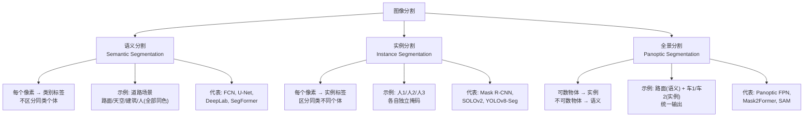

# 图像分割

> **一句话理解**: 如果目标检测是"画框圈出物体"，图像分割就是"为每个像素精确涂色"——从 U-Net 到 SAM，分割模型已从特定任务走向通用基础模型。

---

## 核心概念

图像分割（Image Segmentation）将图像中每个像素分配到特定类别或实例，是计算机视觉中最精细的空间理解任务。分割按精细度分为三个层次：**语义分割**（Semantic，只区分类别）、**实例分割**（Instance，区分同类不同个体）、**全景分割**（Panoptic，语义 + 实例的统一）。

### 核心要点

- **语义分割**：每个像素分配类别，不区分同类个体（所有"人"同色）
- **实例分割**：区分同类的不同个体（不同的"人"不同色），如 Mask R-CNN
- **全景分割**：语义 + 实例统一，可数物体分实例，不可数物体按语义
- 几乎所有分割模型采用**编码器-解码器**架构 + 跳跃连接
- SAM 实现了零样本通用分割，从特定任务走向基础模型

## 分割任务分类



## 详细内容

### 里程碑模型

| 模型 | 年份 | 核心创新 | 任务类型 | 精度 |
|------|------|---------|---------|------|
| FCN | 2015 | 首次全卷积端到端像素分类 | 语义 | 奠基 |
| U-Net | 2015 | 对称编解码器 + 密集跳跃连接 | 语义 | 医学标准 |
| DeepLab v3+ | 2018 | 空洞卷积 + ASPP 多尺度 | 语义 | SOTA |
| Mask R-CNN | 2017 | Faster R-CNN + 掩码分支 + ROI Align | 实例 | 高 |
| SOLOv2 | 2020 | 动态卷积 + 中心分组 | 实例 | 高 |
| SegFormer | 2021 | 纯 Transformer + 多尺度特征 | 语义 | SOTA |
| Mask2Former | 2022 | 掩码注意力 + 统一架构 | 全景 | SOTA |
| SAM | 2023 | 1B 掩码预训练 + 交互提示 | 通用 | 零样本 |
| SAM 2 | 2024 | 扩展视频分割 + 时序追踪 | 视频 | SOTA |

### U-Net：医学影像王者

U-Net 的 U 形对称结构是医学影像分割的标准。关键设计：

```
输入图像
  │
  ├─[编码器]── Conv + BN + ReLU + MaxPool → 特征图缩小, 通道增加
  │     64 → 128 → 256 → 512 → 1024
  │
  ├─[瓶颈层]── 最深层
  │
  └─[解码器]── ConvTranspose 上采样 + 跳跃连接拼接
        1024 → 512 → 256 → 128 → 64
                    ↑       ↑
              跳跃连接(编码器→解码器)
  │
  输出: 每像素类别概率

跳跃连接作用: 保留高分辨率空间细节(边缘、纹理)
```

| 变体 | 改进 | 适用场景 |
|------|------|---------|
| U-Net++ | 嵌套跳跃连接（密集监督） | 更精细的边界 |
| Attention U-Net | 注意力门控跳跃连接 | 抑制无关区域 |
| nnU-Net | 自适应配置（无需调参） | 通用医学影像 |
| TransUNet | ViT 编码器 + U-Net 解码器 | 全局+局部结合 |
| Swin-UNet | 纯 Swin Transformer | 通用医学分割 |

### DeepLab 与空洞卷积

空洞卷积（Dilated/Atrous Convolution）在不增加参数量的前提下扩大感受野：

```
标准 3×3 卷积, rate=1:  感受野 = 3×3
空洞 3×3 卷积, rate=2:  感受野 = 5×5 (孔间隔 1)
空洞 3×3 卷积, rate=4:  感受野 = 9×9 (孔间隔 3)

DeepLab ASPP: 并行 rate=[6, 12, 18, 24] 的空洞卷积
  → 多尺度上下文 → 全局平均池化 → 拼接
```

### 编码器-解码器 vs 检测器 + 掩码

| 维度 | 编码器-解码器（U-Net/DeepLab） | 检测器+掩码（Mask R-CNN） |
|------|-------------------------------|-------------------------|
| 任务类型 | 语义/全景分割 | 实例分割 |
| 流程 | 直接全图像素分类 | 先检测框，再框内分割 |
| 小实例 | 不区分 | 优 |
| 大面积（背景） | 优 | 难以处理 |
| 速度 | 快 | 较慢（两阶段） |

### 损失函数

| 损失函数 | 公式（简） | 适用场景 | 特点 |
|---------|----------|---------|------|
| Cross Entropy | -Σ y log(ŷ) | 类别均衡 | 通用基线 |
| **Dice Loss** | 1 - 2\|A∩B\|/\|A\|+\|B\| | 类别不均衡 | 医学常用 |
| **Focal Loss** | -α(1-p)^γ log(p) | 难例挖掘 | 前景/背景不均 |
| **CE + Dice** | CE + λ·Dice | 实践最优 | 最常用组合 |
| Boundary Loss | 边界距离权重 | 精确边界 | 轮廓敏感 |
| Lovász Loss | 替代 IoU 直接优化 | 直接优化 IoU | 理论优雅 |

### 全景分割

全景分割统一了语义和实例：

```
Stuff（不可数物体）: 天空、道路、草地 → 语义标签
Thing（可数物体）:   人、车、建筑 → 实例标签

输出格式: 每个像素 → (类别, 实例ID)
  天空像素 → (sky, -1)        # stuff, 无实例ID
  车1像素  → (car, 0)         # thing, 实例0
  车2像素  → (car, 1)         # thing, 实例1
```

| 指标 | 含义 |
|------|------|
| PQ (Panoptic Quality) | 全景分割质量主指标 |
| SQ (Segmentation Quality) | 掩码质量 |
| RQ (Recognition Quality) | 识别/区分质量 |

### 分割中的常见陷阱

| 陷阱 | 原因 | 解决方案 |
|------|------|---------|
| 类别不均衡 | 背景 >> 前景 | Dice/Focal Loss + 类别权重 |
| 边界模糊 | 下采样丢细节 | 跳跃连接 + 边界辅助损失 |
| 大小目标兼顾 | 单一尺度 | 多尺度融合（FPN/ASPP） |
| 标注昂贵 | 像素级标注成本高 | 半监督 + 数据增强（弹性形变） |
| 实例粘连 | 相邻同类实例合并 | 实例感知策略（中心/嵌入） |

### 实时分割

| 模型 | FPS | mAP/mIoU | 适用场景 |
|------|-----|----------|---------|
| BiSeNet v2 | 150+ | ~73 mIoU | 实时语义分割 |
| PIDNet | 93 | ~80 mIoU | 轻量全景 |
| YOLOv8-Seg | 80+ | ~45 mAP | 实时实例 |
| SAM (单图) | ~7 FPS（编码）+ 200 FPS（解码） | 零样本 | 交互式 |

## 对比表格

### 三种分割任务对比

| 维度 | 语义分割 | 实例分割 | 全景分割 |
|------|---------|---------|---------|
| 输出 | 每像素一个类别 | 每像素一个实例 | 每像素（类别, 实例） |
| 区分同类个体 | 否 | 是 | 是（Thing） |
| 处理背景 | 是 | 否（仅前景） | 是（Stuff） |
| 典型模型 | U-Net, DeepLab | Mask R-CNN | Mask2Former |
| 评估指标 | mIoU | mAP | PQ |
| 应用 | 场景理解 | 精确计数 | 自动驾驶全景 |

### Transformer 分割 vs CNN 分割

| 维度 | CNN（DeepLab, U-Net） | Transformer（SegFormer, Mask2Former） |
|------|----------------------|--------------------------------------|
| 全局上下文 | 需堆叠/空洞卷积 | 第一层即全局 |
| 多尺度 | ASPP/FPN | 层级特征融合 |
| 精度（ADE20K） | ~44 mIoU | ~55 mIoU |
| 参数效率 | 中等 | 高（大数据高效） |
| 小数据表现 | 优 | 较弱 |

## AI 应用

| 应用领域 | 分割类型 | 关键要求 | 代表系统 |
|---------|---------|---------|---------|
| 自动驾驶 | 全景分割 | 实时 >30 FPS | Cityscapes 模型 |
| 医学影像 | 语义分割 | 高精度、小目标 | nnU-Net, MedSAM |
| 遥感图像 | 语义分割 | 超大分辨率 | 卫星建筑/植被分割 |
| 视频会议 | 实例分割 | 实时 + 边缘精度 | 人像分割 |
| 工业质检 | 语义分割 | 微小缺陷 | PCB 缺陷检测 |
| 图像编辑 | 交互分割 | 精准抠图 | Photoshop AI 选区 |
| 机器人 | 实例/全景 | 操控精度 | 抓取目标分割 |

## 开放问题

- SAM 缺乏细粒度语义（知道"分什么"但不确定"是什么"） ^[ambiguous]
- 视频分割的时间一致性和遮挡处理仍是活跃方向
- 3D 分割（点云/体素）的实时性远低于 2D
- 类别极度不均衡（背景 >> 前景）的鲁棒方案
- 开放词表分割的精度与固定类别差距仍大

## 来源

- 04_计算机视觉/03_Segmentation/Segmentation.md
- Ronneberger et al., "U-Net: Convolutional Networks for Biomedical Image Segmentation", MICCAI 2015
- Kirillov et al., "Segment Anything" (SAM), ICCV 2023

## Related

- [[概念/computer-vision]] — 计算机视觉 (共享: cv, segmentation)
- [[概念/Vision/sam]] — Segment Anything Model (共享: segmentation, foundation-model)
- [[概念/Vision/object-detection]] — 目标检测 (共享: localization, detection)
- [[概念/Vision/dino]] — DINOv2 (共享: dense-feature, segmentation)
- [[概念/Vision/data-augmentation-cv]] — 数据增强 (共享: training, medical)

---

## 2026 图像分割生态

| 特性/工具 | 说明 | 状态 |
|------|------|------|
| **SAM 2** | Meta 通用分割模型 | GA |
| **Mask2Former** | 统一分割架构 | GA |
| **医学分割** | 医学图像专用分割模型 | GA |
| **实时分割** | 移动端实时语义分割 | GA |
| **3D 分割** | 点云/体素分割 | GA |

## 生产最佳实践

1. **模型选择**：通用分割用 SAM，实时用轻量级模型
2. **标注质量**：分割标注成本高，用 SAM 辅助标注
3. **后处理**：CRF/形态学操作优化分割边界
4. **领域适配**：医学/遥感需领域微调
5. **评估指标**：用 mIoU/Dice 系数评估分割质量
