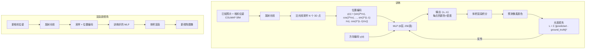

# NeRF — 神经辐射场

> 中文简称：NeRF — 神经辐射场

> **一句话理解**: NeRF 把一整个 3D 场景"压缩"进一个小型神经网络——给它一个 3D 坐标和观察角度，它就能预测该位置的颜色和密度，再通过光线投射合成出任意视角的逼真照片。

---

## 核心概念

Neural Radiance Field（NeRF）由 Mildenhall et al.（UC Berkeley）在 ECCV 2020 提出，是神经渲染（Neural Rendering）领域的里程碑工作。给定一个未知场景的多视角 2D 照片集合（~数十张，含相机位姿），NeRF 训练一个 MLP 来隐式表示该场景的辐射场，随后可从任意新视角渲染高质量图像。

### 核心要点

- **5D 输入**：3D 位置 (x, y, z) + 2D 观察方向 (θ, φ)
- **4D 输出**：RGB 颜色 (r, g, b) + 体积密度 σ（不透明度）
- **MLP 近似辐射场**：F_θ: (x, d) → (c, σ)，用全连接网络替代传统显式 3D 表示
- **体积渲染**：沿相机光线采样多个点，按密度加权积分合成像素颜色
- **位置编码（PE）**：将坐标映射到高频空间，解决 MLP 学习高频细节的困难

## 架构图



### 体积渲染公式

沿光线 r(t) = o + td，近端 t_n 到远端 t_f：

```
C(r) = ∫_{t_n}^{t_f} T(t) · σ(r(t)) · c(r(t), d) dt

其中 T(t) = exp(-∫_{t_n}^{t} σ(r(s)) ds)  (累积透射率)

离散近似:
C(r) ≈ Σ_{i=1}^{N} T_i · (1 - exp(-σ_i · δ_i)) · c_i

T_i = exp(-Σ_{j=1}^{i-1} σ_j · δ_j)
δ_i = t_{i+1} - t_i (相邻采样点间距)
```

### 位置编码（Positional Encoding）

NeRF 的关键发现：直接用 MLP 拟合坐标无法捕获高频细节。将输入通过正弦/余弦函数提升到高维空间：

```
γ(p) = (sin(2⁰πp), cos(2⁰πp), sin(2¹πp), cos(2¹πp), ..., sin(2^{L-1}πp), cos(2^{L-1}πp))

位置编码 L=10 → 3D 坐标从 3 维扩展到 60 维
方向编码 L=4  → 3D 方向从 3 维扩展到 24 维
```

## 详细内容

### 两段式 MLP 结构

NeRF 的 MLP 采用特殊设计以实现视图相关的颜色：

| 层 | 输入 | 输出 | 作用 |
|----|------|------|------|
| Layer 1-5 | γ(x) (60 维) | 256 | 学习 3D 结构 |
| Layer 6-8 | 前一层 + 初始 γ(x) (跳跃连接) | 256 | 深层特征 |
| σ 分支 | Layer 8 | 1 | 预测密度 |
| 特征拼接 | Layer 8 + γ(d) (24 维) | 256 | 加入观察方向 |
| c 分支 | 拼接特征 | 3 | 预测 RGB 颜色 |

**密度 σ 只依赖位置**（场景几何不变），**颜色 c 依赖位置和方向**（镜面反射、光泽随视角变化）。

### NeRF 的训练

| 项目 | 详情 |
|------|------|
| 输入照片 | 100 张左右（含 COLMAP 计算的位姿） |
| 训练时间 | 单场景 1-2 天（单 V100） |
| 模型大小 | ~5MB（MLP 权重） |
| 渲染速度 | 0.1-1 FPS（原版 NeRF） |
| 采样点 | 每条光线 64（粗）+ 128（细） |

### NeRF 的改进谱系

| 变体 | 年份 | 核心改进 | 训练 / 渲染速度 |
|------|------|---------|----------------|
| **NeRF** | 2020 | 基线 | 1-2 天 / 0.1 FPS |
| **Mip-NeRF** | 2021 | 圆锥体采样替代光线 | 更高质量 |
| **NeRF++** | 2020 | 处理无界场景 | 室外场景 |
| **Instant-NGP** | 2022 | 多分辨率哈希网格 | **5 分钟 / 60 FPS** |
| **Plenoxels** | 2022 | 稀疏体素，无需 MLP | 11 分钟 |
| **Nerfacto** | 2023 | 混合方案（Nerfstudio） | 平衡速度和质量 |
| **3DGS** | 2023 | 3D 高斯泼溅替代 MLP | 10 分钟 / **300 FPS** |

### 3D Gaussian Splatting (3DGS) 革命

3DGS 是 NeRF 范式的重要进化，已逐渐成为新视角合成的首选：

| 维度 | NeRF | 3DGS |
|------|------|------|
| 场景表示 | 隐式 MLP | 显式 3D 高斯点集 |
| 渲染方式 | 体积渲染（慢） | 可微光栅化（快） |
| 渲染速度 | 0.1-60 FPS | **300+ FPS** |
| 训练时间 | 5min - 2 天 | ~10 分钟 |
| 内存占用 | ~5MB | 100-500MB |
| 编辑灵活性 | 低（隐式表示） | 高（可操控点） |

## 对比表格

### NeRF vs 传统 3D 重建方法

| 维度 | SfM + MVS | 光场相机 | NeRF / 3DGS |
|------|-----------|---------|-------------|
| 表示方式 | 显式点云/网格 | 多视角阵列 | 隐式神经网络 / 高斯 |
| 输入照片数 | 10-100 | 特殊硬件 | 10-300 |
| 新视角质量 | 中等（有空洞） | 高（受限于阵列） | **最高** |
| 反光/透明物体 | 差 | 好 | **优秀** |
| 预处理 | 需要稠密重建 | 需标定 | 仅需 SfM 位姿 |
| 存储需求 | GB 级（点云） | 极大 | MB 级（MLP） |

## AI 应用

- **3D 内容创作**：虚拟场景、数字资产、游戏环境重建
- **电商产品 3D 展示**：从商品照片生成可旋转的 3D 展示
- **文化遗产数字化**：博物馆文物的 3D 重建
- **VR/AR**：真实场景的沉浸式重建
- **自动驾驶仿真**：NeRF 生成逼真的仿真环境（UniSim、NeuRAD）
- **建筑与房地产**：室内空间 3D 看房
- **电影 VFX**：场景数字化和虚拟制片
- **机器人仿真**：NeRF 场景用于机器人训练

## 开放问题

- 动态场景的 NeRF（4D 重建）仍面临时间一致性问题 ^[ambiguous]
- 大规模无界场景（城市级）的内存和速度瓶颈
- 可编辑性差：训练后的 NeRF 难以修改场景内容
- 光照可重打（relighting）需要特殊设计（NeRF-W、Relightable NeRF）
- 泛化性不足：每个场景需单独训练（PixelNeRF 等尝试前馈式 NeRF）
- 稀疏输入（<10 张照片）场景的质量下降严重

## 来源

- 04_计算机视觉/05_三维视觉/3D_Vision.md
- Mildenhall et al., "NeRF: Representing Scenes as Neural Radiance Fields for View Synthesis", ECCV 2020
- Kerbl et al., "3D Gaussian Splatting for Real-Time Radiance Field Rendering", SIGGRAPH 2023

## Related

- [[概念/computer-vision]] — 计算机视觉 (共享: 3d-vision, rendering)
- [[概念/Vision/stable-diffusion]] — Stable Diffusion (共享: neural-representation, 3d-generation)
- [[概念/Vision/vit]] — Vision Transformer (共享: neural-network, computer-vision)
- [[概念/Vision/dino]] — DINOv2 (共享: feature-extraction, 3d-reconstruction)
- [[概念/generative-vision-models]] — 生成式视觉模型 (共享: neural-rendering)

---

## 2026 NeRF 生态

| 特性/工具 | 说明 | 状态 |
|------|------|------|
| **3D Gaussian Splatting** | 替代 NeRF 的实时三维重建 | GA |
| **Instant-NGP** | 多分辨率哈希编码加速 NeRF 训练 | GA |
| **动态 NeRF** | 动态场景重建与编辑 | GA |
| **文本引导** | 文本指令编辑 3D 场景 | 研究 |
| **工业应用** | 数字孪生/VR/AR 三维重建 | GA |

## 生产最佳实践

1. **3DGS 优先**：新项目优先考虑 3D Gaussian Splatting，速度更快
2. **数据采集**：多角度、均匀光照的图像采集是重建质量的关键
3. **训练加速**：使用 Instant-NGP 或 3DGS 大幅缩短训练时间
4. **质量评估**：用 PSNR/SSIM/LPIPS 多维度评估重建质量
5. **部署优化**：Web 端使用 WebGL 渲染，移动端用专用渲染器
