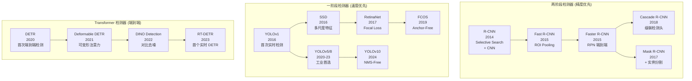
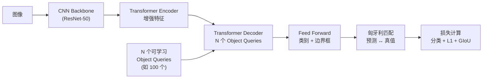

# 目标检测

> 中文简称：目标检测

> **一句话理解**: 目标检测同时回答两个问题——"图像里有什么"（分类）和"在哪里"（定位边界框），是自动驾驶、安防、工业质检等场景的核心视觉能力。

---

## 核心概念

目标检测（Object Detection）是计算机视觉中最重要的任务之一。与图像分类只输出类别不同，检测需要为图像中每个物体输出 `(class, x1, y1, x2, y2)` 五元组。检测算法经历了三大范式：**两阶段检测器**（R-CNN 系列）、**一阶段检测器**（YOLO/SSD/RetinaNet）、**端到端 Transformer 检测器**（DETR 系列）。

### 核心要点

- **两阶段（Two-Stage）**：先生成候选区域（RPN），再分类回归。精度高但慢
- **一阶段（One-Stage）**：单次前向直接预测框 + 类别。速度快（YOLO 200+ FPS）
- **Anchor-Based vs Anchor-Free**：基于预设锚框 vs 直接预测中心点/角点
- **NMS 后处理**：非极大值抑制去除重叠框，DETR 通过匈牙利匹配消除 NMS
- **核心指标**：IoU（框重叠度）、mAP@0.5:0.95（COCO 标准）、FPS（实时性）

## 架构演进图



## 详细内容

### 两阶段 vs 一阶段 vs Transformer

| 维度 | Faster R-CNN | YOLOv8 | DETR / RT-DETR |
|------|-------------|--------|----------------|
| 流程 | RPN + ROI 分类回归 | 单次前向预测 | Transformer + 匹配 |
| 速度 | 10-30 FPS | 200+ FPS | 60-100 FPS (RT-DETR) |
| 精度 (COCO mAP) | ~42 | ~53 | ~56 |
| 小物体检测 | 优 | 较好 | 优 |
| NMS 后处理 | 是 | 是（v10 除外） | **否（端到端）** |
| 训练收敛 | 快 | 快 | 慢（DETR 500 epochs） |
| 部署复杂度 | 中等 | **低（工业首选）** | 中等 |

### YOLO 系列深度对比

YOLO 是工业界最广泛使用的检测框架，核心设计从基于 Anchor 演进到 Anchor-Free：

| 版本 | 年份 | 关键创新 | FPS | COCO mAP | 参数量 |
|------|------|---------|-----|----------|--------|
| YOLOv1 | 2016 | Grid + 单次前向 | 45 | 63.4 (VOC) | - |
| YOLOv3 | 2018 | 多尺度检测 + Darknet53 | 35 | 33.0 | 62M |
| YOLOv4 | 2020 | CSPDarknet + Mosaic | 38 | 43.5 | 64M |
| YOLOv5 | 2020 | 自适应 Anchor + Focus | 140 | 50.0 | 50M |
| YOLOv6 | 2022 | RepVGG backbone | 160 | 52.8 | 18M (n) |
| YOLOv7 | 2022 | E-ELAN + 模型重参数化 | 120 | 56.8 | 37M |
| YOLOv8 | 2023 | Anchor-Free + 解耦头 + C2f | 200+ | 53.9 | 3.2M (n) |
| YOLOv9 | 2024 | PGI + GELAN | 120 | 55.6 | 58M |
| YOLOv10 | 2024 | NMS-Free + 双重分配 | 220+ | 54.4 | 2.3M (n) |

### 评估指标详解

**IoU（Intersection over Union）**：
```
IoU = Area(A ∩ B) / Area(A ∪ B)

IoU > 0.5 → 正确检测 (PASCAL VOC 标准)
IoU > 0.7 → 高质量检测
```

**mAP（Mean Average Precision）**：
```
对每个类别:
  1. 按置信度排序所有检测结果
  2. 在不同召回率点计算精确率
  3. 对 PR 曲线做积分得到 AP

mAP = 所有类别 AP 的平均值

COCO 标准:
  mAP@0.5:0.95 = mAP 在 IoU 阈值 [0.5, 0.55, ..., 0.95] 上的平均
  比单一阈值更严格，更能反映模型水平
```

### 损失函数演进

| 损失 | 公式（简） | 特点 |
|------|----------|------|
| MSE | \|\|y - ŷ\|² | 早期使用，对尺度敏感 |
| IoU Loss | 1 - IoU | 尺度不变，但无梯度当 IoU=0 |
| GIoU | 1 - IoU + Area(C)\Area(C\A∪B) | 解决 IoU=0 的梯度问题 |
| DIoU | IoU + 中心点距离/对角线² | 加速收敛 |
| **CIoU** | DIoU + 长宽比惩罚 | 当前最优，YOLO 标配 |
| Focal Loss | -α(1-p)^γ log(p) | 解决类别不平衡（前景/背景） |

### DETR 的端到端范式

DETR 的核心创新是**用集合预测替代 NMS**：



- **Object Queries**：N 个可学习的"查询"向量，每个负责预测一个物体
- **匈牙利匹配**：将 N 个预测与真值做一对一最优匹配（无重复预测）
- **无需 NMS**：因为一对一匹配，不会产生重复框
- **代价**：训练慢（需 500 epochs），小物体精度需 Deformable Attention 改进

### 检测模型选择指南

| 场景 | 推荐模型 | 选择理由 |
|------|---------|---------|
| 实时（自动驾驶） | YOLOv8/v10, RT-DETR | 100+ FPS，精度足够 |
| 高精度（医疗） | Cascade R-CNN, DINO | mAP 最高 |
| 移动端 | YOLOv8n, MobileNet-SSD | <5M 参数 |
| 视频分析 | YOLOv8 + DeepSORT | 平衡速度和追踪 |
| 开放词表 | Grounding DINO + CLIP | 检测任意类别 |
| 小目标密集 | DETR 变体 / FPN | 多尺度 + 注意力 |

## 对比表格

### Anchor-Based vs Anchor-Free

| 维度 | Anchor-Based (Faster R-CNN, YOLOv5) | Anchor-Free (FCOS, YOLOv8) |
|------|-------------------------------------|---------------------------|
| 预测方式 | 基于预设锚框偏移 | 直接预测点/中心/角点 |
| 超参 | Anchor 尺寸/比例（需聚类） | 无 Anchor 超参 |
| 小物体 | 依赖 Anchor 设计 | 自适应尺度 |
| 训练 | 正负样本匹配（IoU 阈值） | 中心区域分配 |
| 部署 | 成熟工具链 | 简化流程 |

### 开放词表检测

传统检测仅限固定类别，开放词表检测结合 CLIP/Grounding 实现任意类别：

| 模型 | 机制 | 新类别方式 |
|------|------|----------|
| ViLD | CLIP 特征蒸馏 | CLIP 文本编码 |
| GLIP | 语言-视觉融合 | 自然语言 grounding |
| Grounding DINO | 开放集 DETR | 文本 prompt 引导 |
| OWL-ViT | 对比预训练 + 定位 | 零样本检测 |

## AI 应用

- **自动驾驶**：检测行人、车辆、交通标志（YOLO + DeepSORT 追踪）
- **安防监控**：异常行为检测、入侵检测、人群密度
- **工业质检**：PCB 缺陷检测、产品表面缺陷、零件计数
- **零售**：货架商品识别、自动结账、库存盘点
- **农业**：病虫害检测、果实计数、杂草识别
- **医疗影像**：病灶检测（结节、肿瘤）、细胞计数
- **无人机**：电力巡检、搜救、地理测绘
- **AR/VR**：实时物体检测增强交互

## 开放问题

- 开放词表检测（Open-Vocabulary）的精度与固定类别差距 ^[ambiguous]
- 3D 目标检测（点云/多视角）的纯视觉方案精度仍不足
- 小目标（< 16×16 像素）和密集遮挡场景检测性能瓶颈
- 检测模型在边缘设备上的极致优化（量化、蒸馏）仍是工程挑战
- 长尾类别分布的鲁棒训练策略
- 视频时序检测的时序一致性

## 来源

- 04_计算机视觉/02_Image_Classification_Detection/Image_Classification_Detection.md
- Redmon et al., "You Only Look Once" (YOLO), CVPR 2016
- Ren et al., "Faster R-CNN", NeurIPS 2015
- Carion et al., "End-to-End Object Detection with Transformers" (DETR), ECCV 2020

## Related

- [[概念/computer-vision]] — 计算机视觉 (共享: cv, object-detection)
- [[概念/Vision/image-segmentation]] — 图像分割 (共享: detection, localization)
- [[概念/Vision/clip]] — CLIP (共享: open-vocabulary, zero-shot)
- [[概念/Vision/vit]] — Vision Transformer (共享: transformer, detection)
- [[概念/Vision/data-augmentation-cv]] — 数据增强 (共享: mosaic, training)

---

## 2026 目标检测生态

| 特性/工具 | 说明 | 状态 |
|------|------|------|
| **YOLO11** | Ultralytics 最新实时检测 | GA |
| **RT-DETR** | 实时 Transformer 检测器 | GA |
| **开放词汇检测** | 检测任意类别物体 | GA |
| **3D 检测** | 点云/多视角 3D 检测 | GA |
| **小目标检测** | 无人机/遥感小目标 | GA |

## 生产最佳实践

1. **模型选择**：实时用 YOLO，精度优先用 DETR 变体
2. **数据质量**：检测框标注质量直接影响性能
3. **NMS 调优**：调整 NMS 阈值平衡召回和精度
4. **边缘部署**：移动端用量化 + TensorRT 加速
5. **持续学习**：定期用新数据微调，适应场景变化
