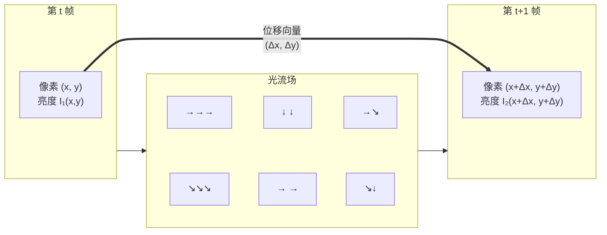
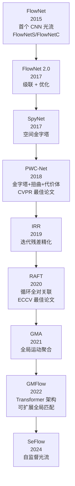
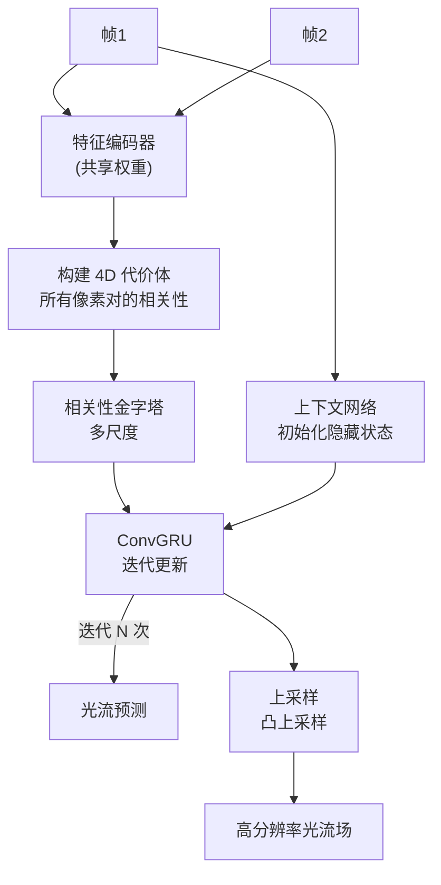

# 光流 — 运动估计与视频理解

> **一句话理解**: 光流是视频中每个像素从一帧到下一帧的"位移向量"——想象每个像素都有一根箭头指着它下一帧要去哪里，这组箭头构成的运动场就是光流，是视频理解的物理基础。

---

## 核心概念

光流（Optical Flow）描述了相邻视频帧之间每个像素的表观运动模式。它估计一个稠密的位移向量场：对于第一帧中的每个像素 (x, y)，预测其在第二帧中的位置 (x+Δx, y+Δy)。光流是 3D 运动在 2D 图像平面上的投影，蕴含了场景结构、相机运动和物体动作等丰富信息。

### 核心要点

- **2D 向量场**：每个像素对应一个 (Δx, Δy) 位移向量
- **亮度恒常假设**：同一像素在相邻帧亮度不变（I(x,y,t) = I(x+Δx, y+Δy, t+Δt)）
- **经典方法**：Horn-Schunck（全局平滑）、Lucas-Kanade（局部窗口）
- **深度学习方法**：FlowNet → PWC-Net → RAFT → GMFlow
- **应用领域**：动作识别、视频插帧、视频压缩、自动驾驶运动分析

## 光流问题图解



### 数学定义

光流基于**运动场一致性约束（光流约束方程）**：

```
I(x, y, t) = I(x + Δx, y + Δy, t + Δt)

Taylor 展开一阶近似:
∂I/∂x · Δx + ∂I/∂y · Δy + ∂I/∂t = 0

即: I_x · u + I_y · v + I_t = 0
其中 (u, v) = (Δx, Δy) 为光流向量

这是一个方程两个未知数 → 孉孔问题（Aperture Problem）
需要额外约束求解:
  - 全局平滑约束 (Horn-Schunck)
  - 局部恒常假设 (Lucas-Kanade)
```

## 详细内容

### 经典方法

#### Horn-Schunck（全局方法）

| 特性 | 详情 |
|------|------|
| 约束 | 光流场全局平滑（相邻像素运动相似） |
| 优化 | 变分法最小化能量泛函 |
| 能量函数 | E = ∫∫ (I_x u + I_y v + I_t)² + α²(\|∇u\|² + \|∇v\|²) dx dy |
| 优点 | 稠密光流（每像素有值） |
| 缺点 | 运动边界模糊（平滑假设在边缘失效） |
| 迭代 | Gauss-Seidel 迭代收敛 |

#### Lucas-Kanade（局部方法）

| 特性 | 详情 |
|------|------|
| 约束 | 局部窗口内光流恒常 |
| 求解 | 最小二乘法（窗口内像素联立方程） |
| 优点 | 边界保持较好，计算快 |
| 缺点 | 稀疏光流（仅特征点处有值） |
| 金字塔 | 多尺度金字塔处理大位移（Pyramidal LK） |

**Lucas-Kanade 广泛用于特征点追踪**（如 KLT tracker、OpenCV 的 `calcOpticalFlowPyrLK`）。

### 深度学习光流方法演进



### RAFT 架构详解

RAFT（Recurrent All-Pairs Field-of-Flow）是 2020 年的 SOTA，核心创新：



| RAFT 组件 | 功能 |
|-----------|------|
| 特征编码器 | 提取两帧的稠密特征图 |
| 代价体（Cost Volume） | 计算帧1每个像素与帧2所有像素的相关性 |
| ConvGRU | 循环更新光流估计，模拟迭代优化 |
| 凸上采样 | 从低分辨率恢复高分辨率光流 |

### 光流评估指标

| 指标 | 全称 | 含义 |
|------|------|------|
| **EPE** | End-Point Error | 预测光流与真值的平均欧氏距离 |
| **AE** | Angular Error | 位移向量的角度误差 |
| **Fl** | Flow Outlier Rate | EPE > 3px 且相对误差 > 5% 的像素比例 |
| **FPS** | Frames Per Second | 推理速度 |

### 主流方法对比

| 方法 | 类型 | Sintel Clean EPE | KITTI Fl-all | FPS | 特点 |
|------|------|-----------------|-------------|-----|------|
| Horn-Schunck | 经典全局 | ~10.0 | ~60% | 5 | 边界模糊 |
| Pyramidal LK | 经典局部 | ~8.0 | ~50% | 100+ | 特征点追踪 |
| FlowNet2 | CNN | 2.35 | ~20% | 12 | 多级级联 |
| PWC-Net | CNN | 3.33 | ~15% | 35 | 代价体金字塔 |
| **RAFT** | 循环 | 1.43 | ~8% | 10 | 迭代优化 |
| GMA + RAFT | 循环 + 注意力 | 1.30 | ~7% | 8 | 全局聚合 |
| **GMFlow** | Transformer | 1.08 | ~7% | 6 | 全局匹配 |
| FlowFormer | Transformer | 0.93 | ~6% | 5 | 编解码 Transformer |

### 光流的挑战场景

| 挑战 | 描述 | 经典方法表现 | 深度学习方法 |
|------|------|------------|------------|
| 大位移 | 物体快速移动 | 差（金字塔部分缓解） | 优（全局匹配） |
| 遮挡 | 像素在下一帧消失 | 失效 | 较好（学习遮挡） |
| 运动模糊 | 快速运动导致模糊 | 差 | 较好 |
| 纹理稀疏 | 平坦区域无纹理 | 孉孔问题 | 较好（语义特征） |
| 光照变化 | 亮度恒常假设失效 | 严重失效 | 优（鲁棒特征） |
| 细小物体 | 小目标精确位移 | 差 | 中等 |

## 对比表格

### 光流 vs 场景流 vs 动作识别

| 维度 | 光流 | 场景流 (Scene Flow) | 动作识别 (Action Recognition) |
|------|------|-------------------|---------------------------|
| 数据 | 2D 视频帧对 | 立体视频/RGB-D | 视频序列 |
| 输出 | 2D 位移场 (u,v) | 3D 位移场 (u,v,w) | 动作类别 |
| 目标 | 像素级运动 | 3D 运动 | 语义理解 |
| 应用 | 追踪、插帧 | 自动驾驶 3D 运动 | 行为分析 |

### 光流在动作识别中的角色

光流是 Two-Stream 动作识别网络的核心：

```
Two-Stream Network:
  空间流: RGB 帧 → 分类（外观信息）
  时间流: 光流图 → 分类（运动信息）  ← 光流显式编码运动
  融合: 两流 softmax 平均

改进:
  TSN: 稀疏时间采样 + 双流
  I3D: 光流输入 3D 卷积（无需显式双流）
  SlowFast: 快慢路径替代光流（端到端学习运动）
```

## AI 应用

- **动作识别**：Two-Stream / TSN 网络的光流输入通道
- **视频插帧**：基于光流中间帧估计（RIFE, FILM）
- **视频稳定**：估计相机运动光流进行补偿
- **视频压缩**：运动补偿编码（H.264/265 的运动估计）
- **自动驾驶**：检测运动物体的轨迹和速度
- **目标追踪**：光流辅助短时追踪（KLT tracker）
- **视频去噪**：利用时域运动对齐进行多帧去噪
- **AR 特效**：基于光流的运动跟踪叠加虚拟物体

## 开放问题

- 无监督/自监督光流在遮挡和大位移场景仍远不如有监督方法 ^[ambiguous]
- 实时高精度光流（>60 FPS + 低 EPE）仍是工程挑战
- 长程光流（超过帧间的运动）预测困难
- 光流在极端光照和天气条件下的鲁棒性不足
- 端到端视频模型（如 SlowFast）逐渐减少对显式光流的依赖
- 3D 场景流的实时估计仍是开放课题

## 来源

- 计算机视觉/Optical_Flow_and_Video.md
- Horn & Schunck, "Determining optical flow", Artificial Intelligence 1981
- Teed & Deng, "RAFT: Recurrent All-Pairs Field Transforms for Optical Flow", ECCV 2020
- Xu et al., "GMFlow: Learning Optical Flow via Global Matching", CVPR 2022

## Related

- [[概念/computer-vision]] — 计算机视觉 (共享: cv, video)
- [[概念/Vision/object-detection]] — 目标检测 (共享: tracking, motion)
- [[概念/Vision/image-segmentation]] — 图像分割 (共享: video, dense-prediction)
- [[概念/Vision/video-generation]] — 视频生成 (共享: video, motion)
- [[概念/Vision/vit]] — Vision Transformer (共享: transformer, video)
