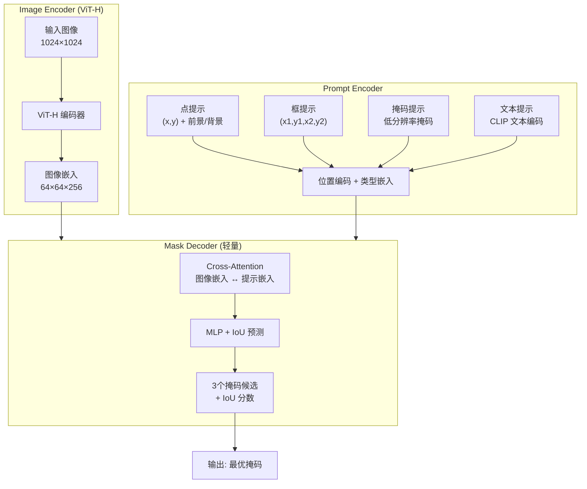
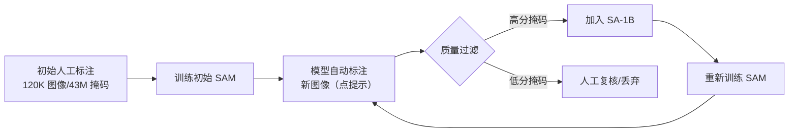

# Segment Anything Model (SAM)

> **一句话理解**: SAM 是视觉领域的 "GPT 时刻"——一个在 10 亿级掩码上训练的分割基础模型，你只需给一个点或画一个框，它就能分割出任何物体，无需额外训练。

---

## 核心概念

Segment Anything Model（SAM）由 Meta AI 在 2023 年 4 月发布（Kirillov et al.）。它提出了**可提示分割（Promptable Segmentation）** 的范式：模型接受点、边界框、掩码或文本作为提示，输出对应的分割掩码。SAM 在 SA-1B 数据集（11M 图像、1B 掩码）上训练，具备强大的零样本泛化能力。

### 核心要点

- **提示驱动**：支持点、框、掩码、文本四种提示类型，灵活交互
- **三种架构组件**：Image Encoder（ViT-H/L/B）+ Prompt Encoder + Mask Decoder
- **模糊感知设计**：一个提示可能对应多个层级（整体/部分/子部分），SAM 同时输出 3 个掩码
- **SA-1B 数据集**：1B 掩码，比以往最大分割数据集大 400 倍，99% 由模型自动标注
- **零样本迁移**：无需微调即可用于新场景（医学、遥感、视频）

## 架构图

### 数据飞轮训练法

SAM 的关键创新是**模型辅助标注的数据飞轮**：

## 详细内容

### Image Encoder

SAM 的图像编码器采用 **ViT-H**（也提供 ViT-L 和 ViT-B 变体），输入图像缩放到 1024×1024。编码器只计算一次（与提示数量无关），输出 64×64×256 的图像嵌入。这一设计使得交互式分割时图像编码可预计算，用户每次点击只需跑轻量的 Mask Decoder。

| 编码器 | 参数量 | 单图编码时间（A100） | 掩码解码时间 |
|--------|--------|---------------------|-------------|
| ViT-H | 636M | ~150ms | ~5ms |
| ViT-L | 308M | ~100ms | ~5ms |
| ViT-B | 91M | ~50ms | ~5ms |

### Prompt Encoder

| 提示类型 | 编码方式 | 维度 |
|---------|---------|------|
| 前景点 | 位置编码 + 前景标记 | 256 |
| 背景点 | 位置编码 + 背景标记 | 256 |
| 框 | 两点位置编码 + 框类型标记 | 256×2 |
| 掩码 | 下采样到 4×256×256 后卷积 | 256 |
| 文本 | CLIP 文本编码器 | 256 |

### Mask Decoder

Mask Decoder 是 SAM 的核心创新，采用轻量的双向 Transformer 设计：
- **Self-Attention**：提示 Token 之间交互
- **Cross-Attention**：提示 Token → 图像嵌入（获取图像上下文）
- **Cross-Attention**：图像 Token → 提示嵌入（获取提示条件）
- **MLP + ConvTranspose**：上采样输出高分辨率掩码

**模糊感知（Ambiguity-Aware）**：SAM 面对一个点提示时，会输出 3 个候选掩码（整体 / 部分 / 子部分），并预测各自 IoU 分数，让用户选择最合适的。

### SA-1B 数据集

| 指标 | 数值 |
|------|------|
| 图像数量 | 11M |
| 掩码数量 | 1B |
| 平均每图掩码 | ~100 |
| 掩码面积分布 | 4% < 32×32, 73% > 256×256 |
| 标注来源 | 96% 模型自动, 4% 人工 |
| 图像分辨率 | 平均 3300×4950 |

### SAM 2（2024）

SAM 2 将能力扩展到**视频分割**，引入了流式记忆架构：

| 特性 | SAM (2023) | SAM 2 (2024) |
|------|-----------|-------------|
| 模态 | 仅图像 | 图像 + 视频 |
| 架构 | ViT + Prompt Encoder + Decoder | Hiera Encoder + Memory Bank + Decoder |
| 交互方式 | 每帧独立提示 | 首帧标注，自动传播 |
| 速度 | 5ms/掩码（图像） | 6 帧预测 + 35ms/帧 |
| 精度 | 图像分割 SOTA | 视频 VOS SOTA（+5-8 mAP） |
| 记忆机制 | 无 | 时序记忆流 + 空间上下文 |

## 对比表格

### SAM vs 传统分割模型

| 维度 | U-Net / DeepLab | Mask R-CNN | SAM |
|------|----------------|-----------|-----|
| 训练数据 | 特定数据集 (1K-10K 图) | 特定数据集 | SA-1B (1B 掩码) |
| 类别 | 固定类别 | 固定类别 | 任意物体 |
| 是否需要微调 | 是（必须） | 是 | 否（零样本） |
| 提示方式 | 无 | 无 | 点/框/掩码/文本 |
| 输出层级 | 单一 | 单一 | 多层级（3 候选） |
| 交互性 | 无 | 无 | 实时交互 |

## AI 应用

- **医学影像**：MedSAM 在 1.5M 医学图像上微调，覆盖 CT/MRI/X-ray 等模态
- **遥感分析**：零样本分割卫星图像中的建筑、植被、水体
- **AR/VR**：实时手部、物体分割用于虚实融合
- **图像编辑**：精准分割抠图，支撑 Adobe Photoshop 的 AI 选区功能
- **视频分析**：SAM 2 用于视频目标分割与追踪
- **数据标注**：自动生成分割标注，将标注效率提升 10-100 倍
- **机器人**：可提示分割用于抓取目标的精确定位

## 开放问题

- SAM 缺乏语义理解能力：能分割但不确定"分割的是什么" ^[ambiguous]
- 文本提示分割效果远不如点/框提示（文本→掩码能力有限）
- 极小目标和细长结构（如毛发、文字笔画）的分割精度不足
- SAM 2 在复杂遮挡和快速运动场景的时序一致性仍需改进
- 3D 分割（点云、体素）的 SAM 化仍处于早期阶段

## 来源

- 计算机视觉/Segmentation/Segmentation.md
- Kirillov et al., "Segment Anything", ICCV 2023
- Ravi et al., "SAM 2: Segment Anything in Images and Videos", 2024

## Related

- [[概念/Vision/vit]] — Vision Transformer (共享: vit, encoder)
- [[概念/Vision/image-segmentation]] — 图像分割 (共享: segmentation)
- [[概念/Vision/dino]] — DINOv2 (共享: self-supervised, foundation-model)
- [[概念/computer-vision]] — 计算机视觉 (共享: cv, deep-learning)
- [[概念/Vision/clip]] — CLIP (共享: foundation-model, zero-shot)
