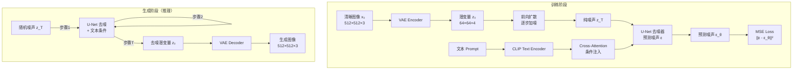

# Stable Diffusion — 潜在空间扩散模型

> **一句话理解**: Stable Diffusion 把扩散过程从像素空间搬到压缩的"潜在空间"中——就像先在缩小版画布上反复擦除噪声草图，最后再放大回原图，生成速度提升数十倍，是 AI 绘画普及的引爆点。

---

## 核心概念

Stable Diffusion（SD）由 CompVis（LMU Munich）、Runway 和 Stability AI 在 2022 年联合发布（Rombach et al., "High-Resolution Image Synthesis with Latent Diffusion Models"，CVPR 2022）。它基于**潜在扩散模型（Latent Diffusion Model, LDM）**架构，核心创新是在变分自编码器（VAE）压缩的低维潜在空间中执行扩散去噪，大幅降低计算成本。

### 核心要点

- **前向扩散（加噪）**：逐步给清晰图像加高斯噪声，T 步后变成纯噪声
- **逆向去噪（生成）**：训练 U-Net 学习逐步去噪，从纯噪声恢复清晰图像
- **潜在空间压缩**：VAE 将 512×512×3 图像压缩到 64×64×4 的潜空间，计算量降低 64 倍
- **文本条件控制**：CLIP 文本编码器提取 prompt 嵌入，通过 Cross-Attention 注入 U-Net
- **采样过程**：从随机噪声出发，经 20-50 步去噪生成图像

## 架构图



### U-Net 结构详解

SD 的核心是带 Cross-Attention 的 U-Net：

```
输入: z_t (噪声潜变量) + t (时间步) + c (文本条件)

Encoder:
  ResBlock(z_t, t) → Self-Attention → Cross-Attention(c) → 下采样
  ResBlock → Self-Attention → Cross-Attention → 下采样
  ResBlock → Self-Attention → Cross-Attention → 下采样

Middle:
  ResBlock → Self-Attention → Cross-Attention → ResBlock

Decoder (镜像):
  上采样 → ResBlock → Self-Attention → Cross-Attention
  上采样 → ResBlock → Self-Attention → Cross-Attention
  上采样 → ResBlock → Self-Attention → Cross-Attention

输出: 预测噪声 ε_θ
```

### 扩散过程的数学表达

**前向过程**（加噪，固定，不可训练）：
```
q(z_t | z_{t-1}) = N(z_t; √(1-β_t) · z_{t-1}, β_t · I)

闭式解:
q(z_t | z_0) = N(z_t; √(ᾱ_t) · z_0, (1-ᾱ_t) · I)
其中 α_t = 1 - β_t, ᾱ_t = Π_{s=1}^{t} α_s
```

**逆向过程**（去噪，U-Net 学习）：
```
p_θ(z_{t-1} | z_t) = N(z_{t-1}; μ_θ(z_t, t, c), Σ_θ(z_t, t))
```

**训练目标**（简化形式）：
```
L = E_{z_0, ε, t} [ ||ε - ε_θ(z_t, t, c)||² ]
```

## 详细内容

### 为什么选择潜在空间？

| 维度 | 像素空间扩散 | 潜在空间扩散 (SD) |
|------|------------|-------------------|
| 计算维度 | 512×512×3 ≈ 786K | 64×64×4 ≈ 16K |
| 计算量 | 48× | 1×（基线） |
| 显存占用 | 极高 | 可消费级 GPU |
| 质量 | 像素级精确 | 足够好（VAE 重建损失 < 1%） |

### 采样器

| 采样器 | 步数 | 质量 | 速度 | 特点 |
|--------|------|------|------|------|
| DDPM | 1000+ | 最优 | 极慢 | 原始论文方法 |
| DDIM | 20-50 | 优 | 快 | 确定性采样 |
| Euler a | 20-30 | 好 | 快 | 快速探索 |
| DPM++ 2M Karras | 20-30 | 优 | 快 | SD 标配 |
| UniPC | 10-20 | 好 | 最快 | 少步数优秀 |

### SD 版本演进

| 版本 | 发布时间 | 核心改进 | 架构变化 |
|------|---------|---------|---------|
| SD 1.4 | 2022.10 | 开源首发 | U-Net + CLIP ViT-L/14 |
| SD 1.5 | 2022.10 | 微调优化 | 同上 |
| SD 2.0 | 2022.11 | OpenCLIP 文本编码器 | 768×768 原生分辨率 |
| SD 2.1 | 2022.12 | 人体艺术去限制 | 768×768 |
| SDXL | 2023.07 | 1B 参数双文本编码器 | 1024×1024 原生 |
| SDXL Turbo | 2023.11 | 蒸馏 + 对抗蒸馏 | 1-4 步生成 |
| SD3 | 2024.06 | Rectified Flow + MMDiT | 多模态 DiT 架构 |
| Flux | 2024.08 | Flow Matching + 12B 参数 | 替代 SD 系列的新 SOTA |

### 高级控制技术

| 技术 | 原理 | 控制类型 |
|------|------|---------|
| **LoRA** | 低秩矩阵微调 | 风格 / 角色定制 |
| **ControlNet** | 附加条件分支网络 | 边缘 / 深度 / 姿态 |
| **Inpainting** | 掩码区域重绘 | 局部编辑 |
| **Img2Img** | 图像作为初始噪声 | 风格迁移 |
| **IP-Adapter** | 图像 prompt 注入 | 参考图风格 |
| **AnimateDiff** | 时序模块 | 视频生成 |

## 对比表格

### SD vs GAN vs VAE

| 维度 | GAN | VAE | 扩散模型 (SD) |
|------|-----|-----|-------------|
| 训练稳定性 | 差（模式坍缩） | 好 | 优 |
| 生成多样性 | 低 | 高 | 最高 |
| 生成质量 | 高 | 中等 | 最高 |
| 推理速度 | 最快（1步） | 快（1步） | 慢（20-50步） |
| 采样可控制性 | 低 | 低 | 高（每步可控） |
| 文本条件 | 需架构修改 | 困难 | 天然支持 |

### SDXL 的文本编码双塔

| 编码器 | 维度 | 作用 |
|--------|------|------|
| CLIP ViT-L/14 | 768 | 理解基础语义 |
| OpenCLIP ViT-bigG | 1280 | 理解复杂描述 |
| 双塔拼接 | 2048 | 综合理解 |

## AI 应用

- **AI 绘画 / 艺术创作**：Midjourney、Stable Diffusion WebUI、ComfyUI
- **设计辅助**：产品概念图、UI 设计稿、海报生成
- **游戏开发**：角色设计、场景概念、纹理素材
- **广告营销**：商品图生成、广告创意
- **图像编辑**：局部重绘、风格迁移、背景替换
- **视频生成**：AnimateDiff、SVD（Stable Video Diffusion）
- **3D 生成**：DreamFusion、Zero-1-to-3 使用扩散模型生成 3D 资产

## 开放问题

- 采样速度仍慢于 GAN（少步蒸馏缩小但未消除差距） ^[ambiguous]
- 多手指 / 复杂手部生成仍然不稳定
- 文本渲染（AI 生成图中文字拼写错误率仍高）
- 训练数据的版权与伦理争议
- 深度伪造（Deepfake）滥用风险与检测

## 来源

- 计算机视觉/Diffusion_Models.md
- Rombach et al., "High-Resolution Image Synthesis with Latent Diffusion Models", CVPR 2022
- Ho et al., "Denoising Diffusion Probabilistic Models" (DDPM), NeurIPS 2020

## Related

- [[概念/Vision/clip]] — CLIP (共享: text-encoder, text-image-alignment)
- [[概念/Vision/vit]] — Vision Transformer (共享: generative-model)
- [[概念/generative-vision-models]] — 生成式视觉模型 (共享: generation, diffusion)
- [[概念/Vision/video-generation]] — 视频生成 (共享: diffusion, generation)
- [[概念/multimodal-vision]] — 多模态视觉 (共享: multimodal, text-image)
