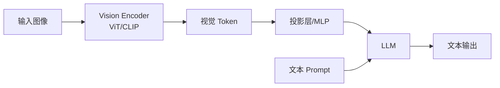

# 视觉语言模型（Vision-Language Model）训练与推理

> **相关**: [[multimodal-models|多模态模型主卡片]]

## 一句话总结

**视觉语言模型（VLM）** 将图像编码为特征序列，输入到大语言模型中，实现“看图说话”式的图文理解与交互。

---

## 典型架构



---

## 核心组件

### 1. 视觉编码器

| 编码器 | 说明 |
|---|---|
| **CLIP ViT** | 最常用，图文对齐好 |
| **SigLIP** | Google 改进版，效率更高 |
| **DINOv2** | 自监督视觉特征 |
| **Swin Transformer** | 层次化视觉编码 |

### 2. 投影层（Projector）

- 将视觉特征维度映射到 LLM embedding 维度；
- 常见形式：线性层、MLP、Q-Former、Perceiver Resampler。

### 3. 大语言模型

- 通常使用开源 LLM（LLaMA、Qwen、Vicuna）；
- 接收拼接后的视觉 token 和文本 token。

---

## 训练流程

### Stage 1：特征对齐

- 冻结视觉编码器和 LLM；
- 只训练投影层；
- 使用大规模图文对（如 CC3M、CC12M、LAION）。

```python
# 伪代码
vision_features = vision_encoder(image)
projected = projector(vision_features)
input_embeds = concat(projected, text_embeds)
logits = llm(input_embeds)
loss = cross_entropy(logits, labels)
```

### Stage 2：视觉指令微调

- 解冻 LLM（部分或全部）；
- 使用视觉指令数据（如 LLaVA-Instruct）；
- 训练模型遵循图文指令。

### Stage 3：高级能力训练

- OCR、文档理解、视频理解等专项数据；
- 多轮对话、复杂推理数据。

---

## 推理优化

| 优化方向 | 技术 |
|---|---|
| **视觉编码缓存** | 预计算并缓存图像特征 |
| **量化** | 对视觉编码器和 LLM 同时量化 |
| **分辨率策略** | 动态分辨率、多尺度输入 |
| **高效 Attention** | FlashAttention、视觉 token 压缩 |
| **批处理** | 多图共享视觉编码器计算 |

---

## 主流 VLM

| 模型 | 视觉编码器 | LLM | 特点 |
|---|---|---|---|
| **LLaVA-1.5** | CLIP ViT | Vicuna | 开源 VLM 标杆 |
| **LLaVA-NeXT** | CLIP ViT | LLaMA-3 | 更强视觉推理 |
| **Qwen-VL** | 自研 ViT | Qwen | 中文 OCR 强 |
| **InternVL** | InternViT | InternLM | 高分辨率支持 |
| **GPT-4V** | 未知 | GPT-4 | 闭源最强 |

---

## 常见挑战

| 挑战 | 说明 |
|---|---|
| **高分辨率图像** | 图像 patch 过多导致序列过长 |
| **细粒度理解** | 难以识别小物体、文字、细节 |
| **幻觉** | 描述与图像不符 |
| **多图理解** | 跨图像关系推理困难 |
| **视频扩展** | 时序信息建模复杂 |

---

## 延伸阅读

- [[概念/multimodal-llm|多模态 LLM]]
- [[概念/qwen-series|Qwen 系列]]
- [[概念/gpt-series-evolution|GPT 系列演进]]
- [[概念/quantization|模型量化]]
