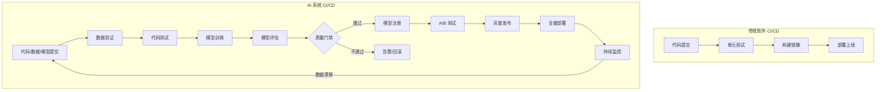
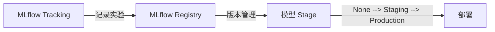
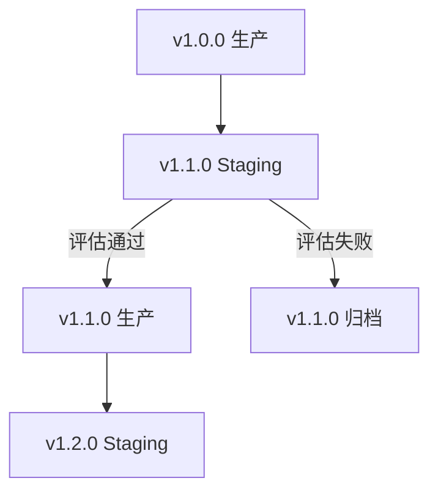

> [!warning] 生产安全提示 · Production Safety
> 本文档含可执行命令/操作步骤。执行前请核对风险等级（🟢低/🔶中/🔴高），高危命令必须 dry-run 并确认回滚方案。完整策略见 [生产安全策略](治理/Production_Safety_Policy.md)。
<!-- op-safety-banner v1 -->
# AI 系统 CI/CD 流水线 2026 (CI/CD Pipeline for AI)

> **一句话理解**: AI 系统的 CI/CD 就像"智能工厂的生产线"——不仅自动测试和部署代码，还要自动训练模型、评估质量、监控性能，确保每次更新都是安全可靠的。

---

## TL;DR（30 秒速览）

- **传统 CI/CD** = 代码 → 测试 → 构建 → 部署
- **AI CI/CD** = 代码 + 数据 + 模型 → 测试 → 训练 → 评估 → 部署 → 监控
- **关键差异**：模型也是"代码"，数据也是"代码"，都需要版本控制和自动化测试
- **核心工具**：GitHub Actions / GitLab CI / Jenkins + MLflow / W&B + Kubeflow

---

## 1. AI 系统 CI/CD 与传统 CI/CD 的区别



| 维度 | 传统软件 | AI 系统 |
|------|---------|---------|
| **版本控制** | 代码 | 代码 + 数据 + 模型 |
| **测试对象** | 逻辑正确性 | 代码 + 模型性能 + 数据质量 |
| **构建产物** | 可执行文件/容器镜像 | 训练好的模型 + 推理服务 |
| **部署单元** | 服务实例 | 模型版本 + 推理配置 |
| **回滚触发** | 代码 bug | 性能下降 / 数据漂移 |
| **监控指标** | 延迟、错误率 | 延迟、准确率、数据分布 |

---

## 2. AI CI/CD 流水线架构

### 2.1 完整流水线阶段


### 2.2 各阶段详解

#### 阶段 1：数据验证（Data Validation）

```yaml
# 数据验证示例（Great Expectations）
validations:
  - expectation: column_values_not_null
    column: user_id
  - expectation: column_values_between
    column: age
    min: 0
    max: 120
  - expectation: table_row_count
    min: 10000
```

| 检查项 | 工具 | 目的 |
|--------|------|------|
| **Schema 验证** | Great Expectations, TFDV | 确保数据格式正确 |
| **分布检查** | Evidently, WhyLabs | 检测数据漂移 |
| **缺失值检测** | Pandas, Deequ | 防止脏数据进入训练 |
| **标签质量** | Cleanlab | 发现标注错误 |

#### 阶段 2：代码测试（Code Testing）

```python
# 模型代码单元测试示例
def test_model_forward_pass():
    model = create_model()
    input_batch = torch.randn(4, 3, 224, 224)
    output = model(input_batch)
    assert output.shape == (4, 10)

def test_data_preprocessing():
    raw_data = load_test_sample()
    processed = preprocess(raw_data)
    assert processed.min() >= 0
    assert processed.max() <= 1
```

#### 阶段 3：模型训练（Model Training）

```yaml
# GitHub Actions 训练工作流示例
jobs:
  train:
    runs-on: gpu-runner
    steps:
      - uses: actions/checkout@v4
      
      - name: Setup Environment
        run: pip install -r requirements.txt
      
      - name: Data Preparation
        run: python scripts/prepare_data.py --version ${{ github.sha }}
      
      - name: Train Model
        run: python train.py --config configs/experiment.yaml
      
      - name: Upload Artifacts
        uses: actions/upload-artifact@v4
        with:
          name: model-${{ github.sha }}
          path: outputs/
```

#### 阶段 4：模型评估（Model Evaluation）

```python
# 评估脚本示例
def evaluate_model(model_path, test_data):
    model = load_model(model_path)
    
    # 基础指标
    metrics = {
        'accuracy': compute_accuracy(model, test_data),
        'f1': compute_f1(model, test_data),
        'latency_p99': measure_latency(model, n=1000)
    }
    
    # 回归测试：与上一版本对比
    baseline = load_baseline_model()
    baseline_metrics = evaluate(baseline, test_data)
    
    for key in metrics:
        if metrics[key] < baseline_metrics[key] * 0.95:
            raise ValueError(f"{key} 回归: {metrics[key]} < {baseline_metrics[key]}")
    
    return metrics
```

#### 阶段 5：质量门禁（Quality Gates）

| 门禁级别 | 条件 | 失败处理 |
|---------|------|---------|
| **硬性门禁** | 准确率 > 阈值 | 阻断发布 |
| **软性门禁** | 推理延迟 < 阈值 | 告警但允许发布 |
| **公平性门禁** | 各群体 AUC 差异 < 5% | 阻断发布 |
| **稳定性门禁** | 与基线差异 < 3% | 人工审核 |

---

## 3. 技术栈与工具链

### 3.1 流水线编排

| 工具 | 适用场景 | 特点 |
|------|---------|------|
| **GitHub Actions** | 开源项目、中小企业 | 与 GitHub 深度集成，社区生态丰富 |
| **GitLab CI** | 已有 GitLab 的企业 | 内置 MLOps 功能，无需额外工具 |
| **Jenkins** | 大型企业、复杂流程 | 插件生态最丰富，可定制性强 |
| **CircleCI** | 快速启动 | 配置简单，并行执行能力强 |

### 3.2 模型生命周期管理



| 工具 | 功能 | 适用场景 |
|------|------|---------|
| **MLflow** | 实验跟踪 + 模型注册 + 部署 | 开源，最通用 |
| **Weights & Biases** | 实验跟踪 + 可视化 + 报告 | 团队协作、论文复现 |
| **DVC** | 数据版本化 + 流水线 | 大数据集管理 |
| **LakeFS** | 数据版本化（Git for Data）| 数据湖场景 |

### 3.3 部署与推理服务

| 工具 | 功能 | 特点 |
|------|------|------|
| **BentoML** | 模型打包 + 服务化 | 一键生成 API 服务 |
| **Seldon** | K8s 模型部署 | 企业级，A/B 测试原生支持 |
| **KServe** | K8s 原生模型服务 | 云原生标准 |
| **vLLM** | LLM 高吞吐推理 | PagedAttention，吞吐量 10×+ |

---

## 4. 完整配置示例

### GitHub Actions + MLflow + BentoML

```yaml
# .github/workflows/ml-pipeline.yml
name: AI CI/CD Pipeline

on:
  push:
    branches: [main]
  pull_request:
    branches: [main]

jobs:
  data-validation:
    runs-on: ubuntu-latest
    steps:
      - uses: actions/checkout@v4
      - run: pip install great-expectations
      - run: great_expectations checkpoint run data_checkpoint

  code-test:
    runs-on: ubuntu-latest
    steps:
      - uses: actions/checkout@v4
      - run: pip install pytest
      - run: pytest tests/ --cov=src --cov-report=xml

  train-and-evaluate:
    needs: [data-validation, code-test]
    runs-on: gpu-runner
    steps:
      - uses: actions/checkout@v4
      
      - name: Train
        run: python train.py
        env:
          MLFLOW_TRACKING_URI: ${{ secrets.MLFLOW_URI }}
      
      - name: Evaluate
        run: python evaluate.py --baseline production
      
      - name: Register Model
        if: github.ref == 'refs/heads/main'
        run: python register_model.py --stage staging

  deploy-staging:
    needs: train-and-evaluate
    runs-on: ubuntu-latest
    steps:
      - uses: actions/checkout@v4
      - run: bentoml build
      - run: bentoml containerize
      - run: kubectl apply -f k8s/staging/

  integration-test:
    needs: deploy-staging
    runs-on: ubuntu-latest
    steps:
      - run: pytest tests/integration/

  deploy-production:
    needs: integration-test
    if: github.ref == 'refs/heads/main'
    runs-on: ubuntu-latest
    environment: production
    steps:
      - run: kubectl apply -f k8s/production/
      - run: python promote_model.py --to-production
```

---

## 5. 最佳实践

### 5.1 模型版本管理



| 实践 | 说明 |
|------|------|
| **语义化版本** | MAJOR.MINOR.PATCH（破坏性变更.功能.修复） |
| **Stage 标签** | None → Staging → Production → Archived |
| **自动回滚** | 监控指标异常时自动切回上一版本 |
| **影子部署** | 新模型并行运行，只记录不返回结果 |

### 5.2 数据版本化

```bash
# DVC 数据版本化工作流
dvc add data/training.dvc
git add data/training.dvc.dvc
git commit -m "Update training data v2.1"

# 与代码版本联动
git tag -a data-v2.1 -m "Training data version 2.1"
```

### 5.3 可复现性清单

| 检查项 | 做法 |
|--------|------|
| **随机种子固定** | `random.seed(42)`, `torch.manual_seed(42)` |
| **依赖锁定** | `pip freeze > requirements.txt` |
| **Docker 化** | 用 Dockerfile 定义完整环境 |
| **配置版本化** | 训练参数存入 Git，不用口头传递 |
| **数据版本化** | DVC / LakeFS 管理数据集版本 |

---

## 6. 常见问题（FAQ）

**Q1: 模型训练几小时甚至几天，怎么放进 CI/CD？**
> 训练不放在每次 commit 的 CI 中，而是：
> - 代码变更触发**训练流水线**（异步执行）
> - 日常用**定时触发**（如每天凌晨训练）
> - 快速 CI 只跑**小规模验证**（少量数据、少量 epoch）

**Q2: 如何测试数据漂移？**
> 用 Evidently / WhyLabs 定期对比训练数据和线上数据的分布：
> - PSI（Population Stability Index）> 0.2 告警
> - KL 散度异常检测
> - 特征相关性变化监控

**Q3: 模型太大，构建/部署太慢怎么办？**
> - 用模型量化（INT8 / FP16）减小体积
> - 分层部署：核心模型常驻，LoRA 适配器动态加载
> - 模型缓存：推理节点本地缓存常用模型版本

**Q4: 如何处理 A/B 测试？**
> - 流量按比例分流（如 10% 新模型，90% 旧模型）
> - 定义明确的胜利指标（如转化率、准确率）
> - 达到统计显著性后自动全量或回滚

---

## 7. 与其他章节的关联

- [MLOps 流水线](.README.md) — 训练到部署的完整流程
- [模型评估](../../模型评估/README.md) — 质量门禁的评估方法
- [部署推理](../.部署推理/README.md) — 模型服务化技术
- [混沌工程](运维/SRE_Reliability/Chaos_Engineering_AI.md) — 故障注入测试
- [AI Ops 概述](运维/AIOps_Fundamentals/AI_Ops_2026.md) — 运维监控体系

---

*Last updated: 2026-05-07*

## Related

- [[运维/AIOps_Fundamentals/AIOps-in-nutshell.md|AIOps-in-nutshell]]
- [[运维/SRE_Reliability/AI_Incident_Response_Playbook|AI_Incident_Response_Playbook]]
- [[运维/AIOps_Fundamentals/AI_Ops_for_dummy.md|AI_Ops_for_dummy]]
- [[运维/README.md|运维 README]]
- [[运维/README_for_dummy.md|README_for_dummy]]
- [[tekton]]
- [[argo-rollouts]]
