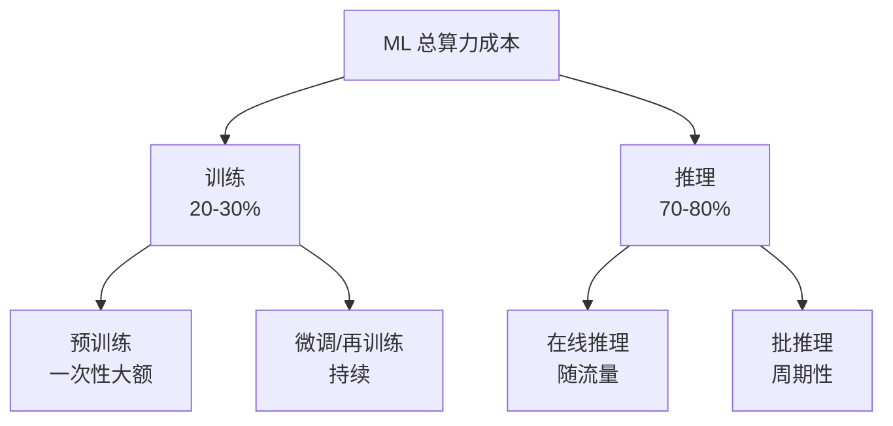
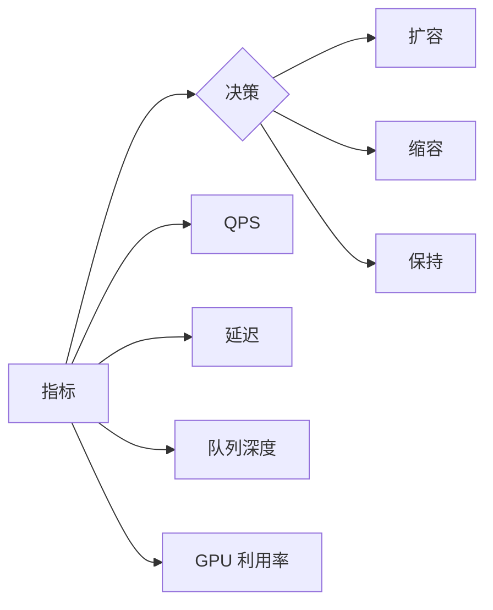
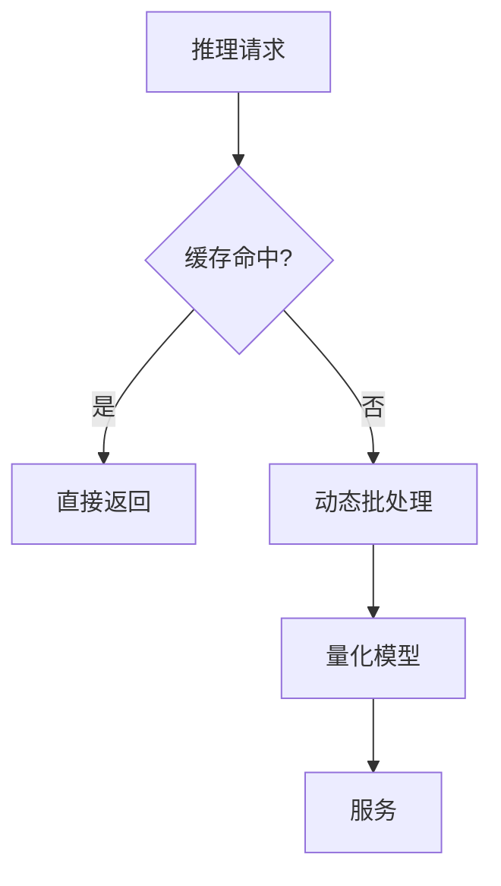

# MLOps 成本优化

> **一句话理解**: 模型训练和推理的算力成本是 MLOps 最大的可控开销——GPU 调度、Spot 实例、弹性伸缩、FinOps 分摊，是把月账单砍掉 50% 的四把刀。

本文关注**基础设施算力成本**。LLM Token 成本与缓存路由见 [[LLM_Cost_Latency_SLO]]。

---

## 目录

| 章节 | 内容 | 难度 |
|------|------|------|
| [1. 成本构成](#1-成本构成) | 训练 vs 推理 | 入门 |
| [2. GPU 调度优化](#2-gpu-调度优化) | 利用率是关键 | 进阶 |
| [3. Spot 实例](#3-spot-实例) | 省 70% 的双刃剑 | 实战 |
| [4. 弹性伸缩](#4-弹性伸缩) | 按需扩缩 | 进阶 |
| [5. 训练成本优化](#5-训练成本优化) | 混合精度/梯度累积 | 进阶 |
| [6. 推理成本优化](#6-推理成本优化) | 量化/批处理/蒸馏 | 实战 |
| [7. FinOps 分摊](#7-finops-分摊) | 成本归因到团队 | 管理 |
| [8. 相关文档](#8-相关文档) | 导航 | 导航 |

---

## 1. 成本构成

### 1.1 训练 vs 推理



**关键洞察**：虽然训练单次很贵，但**推理才是长期大头**（占 70–80%）。优化重点应放在推理侧。

### 1.2 单位成本对比

| 资源 | 按需价格 | 优化后 | 节省 |
|------|---------|--------|------|
| GPU（按需） | $3/h | $0.9/h（Spot） | 70% |
| GPU（低利用） | $3/h × 20% 利用 = $15/有效h | $3/h × 80% = $3.75/有效h | 75% |
| CPU 推理 | $0.5/h | $0.1/h（批处理） | 80% |

---

## 2. GPU 调度优化

### 2.1 GPU 利用率是第一指标

```python
# 监控真实利用率（不是分配率）
def gpu_utilization_health():
    metrics = dcgm_exporter.query()
    
    for gpu in metrics:
        if gpu.utilization < 30:
            alert(f"GPU {gpu.id} 利用率低: {gpu.utilization}%")
            # 常见原因：数据管道慢、CPU 预处理瓶颈、batch 太小
```

### 2.2 GPU 低利用率的根因

| 原因 | 症状 | 修复 |
|------|------|------|
| 数据预处理慢 | GPU 等数据 | 多 worker 预取 |
| Batch 太小 | 利用率波动 | 增大 batch |
| CPU 瓶颈 | CPU 100% / GPU 30% | 预处理卸到 GPU |
| I/O 瓶颈 | 磁盘 100% | 更快存储 / 缓存 |
| 同步阻塞 | 训练 step 间空档 | 异步数据加载 |

### 2.3 多租户共享

```yaml
# 时间分片：白天推理，夜间训练
schedules:
  - name: inference
    hours: "8-22"
    gpus: all
  - name: training
    hours: "22-8"
    gpus: all
    priority: low

# MPS（Multi-Process Service）：多进程共享单 GPU
# MIG（Multi-Instance GPU）：A100/H100 硬件级分区
```

---

## 3. Spot 实例

### 3.1 Spot 的本质

云厂商把空闲算力以 **1–3 折**出售，但**可被随时抢占**。

| 云 | 产品 | 折扣 | 抢占通知 |
|----|------|------|---------|
| AWS | Spot Instance | 70–90% off | 2 分钟 |
| GCP | Preemptible VM | 60–80% off | 30 秒 |
| Azure | Spot VM | 60–80% off | 30 秒 |

### 3.2 适用场景

| 场景 | 适合 Spot？ |
|------|-----------|
| **分布式训练** | ✅（需 checkpoint 容错） |
| **批推理** | ✅ |
| **在线推理** | ❌（中断影响用户） |
| **超参搜索** | ✅（单任务失败可重试） |
| **A/B 测试** | ⚠️（需快速迁移） |

### 3.3 Spot 容错训练

```python
class SpotTrainer:
    def train_with_checkpoint(self):
        # 每 N 步存 checkpoint 到持久存储
        for step in range(total_steps):
            self.train_step(step)
            
            if step % 100 == 0:
                self.save_checkpoint(s3=f"s3://ckpt/run-{run_id}/{step}")
        
    def resume_if_preempted(self):
        latest = find_latest_checkpoint(s3_prefix=f"s3://ckpt/run-{run_id}/")
        if latest:
            self.load_checkpoint(latest)
            print(f"从 {latest} 恢复训练")
```

**核心**：用 Spot 训练必须做到「任何时刻被抢占都能从最近 checkpoint 恢复」。

---

## 4. 弹性伸缩

### 4.1 伸缩策略



### 4.2 KEDA 事件驱动伸缩（推荐）

```yaml
# KEDA ScaledObject — 按队列深度伸缩
apiVersion: keda.sh/v1alpha1
kind: ScaledObject
spec:
  scaleTargetRef:
    name: inference-server
  minReplicaCount: 2
  maxReplicaCount: 50
  triggers:
    - type: kafka
      metadata:
        topic: inference-requests
        lagThreshold: "10"      # 每积压 10 条扩一个副本
```

### 4.3 缩容的陷阱

| 陷阱 | 后果 | 防御 |
|------|------|------|
| **缩容过快** | 流量突增时不够 | 设稳定窗口（5–10 分钟） |
| **冷启动慢** | 模型加载 30s | 预热 / 保持最小副本 |
| **连接未排空** | 在途请求被中断 | 优雅下线（drain） |

---

## 5. 训练成本优化

### 5.1 技术手段

| 手段 | 成本节省 | 质量影响 |
|------|---------|---------|
| **混合精度（FP16/BF16）** | 30–50% | 无 |
| **梯度累积** | 模拟大 batch | 无 |
| **梯度检查点** | 显存省 40% | 训练慢 20% |
| **数据并行** | 线性加速 | 通信开销 |
| **LoRA / QLoRA** | 90%（微调） | 微小 |
| **早停** | 10–30% | 无 |

详见 [[模型训练/Optimization/Mixed_Precision_Training]]、[[大模型/Fine_tuning_Techniques/Fine_tuning_Strategies]]。

---

## 6. 推理成本优化

### 6.1 优化栈



| 手段 | 成本节省 | 详见 |
|------|---------|------|
| **量化（INT8/INT4）** | 50–75% 显存 | [[部署推理/Quantization/Quantization_Techniques_2026]] |
| **动态批处理** | 3–5x 吞吐 | [[部署推理/Inference_Engines/vLLM_Deep_Dive]] |
| **知识蒸馏** | 小模型替代大模型 | [[模型训练/Compression/Pruning_and_Knowledge_Distillation]] |
| **投机解码** | 2x 速度 | [[部署推理/Caching/Speculative_Decoding_Advanced_2026]] |
| **Prompt 缓存** | 50% 延迟 | [[部署推理/Caching/Prompt_Caching_Advanced]] |

---

## 7. FinOps 分摊

### 7.1 成本归因到团队

```yaml
# 所有资源必须打标签
labels:
  team: ml-recommendation
  project: recsys-v2
  environment: production
  cost_center: CC-1001
```

### 7.2 月度 FinOps 评审

| 维度 | 必答问题 |
|------|---------|
| 总成本 | vs 预算？ |
| 团队 Top 3 | 谁烧最多？为什么？ |
| 利用率 | GPU 平均利用率？<60% 要优化 |
| 单位成本 | 每千次推理成本趋势？ |
| 闲置资源 | 有没有忘了关的实例？ |

### 7.3 成本异常检测

```python
def detect_cost_anomaly():
    daily = query_cost(group_by="day")
    baseline = historical_median(daily, days=30)
    
    if daily[-1] > baseline * 1.3:
        alert(f"成本异常: 今日 {daily[-1]} > 基线 30%")
        # 常见原因：忘了关 GPU、Spot 失效回退按需、流量突增
```

---

## 8. 相关文档

### 本章内
- [[模型运维/Cost/LLM_Cost_Latency_SLO]] — LLM Token 成本与缓存
- [[模型运维/Observability/ML_Observability_SLO]] — GPU 利用率监控
- [[模型运维/MLOps_Maturity_Model]] — 成熟度

### 跨章
- [[模型训练/Optimization/Training_Optimization_2026]] — 训练优化
- [[模型训练/Optimization/Mixed_Precision_Training]] — 混合精度
- [[部署推理/Cost/LLM_Cost_Optimization]] — LLM 推理成本
- [[部署推理/Quantization/Quantization_Techniques_2026]] — 量化
- [[架构基建/AI_Cost_Optimization_2026]] — 架构层成本
- [[概念/mlops]] — MLOps 概念

---

*最后更新：2026-06-15*
