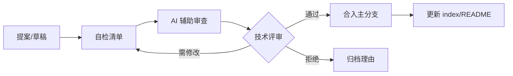
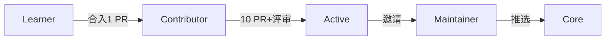

# 内容治理 (Content Governance)

## 1. 治理框架

```
内容治理 = 确保知识库持续高质量的流程和规则

核心原则:
1. 只增不减: 不删除现有内容，只补充和更新
2. 质量优先: 宁可少写，不可滥写
3. 持续更新: 技术内容 6 个月内需审查
4. 交叉引用: 新内容必须链接到相关内容
5. 格式统一: 严格遵循文件规范
```

## 2. 更新周期

```python
UPDATE_SCHEDULE = {
    "快速变化 (每月审查)": [
        "大模型产品动态 (新功能/新模型)",
        "AI 工具对比 (价格/功能变化)",
        "行业应用案例 (新落地)",
    ],
    "中速变化 (每季度审查)": [
        "技术架构 (新框架/新实践)",
        "模型评估 (新基准/SOTA)",
        "编程工具 (新版本/新功能)",
    ],
    "慢速变化 (每半年审查)": [
        "数学基础 (基本不变)",
        "经典 ML 算法 (原理不变)",
        "伦理法规 (除非新法规)",
    ],
    "触发式更新": [
        "重大模型发布 (GPT-5/Claude 5/...)",
        "重大法规变化",
        "用户反馈指出错误",
    ],
}
```

## 3. 审核流程

```python
REVIEW_PROCESS = {
    "新增内容": [
        "1. 作者创建文件 (遵循模板)",
        "2. 自检: frontmatter/格式/交叉引用",
        "3. AI 辅助审查: 检查一致性/断链",
        "4. 同行审查 (可选): 技术准确性",
        "5. 合入主分支",
    ],
    "更新内容": [
        "1. 标记需要更新的部分",
        "2. 更新内容 + 修改 updated 日期",
        "3. 检查相关引用是否需要更新",
        "4. 合入",
    ],
    "质量门禁": [
        "frontmatter 完整且格式正确",
        "无断链 (wikilink 目标存在)",
        "内容 ≥ 100 行 (主文件)",
        "至少 3 个交叉引用",
        "updated 日期已更新",
    ],
}
```

## 4. 版本策略

```python
VERSIONING_STRATEGY = {
    "Git 管理": {
        "分支": "main (稳定) / dev (开发) / feature/* (新功能)",
        "提交": "每个文件独立提交, 消息格式: [目录] 动作: 描述",
        "标签": "按季度打标签 (v2026-Q3)",
    },
    "内容版本": {
        "重大更新": "在文件内标注版本历史",
        "过时内容": "不删除, 标注 [已过时] 并补充新版",
        "争议内容": "保留多方观点, 标注争议",
    },
}
```

## 5. 贡献规范

```python
CONTRIBUTION_GUIDELINES = {
    "文件命名": [
        "主文件: Topic_Name.md",
        "入门版: Topic_Name_for_dummy.md",
        "深度版: Topic_Name_Deep_Dive.md",
        "速查表: Topic_Name_Cheat_Sheet.md",
    ],
    "Frontmatter 必填": [
        "title: 中文标题 (英文原名)",
        "category: 所属大类编号",
        "tags: 3-6 个标签",
        "summary: 一句话摘要",
        "created: 创建日期",
        "updated: 最后更新日期",
        "tier: core/supporting/reference",
    ],
    "内容结构": [
        "# 标题",
        "## 1. 概述/核心概念",
        "## 2-N. 主体内容",
        "## N+1. 交叉引用 (必须)",
    ],
    "禁止事项": [
        "不得删除现有文件",
        "不得修改他人文件的核心观点 (可补充)",
        "不得引入未验证的信息",
    ],
}
```

## 6. 交叉引用

- [[治理/|治理]]
- [[治理/Quality_Metrics|质量度量]]
- [[入门/|入门]]
- [[学习/|学习]]

## 核心知识体系

| 知识域 | 核心内容 | 重要程度 | 学习优先级 |
|--------|----------|----------|------------|
| 基础理论 | 核心概念/原理/方法论 | 最高 | P0 |
| 技术实践 | 工具/框架/最佳实践 | 高 | P0 |
| 工程方法 | 设计模式/架构/流程 | 高 | P1 |
| 前沿趋势 | 新技术/新方向/研究 | 中 | P2 |
| 行业应用 | 实际案例/落地经验 | 中 | P1 |

## 技术对比与选型

| 维度 | 方案A | 方案B | 方案C | 选型建议 |
|------|-------|-------|-------|----------|
| 性能 | 高吞吐 | 低延迟 | 均衡 | 按场景选择 |
| 复杂度 | 简单 | 中等 | 复杂 | 按团队能力 |
| 成本 | 低 | 中 | 高 | 按预算约束 |
| 生态 | 成熟 | 发展中 | 新兴 | 按稳定性需求 |
| 扩展性 | 有限 | 良好 | 优秀 | 按增长预期 |

## 最佳实践清单

| 实践 | 说明 | 优先级 | 预期收益 |
|------|------|--------|----------|
| 标准化流程 | 统一规范和流程 | P0 | 减少错误+提升效率 |
| 自动化 | 重复工作自动化 | P0 | 节省时间+降低风险 |
| 持续监控 | 关键指标实时监控 | P1 | 及时发现问题 |
| 定期回顾 | 周期性复盘改进 | P1 | 持续优化 |
| 知识沉淀 | 文档化经验教训 | P2 | 团队能力提升 |
| 安全优先 | 安全贯穿全流程 | P0 | 降低风险 |

## 常见问题与解决方案

| 问题 | 根因分析 | 解决方案 | 预防措施 |
|------|----------|----------|----------|
| 效率低下 | 流程不规范/工具不当 | 优化流程+引入工具 | 标准化+培训 |
| 质量不稳定 | 缺乏检查机制 | 引入质量门禁 | 自动化测试 |
| 协作困难 | 职责不清/沟通不畅 | 明确分工+定期同步 | 文档化+工具 |
| 技术债务 | 赶工忽略质量 | 定期重构+代码审查 | 质量优先文化 |
| 安全风险 | 意识不足/措施缺失 | 安全培训+工具扫描 | 安全左移 |

## 学习路径建议

| 阶段 | 内容 | 时间 | 产出 |
|------|------|------|------|
| 入门 | 核心概念+基础操作 | 1-2周 | 理解基本框架 |
| 基础 | 工具使用+简单实践 | 2-3周 | 能独立完成基础任务 |
| 进阶 | 深入原理+复杂场景 | 3-4周 | 能处理复杂问题 |
| 实战 | 生产级应用+优化 | 4-6周 | 独立负责项目 |
| 精通 | 架构设计+前沿探索 | 持续 | 技术领导力 |

## 术语速查表

| 术语 | 含义 |
|------|------|
| Best Practice | 行业公认的最佳做法 |
| Anti-pattern | 反模式(应避免的做法) |
| Technical Debt | 技术债务(为速度牺牲质量) |
| CI/CD | 持续集成/持续部署 |
| SLA | 服务等级协议 |
| KPI | 关键绩效指标 |
| ROI | 投资回报率 |
| TCO | 总拥有成本 |

## 检查清单

- [ ] 核心概念和原理已理解
- [ ] 主流工具和框架已掌握
- [ ] 最佳实践已应用到工作中
- [ ] 常见问题能独立解决
- [ ] 持续关注前沿趋势
- [ ] 知识已文档化沉淀


---

## 7. 变更评审流程（Change Review Workflow）

知识库的每一次内容变更都应经过结构化评审，避免低质量合入与回归。流程以轻量 PR（Pull Request）为核心，兼顾效率与质量。

### 评审阶段



### 评审角色与职责

| 角色 | 职责 | 投入 | 决策权 |
|------|------|------|--------|
| 作者 (Author) | 撰写内容、自检、响应反馈 | 主要 | 无（不可自行合入） |
| 评审者 (Reviewer) | 技术准确性、格式、断链检查 | 中等 | 建议/请求修改 |
| 维护者 (Maintainer) | 仲裁、合入、回归确认 | 把关 | 最终合入权 |
| 审计者 (Auditor) | 周期性抽查质量与时效 | 周期 | 触发回滚 |

### 评审 SLA

| 变更类型 | 首响时长 | 合入目标 | 评审人数 |
|----------|----------|----------|----------|
| 错别字/断链修复 | 1 工作日 | 3 工作日内 | 1 人 |
| 内容补充/更新 | 2 工作日 | 1 周内 | 2 人 |
| 新建深度页 (Deep Dive) | 3 工作日 | 2 周内 | 2 人（含 1 维护者） |
| 结构性重构 | 5 工作日 | 3 周内 | 3 人（含 2 维护者） |

### 评审关注点清单

1. **准确性**: 技术陈述是否有据可查，公式/参数是否正确。
2. **时效性**: 是否反映当前（≤ 6 个月）实践，引用版本是否过时。
3. **一致性**: 是否遵循 frontmatter、命名、标题层次规范。
4. **连通性**: 是否补齐交叉引用，是否引入断链。
5. **原创性/版权**: 外部资料是否按 [[治理/Import_Guide|导入指南]] 处理。
6. **安全合规**: 是否触碰 [[治理/Production_Safety_Policy|生产安全策略]] 红线。

---

## 8. PR 模板（Pull Request Template）

为统一评审信息，所有 PR 须按以下模板填写。

### 模板正文

```markdown
## 变更类型
- [ ] 新增内容
- [ ] 内容更新
- [ ] 错误修复
- [ ] 结构调整
- [ ] 工具/脚本

## 变更摘要
<!-- 一句话说明本次改了什么、为什么 -->

## 影响范围
- 涉及文件：<!-- 路径列表 -->
- 影响章节：<!-- 哪些 index/README 需同步 -->

## 自检清单
- [ ] frontmatter 完整且 updated 已更新
- [ ] 无占位符/TODO
- [ ] 交叉引用 ≥ 3 且无断链
- [ ] 主文件 ≥ 100 行 / Deep Dive ≥ 400 行
- [ ] 已运行 `工具/check_links.py`

## 关联
- 关联 Issue/审计项：<!-- 如 治理/_content-audit-2026-07-01 的 P0-x -->
- 关联文档：<!-- wikilink -->
```

### PR 标题规范

| 前缀 | 含义 | 示例 |
|------|------|------|
| `[新增]` | 创建新文件 | `[新增] 强化学习/Deep_RL/SAC_Deep_Dive` |
| `[更新]` | 更新现有内容 | `[更新] 大模型/推理优化` |
| `[修复]` | 修复错误/断链 | `[修复] 治理/CONTRIBUTING 断链` |
| `[重构]` | 结构调整 | `[重构] 可视化 目录归类` |
| `[治理]` | 治理流程类 | `[治理] ROADMAP 季度更新` |

---

## 9. 冲突解决（Conflict Resolution）

多方协作中必然出现观点分歧。本节定义冲突升级与仲裁机制，确保争议不阻塞推进、不损害质量。

### 冲突分级

| 级别 | 典型场景 | 处理方式 | 升级路径 |
|------|----------|----------|----------|
| L1 技术细节 | 公式/参数/措辞 | 评论讨论，引用权威来源 | 48h 无共识 → L2 |
| L2 方案选型 | 架构/工具/命名 | 维护者组织轻量 RFC，多数决 | 1 周无共识 → L3 |
| L3 结构性 | 目录归属/拆分合并 | 维护者团评审，记入 [[治理/log|项目日志]] | 2 周无共识 → L4 |
| L4 战略性 | 范围/路线/原则 | 主维护者裁定，必要时社区投票 | 终决 |

### 仲裁原则

1. **证据优先**：以权威教材、官方文档、可复现实验为准，不以声量定胜负。
2. **保留多元**：技术争议若无法消解，保留多方观点并标注 `[争议]`，不强求统一。
3. **可追溯**：所有 L2+ 冲突的结论写入 [[治理/log|项目日志]] 与相关文件的版本历史。
4. **不删原意**：依据"只增不减"原则，修订他人核心观点须先评论协商，不得直接覆盖。

---

## 10. 版本与回滚（Versioning & Rollback）

### 版本号约定

```text
v<年份>-Q<季度>.<修订号>
示例: v2026-Q3.2  →  2026 年第三季度第 2 次修订
```

- **主版本（季度标签）**：每季度末由维护者打 Git tag（如 `v2026-Q3`），对应 [[治理/ROADMAP|项目路线图]] 里程碑。
- **修订号**：季度内重大合入累加，用于回滚定位。

### 文件级版本历史

每个核心文件在文末维护版本表（示例）：

| 版本 | 日期 | 变更说明 | 作者 |
|------|------|----------|------|
| v1.0 | 2026-05-31 | 初始创建 | @agent |
| v1.1 | 2026-06-15 | 补充交叉引用 | @reviewer |
| v2.0 | 2026-07-21 | 结构化扩写 | @agent |

### 回滚策略

| 触发条件 | 回滚方式 | 验证 |
|----------|----------|------|
| 引入断链/格式破损 | `git revert` 单 PR | 跑 `工具/check_links.py` |
| 技术错误（公式/事实） | 修正 PR + 版本号 +1 | 评审者复核 |
| 严重合规问题 | 立即下线标注 `[已过时]` | 维护者确认 |
| 批量回归 | 回退到季度 tag | 重跑质量度量 |

### 过时内容处理（不删除原则）

知识库坚持"只增不减"。过时内容**不删除**，而是：

1. 在标题加 `[已过时]` 标记。
2. 在文件顶部加 `> **注意**: 本文内容已被 [[新文件|新版]] 取代，保留用于历史参考。`
3. 在新版文件中加"演进自 [[旧文件]]"的回链。

---

## 11. 贡献者等级（Contributor Tiers）

为激励持续高质量贡献，建立分级贡献者体系，等级对应不同权限。

| 等级 | 名称 | 达成条件 | 权限 | 标识 |
|------|------|----------|------|------|
| T0 | 学习者 (Learner) | 注册 | 阅读、提 Issue | — |
| T1 | 贡献者 (Contributor) | ≥ 1 个合入 PR | 提交 PR、参与评审 | `🌱 Contributor` |
| T2 | 活跃贡献者 (Active) | ≥ 10 个合入 + 优质评审 | 评审权、认领任务 | `🌟 Active` |
| T3 | 维护者 (Maintainer) | 邀请制 + 持续高质量 | 合入权、打 tag | `🏅 Maintainer` |
| T4 | 核心维护者 (Core) | T3 中推选 | 战略决策、仲裁 | `👑 Core` |

### 晋升路径



### 等级维护

- **降级**：连续 2 个季度无贡献的 T2 降为 T1（保留记录）。
- **荣誉**：重大贡献者记入 [[治理/log|项目日志]] 的"致谢"区。
- **评审回避**：作者不得评审自己的 PR；T4 维护者回避自己发起的冲突仲裁。

---

## 12. 质量门禁（Quality Gates）

质量门禁是 PR 合入前的硬性检查，自动化优先、人工兜底。

### 门禁矩阵

| 门禁 | 检查项 | 工具 | 阻断级别 | 失败处理 |
|------|--------|------|----------|----------|
| G1 元数据 | frontmatter 七字段完整 | `工具/check_frontmatter.py` | 🔴 阻断 | 必须补全 |
| G2 格式 | 标题层次/命名/分隔线 | `工具/lint_markdown.py` | 🔴 阻断 | 修复后重提 |
| G3 链接 | wikilink 目标存在 | `工具/check_links.py` | 🔴 阻断 | 修断链或加 stub |
| G4 深度 | 行数达标 | `wc -l` | 🟡 警告 | 主文件<100 行需说明 |
| G5 连通 | 入链 ≥ 1 | 反向链接扫描 | 🟡 警告 | 在 index 加引用 |
| G6 时效 | updated 已更新 | 日期比对 | 🟡 警告 | 更新日期 |
| G7 安全 | 无敏感信息/合规 | [[治理/Production_Safety_Policy|安全策略]] 人工 | 🔴 阻断 | 移除/脱敏 |

### 阻断 vs 警告

- **🔴 阻断（Blocking）**：PR 无法合入，必须修复。对应 G1/G2/G3/G7。
- **🟡 警告（Warning）**：可合入但需在 PR 说明，且记入下次整改清单。对应 G4/G5/G6。

### 门禁执行节奏

| 节奏 | 动作 | 责任人 |
|------|------|--------|
| 每次 PR | 运行 G1-G3、G7 | 作者 + CI |
| 合入前 | 人工复核 G4-G6 | 评审者 |
| 每周 | 扫描全库断链/孤立文件 | 审计者 |
| 每季度 | 完整质量度量回顾 | 维护者团，输出 [[治理/quality-metrics/Quality_Metrics|质量度量]] 更新 |

---

## 关联

- [[治理/quality-metrics/Quality_Metrics|质量度量]] — 量化验收指标
- [[治理/CONTRIBUTING|贡献指南]] — 贡献流程入口
- [[治理/AGENTS|AI Agent 协作指令]] — Agent 参与规则
- [[治理/ROADMAP|项目路线图]] — 治理节奏与里程碑
- [[治理/Document_Templates|文档模板规范]] — 文件结构标准
- [[治理/_lint-report|Lint 报告]] — 门禁执行记录
- [[治理/Import_Guide|导入指南]] — 外部资料导入规范
- [[治理/Production_Safety_Policy|生产安全策略]] — 安全门禁依据
