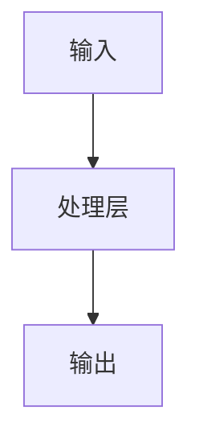
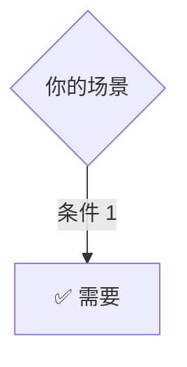
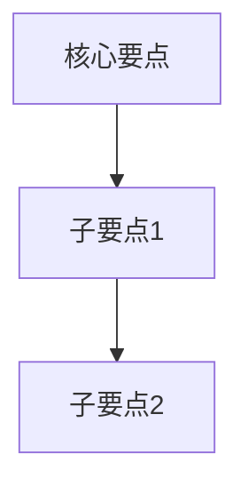
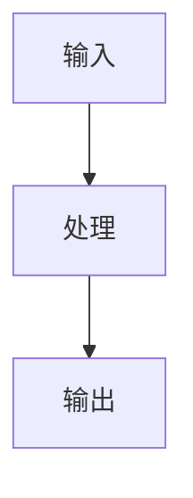
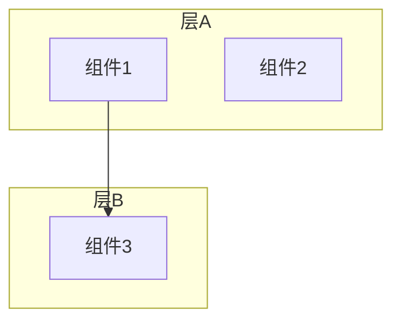
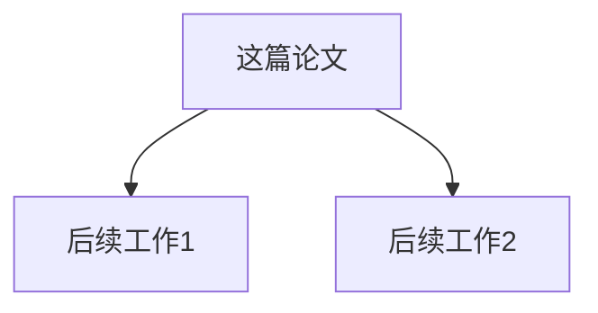
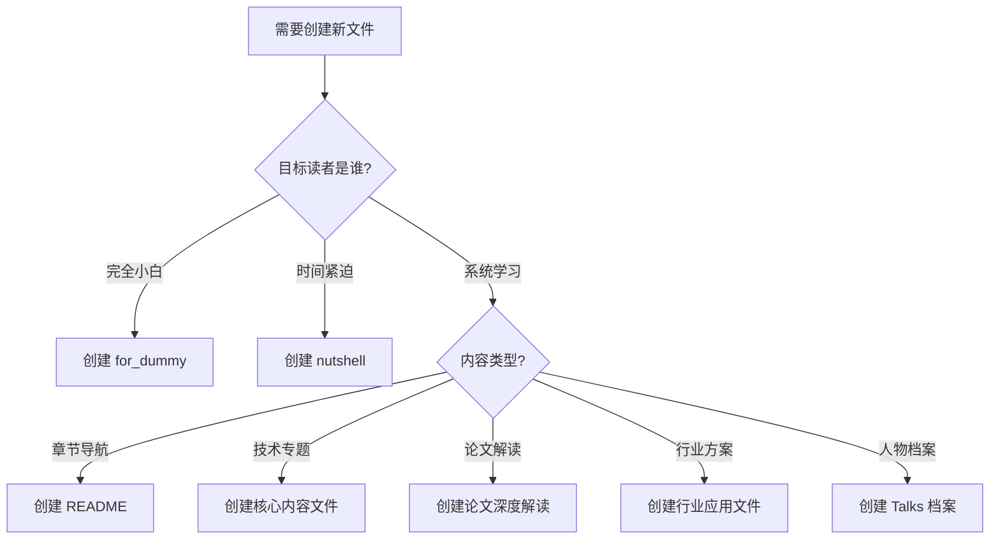
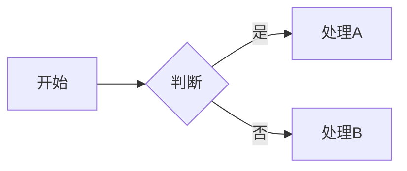

# AI Guru 知识库 — 文档模板规范

> **一句话理解**: 本文档定义了 AI Guru 知识库所有 Markdown 文件的标准模板，确保 22 个章节、650+ 文件在结构、风格和用户体验上的一致性。

---

## 目录

| 模板类型 | 适用场景 | 模板文件 |
|---------|---------|---------|
| **章节 README** | 每个主要章节的导航入口 | [README 模板](#1-章节-readme-模板) |
| **Nutshell 速览** | 30 分钟快速理解核心概念 | [Nutshell 模板](#2-nutshell-速览模板) |
| **For Dummy 简化版** | 小白友好的极简解释 | [For Dummy 模板](#3-for-dummy-简化版模板) |
| **核心内容文件** | 技术专题深度文档 | [核心内容模板](#4-核心内容文件模板) |
| **论文深度解读** | 经典论文的完整分析 | [论文解读模板](#5-论文深度解读模板) |
| **行业应用文件** | 特定行业的 AI 应用方案 | [行业应用模板](#6-行业应用文件模板) |
| **Talks 人物档案** | AI 领袖人物简介与观点 | [Talks 人物模板](#7-talks-人物档案模板) |
| **面试准备文件** | 岗位面试题库与指南 | [面试准备模板](#8-面试准备模板) |

**辅助规范**：
- [通用格式规范](#通用格式规范)
- [文件命名规范](#文件命名规范)
- [反模式清单](#反模式清单--不要这样做)
- [质量检查清单](#质量检查清单)
- [自动化检查脚本](#自动化检查脚本)

---

## 通用格式规范

### 所有文件必须遵循

```markdown
# 标题（中文为主，可附英文）

> **一句话理解**: 用一句通俗的话概括本文核心内容。

---

[正文内容]

---

*Last updated: YYYY-MM-DD*
```

| 元素 | 规范 | 示例 |
|------|------|------|
| **标题** | `# 中文标题 (English Title)` | `# 模型训练 (Model Training)` |
| **一句话理解** | 必须放在标题下方，用 `>` 引用 | `> **一句话理解**: 模型训练是...` |
| **分隔线** | 章节之间用 `---` | `---` |
| **更新日期** | 文件末尾必须标注 | `*Last updated: 2026-05-07*` |
| **交叉引用** | 使用相对路径 `../` | `[深度学习](../深度学习/README.md)` |

### Markdown 格式规范

| 元素 | 规范 |
|------|------|
| **表格** | 表头加粗，文本左对齐，数字右对齐 |
| **代码块** | 标注语言，关键代码必须有注释 |
| **Mermaid 图** | 首选 `flowchart` 和 `subgraph`，注释说明节点含义 |
| **Emoji** | for_dummy 文件可多用，核心文件节制使用 |
| **加粗** | 术语首次出现加粗，表头必须加粗 |

### 中英文混排规范

| 场景 | 规范 | 正确示例 | 错误示例 |
|------|------|---------|---------|
| **中文 + 英文术语** | 英文前后加空格 | `使用 Python 编写` | `使用Python编写` |
| **中文 + 数字** | 数字前后加空格 | `训练了 100 轮` | `训练了100轮` |
| **英文括号** | 中文内容用全角括号 | `（见上图）` | `(见上图)` |
| **专有名词** | 保留原大小写 | `PyTorch`、`GPT-4` | `pytorch`、`gpt-4` |
| **文件名** | 中英混合时使用英文 | `README.md` | `读取我.md` |

### "一句话理解"质量标准

| 质量等级 | 标准 | 示例 |
|---------|------|------|
| ✅ **优秀** | 包含类比，小学生能懂 | `模型训练就像教小孩认动物` |
| ✅ **良好** | 无术语，一句话说清价值 | `让计算机从数据中学习规律` |
| ⚠️ **及格** | 专业但易懂 | `用优化算法调整模型参数` |
| ❌ **不合格** | 包含术语、超过 50 字、说不清价值 | `基于梯度下降的反向传播优化` |

**自测标准**：把"一句话理解"念给完全不懂 AI 的人听，对方能大致猜出这是干什么的，就算合格。

---

## 文件命名规范

### 命名规则

| 文件类型 | 命名模式 | 正确示例 | 错误示例 |
|---------|---------|---------|---------|
| **章节 README** | `README.md` | `README.md` | `readme.md`、`ReadMe.md` |
| **章节简化版** | `README_for_dummy.md` | `README_for_dummy.md` | `readme_for_dummy.md` |
| **速览文件** | `Topic-in-nutshell.md` | `ML-in-nutshell.md` | `ml_in_nutshell.md` |
| **小白指南** | `Topic_for_dummy.md` | `RAG_Systems_for_dummy.md` | `rag-systems-dummy.md` |
| **深度文档** | `Topic_Deep_Dive.md` | `LiteLLM_Deep_Dive.md` | `litellm-deep-dive.md` |
| **年度趋势** | `Topic_2026.md` | `AI_System_Architecture_2026.md` | `ai-system-architecture-2026.md` |
| **子目录文件** | `Subtopic/Subtopic.md` | `Transformer_Revolution/Transformer_Revolution.md` | `transformer/Readme.md` |

### 命名原则

1. **英文为主**：文件名全部使用英文，避免中文文件名
2. **大驼峰（PascalCase）**：每个单词首字母大写，用下划线连接
   - ✅ `Distributed_Training_2026.md`
   - ❌ `distributed-training-2026.md`
   - ❌ `distributedTraining2026.md`
3. **无多余后缀**：深度文档不需要同时写 `Deep_Dive` 和 `_2026`
   - ✅ `Attention_Is_All_You_Need_Deep_Dive.md`
   - ❌ `Attention_Is_All_You_Need_Deep_Dive_2026.md`
4. **子目录内文件与目录同名**：
   - 目录：`Transformer_Revolution/`
   - 文件：`Transformer_Revolution/Transformer_Revolution.md`
   - 简化版：`Transformer_Revolution/Transformer_Revolution_for_dummy.md`

---

## 反模式清单（不要这样做）

基于本次全项目优化中发现的 200+ 处问题，总结以下反模式：

### 结构反模式

| 反模式 | 问题 | 正确做法 |
|--------|------|---------|
| **孤岛文档** | 文件没有任何内部链接 | 至少包含 2 个 `../` 交叉引用 |
| **目录裸引用** | `[章节](../XX_Chapter/)` | `[章节](../模型运维/README.md)` |
| **断链** | 引用了不存在的文件路径 | 创建文件前先检查目标是否存在 |
| **深度失衡** | for_dummy 比正常版还长 | for_dummy 应为正常版的 40-70% |
| **README 缺席** | 章节没有 README.md | 每个主要目录必须有 README |

### 内容反模式

| 反模式 | 问题 | 正确做法 |
|--------|------|---------|
| **术语轰炸** | 一句话里 3 个以上未解释术语 | 首次出现术语时加粗并简要解释 |
| **有图无文** | mermaid 图旁没有文字说明 | 每个图下方加 1-2 句解释 |
| **代码裸奔** | 代码块无注释、无运行说明 | 关键行加注释，附预期输出 |
| **表格空洞** | 表格只有表头没有内容 | 表格至少 3 行数据 |
| **FAQ 敷衍** | 回答只有一句话 | FAQ 回答应包含"原因 + 方案" |

### 格式反模式

| 反模式 | 问题 | 正确做法 |
|--------|------|---------|
| **中英文粘连** | `使用Python训练` | `使用 Python 训练` |
| **日期不一致** | 同一文件多种日期格式 | 统一使用 `YYYY-MM-DD` |
| **标题层级跳跃** | 从 `##` 跳到 `####` | 层级逐次递减 |
| **emoji 滥用** | 核心文件每段都有 emoji | 核心文件节制使用，for_dummy 可用 |

---

## 质量检查清单

### 创建新文件时的必检项

- [ ] **结构**：包含"一句话理解" + `---` 分隔线 + `*Last updated*`
- [ ] **命名**：符合[文件命名规范](#文件命名规范)
- [ ] **交叉引用**：至少 2 个 `../` 相对路径引用其他章节
- [ ] **表格**：至少 1 个对比表格（表头加粗）
- [ ] **图表**：README/核心文件至少 1 个 mermaid 图
- [ ] **代码**：如有代码示例，必须标注语言并带注释
- [ ] **反模式**：检查是否触发了[反模式清单](#反模式清单--不要这样做)中的任何一条

### 按文件类型的附加检查项

| 文件类型 | 附加检查 |
|---------|---------|
| **README** | 有学习路径、有前置/进阶方向、文档清单有"适用读者"列 |
| **nutshell** | 有 TL;DR、有生活类比、字数 500-800 行 |
| **for_dummy** | 标题带 emoji、大量类比、代码 < 30 行、字数 300-500 行 |
| **核心内容** | 六大块齐全（概述→原理→架构→实战→性能→FAQ）、字数 800-1,500 |
| **论文解读** | 有论文元信息表、有历史背景、有后续影响图 |
| **行业应用** | 有市场数据、有 3+ 应用场景、有合规要求 |

---

## 自动化检查脚本

### 快速自检命令

```bash
# 检查文件是否符合基本规范
check_doc() {
    file="$1"
    echo "=== 检查: $file ==="
    
    # 1. 检查是否有"一句话理解"
    if grep -q "一句话理解" "$file"; then
        echo "✅ 包含一句话理解"
    else
        echo "❌ 缺少一句话理解"
    fi
    
    # 2. 检查是否有更新日期
    if grep -q "Last updated" "$file"; then
        echo "✅ 包含更新日期"
    else
        echo "❌ 缺少更新日期"
    fi
    
    # 3. 检查内部链接数量
    links=$(grep -co '\.\./' "$file" 2>/dev/null || echo 0)
    if [ "$links" -ge 2 ]; then
        echo "✅ 内部链接: $links 个"
    else
        echo "⚠️ 内部链接偏少: $links 个（建议 ≥2）"
    fi
    
    # 4. 检查表格数量
    tables=$(grep -c '^|' "$file" 2>/dev/null || echo 0)
    if [ "$tables" -ge 3 ]; then
        echo "✅ 表格行数: $tables"
    else
        echo "⚠️ 表格偏少: $tables 行（建议 ≥3）"
    fi
    
    # 5. 检查 mermaid 图
    if grep -q "^\s*\`\`\`mermaid" "$file"; then
        echo "✅ 包含 mermaid 图"
    else
        echo "⚠️ 缺少 mermaid 图（README/核心文件建议添加）"
    fi
    
    # 6. 检查行数
    lines=$(wc -l < "$file")
    echo "📊 总行数: $lines"
}

# 使用示例: check_doc 模型训练/README.md
```

### 批量检查脚本

```bash
#!/bin/bash
# check_project.sh — 批量检查项目文档质量

echo "=== AI Guru 知识库质量检查 ==="
echo ""

# 检查缺失 README 的目录
missing_readme=0
for d in [0-9][0-9]_*/; do
    if [ ! -f "$d/README.md" ]; then
        echo "❌ 缺少 README: $d"
        missing_readme=$((missing_readme + 1))
    fi
done
if [ "$missing_readme" -eq 0 ]; then
    echo "✅ 所有主要目录都有 README.md"
fi

# 统计各章节文件数
echo ""
echo "=== 各章节文件统计 ==="
for d in [0-9][0-9]_*/; do
    md_count=$(find "$d" -name "*.md" | wc -l)
    echo "  $md_count files | $d"
done

# 检查 last updated 日期不一致
echo ""
echo "=== 日期分布 ==="
find . -name "*.md" -path "./[0-9][0-9]_*" -exec grep -h "Last updated" {} + 2>/dev/null | sed 's/.*Last updated: //' | sort | uniq -c | sort -rn | head -5
```

---

## 1. 章节 README 模板

### 用途
每个主要章节的导航入口，帮助读者快速了解本章内容、找到学习路径、跳转到相关章节。

### 文件位置
`XX_Chapter_Name/README.md`

### 模板结构

```markdown
# 章节名 (English Name)

> **一句话理解**: [用一句话概括本章核心内容]

---

## 本章内容

| 文档 | 内容 | 适用读者 |
|------|------|----------|
| [文件A](`./fileA.md`) | 一句话描述 | 快速入门 |
| [文件B](`./fileB.md`) | 一句话描述 | 系统学习 |
| [文件C](`./subdir/fileC.md`) | 一句话描述 | 进阶学习 |

> ⚠️ **注意**: [如果有内容正在建设中，在此说明]

---

## 学习路径

- **快速入门** → [Nutshell 文件](`./chapter-in-nutshell.md`)（30 分钟）
- **系统学习** → [主文件](`./main_topic.md`)（2-3 小时）
- **进阶实践** → [高级文件](`./advanced.md`)
- **简化版** → [For Dummy 文件](`./topic_for_dummy.md`)

---

## 与其他章节的关联

### 前置知识
- [前置章节](../模型运维/README.md) — 为什么需要它
- [基础章节](../数学基础/Topic/Topic.md) — 具体基础概念

### 进阶方向
- [后续章节](../模型运维/README.md) — 学完本章后可以深入的方向
- [相关工具](../模型运维/README.md) — 实践本章内容的工具

---

## 关键技术概览（可选）



---

## 规划中的内容（如适用）

<!-- 列出尚未创建但计划补充的文件，创建后删除对应条目 -->

---

*Last updated: YYYY-MM-DD*
```

### 检查清单

- [ ] 包含 "一句话理解"
- [ ] 文档清单表格包含"内容"和"适用读者"列
- [ ] 有明确的学习路径（快速入门 → 系统学习 → 进阶）
- [ ] 有"前置知识"和"进阶方向"的交叉引用
- [ ] 所有内部链接使用相对路径 `./` 或 `../`
- [ ] 链接指向具体文件，不是目录

---

## 2. Nutshell 速览模板

### 用途
30 分钟速览文档，让读者快速掌握核心概念、关键术语和基本用法。面向时间紧迫的读者。

### 文件位置
`XX_Chapter/chapter-in-nutshell.md` 或 `XX_Chapter/Subtopic/subtopic-in-nutshell.md`

### 模板结构

```markdown
# 主题速成指南 (Topic in a Nutshell)

> **一句话理解**: [用最简单的话概括]

---

## TL;DR（30 秒速览）

- **核心概念 1**: 一句话解释
- **核心概念 2**: 一句话解释
- **核心概念 3**: 一句话解释
- **关键工具**: 列出 2-3 个工具

---

## 1. 核心概念速查


| 概念 | 解释 | 类比 |
|------|------|------|
| **术语A** | 一句话定义 | 生活类比 |
| **术语B** | 一句话定义 | 生活类比 |

---

## 2. 关键技术/方法

### 2.1 方法A

[2-3 句话解释 + 1 个 mermaid 图]

### 2.2 方法B

[2-3 句话解释 + 对比表格]

---

## 3. 代码示例（如适用）

```python
# 最小可运行示例
print("Hello")
```

---

## 4. 常见问题

**Q: 最常见的问题？**
> 简洁回答。

**Q: 如何快速上手？**
> 给出具体的第一步。

---

## 5. 与其他章节的关联

- [前置知识](../模型运维/README.md)
- [进阶方向](../模型运维/README.md)

---

*Last updated: YYYY-MM-DD*
```

### 检查清单

- [ ] 包含 "TL;DR" 部分（30 秒速览）
- [ ] 核心概念有生活类比
- [ ] 包含至少 1 个 mermaid 图
- [ ] 有最小可运行的代码示例
- [ ] 字数控制在 500-800 行

---

## 3. For Dummy 简化版模板

### 用途
绝对初学者的入门指南，避免术语，大量使用类比、emoji 和简单图表。

### 文件位置
`XX_Chapter/topic_for_dummy.md` 或 `XX_Chapter/Subtopic/subtopic_for_dummy.md`

### 模板结构

```markdown
# 主题小白指南 (Topic for Dummy)

> **一句话理解**: [用小学生能懂的话概括]

---

## 🤔 什么是[主题]？

### 用[生活物品]来比喻

[简单场景描述]


---

## 🧩 [主题]的核心组件

### 1. [组件A]

[一句话解释 + 类比]

### 2. [组件B]

[一句话解释 + 类比]

---

## ⚖️ [对比项A] vs [对比项B]

| 对比项 | A | B |
|--------|---|---|
| **特点1** | ... | ... |
| **特点2** | ... | ... |

---

## 🎯 什么时候需要[主题]？



---

## 🛠️ 最小上手示例

```python
# 最简单的代码示例
print("hello")
```

---

## ⚠️ 常见问题

| 问题 | 原因 | 解决办法 |
|------|------|---------|
| **问题1** | 为什么 | 怎么做 |

---

## 💡 核心要点



---

## 🔗 相关主题

- [深度解析](`./main_topic.md`) — 完整技术细节
- [前置基础](`../模型运维/README.md`) — 需要的基础知识

---

*Last updated: YYYY-MM-DD*
```

### 检查清单

- [ ] 每节标题使用 emoji
- [ ] 大量类比（"就像..."）
- [ ] 表格比段落多
- [ ] 代码示例在 30 行以内
- [ ] 字数控制在 300-500 行
- [ ] 避免专业术语，必须使用时加括号解释
- [ ] 长度应为正常版的 40-70%，不能反而更长

---

## 4. 核心内容文件模板

### 用途
技术专题的完整深度文档，面向有一定基础的读者。包含原理、架构、代码实战、性能数据和常见问题。

### 文件位置
`XX_Chapter/Topic_Deep_Dive.md` 或 `XX_Chapter/Subtopic/Topic_2026.md`

### 模板结构

```markdown
# 主题深度解析 (Topic Deep Dive)

> **一句话理解**: [用专业但易懂的话概括]

---

## 1. 概述 (Overview)

### 1.1 为什么需要[主题]

[背景、痛点、必要性]

### 1.2 核心概念

| 概念 | 定义 | 类比/直觉 |
|------|------|----------|
| **术语A** | 定义 | 直觉解释 |

---

## 2. 原理详解 (Principles)

### 2.1 [子主题A]

[详细解释]



### 2.2 [子主题B]

[详细解释 + 公式]

```
公式: E = mc^2
```

---

## 3. 架构与实现 (Architecture)

### 3.1 整体架构



### 3.2 关键组件对比

| 组件 | 优点 | 缺点 | 适用场景 |
|------|------|------|---------|
| 方案A | ... | ... | ... |
| 方案B | ... | ... | ... |

---

## 4. 实战代码 (Hands-on Code)

### 4.1 环境准备

```bash
pip install required-package
```

### 4.2 核心代码

```python
# 带注释的完整示例
import torch

class MyModel(torch.nn.Module):
 def __init__(self):
 super().__init__()
 self.layer = torch.nn.Linear(10, 1)
 
 def forward(self, x):
 return self.layer(x)
```

### 4.3 运行与验证

```bash
python demo.py
# 预期输出: ...
```

---

## 5. 性能数据 (Performance)

| 指标 | Baseline | 优化后 | 提升 |
|------|---------|--------|------|
| 延迟 | 100ms | 50ms | 2× |
| 吞吐 | 100 QPS | 300 QPS | 3× |

---

## 6. 常见问题 (FAQ)

**Q1: [高频问题]？**
> [详细回答，包含原因和解决方案]

**Q2: [高频问题]？**
> [详细回答]

---

## 7. 与其他章节的关联

### 前置知识
- [基础概念](../模型运维/README.md)

### 进阶方向
- [高级主题](../模型运维/README.md)

---

*Last updated: YYYY-MM-DD*
```

### 检查清单

- [ ] 包含"概述"、"原理"、"架构"、"实战"、"性能"、"FAQ"六大块
- [ ] 至少 2 个 mermaid 架构图
- [ ] 至少 1 个完整可运行的代码示例
- [ ] 至少 3 个对比表格
- [ ] 字数控制在 800-1,500 行
- [ ] 包含与其他章节的交叉引用

---

## 5. 论文深度解读模板

### 用途
对经典 AI 论文的完整解读，帮助读者从论文源头理解技术演进。

### 文件位置
`论文精读/Paper_Name_Deep_Dive.md`

### 模板结构

```markdown
# 论文标题深度解读

> **一句话理解**: [这篇论文像什么，改变了什么]

---

## 论文基本信息

| 属性 | 内容 |
|------|------|
| **标题** | Paper Title |
| **作者** | Author et al. (Institution) |
| **发表** | Conference/Journal Year |
| **引用量** | X,XXX+ (截至 2026) |
| **论文链接** | [arXiv:xxxx.xxxxx](url) |

---

## 1. 历史背景

[这篇论文之前，领域是什么状态？有什么问题？]

---

## 2. 核心创新

### 2.1 直观理解

[用比喻解释核心思想]

### 2.2 技术细节

[公式、算法、架构图]


---

## 3. 实验结果

| 方法 | 指标A | 指标B |
|------|-------|-------|
| 之前的方法 | 80% | 0.5 |
| **这篇论文** | **95%** | **0.8** |

---

## 4. 代码复现（如适用）

```python
# 核心算法的简化实现
```

---

## 5. 后续影响

[这篇论文催生了哪些后续工作？]



---

## 6. FAQ

**Q1: [常见问题]？**
> [回答]

---

## 7. 相关章节

- [理论基础](../模型运维/README.md)
- [实践应用](../模型运维/README.md)

---

*Last updated: YYYY-MM-DD*
```

### 检查清单

- [ ] 包含完整的论文元信息表格
- [ ] 有"历史背景"帮助读者理解上下文
- [ ] 核心创新有直观理解 + 技术细节两层
- [ ] 包含实验结果对比表
- [ ] 有代码复现或伪代码
- [ ] 有"后续影响"展示技术演进

---

## 6. 行业应用文件模板

### 用途
特定行业的 AI 应用方案，包含行业背景、核心场景、技术方案、案例研究、合规要求和 ROI 分析。

### 文件位置
`行业应用/Industry_Name/AI_Industry_Name_2026.md`

### 模板结构

```markdown
# AI [行业名]行业应用 (2025-2026)

> **一句话理解**: [2026年该行业AI的状态，一句话概括]

---

## 1. 行业现状概览

```
2026 年[行业]AI 市场:
├── 全球市场规模: $XX 亿
├── AI 渗透率: XX%
└── 关键驱动力:
 ├── [驱动力 1]
 └── [驱动力 2]
```

---

## 2. 核心应用场景

### 2.1 [场景A]

| 指标 | 数据 | 年份 |
|------|------|------|
| **关键指标** | 数值 | 2026 |

### 2.2 [场景B]

[详细描述]

---

## 3. 技术趋势

[该行业2026年的技术演进方向]

---

## 4. 挑战与监管

| 挑战 | 现状 | 应对方案 |
|------|------|---------|
| **数据隐私** | ... | ... |

---

## 5. 技术栈与工具（扩展内容）

| 工具/框架 | 用途 | 特点 |
|-----------|------|------|
| **工具A** | ... | ... |

---

## 6. 案例研究（扩展内容）

### 案例 1：[公司/产品]

[详细分析，包含 mermaid 流程图]

---

## 7. ROI 与商业模式（扩展内容）

| 应用场景 | 投入 | 回报 | 回收期 |
|---------|------|------|--------|
| **场景A** | $X | Y% 提升 | Z 个月 |

---

## 8. 未来展望（扩展内容）

| 年份 | 预测里程碑 |
|------|-----------|
| **2027** | ... |

---

## 9. 与其他章节的关联

- [相关技术](../模型运维/README.md)
- [伦理安全](../伦理安全/README.md)

---

*Last updated: YYYY-MM-DD*
```

### 检查清单

- [ ] 包含行业市场规模和渗透率数据
- [ ] 至少 3 个核心应用场景
- [ ] 有挑战与监管对比表
- [ ] （扩展）包含案例研究和 ROI 分析
- [ ] （扩展）包含技术栈推荐
- [ ] 字数目标：基础版 200-300 行，完整版 500+ 行

---

## 7. Talks 人物档案模板

### 用途
AI 领域领袖人物的简介、核心观点和动态追踪。

### 文件位置
`业界观点/Person_Name/about.md` + `业界观点/Person_Name/sayings.md`

### about.md 模板

```markdown
# [姓名]简介 ([English Name])

- **身份**: [职位、机构]
- **贡献**: [2-3 个核心贡献]
- **立场**: [技术/哲学立场]
- **来源**: [权威来源链接]

## 最新动态与权威来源
- **个人主页**: [url]
- **关键事件**: [事件描述 + 链接]
- **相关章节**: [知识库中的关联内容]

---

## 相关主题与延伸阅读

- [Talks Synthesis 2026](业界观点/Talks_Synthesis_2026.md) — 查看 [姓名] 在 Scaling Laws、AI 安全等主题中的立场
- [AI 历史](入门/AI_History_Timeline.md) — [姓名] 的关键贡献时间线
- [AI 未来趋势](入门/AI_Future_Trends.md) — 行业前瞻判断汇总

---

*Last updated: YYYY-MM-DD*
```

### sayings.md 模板

```markdown
# [姓名]金句与观点

## 核心观点

> "[金句原文]"
> — [上下文，如"2025年NeurIPS演讲"]

## 权威来源

| 日期 | 来源 | 链接 |
|------|------|------|
| 2025-X-X | [演讲/访谈/论文] | [url] |

---

*Last updated: YYYY-MM-DD*
```

---

## 8. 面试准备文件模板

### 用途
为特定 AI 岗位提供面试准备资料，包含职责、能力要求、考点和题库。

### 文件位置
`面试岗位/Job_Title/interview_preparing.md` 等

### interview_preparing.md 模板

```markdown
# [岗位名]面试准备

## 核心职责
- **职责1**: ...
- **职责2**: ...

## 核心能力
- **能力1**: ...

## 常见考点
- **考点1**: ...

## 项目准备
- **项目类型**: ...

## 简历要点
- **要点1**: ...

---

*Last updated: YYYY-MM-DD*
```

---

## 快速参考：文件创建决策树



---

## 附录：常用 Mermaid 图模式

### 流程图


### 层级架构图


### 对比矩阵（用表格代替）
| 方案 | 优点 | 缺点 |
|------|------|------|
| A | ... | ... |

---

*Last updated: 2026-05-07*

## Related

- [[治理/Import_Guide|导入指南]] — 📥 将知识库导入 NotebookLM / ima / Obsidian 等工具
- [[治理/index|项目治理]] — 项目治理、审计报告与元数据索引
