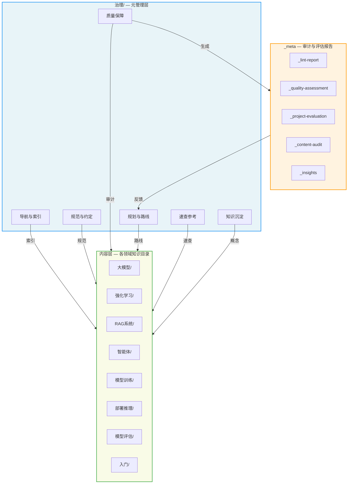
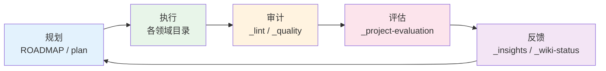

# 项目治理 (治理)

> **一句话理解**: 本文件夹是 AI Guru 知识库的元管理层——负责项目规划、质量评估、内容审计、导航索引和规范约定，是整个知识库的"控制塔"。

---

## 目录

- [项目治理概览](#项目治理概览)
- [知识库治理架构](#知识库治理架构)
- [三大子目录导航](#三大子目录导航)
- [关键文件索引](#关键文件索引)
- [_meta 元文件说明](#_meta-元文件说明)
- [评估与审计报告](#评估与审计报告)
- [分析与洞察](#分析与洞察)
- [工作日志](#工作日志)
- [使用场景](#使用场景)
- [更新日志](#更新日志)
- [贡献指南](#贡献指南)
- [Related](#related)

---

## 项目治理概览

`治理/` 是 AI Guru 知识库的**元管理层（Meta-Management Layer）**。它不直接面向终端学习者，而是为整个知识库提供：

| 职能 | 说明 | 核心载体 |
|------|------|---------|
| **导航与索引** | 为知识库的所有内容提供入口和地图 | `hot.md`、`ROADMAP.md`、各 `index.md` |
| **规范与约定** | 统一文档格式、目录结构、导入流程、协作规则 | `Document_Templates.md`、`Import_Guide.md`、`AGENTS.md` |
| **质量保障** | 持续评估内容完整性、概念覆盖度、标签一致性 | `_quality-assessment.md`、`_lint-report.md`、`_content-audit-*` |
| **规划与路线** | 记录项目发展方向、季度目标和执行状态 | `ROADMAP.md`、`plan/` |
| **速查参考** | 提供各领域可快速查阅的技术速查表 | `cheatsheets/` |
| **知识沉淀** | 维护概念知识图谱和全栈术语字典 | `notes/` |

> **设计理念**: 治理层与内容层分离。`治理/` 管"怎么组织"，各领域目录（如 `大模型/`、`强化学习/`）管"具体内容"。这种分离让知识库可扩展、可维护、可审计。

---

## 知识库治理架构



### 治理流程闭环



---

## 三大子目录导航

### 1. `cheatsheets/` — 速查表

> **定位**: 各 AI 领域的可快速查阅技术参考卡，侧重"怎么做"和"关键参数"。

| 速查表 | 覆盖领域 |
|--------|---------|
| [cheatsheet-agent-design](./cheatsheets/cheatsheet-agent-design.md) | 智能体架构设计 |
| [cheatsheet-evaluation](./cheatsheets/cheatsheet-evaluation.md) | 模型评估方法 |
| [cheatsheet-fine-tuning](./cheatsheets/cheatsheet-fine-tuning.md) | 微调技术 |
| [cheatsheet-llm-inference](./cheatsheets/cheatsheet-llm-inference.md) | LLM 推理优化 |
| [cheatsheet-ml-algorithms](./cheatsheets/cheatsheet-ml-algorithms.md) | 机器学习算法 |
| [cheatsheet-mlops](./cheatsheets/cheatsheet-mlops.md) | MLOps 实践 |
| [cheatsheet-rag-systems](./cheatsheets/cheatsheet-rag-systems.md) | RAG 系统构建 |
| [cheatsheet-security-defense](./cheatsheets/cheatsheet-security-defense.md) | 安全与防御 |

详见: [cheatsheets/index.md](./cheatsheets/index.md)

---

### 2. `notes/` — 知识图谱与概念

> **定位**: AI 全栈知识的"底层数据库"——概念知识图谱、全栈术语字典和知识库元数据。

| 文档 | 内容 | 规模 |
|------|------|------|
| [AI Concept Knowledge Graph](./notes/AI_Concept_Knowledge_Graph.md) | AI 领域概念的知识图谱：概念、关系、属性 | ~1,300 个概念节点 |
| [AI Full Stack Concepts](./notes/AI_Full_Stack_Concepts.md) | AI 全栈技术概念字典：术语定义、技术关联 | ~500 个术语条目 |
| [Knowledge Base](./notes/KNOWLEDGE_BASE.md) | 知识库使用指南与元数据说明 | 导航说明 |

详见: [notes/README.md](./notes/README.md)

---

### 3. `plan/` — 项目规划

> **定位**: 项目规划、评估报告和发展路线图的"指挥中心"。

| 文档 | 内容 | 更新频率 |
|------|------|---------|
| [Project Comprehensive Evaluation 2026](./Project_Comprehensive_Evaluation_2026.md) | 项目全面评估报告（角色视角） | 季度 |
| [Project Structure Evaluation 2026](./Project_Structure_Evaluation_2026.md) | 项目结构评估报告（数据驱动） | 季度 |

> **状态**: 所有历史规划文档（Implementation_Plan、DeepLearningAI_Integration_Plan、HuggingFace_Integration_Plan 等）已执行完毕并归档清理。

详见: [plan/README.md](./plan/README.md)

---

## 关键文件索引

### 导航与索引类

| 文件 | 用途 |
|------|------|
| [hot.md](./hot.md) | **最近新增与高价值页面**——记录最新的内容更新、概念卡片和大白话专题页，是了解"最近发生了什么"的入口 |
| [ROADMAP.md](./ROADMAP.md) | **项目路线图**——年度/季度规划、愿景、任务状态跟踪 |
| [index.md](./index.md) | 治理目录的自动生成索引页 |
| [log.md](./log.md) | 项目变更日志，记录重大结构和内容变动 |

### 规范与约定类

| 文件 | 用途 |
|------|------|
| [AGENTS.md](./AGENTS.md) | **AI Agent 协作指令**——所有 AI agent 在本仓库工作时的统一规则，含生产安全风险评估规范（最高优先级） |
| [Import_Guide.md](./Import_Guide.md) | **导入指南**——如何将外部资源导入知识库的标准化流程 |
| [Document_Templates.md](./Document_Templates.md) | **文档模板规范**——各类文档的标准格式模板（速查表、概念页、for_dummy 等） |
| [CONTRIBUTING.md](./CONTRIBUTING.md) | **贡献指南**——如何 Fork、创建分支、提交 PR |
| [Production_Safety_Policy.md](./Production_Safety_Policy.md) | **生产安全策略**——生产环境操作的安全规范 |
| [_directory-conventions.md](./_meta/_directory-conventions.md) | **目录结构规范**——知识库目录命名和组织约定 |
| [KNOWN_ISSUES.md](./KNOWN_ISSUES.md) | **已知问题**——当前存在的已知问题和待修复项 |
| [knowledge_base_metadata.json](./knowledge_base_metadata.json) | 知识库元数据（JSON 格式），供工具链消费 |

---

## _meta 元文件说明

> **📁 位置变更**: 所有 `_` 开头的元文件已归组到 [_meta/](./_meta/index.md) 子目录。详见 [_meta/index.md](./_meta/index.md)。

以 `_` 开头的文件是**自动生成或半自动维护的元文件**，记录知识库的健康状态、审计结果和评估报告。它们不面向终端读者，而是面向项目维护者和 AI 工具链。所有元文件统一存放在 [`_meta/`](./_meta/index.md) 子目录下。

> **命名约定**: `_` 前缀 = 元文件 / 内部报告。带日期后缀的（如 `_lint-report-2026-06-30.md`）是历史快照；不带日期的（如 `_lint-report.md`）是当前版本。

### 质量与审计

| 元文件 | 用途 | 生成方式 |
|--------|------|---------|
| `_lint-report.md` | **当前 Lint 报告**——检查 wikilink 断链、frontmatter 缺失、格式问题 | wiki-lint skill |
| `_lint-report-2026-06-30.md` | Lint 报告历史快照（2026-06-30） | wiki-lint skill |
| `_quality-assessment.md` | **质量评估**——内容完整性、覆盖度、成熟度评估 | project-quality-assessment skill |
| `_content-audit-2026-07-01.md` | **内容审计**——全量内容逐目录审计（88KB 大报告） | 手动 + 工具辅助 |
| `_content-gap-analysis.md` | **内容缺口分析**——识别缺失的概念和领域 | 工具辅助 |
| `_content-supplement-plan-2026-07-01.md` | 内容补充计划——基于审计结果制定的补充方案 | 手动 |
| `_tag-taxonomy-report.md` | **标签分类报告**——标签使用统计和规范化建议 | tag-taxonomy skill |
| `_taxonomy-assessment-2026-06-23.md` | 标签分类评估历史快照 | tag-taxonomy skill |

### 项目评估

| 元文件 | 用途 |
|--------|------|
| `_project-evaluation.md` | **当前项目整体评估**——健康度、风险、优先改进项 |
| `_evaluation-2026-06-15.md` | 项目评估历史快照（2026-06-15） |
| `_evaluation-2026-06-24.md` | 项目评估历史快照（2026-06-24） |
| `_project-assessment-2026-06-22.md` | 项目评估历史快照（2026-06-22） |
| `_concept-completion-2026-06-24.md` | 概念完成度评估 |
| `_concept-strengthening-r2-2026-06-24.md` | 概念强化第二轮评估 |
| `_improvement-execution-2026-06-24.md` | 改进项执行报告 |

### 分析与洞察

| 元文件 | 用途 |
|--------|------|
| `_insights.md` | **知识洞察**——跨领域的知识结构分析、中心页面、桥梁节点（26KB） |
| `_wiki-status.md` | **Wiki 状态**——当前知识库规模、来源数量、摄取增量 |
| `_wiki-digest.md` | **Wiki 摘要**——周期性知识摘要（新增、更新、连接） |
| `_llm-ecosystem-analysis-2026-06-15.md` | 大模型生态分析 |
| `_nlp-llms-split-assessment-2026-06-22.md` | NLP/LLM 目录拆分评估 |

### 结构调整记录

| 元文件 | 用途 |
|--------|------|
| `_post-restructure-2026-06-19.md` | 重构后验证报告 |
| `_governance-worklog-2026-06-22.md` | 治理工作日志 |
| `_synthesis-index-archive.md` | 综合索引归档 |
| `_synthesis-readme-archive.md` | 综合 README 归档 |

---

## 评估与审计报告

除 `_meta` 元文件外，治理目录还包含以下正式评估报告：

| 报告 | 内容 |
|------|------|
| [Content_Evaluation_2026.md](./Content_Evaluation_2026.md) | 2026 年内容评估 |
| [Project_Comprehensive_Evaluation_2026.md](./Project_Comprehensive_Evaluation_2026.md) | 2026 年项目综合评估（角色视角） |
| [Project_Structure_Evaluation_2026.md](./Project_Structure_Evaluation_2026.md) | 2026 年项目结构评估（数据驱动） |
| [AI_Basics_Gap_Analysis.md](./AI_Basics_Gap_Analysis.md) | AI 基础缺口分析 |
| [Content_Gap_Analysis_Encyclopedia_2026.md](./Content_Gap_Analysis_Encyclopedia_2026.md) | 百科全书级缺口分析 |

---

## 分析与洞察

- [hot.md](./hot.md) — 最近新增与高价值页面
- [_insights.md](./_meta/_insights.md) — 知识洞察（中心页面、桥梁节点）
- [_wiki-status.md](./_meta/_wiki-status.md) — Wiki 当前状态
- [_wiki-digest.md](./_meta/_wiki-digest.md) — Wiki 周期摘要
- [_llm-ecosystem-analysis-2026-06-15.md](./_meta/_llm-ecosystem-analysis-2026-06-15.md) — 大模型生态分析

---

## 工作日志

- [log.md](./log.md) — 项目变更日志
- [_governance-worklog-2026-06-22.md](./_meta/_governance-worklog-2026-06-22.md) — 治理工作日志
- [_post-restructure-2026-06-19.md](./_meta/_post-restructure-2026-06-19.md) — 重构后验证报告

---

## 使用场景

### 1. 新人入门

如果你是第一次接触本知识库：

1. 先看 [hot.md](./hot.md) 了解最近新增的高价值内容
2. 再看 [ROADMAP.md](./ROADMAP.md) 了解项目整体方向
3. 最后看 [notes/KNOWLEDGE_BASE.md](./notes/KNOWLEDGE_BASE.md) 了解知识库的使用方式

### 2. 贡献内容

如果你想添加或修改内容：

1. 阅读 [CONTRIBUTING.md](./CONTRIBUTING.md) 了解贡献流程
2. 参考 [Document_Templates.md](./Document_Templates.md) 使用标准模板
3. 遵循 [Import_Guide.md](./Import_Guide.md) 的导入流程
4. 遵守 [AGENTS.md](./AGENTS.md) 中的协作规则（特别是生产安全规范）
5. 对照 [_directory-conventions.md](./_meta/_directory-conventions.md) 确保目录结构正确

### 3. 质量检查

如果你想评估知识库健康度：

1. 查看 [_quality-assessment.md](./_meta/_quality-assessment.md) 获取当前质量评估
2. 查看 [_lint-report.md](./_meta/_lint-report.md) 获取格式和链接问题
3. 查看 [_content-gap-analysis.md](./_meta/_content-gap-analysis.md) 识别内容缺口
4. 查看 [_project-evaluation.md](./_meta/_project-evaluation.md) 获取整体项目评估

### 4. 快速查阅

如果你需要快速查阅某个技术领域：

1. 进入 [cheatsheets/](./cheatsheets/index.md) 选择对应速查表
2. 在 [notes/AI_Full_Stack_Concepts.md](./notes/AI_Full_Stack_Concepts.md) 中搜索术语
3. 在 [notes/AI_Concept_Knowledge_Graph.md](./notes/AI_Concept_Knowledge_Graph.md) 中探索概念关系

### 5. AI Agent 协作

如果你是 AI agent（opencode / claude / codex 等）：

1. **必须**先阅读 [AGENTS.md](./AGENTS.md)，遵守生产安全风险评估规范
2. 参考 [_directory-conventions.md](./_meta/_directory-conventions.md) 理解目录结构
3. 使用 [Document_Templates.md](./Document_Templates.md) 确保格式一致
4. 遵循 [Production_Safety_Policy.md](./Production_Safety_Policy.md) 的安全规范

---

## 目录结构总览

```
治理/
├── README.md                          ← 本文件（治理层总入口）
├── index.md                           ← 自动生成索引
├── AGENTS.md                          ← AI Agent 协作指令（含生产安全规范）
├── CONTRIBUTING.md                    ← 贡献指南
├── ROADMAP.md                         ← 项目路线图
├── hot.md                             ← 最近新增与高价值页面
├── log.md                             ← 项目变更日志
├── Import_Guide.md                    ← 导入指南
├── Document_Templates.md              ← 文档模板规范
├── Production_Safety_Policy.md        ← 生产安全策略
├── KNOWN_ISSUES.md                    ← 已知问题
├── knowledge_base_metadata.json       ← 知识库元数据（JSON）
│
├── _meta/                             ← 元文件归组（26 个）
│   ├── index.md                       ← _meta 索引
│   ├── _directory-conventions.md      ← 目录结构规范
│   ├── _lint-report*.md               ← Lint 报告
│   ├── _quality-assessment.md         ← 质量评估
│   ├── _project-evaluation.md         ← 项目评估
│   ├── _content-audit-*.md            ← 内容审计
│   ├── _evaluation-*.md               ← 项目评估历史快照
│   ├── _insights.md                   ← 知识洞察
│   ├── _wiki-status.md                ← Wiki 状态
│   ├── _wiki-digest.md                ← Wiki 摘要
│   └── ...                            ← 其他 _meta 元文件
│
├── cheatsheets/                       ← 速查表（8 张）
│   ├── index.md
│   ├── cheatsheet-agent-design.md
│   ├── cheatsheet-evaluation.md
│   ├── cheatsheet-fine-tuning.md
│   ├── cheatsheet-llm-inference.md
│   ├── cheatsheet-ml-algorithms.md
│   ├── cheatsheet-mlops.md
│   ├── cheatsheet-rag-systems.md
│   └── cheatsheet-security-defense.md
│
├── notes/                             ← 知识图谱与概念
│   ├── README.md
│   ├── index.md
│   ├── AI_Concept_Knowledge_Graph.md  ← ~1,300 概念节点
│   ├── AI_Full_Stack_Concepts.md      ← ~500 术语条目
│   ├── KNOWLEDGE_BASE.md
│   └── README_for_dummy.md
│
├── plan/                              ← 项目规划
│   ├── README.md
│   ├── index.md
│   └── README_for_dummy.md
│
├── *_evaluation_*.md                  ← 正式评估报告（非 _meta）
└── *_Gap_Analysis*.md                 ← 正式缺口分析（非 _meta）
```

---

## 更新日志

| 日期 | 变更 |
|------|------|
| 2026-07-11 | 创建 `治理/README.md`，整合治理层总览、架构图、导航和使用指南 |
| 2026-07-09 | 更新 `index.md`，新增分析洞察和工作日志导航 |
| 2026-07-01 | 完成全量内容审计（`_content-audit-2026-07-01.md`），制定内容补充计划 |
| 2026-06-30 | 执行 Lint 检查，生成 `_lint-report-2026-06-30.md` |
| 2026-06-25 | 清理已完成的规划文档，归档历史计划；21 个概念大白话 + 26 张概念卡片上线 |
| 2026-06-24 | 概念完成度评估、概念强化第二轮、改进项执行 |
| 2026-06-23 | 标签分类评估、内容评估 |
| 2026-06-22 | NLP/LLM 目录拆分评估、治理工作日志、项目评估 |
| 2026-06-19 | 目录重构，生成重构后验证报告 |
| 2026-06-15 | 项目评估、大模型生态分析 |

> 完整变更历史见 [log.md](./log.md)。

---

## 贡献指南

欢迎为 AI Guru 知识库贡献内容！请遵循以下流程：

1. **阅读规范**: [CONTRIBUTING.md](./CONTRIBUTING.md) → [AGENTS.md](./AGENTS.md) → [Document_Templates.md](./Document_Templates.md)
2. **Fork 仓库**: 创建你的 feature 分支
3. **遵循模板**: 使用 [Document_Templates.md](./Document_Templates.md) 中的标准模板
4. **导入流程**: 新增外部资源时遵循 [Import_Guide.md](./Import_Guide.md)
5. **安全第一**: 遵守 [Production_Safety_Policy.md](./Production_Safety_Policy.md) 和 [AGENTS.md](./AGENTS.md) 中的风险评估规范
6. **提交 PR**: 确保文档格式正确、wikilink 有效、标签符合 [_tag-taxonomy-report.md](./_meta/_tag-taxonomy-report.md) 的分类体系

### 治理文件维护约定

- `_meta` 元文件（`_` 开头）由工具链或维护者定期更新，贡献者一般无需手动修改
- 正式报告（如 `Content_Evaluation_2026.md`）按季度更新
- `hot.md` 和 `log.md` 在每次重大内容更新后手动维护
- `ROADMAP.md` 在季度规划会议后更新

---

## Related

- [[治理/index|治理目录索引]]
- [[治理/AGENTS|AI Agent 协作指令]]
- [[治理/CONTRIBUTING|贡献指南]]
- [[治理/ROADMAP|项目路线图]]
- [[治理/hot|最近新增与高价值页面]]
- [[治理/cheatsheets/index|速查表]]
- [[治理/notes/README|笔记与知识沉淀]]
- [[治理/plan/README|项目规划]]
- [[治理/Import_Guide|导入指南]]
- [[治理/Document_Templates|文档模板规范]]
- [[治理/Production_Safety_Policy|生产安全策略]]
- [[治理/KNOWN_ISSUES|已知问题]]
- [[治理/_meta/_directory-conventions|目录结构规范]]
- [[治理/_meta/_quality-assessment|质量评估]]
- [[治理/_meta/_project-evaluation|项目整体评估]]
- [[治理/_meta/_lint-report|Lint 报告]]
- [[治理/_meta/_insights|知识洞察]]
- [[治理/_meta/_wiki-status|Wiki 状态]]
- [[治理/_meta/_content-audit-2026-07-01|内容审计]]
- [[治理/log|项目日志]]
